# GPT Image Prompt 模板抓取结果

- 来源：https://gpt-image-prompt.com/zh/template
- 场景数：34
- Prompt 数：306
- 图片目录：`images/`


## 衣品升级模板 (`ai-outfit-upgrade-report`)

用 GPT Image 2 生成穿搭改造报告。


### 1. 法式 Parisian Style Reset (`french-parisian-style-reset`)


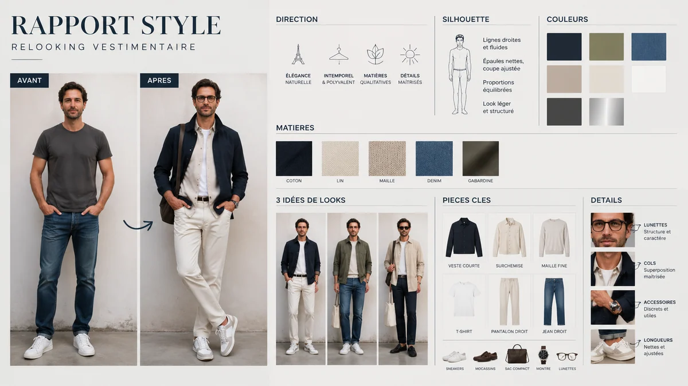


```text
请生成可复用的衣品升级报告图。所有可见文字使用简体中文短标签。 Use [PERSON REFERENCE IMAGE] to preserve the same face, age impression, hairstyle, body proportion, and natural temperament. If no reference image is supplied, use a realistic synthetic adult. Create the scene for this use case: Create a French Parisian understated style upgrade report. Use aspect ratio 16:9. Keep the Before outfit plain and the After look clearly more stylish, wearable, layered, accessorized, and camera-ready. Avoid real logos, celebrity likeness, body scoring, stiff office styling, crowded tiny text, and spreadsheet layouts. Editable variables: Person reference image, Paris context, Style direction, Outerwear type, Palette, Occasion set.
```


### 2. 德语 Minimal Streetwear Scorecard (`german-minimal-streetwear-scorecard`)


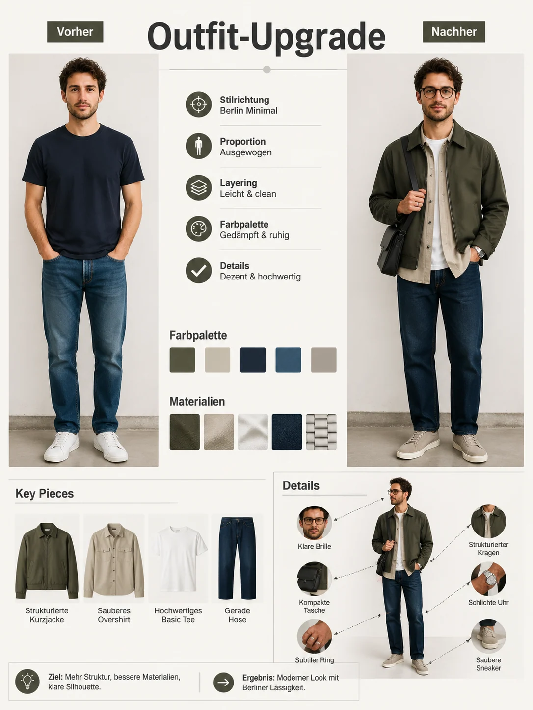


```text
请生成可复用的衣品升级报告图。所有可见文字使用简体中文短标签。 Use [PERSON REFERENCE IMAGE] to preserve the same face, age impression, hairstyle, body proportion, and natural temperament. If no reference image is supplied, use a realistic synthetic adult. Create the scene for this use case: Create a German compact minimal streetwear scorecard. Use aspect ratio 3:4. Keep the Before outfit plain and the After look clearly more stylish, wearable, layered, accessorized, and camera-ready. Avoid real logos, celebrity likeness, body scoring, stiff office styling, crowded tiny text, and spreadsheet layouts. Editable variables: Person reference image, Berlin context, Style direction, Color palette, Upgrade labels, Footwear type.
```


### 3. 西语 Date Walk Upgrade (`spanish-date-walk-upgrade`)


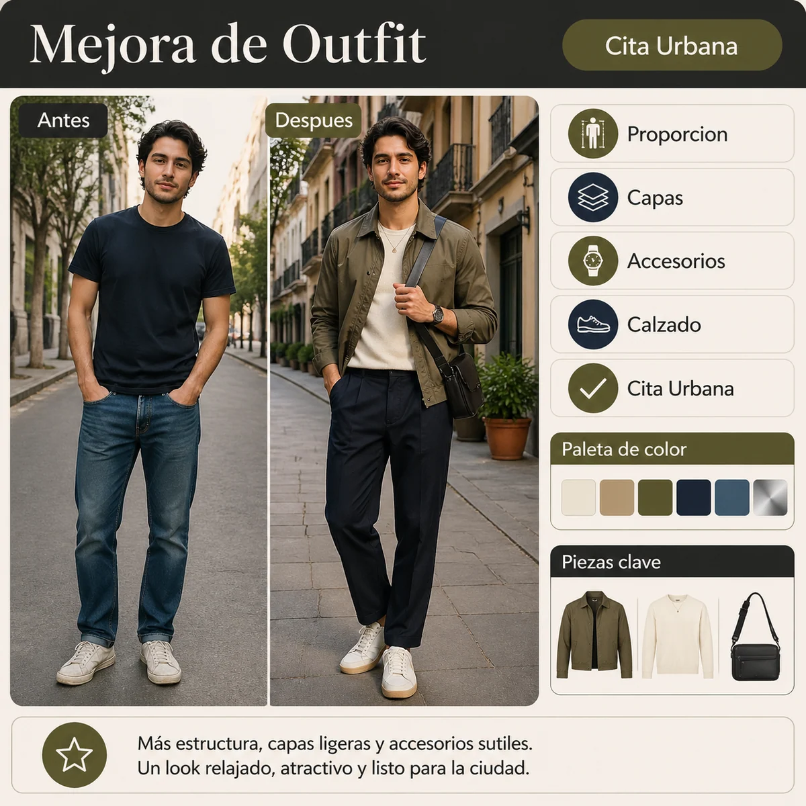


```text
请生成可复用的衣品升级报告图。所有可见文字使用简体中文短标签。 Use [PERSON REFERENCE IMAGE] to preserve the same face, age impression, hairstyle, body proportion, and natural temperament. If no reference image is supplied, use a realistic synthetic adult. Create the scene for this use case: Create a Spanish date-walk style upgrade report. Use aspect ratio 1:1. Keep the Before outfit plain and the After look clearly more stylish, wearable, layered, accessorized, and camera-ready. Avoid real logos, celebrity likeness, body scoring, stiff office styling, crowded tiny text, and spreadsheet layouts. Editable variables: Person reference image, Madrid or Mexico City context, Date walk mood, Color palette, Key pieces.
```


### 4. 葡语 Urban Casual 报告 (`portuguese-urban-casual-report`)


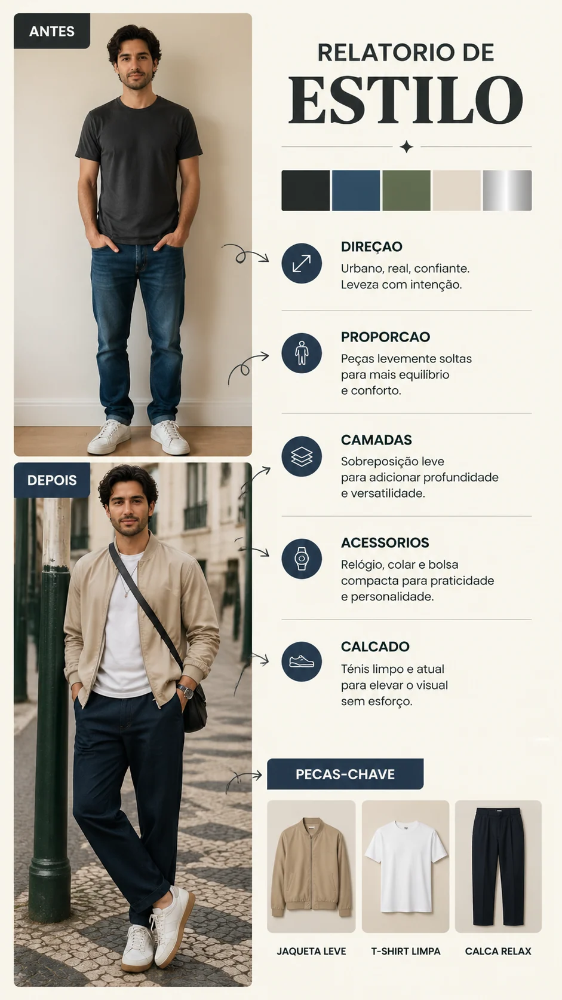


```text
请生成可复用的衣品升级报告图。所有可见文字使用简体中文短标签。 Use [PERSON REFERENCE IMAGE] to preserve the same face, age impression, hairstyle, body proportion, and natural temperament. If no reference image is supplied, use a realistic synthetic adult. Create the scene for this use case: Create a Portuguese urban casual outfit upgrade report. Use aspect ratio 9:16. Keep the Before outfit plain and the After look clearly more stylish, wearable, layered, accessorized, and camera-ready. Avoid real logos, celebrity likeness, body scoring, stiff office styling, crowded tiny text, and spreadsheet layouts. Editable variables: Person reference image, Lisbon or Sao Paulo context, Style direction, Accent color, Key upgrade tags.
```


### 5. 日系 City Boy Board (`japanese-city-boy-style-board`)


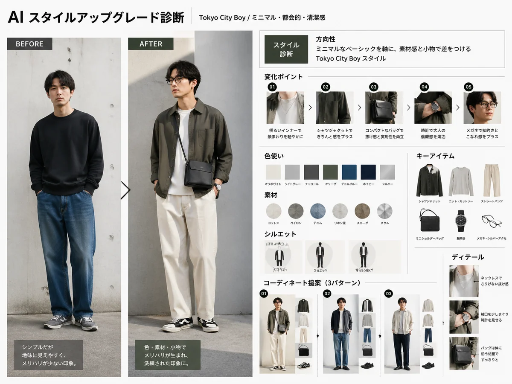


```text
请生成可复用的衣品升级报告图。所有可见文字使用简体中文短标签。 Use [PERSON REFERENCE IMAGE] to preserve the same face, age impression, hairstyle, body proportion, and natural temperament. If no reference image is supplied, use a realistic synthetic adult. Create the scene for this use case: Create a Japanese City Boy style upgrade board. Use aspect ratio 4:3. Keep the Before outfit plain and the After look clearly more stylish, wearable, layered, accessorized, and camera-ready. Avoid real logos, celebrity likeness, body scoring, stiff office styling, crowded tiny text, and spreadsheet layouts. Editable variables: Person reference image, Tokyo or Kyoto context, Style direction, Color palette, Bag type, Shoe style.
```


### 6. 韩系 Clean Street Reset (`korean-clean-street-reset`)


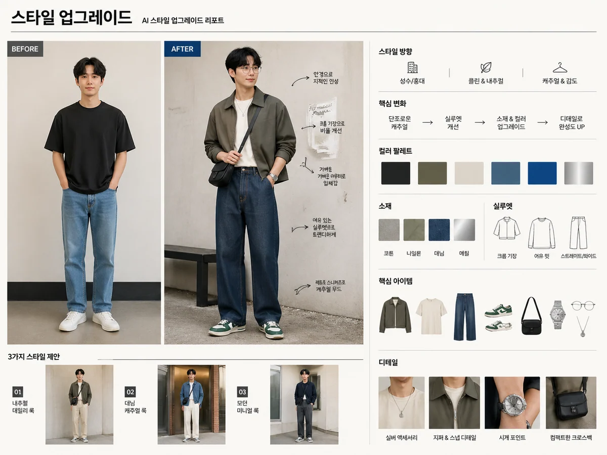


```text
请生成可复用的衣品升级报告图。所有可见文字使用简体中文短标签。 Use [PERSON REFERENCE IMAGE] to preserve the same face, age impression, hairstyle, body proportion, and natural temperament. If no reference image is supplied, use a realistic synthetic adult. Create the scene for this use case: Create a Korean clean streetwear before-and-after report. Use aspect ratio 4:3. Keep the Before outfit plain and the After look clearly more stylish, wearable, layered, accessorized, and camera-ready. Avoid real logos, celebrity likeness, body scoring, stiff office styling, crowded tiny text, and spreadsheet layouts. Editable variables: Person reference image, Seoul neighborhood context, Jacket type, Pants silhouette, Shoe style, Visible title language.
```


### 7. 繁中 中文 Urban 报告 (`tw-relaxed-urban-style-report`)


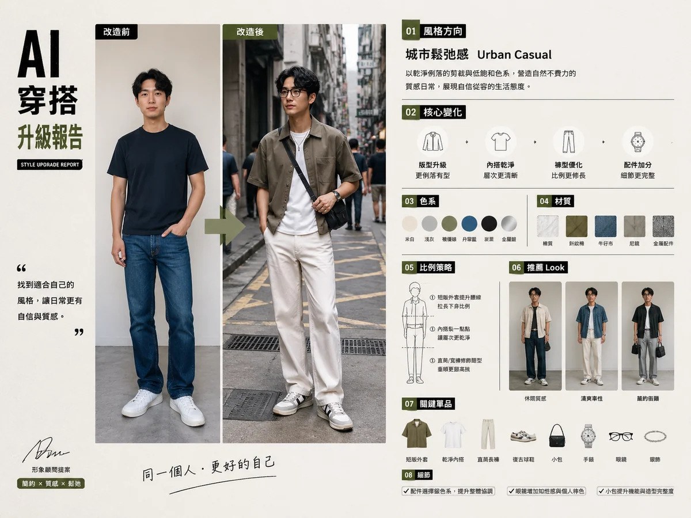


```text
请生成可复用的衣品升级报告图。所有可见文字使用简体中文短标签。 Use [PERSON REFERENCE IMAGE] to preserve the same face, age impression, hairstyle, body proportion, and natural temperament. If no reference image is supplied, use a realistic synthetic adult. Create the scene for this use case: Create a traditional Chinese relaxed urban outfit upgrade board. Use aspect ratio 4:3. Keep the Before outfit plain and the After look clearly more stylish, wearable, layered, accessorized, and camera-ready. Avoid real logos, celebrity likeness, body scoring, stiff office styling, crowded tiny text, and spreadsheet layouts. Editable variables: Person reference image, City context, Style direction, Outerwear type, Color palette, Occasion set.
```


### 8. 中文 Clean Fit 报告 (`cn-clean-fit-style-report`)


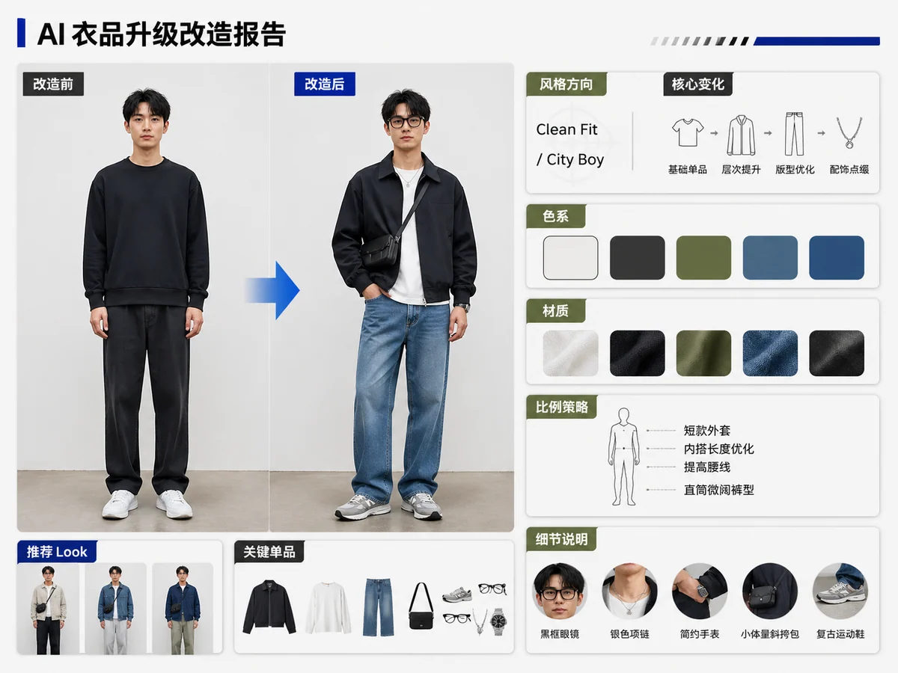


```text
请生成可复用的衣品升级报告图。所有可见文字使用简体中文短标签。 Use [PERSON REFERENCE IMAGE] to preserve the same face, age impression, hairstyle, body proportion, and natural temperament. If no reference image is supplied, use a realistic synthetic adult. Create the scene for this use case: Create a simplified Chinese clean fit wardrobe upgrade board. Use aspect ratio 4:3. Keep the Before outfit plain and the After look clearly more stylish, wearable, layered, accessorized, and camera-ready. Avoid real logos, celebrity likeness, body scoring, stiff office styling, crowded tiny text, and spreadsheet layouts. Editable variables: Person reference image, City context, Style direction, Jacket type, Pants silhouette, Shoe style, Accent color.
```


### 9. 衣品 Upgrade 报告 (`outfit-upgrade-report-en`)


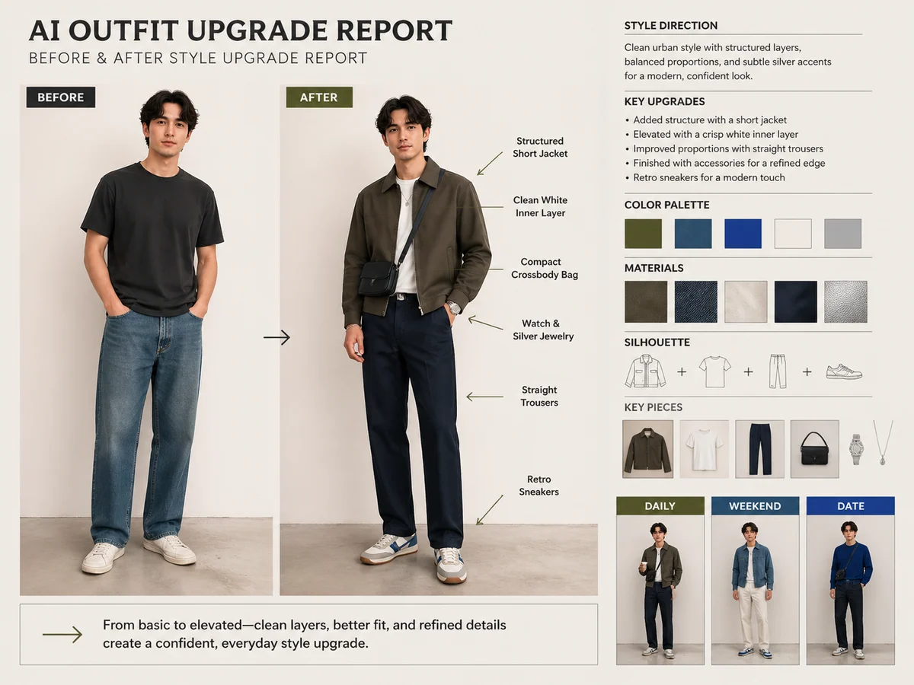


```text
请生成可复用的衣品升级报告图。所有可见文字使用简体中文短标签。 Use [PERSON REFERENCE IMAGE] to preserve the same face, age impression, hairstyle, body proportion, and natural temperament. If no reference image is supplied, use a realistic synthetic adult. Create the scene for this use case: Create the full English before-and-after outfit upgrade board. Use aspect ratio 4:3. Keep the Before outfit plain and the After look clearly more stylish, wearable, layered, accessorized, and camera-ready. Avoid real logos, celebrity likeness, body scoring, stiff office styling, crowded tiny text, and spreadsheet layouts. Editable variables: Person reference image, Gender presentation, Age range, City context, Style direction, Color palette, Occasion set, Accessory level.
```


## 大字海报模板 (`big-type-posters`)

用 GPT Image 2 生成文字优先的海报。


### 1. 法语画廊大字 (`french-gallery-type`)


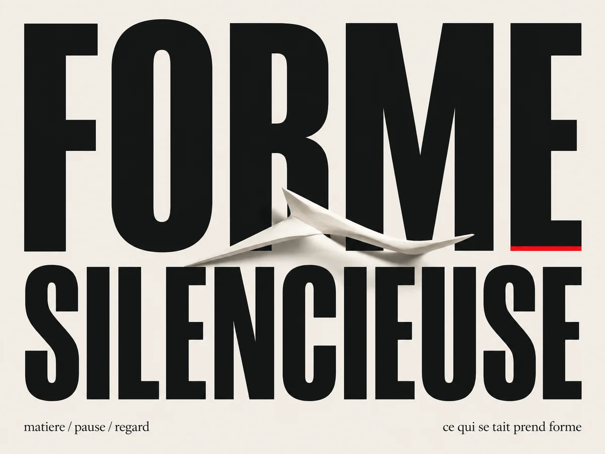


```text
使用这个大字海报模板生成一张海报。所有可见文字使用目标语言，主短句必须巨大、完整、清晰可读。保留一个与含义相关的图形元素，并让它嵌入字形、留白或笔画结构里，而不是贴在背景上。替换方括号变量后再生成：\n\n用途：Create a French exhibition poster with oversized title and sparse copy\n\nCreate a French exhibition-style big-type poster for "[FRENCH TITLE]". The title must be oversized, readable, complete, and the first visual layer. Use one sparse visual element: [VISUAL ELEMENT], integrated into the title through overlap, shadow, path, scale, or negative space. Interpret [EXHIBITION MOOD] and use [PRINT TEXTURE], quiet composition, high contrast, and [COLOR ACCENTS] to make the poster feel gallery-ready. Supporting copy must be short and in French: [SUPPORTING COPY]. Avoid English, fake museum logos, dense event details, random text, unreadable decorative type, and generic abstract art that does not support the title.
```


### 2. 德语建筑大字 (`german-architecture-type`)


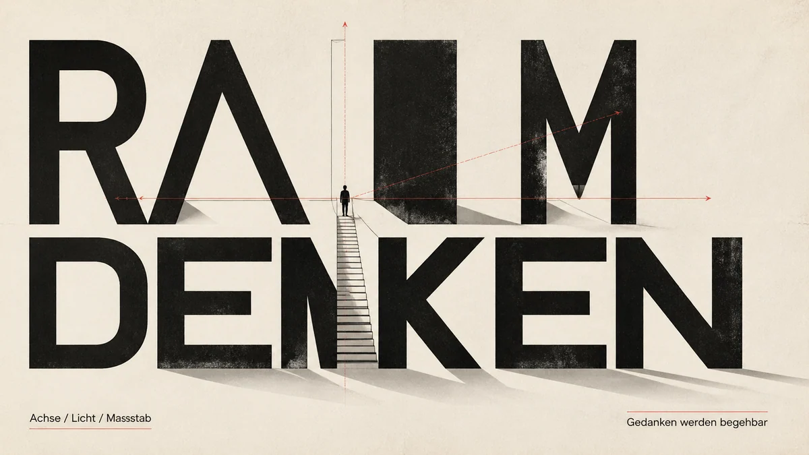


```text
使用这个大字海报模板生成一张海报。所有可见文字使用目标语言，主短句必须巨大、完整、清晰可读。保留一个与含义相关的图形元素，并让它嵌入字形、留白或笔画结构里，而不是贴在背景上。替换方括号变量后再生成：\n\n用途：Create a German architectural big-type poster\n\nCreate a 16:9 German architectural big-type poster for "[GERMAN PHRASE]". The German words must be large, complete, and readable. Make the typography behave like an architectural structure inspired by [ARCHITECTURAL CONCEPT], without turning it into heavy 3D text. Use [MATERIAL PALETTE], believable scale, strict composition, and [HUMAN SCALE ELEMENT] to show how the text becomes space. Let stairs, columns, shadows, windows, or path lines emerge from the letter structure where it supports the meaning. Use [BACKGROUND] and sparse layout. Add only short German supporting labels: [SUPPORTING LABELS]. Avoid English, fake architecture firm logos, dense diagrams, unreadable letters, and photorealistic building render clutter.
```


### 3. 西语活动大字 (`spanish-campaign-big-type`)


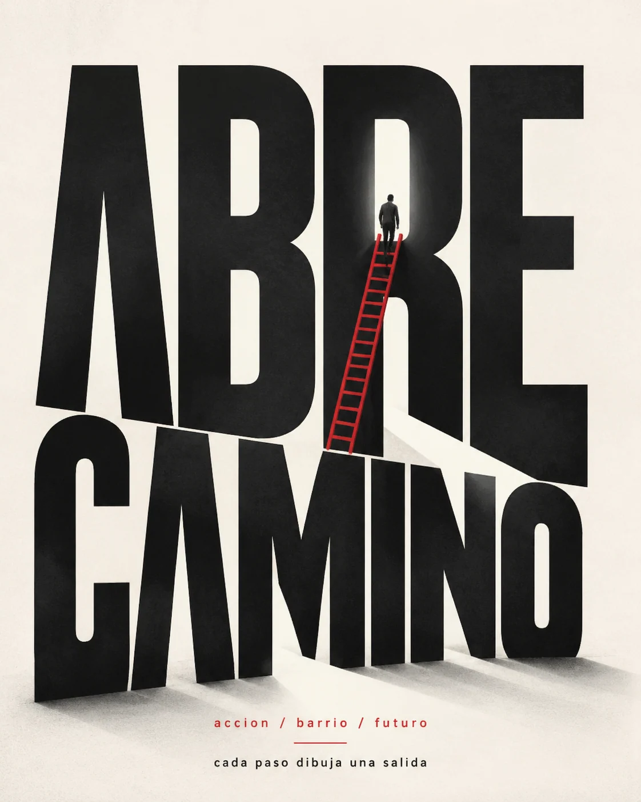


```text
使用这个大字海报模板生成一张海报。所有可见文字使用目标语言，主短句必须巨大、完整、清晰可读。保留一个与含义相关的图形元素，并让它嵌入字形、留白或笔画结构里，而不是贴在背景上。替换方括号变量后再生成：\n\n用途：Create a Spanish campaign-style poster with integrated object metaphor\n\nCreate a vertical Spanish campaign-style big-type poster for "[SPANISH HEADLINE]". The headline must be huge, readable, complete, and dominant. Do not create a normal ad layout. Build the poster around typography first, then integrate [OBJECT METAPHOR] so it explains the campaign idea without needing long copy. Interpret [CAMPAIGN IDEA] and convert it into scale, contrast, direction, object placement, and negative space. Use [COLOR SYSTEM], [TEXTURE], and one or two small graphic marks. Add only short Spanish supporting copy: [SUPPORTING COPY]. Avoid English, fake brand marks, dense captions, crowded icons, stock-photo composition, and unreadable decorative type.
```


### 4. 葡语书封大字 (`portuguese-book-cover-type`)


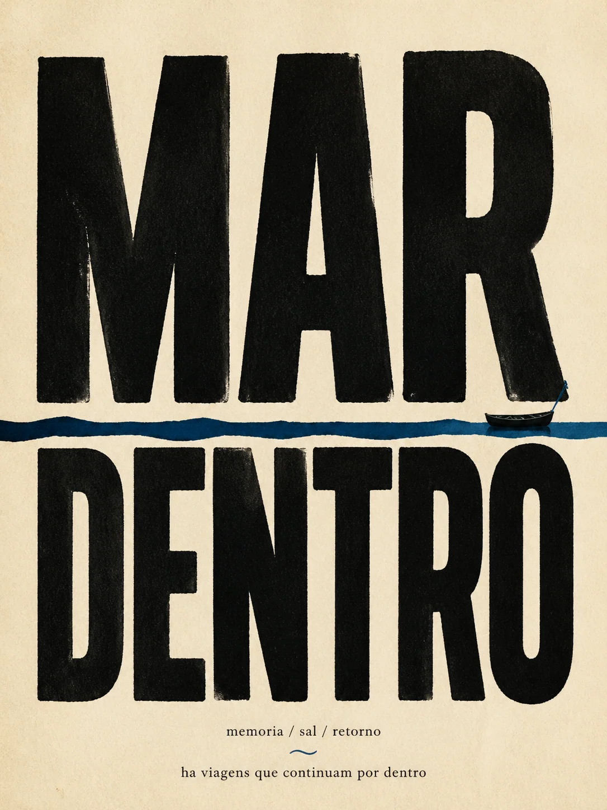


```text
使用这个大字海报模板生成一张海报。所有可见文字使用目标语言，主短句必须巨大、完整、清晰可读。保留一个与含义相关的图形元素，并让它嵌入字形、留白或笔画结构里，而不是贴在背景上。替换方括号变量后再生成：\n\n用途：Create a Portuguese literary cover with oversized typography\n\nCreate a Portuguese literary cover poster for "[PORTUGUESE TITLE]". The title must be oversized, readable, and complete. Make the typography the first visual layer and integrate one visual metaphor: [VISUAL METAPHOR]. Interpret [LITERARY THEME] and translate it into type scale, rhythm, paper texture, light, and composition. The visual metaphor may become a path, window, sea line, object, shadow, or figure that physically interacts with the large title. Use [PAPER OR PRINT TEXTURE] and [COLOR PALETTE] with refined editorial restraint. Add only short Portuguese supporting text: [SUPPORTING LINE]. Avoid English, long body text, fake publisher logos, generic romance cover styling, and unreadable decorative type.
```


### 5. 日文山水大字 (`japanese-mountain-type`)


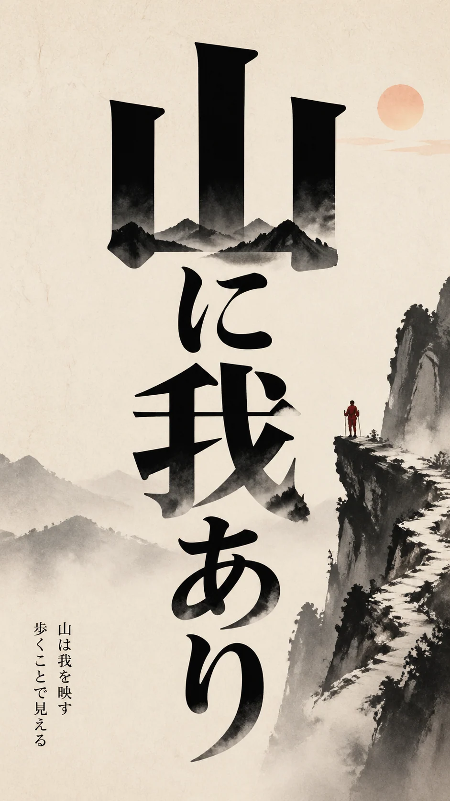


```text
使用这个大字海报模板生成一张海报。所有可见文字使用目标语言，主短句必须巨大、完整、清晰可读。保留一个与含义相关的图形元素，并让它嵌入字形、留白或笔画结构里，而不是贴在背景上。替换方括号变量后再生成：\n\n用途：Create a Japanese poster where huge text and landscape merge\n\nCreate a vertical Japanese big-type poster for "[JAPANESE PHRASE]". The Japanese text must be huge, readable, and complete. Treat the text as a landscape system: strokes can become cliffs, paths, mist edges, sun anchors, or paper cuts only when the text remains legible. Express [MOOD] through [LANDSCAPE MOTIF], [BRUSH OR TYPE STYLE], controlled texture, and quiet negative space. Use one small human figure, bird group, bridge, or sun if it helps scale and meaning. Use [ACCENT COLOR] sparingly. Add only short Japanese supporting copy: [SHORT CAPTION]. Avoid random English, long paragraphs, unreadable characters, crowded scenery, fake seals, and generic anime styling.
```


### 6. 韩文静气海报 (`korean-calm-type-poster`)


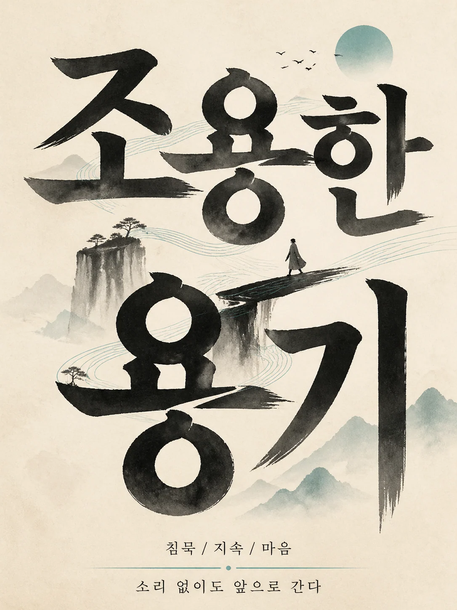


```text
使用这个大字海报模板生成一张海报。所有可见文字使用目标语言，主短句必须巨大、完整、清晰可读。保留一个与含义相关的图形元素，并让它嵌入字形、留白或笔画结构里，而不是贴在背景上。替换方括号变量后再生成：\n\n用途：Create a Korean oversized-text emotion poster\n\nCreate a Korean big-type poster for "[KOREAN PHRASE]". The Hangul must be huge, readable, and complete. Use the text as the main structure of the poster and express [EMOTIONAL TONE] through spacing, stroke weight, texture, light, and one integrated graphic motif: [GRAPHIC MOTIF]. The graphic motif should be attached to the typography through contact, shadow, negative space, or a path that follows the letter shapes. Use [MATERIAL TEXTURE], [COLOR PALETTE], and a restrained layout with room to breathe. Add only short Korean supporting copy: [SUPPORTING CAPTION]. Avoid random English, dense text, clutter, fake logos, unreadable Hangul, and ordinary illustration pasted behind the words.
```


### 7. 宣言大字海报 (`editorial-manifesto-poster`)


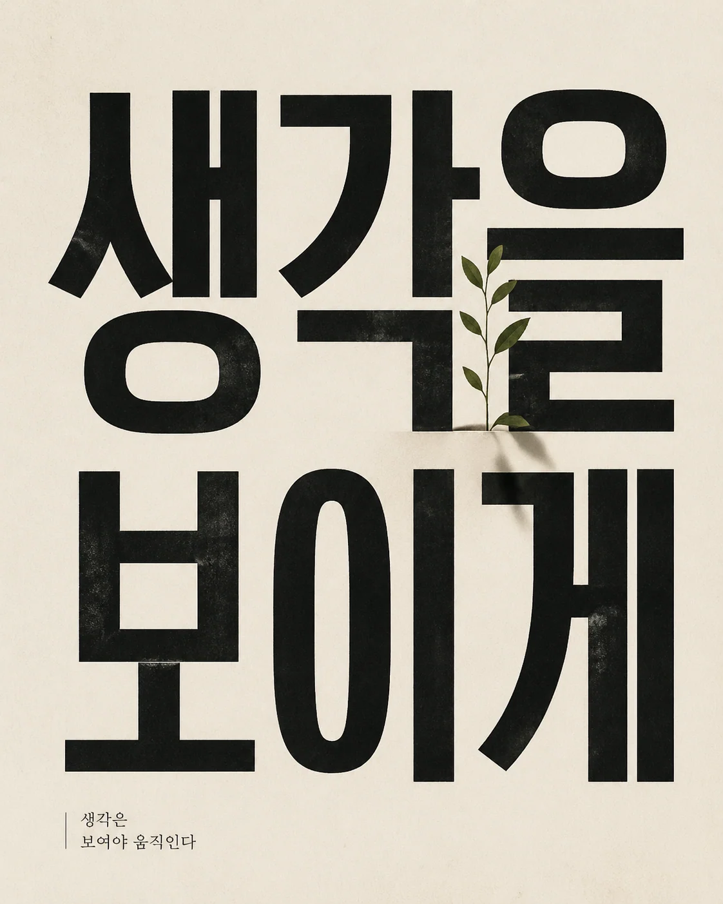


```text
使用这个大字海报模板生成一张海报。所有可见文字使用目标语言，主短句必须巨大、完整、清晰可读。保留一个与含义相关的图形元素，并让它嵌入字形、留白或笔画结构里，而不是贴在背景上。替换方括号变量后再生成：\n\n用途：Create an English manifesto poster with one symbolic figure\n\nCreate a vertical English editorial manifesto poster. The core headline is "[CORE HEADLINE]" and must be huge, readable, complete, and the first visual subject. Build the composition around oversized typography with one symbolic graphic element: [SYMBOLIC FIGURE OR OBJECT]. Interpret [MANIFESTO THEME] before designing. Let the figure or object interact with the title through scale, shadow, cut-through space, overlap, path lines, or placement on a letter stroke. Use [COLOR PALETTE], [TEXTURE STYLE], controlled negative space, and high-end magazine cover restraint. The poster should feel graphic and intentional, not like stock art with text over it. Add only short English supporting copy: [SHORT SUPPORTING COPY]. Avoid fake brand marks, long paragraphs, random decorative text, unreadable letters, and generic 3D typography.
```


### 8. 繁体建筑大字 (`monumental-character-gate`)


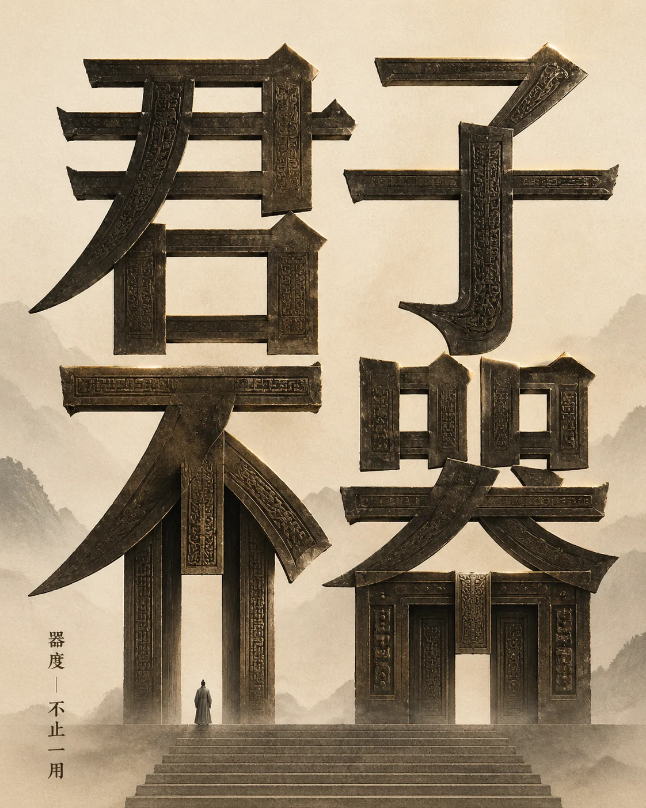


```text
$20
```


### 9. 水墨格言大字 (`ink-proverb-big-type`)


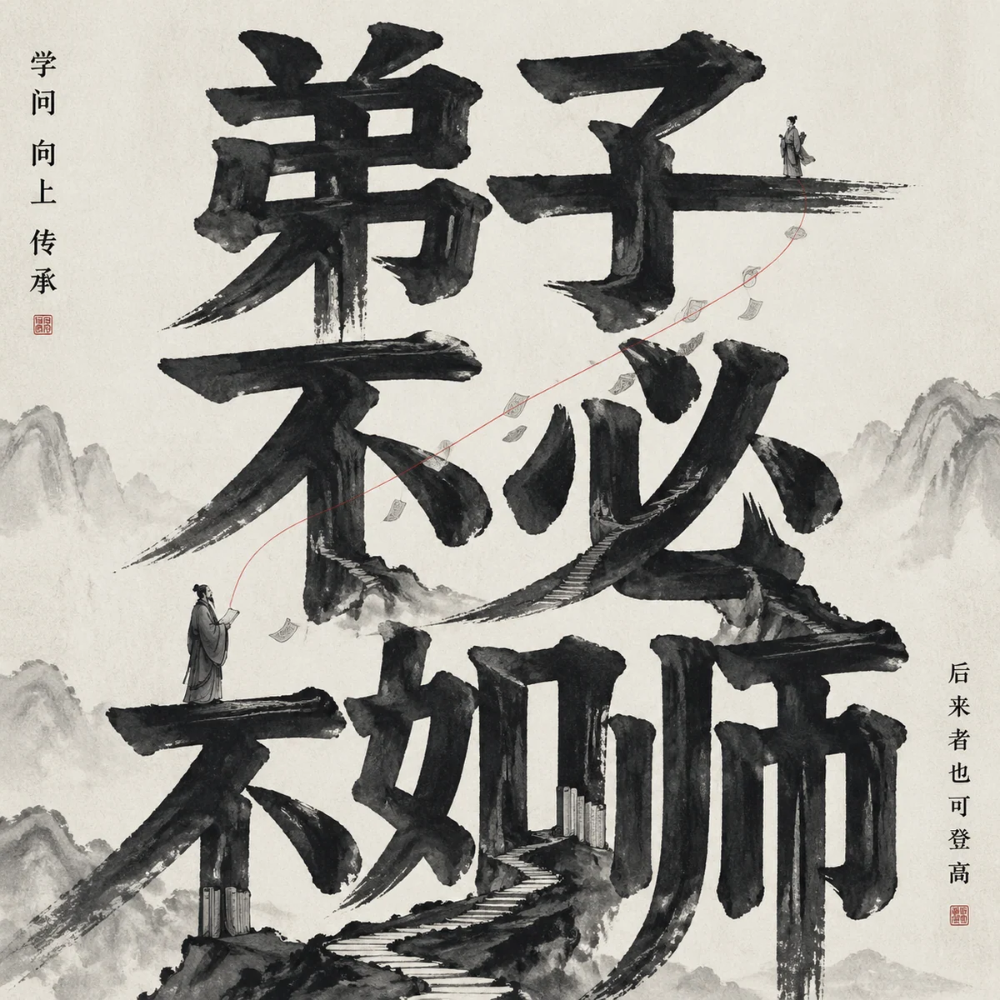


```text
$21
```


## 仿生产品概念 (`biomimicry-product-concepts`)

用 GPT Image 2 生成自然灵感产品板。


### 1. 蜂巢模块搁架 (`honeycomb-modular-shelf`)


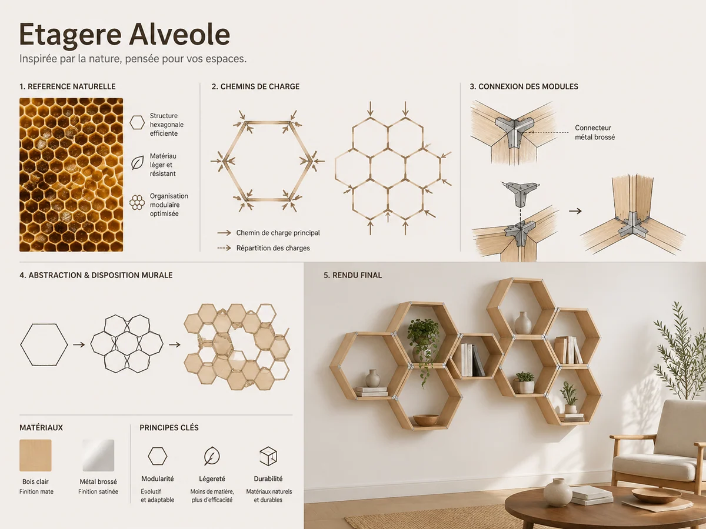


```text
创建一张 4:3 仿生产品概念板，主题是「蜂巢模块搁架」。展示自然参考、结构细节、转化草图、材料研究和最终产品渲染。版式像工业设计提案板，上方是参考与观察，中间是结构图和抽象推导，下方是精致产品渲染。使用温暖自然光、干净留白、真实材质和高级设计工作室质感。 所有可见文字使用简体中文，标签要短而清晰。 不要出现真实品牌、专利暗示、夸大环保认证或不可验证的工程安全承诺。
```


### 2. 松果通风音箱 (`pinecone-vent-speaker`)


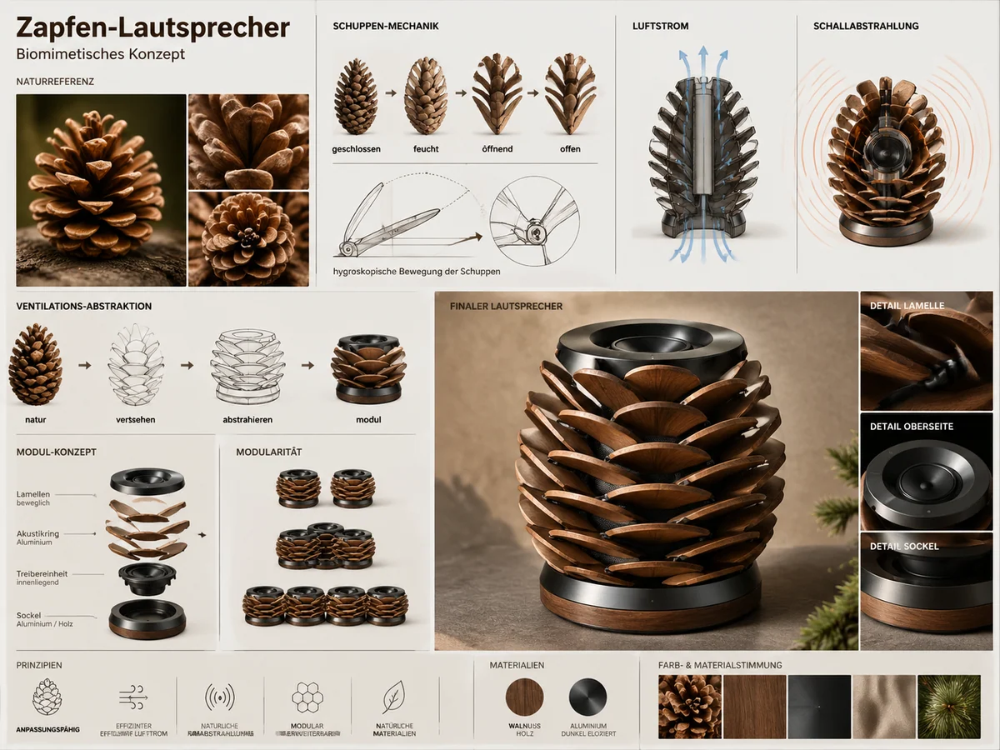


```text
创建一张 4:3 仿生产品概念板，主题是「松果通风音箱」。展示自然参考、结构细节、转化草图、材料研究和最终产品渲染。版式像工业设计提案板，上方是参考与观察，中间是结构图和抽象推导，下方是精致产品渲染。使用温暖自然光、干净留白、真实材质和高级设计工作室质感。 所有可见文字使用简体中文，标签要短而清晰。 不要出现真实品牌、专利暗示、夸大环保认证或不可验证的工程安全承诺。
```


### 3. 仙人掌水瓶 (`cactus-water-bottle`)


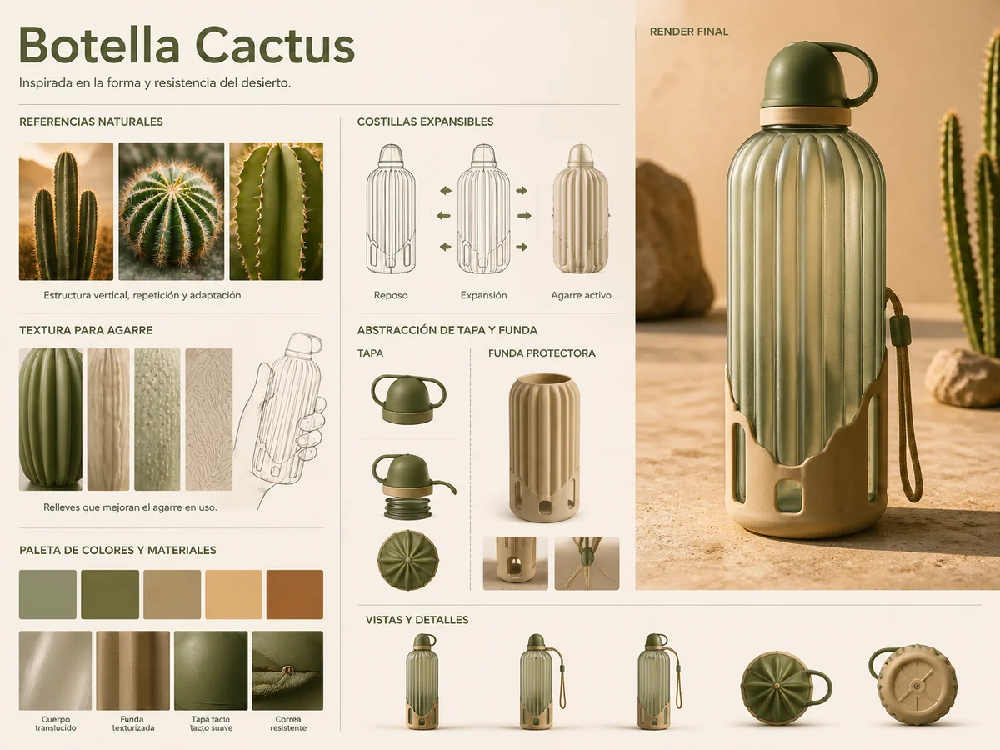


```text
创建一张 4:3 仿生产品概念板，主题是「仙人掌水瓶」。展示自然参考、结构细节、转化草图、材料研究和最终产品渲染。版式像工业设计提案板，上方是参考与观察，中间是结构图和抽象推导，下方是精致产品渲染。使用温暖自然光、干净留白、真实材质和高级设计工作室质感。 所有可见文字使用简体中文，标签要短而清晰。 不要出现真实品牌、专利暗示、夸大环保认证或不可验证的工程安全承诺。
```


### 4. 软木休闲座椅 (`cork-bark-lounge-seat`)


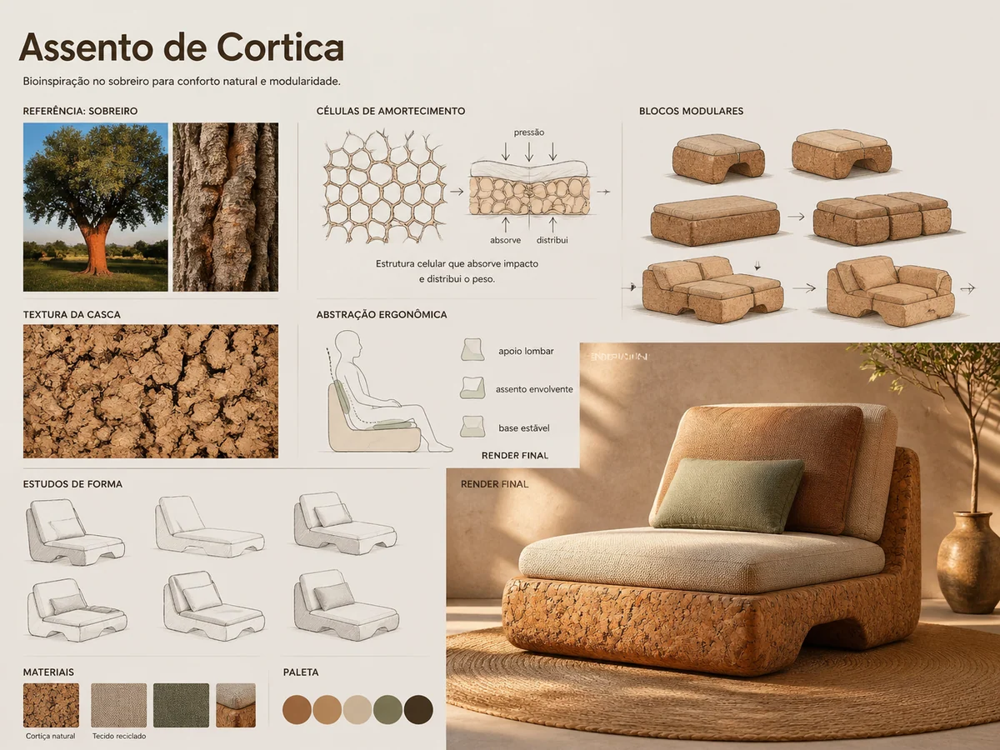


```text
创建一张 4:3 仿生产品概念板，主题是「软木休闲座椅」。展示自然参考、结构细节、转化草图、材料研究和最终产品渲染。版式像工业设计提案板，上方是参考与观察，中间是结构图和抽象推导，下方是精致产品渲染。使用温暖自然光、干净留白、真实材质和高级设计工作室质感。 所有可见文字使用简体中文，标签要短而清晰。 不要出现真实品牌、专利暗示、夸大环保认证或不可验证的工程安全承诺。
```


### 5. 折叶台灯 (`origami-leaf-desk-lamp`)


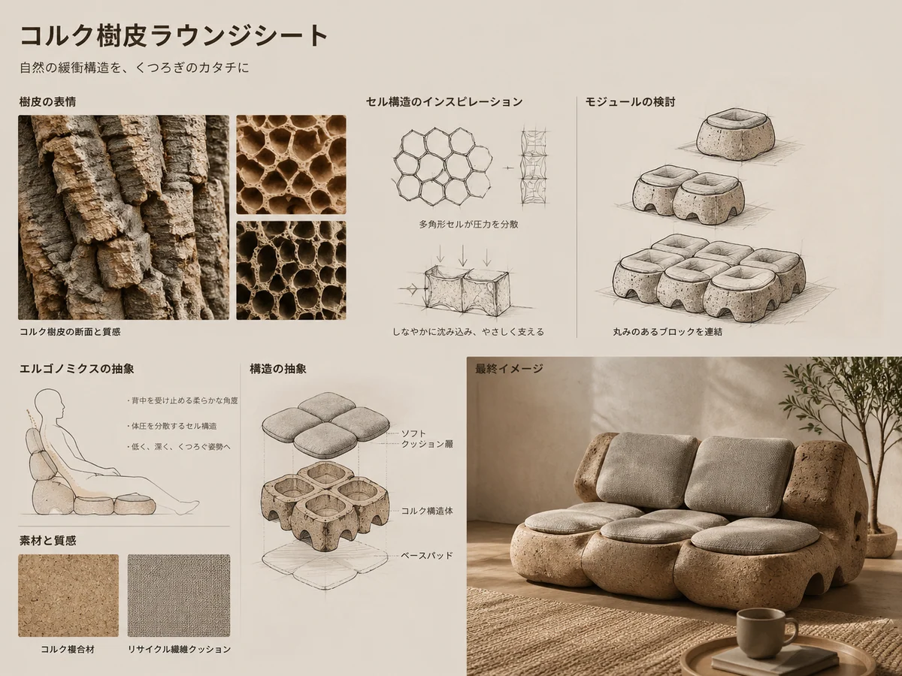


```text
创建一张 4:3 仿生产品概念板，主题是「折叶台灯」。展示自然参考、结构细节、转化草图、材料研究和最终产品渲染。版式像工业设计提案板，上方是参考与观察，中间是结构图和抽象推导，下方是精致产品渲染。使用温暖自然光、干净留白、真实材质和高级设计工作室质感。 所有可见文字使用简体中文，标签要短而清晰。 不要出现真实品牌、专利暗示、夸大环保认证或不可验证的工程安全承诺。
```


### 6. 荷叶音箱系统 (`lotus-speaker-system`)


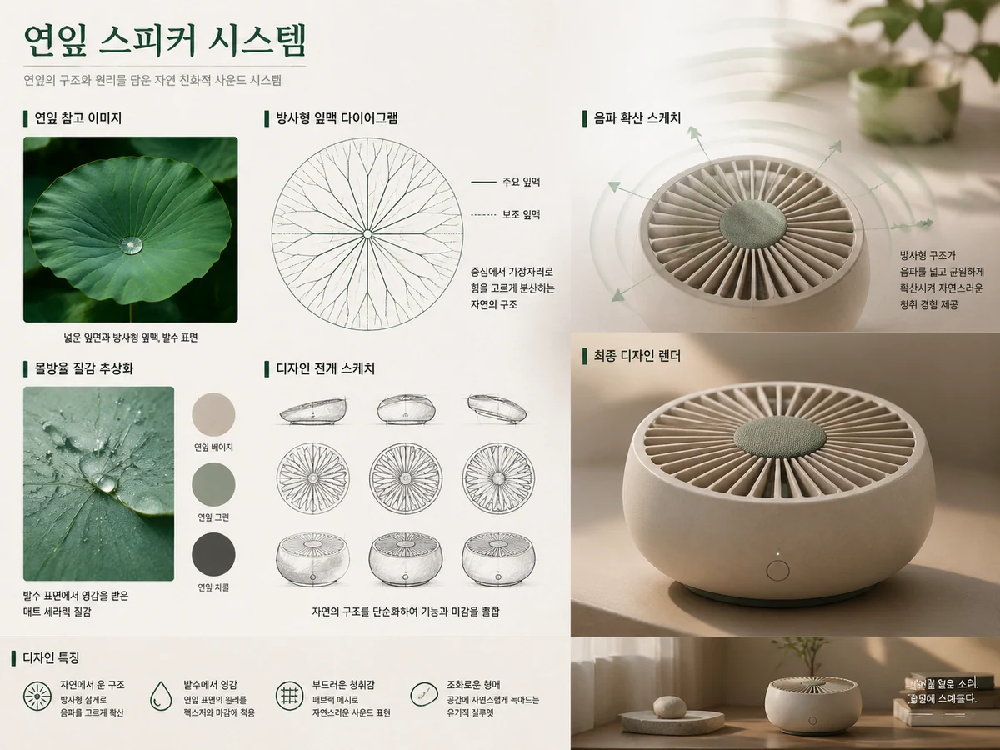


```text
创建一张 4:3 仿生产品概念板，主题是「荷叶音箱系统」。展示自然参考、结构细节、转化草图、材料研究和最终产品渲染。版式像工业设计提案板，上方是参考与观察，中间是结构图和抽象推导，下方是精致产品渲染。使用温暖自然光、干净留白、真实材质和高级设计工作室质感。 所有可见文字使用简体中文，标签要短而清晰。 不要出现真实品牌、专利暗示、夸大环保认证或不可验证的工程安全承诺。
```


### 7. 贝壳肋骨吊灯 (`shell-rib-pendant-lamp`)


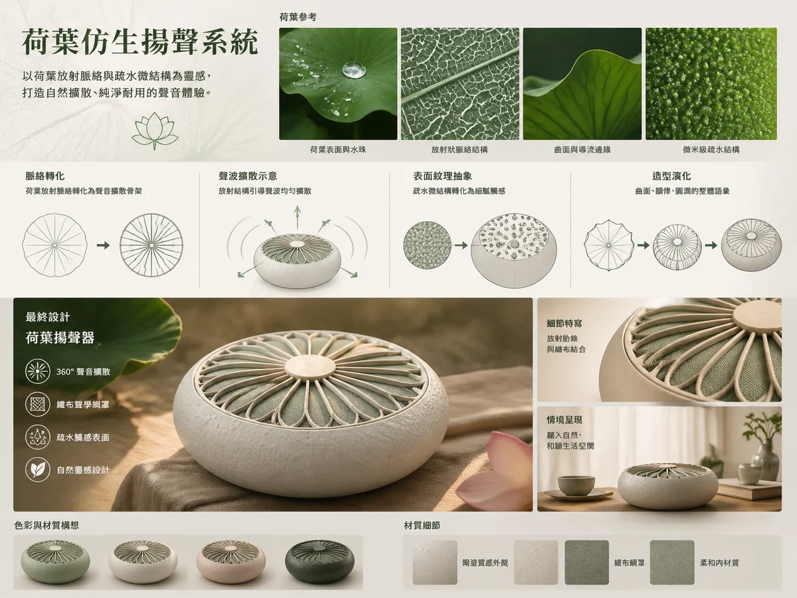


```text
创建一张 4:3 仿生产品概念板，主题是「贝壳肋骨吊灯」。展示自然参考、结构细节、转化草图、材料研究和最终产品渲染。版式像工业设计提案板，上方是参考与观察，中间是结构图和抽象推导，下方是精致产品渲染。使用温暖自然光、干净留白、真实材质和高级设计工作室质感。 所有可见文字使用简体中文，标签要短而清晰。 不要出现真实品牌、专利暗示、夸大环保认证或不可验证的工程安全承诺。
```


### 8. 竹编折叠椅 (`bamboo-weave-folding-chair`)


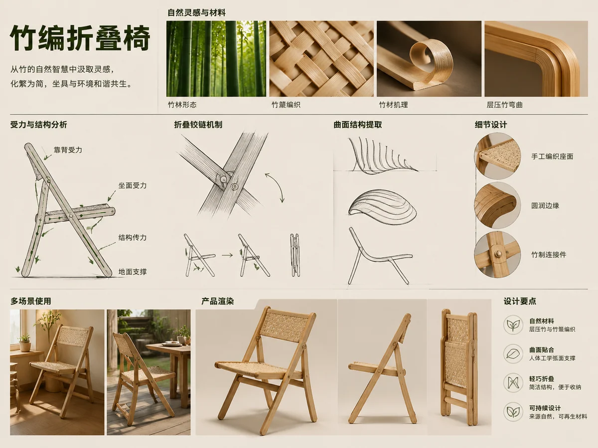


```text
创建一张 4:3 仿生产品概念板，主题是「竹编折叠椅」。展示自然参考、结构细节、转化草图、材料研究和最终产品渲染。版式像工业设计提案板，上方是参考与观察，中间是结构图和抽象推导，下方是精致产品渲染。使用温暖自然光、干净留白、真实材质和高级设计工作室质感。 所有可见文字使用简体中文，标签要短而清晰。 不要出现真实品牌、专利暗示、夸大环保认证或不可验证的工程安全承诺。
```


### 9. 鸟巢休闲椅 (`bird-nest-lounge-chair`)


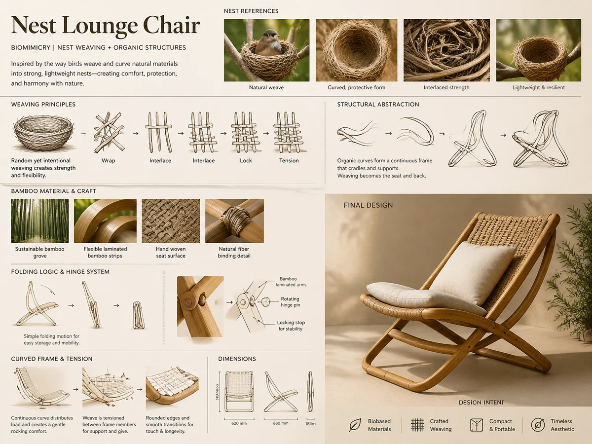


```text
创建一张 4:3 仿生产品概念板，主题是「鸟巢休闲椅」。展示自然参考、结构细节、转化草图、材料研究和最终产品渲染。版式像工业设计提案板，上方是参考与观察，中间是结构图和抽象推导，下方是精致产品渲染。使用温暖自然光、干净留白、真实材质和高级设计工作室质感。 所有可见文字使用简体中文，标签要短而清晰。 不要出现真实品牌、专利暗示、夸大环保认证或不可验证的工程安全承诺。
```


## 角色设定模板 (`character-design-charts`)

用 GPT Image 2 生成角色设定图。


### 1. 完整角色资料海报 (`full-character-profile-poster`)


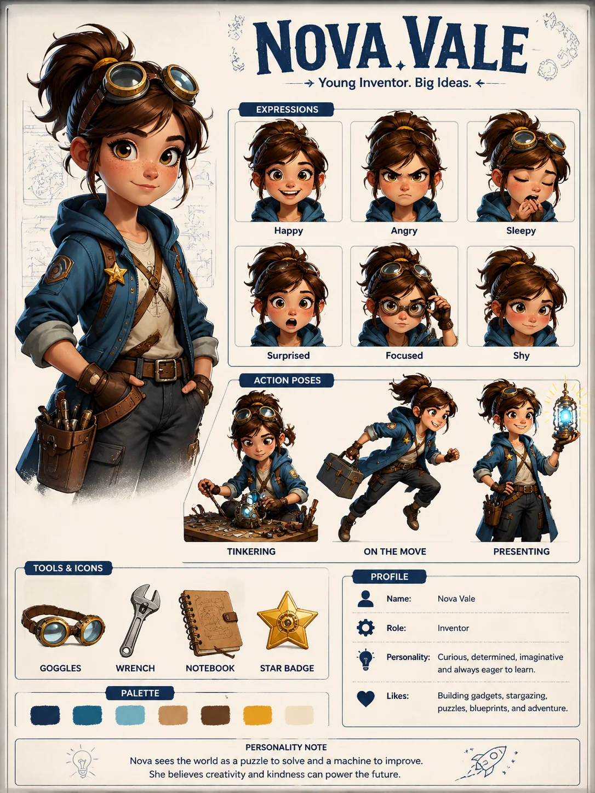


```text
生成一张结构清晰的角色设定图，保留上传参考图中的身份特征；如果没有参考图，就根据变量创建原创角色。包含主头像、表情、动作、道具图标、配色和短资料卡。所有可见文字使用简体中文，标签简短可读，避免真实品牌和受版权保护角色。\n\n场景: Create an all-in-one character profile board from a reference or character idea.\n默认比例: 3:4\n可编辑变量: Character name, Character age or role, Personality traits, Clothing style, Signature props, Color palette.
```


### 2. 角色表情九宫格 (`facial-expression-grid`)


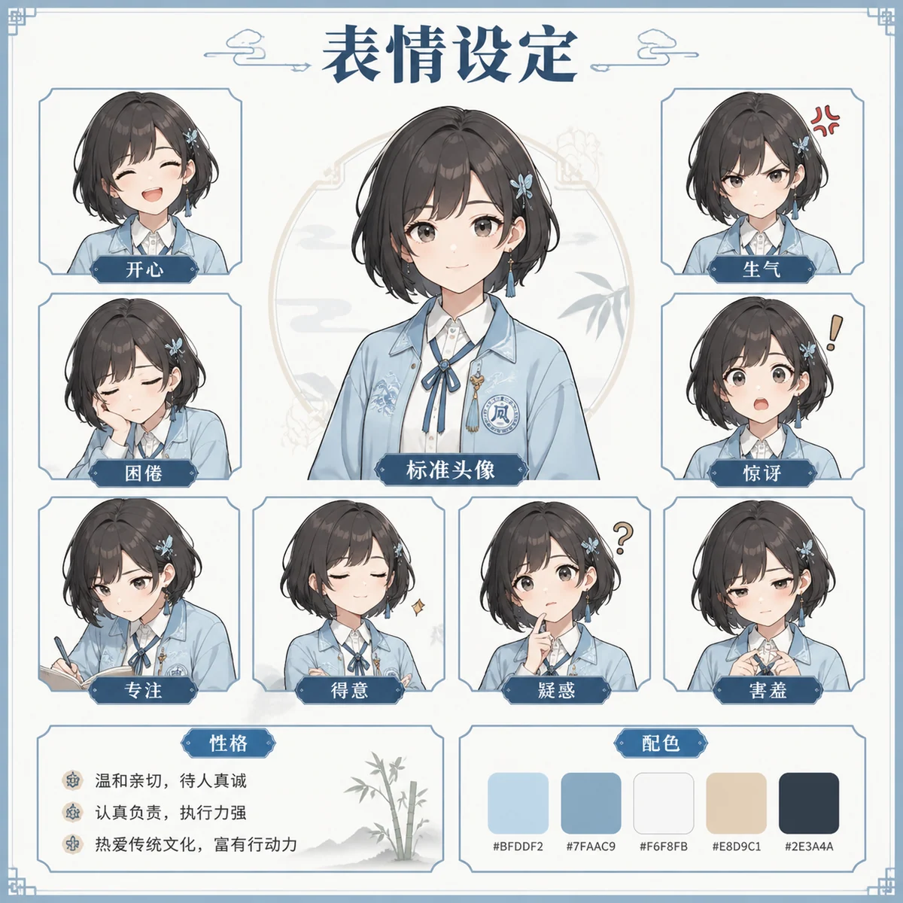


```text
生成一张结构清晰的角色设定图，保留上传参考图中的身份特征；如果没有参考图，就根据变量创建原创角色。包含主头像、表情、动作、道具图标、配色和短资料卡。所有可见文字使用简体中文，标签简短可读，避免真实品牌和受版权保护角色。\n\n场景: Explore a character across many readable emotional expressions.\n默认比例: 1:1\n可编辑变量: Character type, Expression list, Art style, Label language, Mood range.
```


### 3. 动作姿势转面图 (`action-pose-turnaround`)


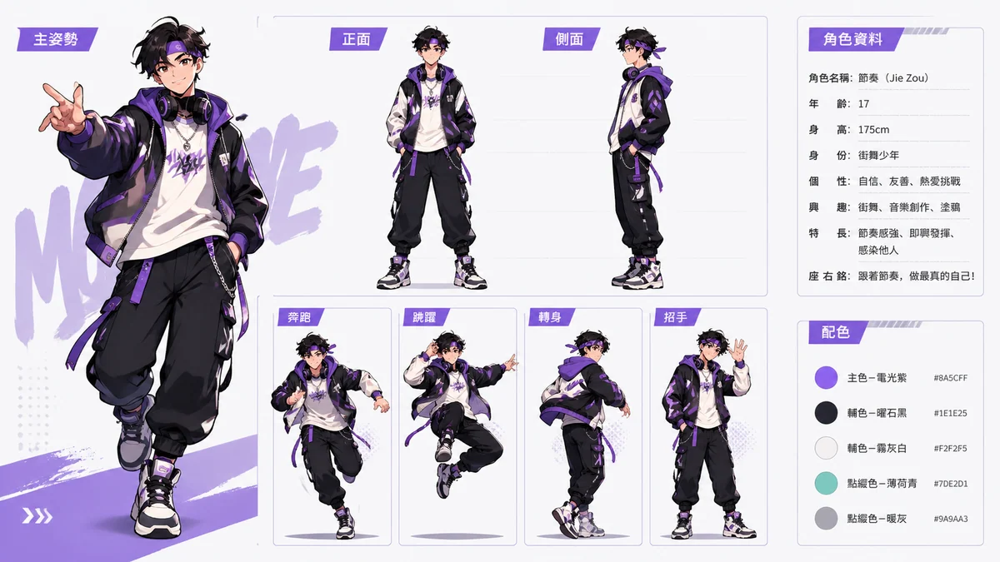


```text
生成一张结构清晰的角色设定图，保留上传参考图中的身份特征；如果没有参考图，就根据变量创建原创角色。包含主头像、表情、动作、道具图标、配色和短资料卡。所有可见文字使用简体中文，标签简短可读，避免真实品牌和受版权保护角色。\n\n场景: Show a character in movement, front view, side view, and personality-driven poses.\n默认比例: 16:9\n可编辑变量: Character name, Personality, Action poses, Clothing or costume, Prop, Annotation style.
```


### 4. 品牌吉祥物设定 (`mascot-brand-sheet`)


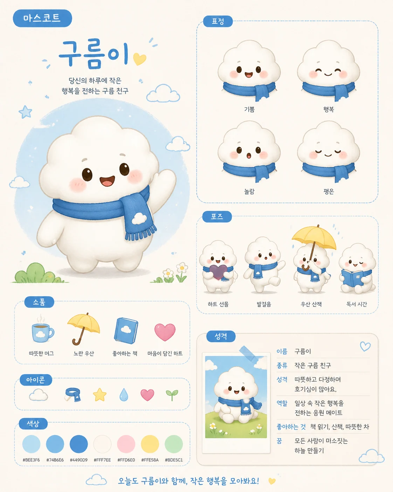


```text
生成一张结构清晰的角色设定图，保留上传参考图中的身份特征；如果没有参考图，就根据变量创建原创角色。包含主头像、表情、动作、道具图标、配色和短资料卡。所有可见文字使用简体中文，标签简短可读，避免真实品牌和受版权保护角色。\n\n场景: Design a friendly mascot board for a product, creator brand, or community.\n默认比例: 4:5\n可编辑变量: Mascot species or object, Brand mood, Target audience, Color palette, Allowed props, Use cases.
```


### 5. 绘本角色设定板 (`storybook-character-board`)


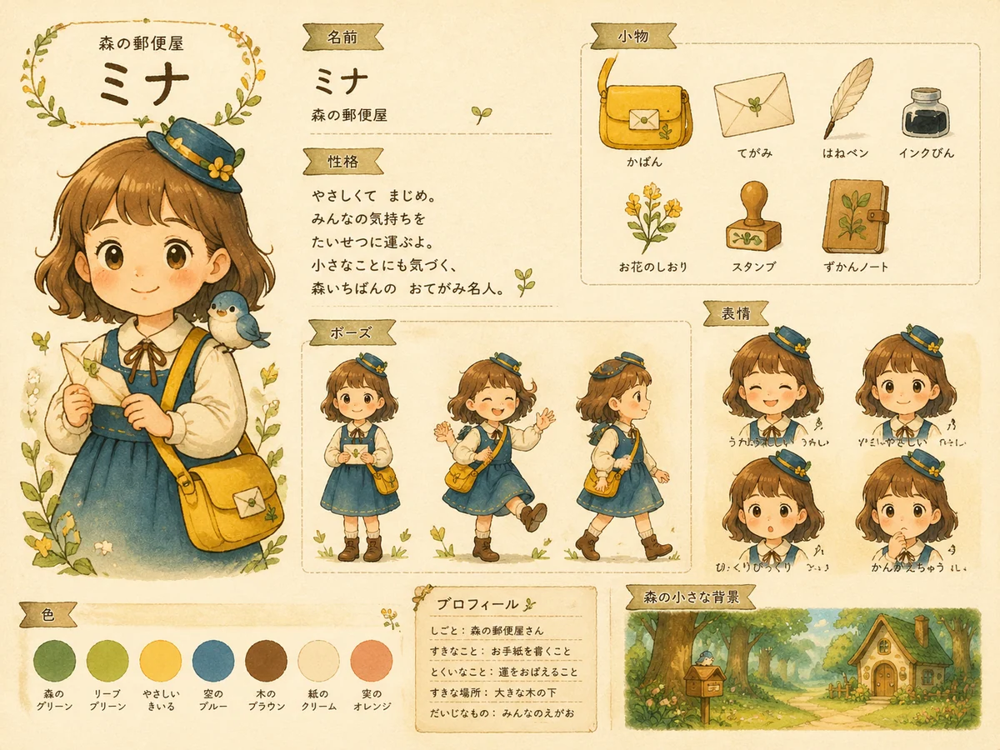


```text
生成一张结构清晰的角色设定图，保留上传参考图中的身份特征；如果没有参考图，就根据变量创建原创角色。包含主头像、表情、动作、道具图标、配色和短资料卡。所有可见文字使用简体中文，标签简短可读，避免真实品牌和受版权保护角色。\n\n场景: Build a charming character board for children's books and illustrated stories.\n默认比例: 4:3\n可编辑变量: Story genre, Character name, Age or creature type, Costume details, Story props, Emotional tone.
```


### 6. 游戏 NPC 参考表 (`game-npc-reference-sheet`)


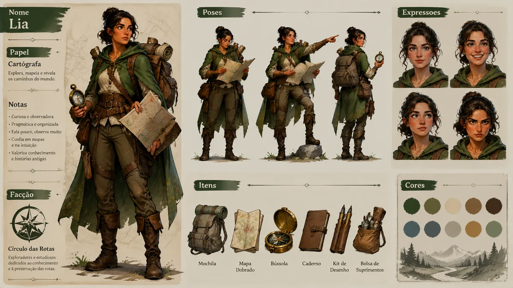


```text
生成一张结构清晰的角色设定图，保留上传参考图中的身份特征；如果没有参考图，就根据变量创建原创角色。包含主头像、表情、动作、道具图标、配色和短资料卡。所有可见文字使用简体中文，标签简短可读，避免真实品牌和受版权保护角色。\n\n场景: Create a game-ready NPC concept sheet with role, gear, expressions, and poses.\n默认比例: 16:9\n可编辑变量: NPC role, Game genre, Clothing or armor, Equipment icons, Faction mood, Color palette.
```


### 7. 角色穿搭线稿 (`fashion-character-lineup`)


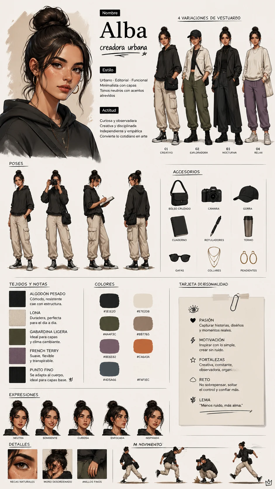


```text
生成一张结构清晰的角色设定图，保留上传参考图中的身份特征；如果没有参考图，就根据变量创建原创角色。包含主头像、表情、动作、道具图标、配色和短资料卡。所有可见文字使用简体中文，标签简短可读，避免真实品牌和受版权保护角色。\n\n场景: Explore outfits, silhouette, accessories, and attitude for one character.\n默认比例: 9:16\n可编辑变量: Character name, Fashion direction, Outfit variations, Accessories, Color story, Personality keywords.
```


### 8. 伙伴生物设定 (`creature-companion-sheet`)


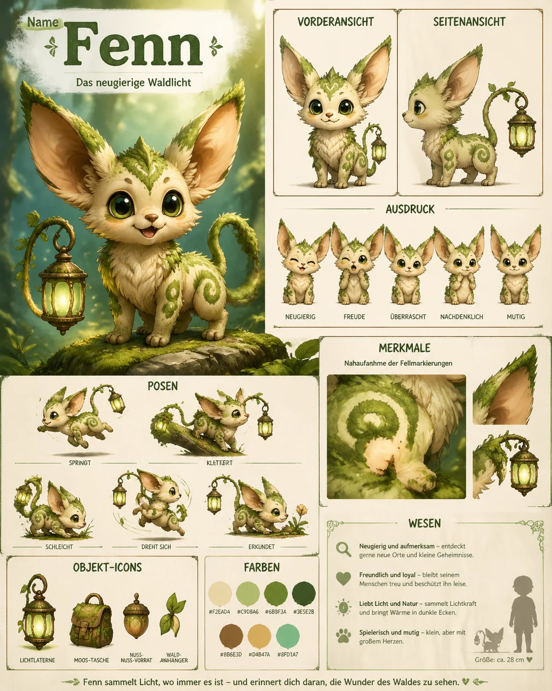


```text
生成一张结构清晰的角色设定图，保留上传参考图中的身份特征；如果没有参考图，就根据变量创建原创角色。包含主头像、表情、动作、道具图标、配色和短资料卡。所有可见文字使用简体中文，标签简短可读，避免真实品牌和受版权保护角色。\n\n场景: Design a creature sidekick or pet companion with poses, markings, and behavior notes.\n默认比例: 4:5\n可编辑变量: Creature species, Companion role, Markings, Movement style, Favorite objects, Temperament.
```


### 9. 创作者头像卡 (`creator-avatar-profile-card`)


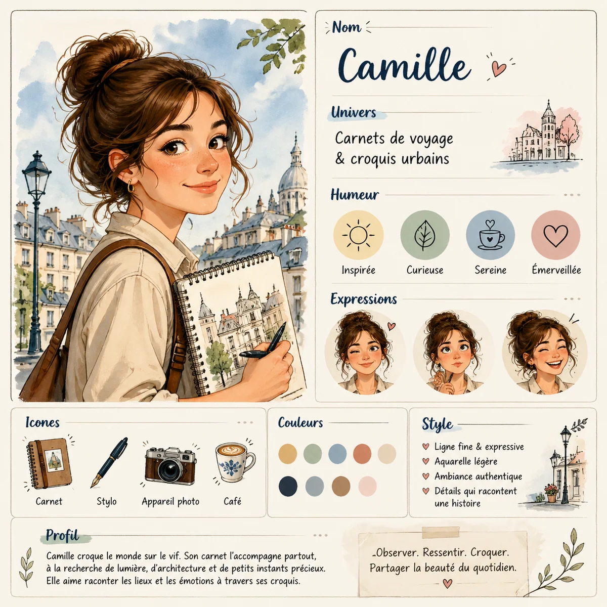


```text
生成一张结构清晰的角色设定图，保留上传参考图中的身份特征；如果没有参考图，就根据变量创建原创角色。包含主头像、表情、动作、道具图标、配色和短资料卡。所有可见文字使用简体中文，标签简短可读，避免真实品牌和受版权保护角色。\n\n场景: Turn a creator persona into a polished avatar board for profiles and social branding.\n默认比例: 1:1\n可编辑变量: Creator name, Niche, Visual persona, Mood words, Signature icons, Background style.
```


## 概念海报模板 (`concept-posters`)

用 GPT Image 2 生成隐喻海报。


### 1. Absence Gallery Poster 模板 (`absence-gallery-poster`)


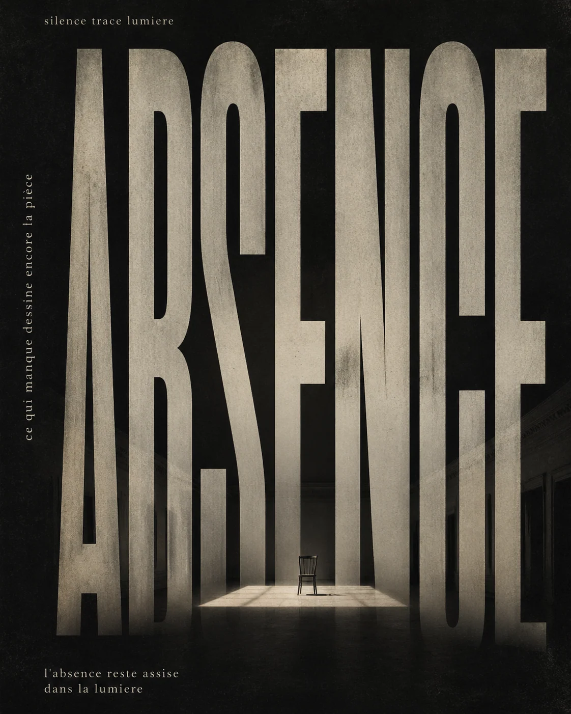


```text
创建一张 4:5 高级概念海报，模板方向是：Create a French exhibition-style poster about absence。核心文字由用户填写，必须清晰完整并成为第一视觉；所有可见文字使用简体中文。先理解文字的表层含义、深层寓意、情绪气质、文化联想和隐含张力，再决定画面风格、构图、色彩和一个最准确的视觉隐喻。请保留三处短文案：左上关键词、侧边短句、底部总结。可编辑变量：French core word, Emotional reading, Gallery or room metaphor, Light and shadow plan, Supporting French copy, Texture。避免拥挤、长段文字、品牌 logo、廉价广告感和错字。
```


### 2. Sehnsucht Station Poster 模板 (`sehnsucht-station-poster`)


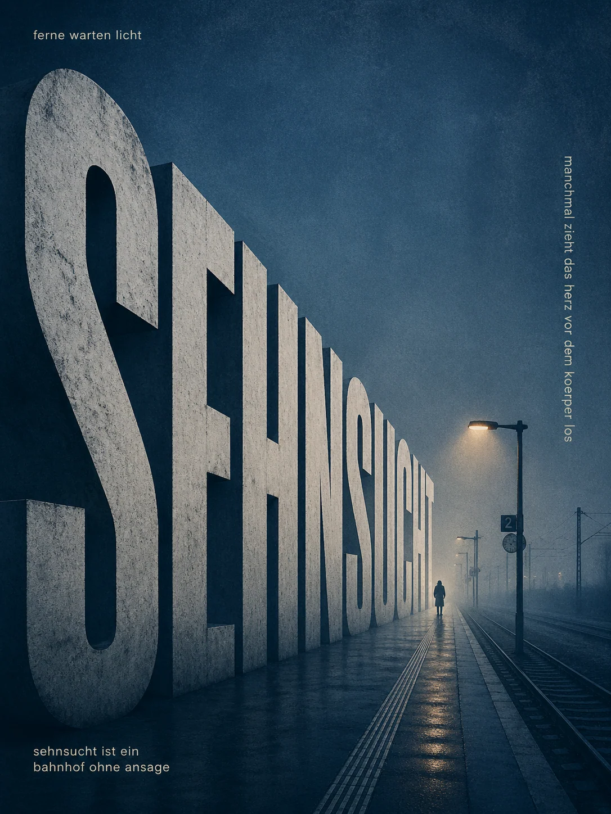


```text
创建一张 3:4 高级概念海报，模板方向是：Create a German longing poster with architectural metaphor。核心文字由用户填写，必须清晰完整并成为第一视觉；所有可见文字使用简体中文。先理解文字的表层含义、深层寓意、情绪气质、文化联想和隐含张力，再决定画面风格、构图、色彩和一个最准确的视觉隐喻。请保留三处短文案：左上关键词、侧边短句、底部总结。可编辑变量：German core word, Emotional interpretation, Architectural metaphor, Weather or light condition, Supporting German copy, Texture。避免拥挤、长段文字、品牌 logo、廉价广告感和错字。
```


### 3. Memory City Poster 模板 (`memory-city-poster`)


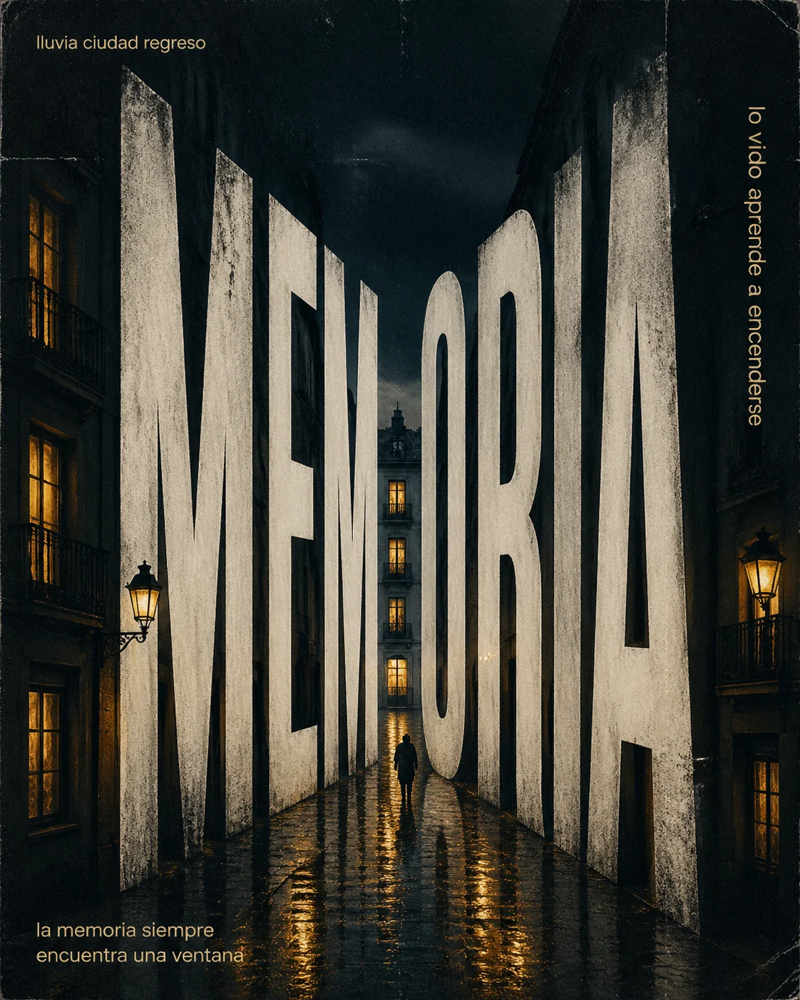


```text
创建一张 4:5 高级概念海报，模板方向是：Create a Spanish urban memory poster with cinematic metaphor。核心文字由用户填写，必须清晰完整并成为第一视觉；所有可见文字使用简体中文。先理解文字的表层含义、深层寓意、情绪气质、文化联想和隐含张力，再决定画面风格、构图、色彩和一个最准确的视觉隐喻。请保留三处短文案：左上关键词、侧边短句、底部总结。可编辑变量：Spanish core word, Urban memory, City setting, Visual metaphor, Supporting Spanish copy, Color atmosphere。避免拥挤、长段文字、品牌 logo、廉价广告感和错字。
```


### 4. Saudade Ocean Poster 模板 (`saudade-ocean-poster`)


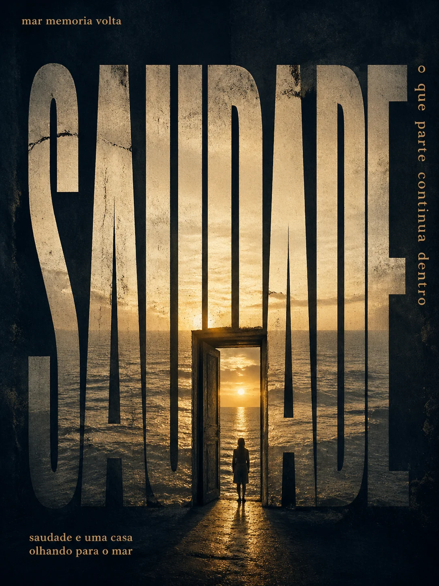


```text
创建一张 3:4 高级概念海报，模板方向是：Create a Portuguese literary emotion poster with ocean metaphor。核心文字由用户填写，必须清晰完整并成为第一视觉；所有可见文字使用简体中文。先理解文字的表层含义、深层寓意、情绪气质、文化联想和隐含张力，再决定画面风格、构图、色彩和一个最准确的视觉隐喻。请保留三处短文案：左上关键词、侧边短句、底部总结。可编辑变量：Portuguese word or title, Emotional interpretation, Ocean or city metaphor, Supporting copy, Material texture, Light mood。避免拥挤、长段文字、品牌 logo、廉价广告感和错字。
```


### 5. Ma Silence Poster 模板 (`ma-silence-poster`)


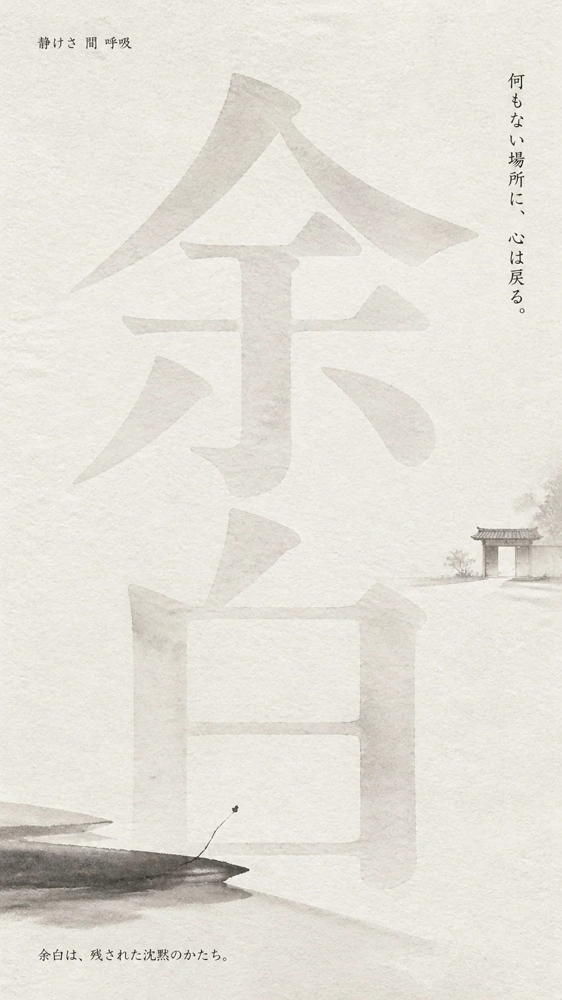


```text
创建一张 9:16 高级概念海报，模板方向是：Create a Japanese concept poster around silence and negative space。核心文字由用户填写，必须清晰完整并成为第一视觉；所有可见文字使用简体中文。先理解文字的表层含义、深层寓意、情绪气质、文化联想和隐含张力，再决定画面风格、构图、色彩和一个最准确的视觉隐喻。请保留三处短文案：左上关键词、侧边短句、底部总结。可编辑变量：Japanese word, Concept meaning, Natural or architectural symbol, Negative space strategy, Supporting Japanese copy, Color palette。避免拥挤、长段文字、品牌 logo、廉价广告感和错字。
```


### 6. Longing Memory Poster 模板 (`longing-memory-poster`)


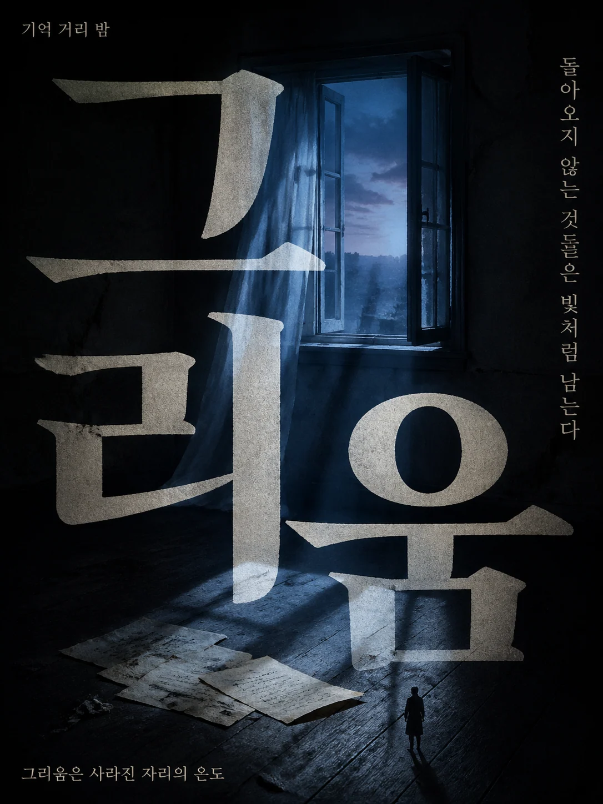


```text
创建一张 3:4 高级概念海报，模板方向是：Create a Korean emotion-word poster with restrained cinematic mood。核心文字由用户填写，必须清晰完整并成为第一视觉；所有可见文字使用简体中文。先理解文字的表层含义、深层寓意、情绪气质、文化联想和隐含张力，再决定画面风格、构图、色彩和一个最准确的视觉隐喻。请保留三处短文案：左上关键词、侧边短句、底部总结。可编辑变量：Korean core word, Emotional meaning, Memory object, Metaphor scene, Color mood, Supporting Korean copy。避免拥挤、长段文字、品牌 logo、廉价广告感和错字。
```


### 7. Resilience Title Poster 模板 (`resilience-title-poster`)


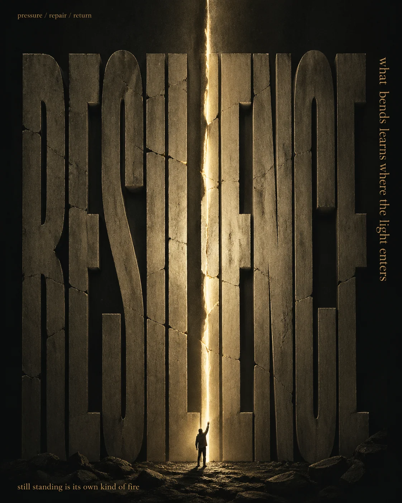


```text
创建一张 4:5 高级概念海报，模板方向是：Create an English concept poster for an abstract value。核心文字由用户填写，必须清晰完整并成为第一视觉；所有可见文字使用简体中文。先理解文字的表层含义、深层寓意、情绪气质、文化联想和隐含张力，再决定画面风格、构图、色彩和一个最准确的视觉隐喻。请保留三处短文案：左上关键词、侧边短句、底部总结。可编辑变量：Core word, Emotional tone, Symbolic setting, Visual metaphor, Supporting keywords, Summary line。避免拥挤、长段文字、品牌 logo、廉价广告感和错字。
```


### 8. Midnight Delivery Poster 模板 (`midnight-delivery-poster`)


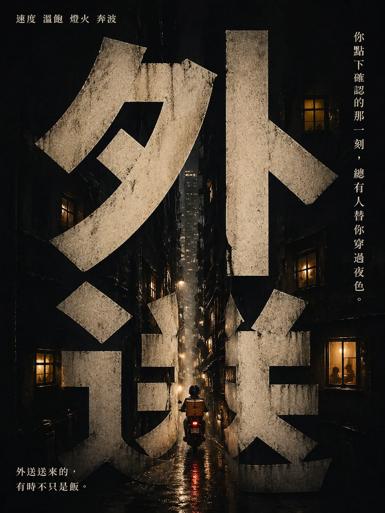


```text
创建一张 3:4 高级概念海报，模板方向是：Turn an everyday urban phrase into a dramatic fate-driven poster。核心文字由用户填写，必须清晰完整并成为第一视觉；所有可见文字使用简体中文。先理解文字的表层含义、深层寓意、情绪气质、文化联想和隐含张力，再决定画面风格、构图、色彩和一个最准确的视觉隐喻。请保留三处短文案：左上关键词、侧边短句、底部总结。可编辑变量：Core phrase, Everyday context, Hidden emotional tension, Urban setting, Main metaphor, Supporting copy。避免拥挤、长段文字、品牌 logo、廉价广告感和错字。
```


### 9. Serene Blessing Poster 模板 (`serene-blessing-poster`)


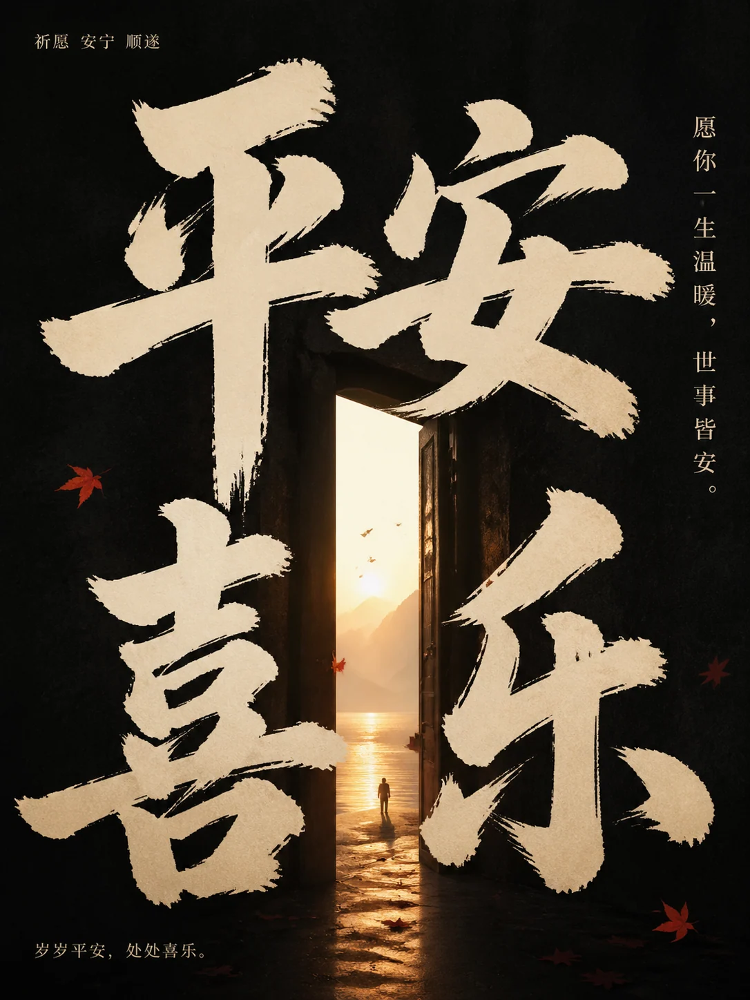


```text
创建一张 3:4 高级概念海报，模板方向是：Create a poetic Chinese blessing poster with a doorway metaphor。核心文字由用户填写，必须清晰完整并成为第一视觉；所有可见文字使用简体中文。先理解文字的表层含义、深层寓意、情绪气质、文化联想和隐含张力，再决定画面风格、构图、色彩和一个最准确的视觉隐喻。请保留三处短文案：左上关键词、侧边短句、底部总结。可编辑变量：Core Chinese phrase, Surface meaning, Deeper emotional meaning, Cultural association, Visual metaphor, Three short supporting copy lines。避免拥挤、长段文字、品牌 logo、廉价广告感和错字。
```


## 剖面科普绘本 (`cutaway-educational-picture-books`)

用 GPT Image 2 生成儿童友好的剖面科普页。


### 1. 火山剖面科普绘本 (`volcano-cutaway-picture-book`)


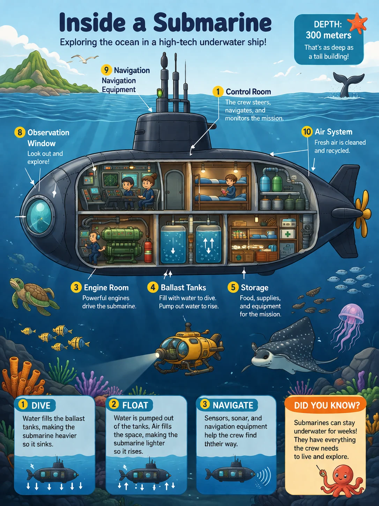


```text
使用 GPT Image 2 生成一张 3:4 竖版现代儿童科普绘本页，主题是“火山剖面科普绘本”。目标用途：Explain a natural structure with exterior, magma chamber, vents, and eruption flow。画面必须同时呈现清楚的外部轮廓和内部剖面结构，包含功能分区、层级关系、短中文标题、箭头、编号、说明框和局部放大框。风格保持干净现代的儿童科普绘本插画，配色明亮柔和，细节丰富但不杂乱。根据主题自动选择切开、半透明、分层展开或内部空间揭示。避免纸张纹理、书页折痕、医学恐怖感、工业蓝图、假 logo 和不可读乱码。
```


### 2. 潜水艇剖面科普页 (`ocean-submarine-cutaway`)


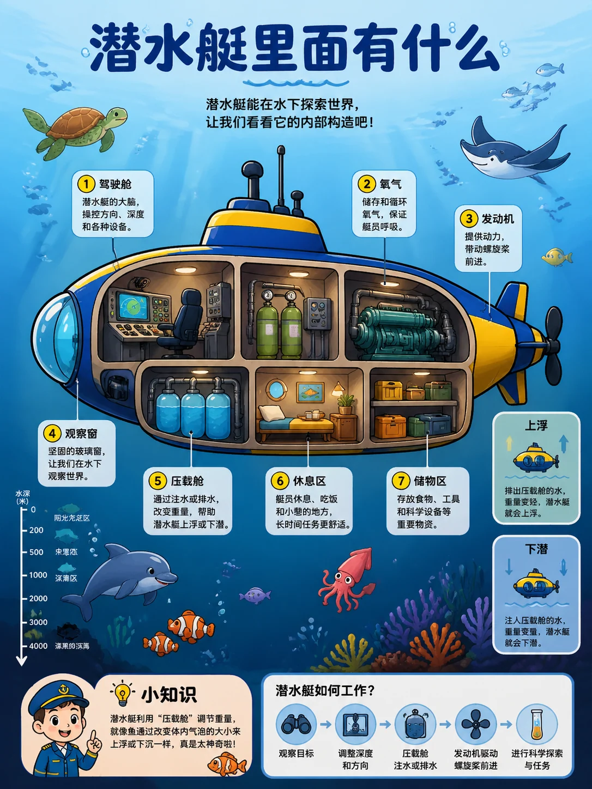


```text
使用 GPT Image 2 生成一张 3:4 竖版现代儿童科普绘本页，主题是“潜水艇剖面科普页”。目标用途：Reveal a vehicle interior, crew spaces, equipment zones, and surrounding environment。画面必须同时呈现清楚的外部轮廓和内部剖面结构，包含功能分区、层级关系、短中文标题、箭头、编号、说明框和局部放大框。风格保持干净现代的儿童科普绘本插画，配色明亮柔和，细节丰富但不杂乱。根据主题自动选择切开、半透明、分层展开或内部空间揭示。避免纸张纹理、书页折痕、医学恐怖感、工业蓝图、假 logo 和不可读乱码。
```


### 3. 心脏剖面故事页 (`heart-cutaway-story-page`)


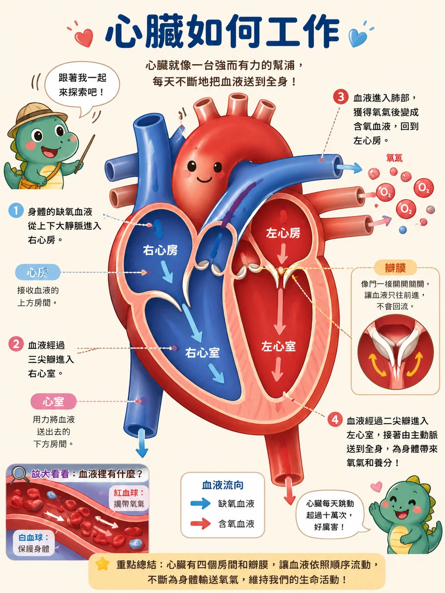


```text
使用 GPT Image 2 生成一张 3:4 竖版现代儿童科普绘本页，主题是“心脏剖面故事页”。目标用途：Turn an anatomy topic into a friendly structure-and-function page。画面必须同时呈现清楚的外部轮廓和内部剖面结构，包含功能分区、层级关系、短中文标题、箭头、编号、说明框和局部放大框。风格保持干净现代的儿童科普绘本插画，配色明亮柔和，细节丰富但不杂乱。根据主题自动选择切开、半透明、分层展开或内部空间揭示。避免纸张纹理、书页折痕、医学恐怖感、工业蓝图、假 logo 和不可读乱码。
```


### 4. 恐龙身体剖面图 (`dinosaur-body-cutaway`)


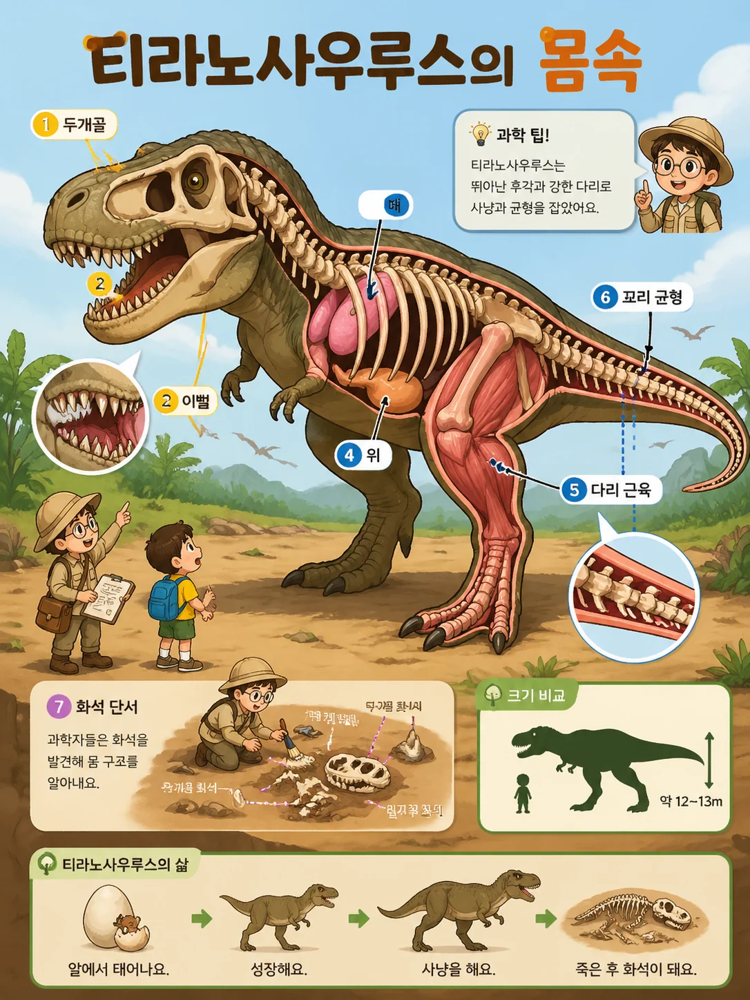


```text
使用 GPT Image 2 生成一张 3:4 竖版现代儿童科普绘本页，主题是“恐龙身体剖面图”。目标用途：Show a prehistoric animal as a readable anatomy and habitat explainer。画面必须同时呈现清楚的外部轮廓和内部剖面结构，包含功能分区、层级关系、短中文标题、箭头、编号、说明框和局部放大框。风格保持干净现代的儿童科普绘本插画，配色明亮柔和，细节丰富但不杂乱。根据主题自动选择切开、半透明、分层展开或内部空间揭示。避免纸张纹理、书页折痕、医学恐怖感、工业蓝图、假 logo 和不可读乱码。
```


### 5. 向日葵生长剖面 (`sunflower-growth-cutaway`)


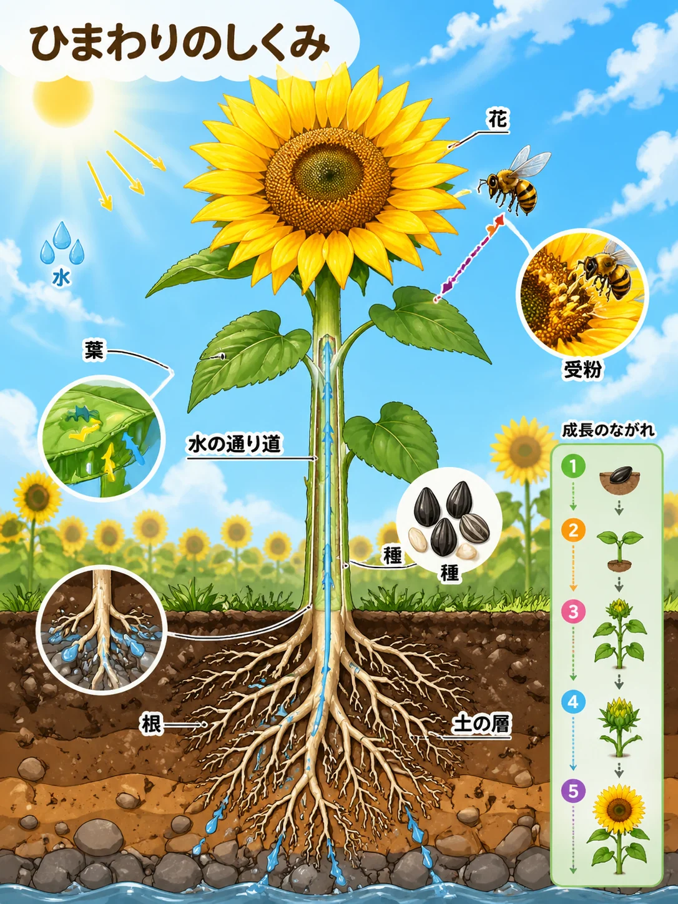


```text
使用 GPT Image 2 生成一张 3:4 竖版现代儿童科普绘本页，主题是“向日葵生长剖面”。目标用途：Explain plant growth, roots, stem, flower head, and pollination zones。画面必须同时呈现清楚的外部轮廓和内部剖面结构，包含功能分区、层级关系、短中文标题、箭头、编号、说明框和局部放大框。风格保持干净现代的儿童科普绘本插画，配色明亮柔和，细节丰富但不杂乱。根据主题自动选择切开、半透明、分层展开或内部空间揭示。避免纸张纹理、书页折痕、医学恐怖感、工业蓝图、假 logo 和不可读乱码。
```


### 6. 鲸鱼生态剖面页 (`whale-ecosystem-cutaway`)


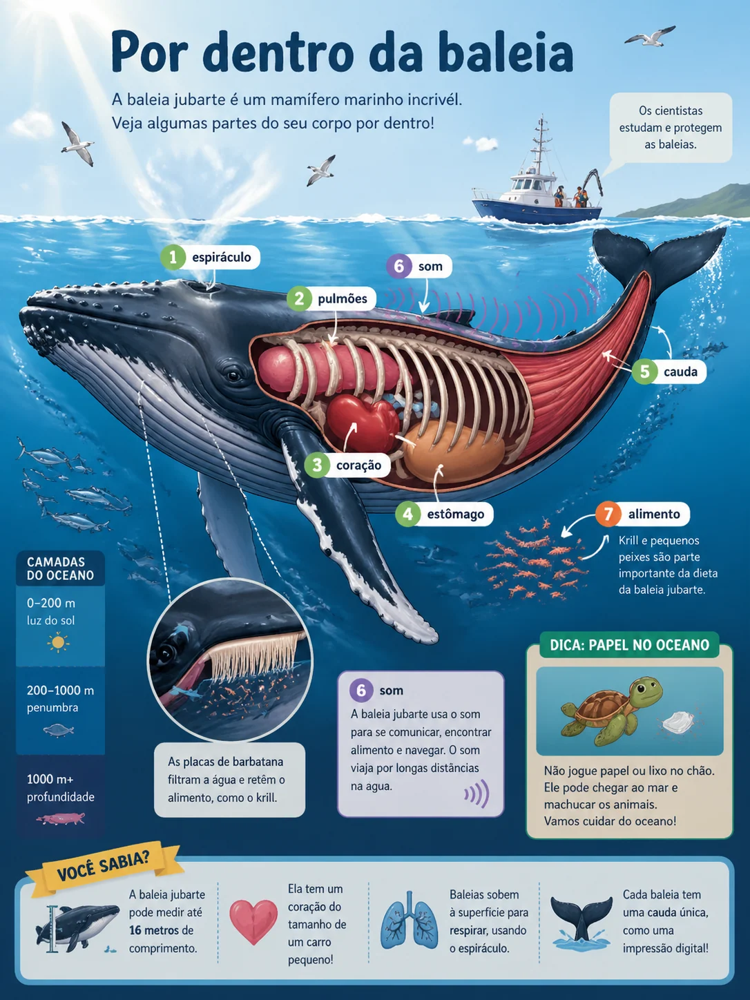


```text
使用 GPT Image 2 生成一张 3:4 竖版现代儿童科普绘本页，主题是“鲸鱼生态剖面页”。目标用途：Combine animal structure with ocean ecosystem relationships。画面必须同时呈现清楚的外部轮廓和内部剖面结构，包含功能分区、层级关系、短中文标题、箭头、编号、说明框和局部放大框。风格保持干净现代的儿童科普绘本插画，配色明亮柔和，细节丰富但不杂乱。根据主题自动选择切开、半透明、分层展开或内部空间揭示。避免纸张纹理、书页折痕、医学恐怖感、工业蓝图、假 logo 和不可读乱码。
```


### 7. 城堡生活剖面图 (`castle-life-cutaway`)


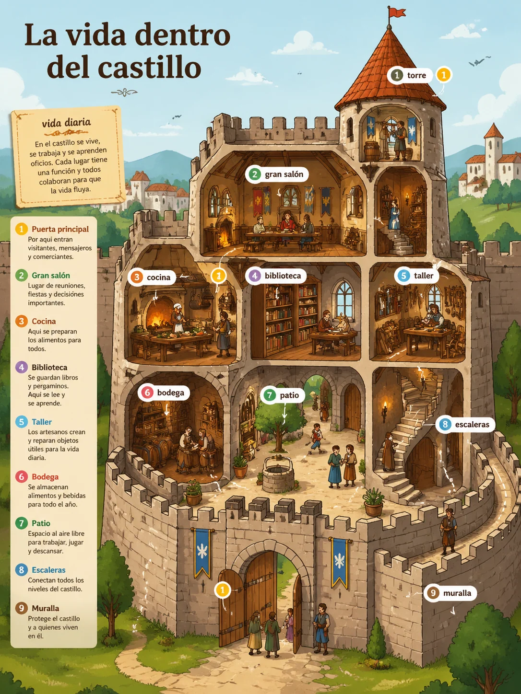


```text
使用 GPT Image 2 生成一张 3:4 竖版现代儿童科普绘本页，主题是“城堡生活剖面图”。目标用途：Reveal rooms, daily life, defenses, and vertical building organization。画面必须同时呈现清楚的外部轮廓和内部剖面结构，包含功能分区、层级关系、短中文标题、箭头、编号、说明框和局部放大框。风格保持干净现代的儿童科普绘本插画，配色明亮柔和，细节丰富但不杂乱。根据主题自动选择切开、半透明、分层展开或内部空间揭示。避免纸张纹理、书页折痕、医学恐怖感、工业蓝图、假 logo 和不可读乱码。
```


### 8. 图书馆知识剖面 (`library-knowledge-cutaway`)


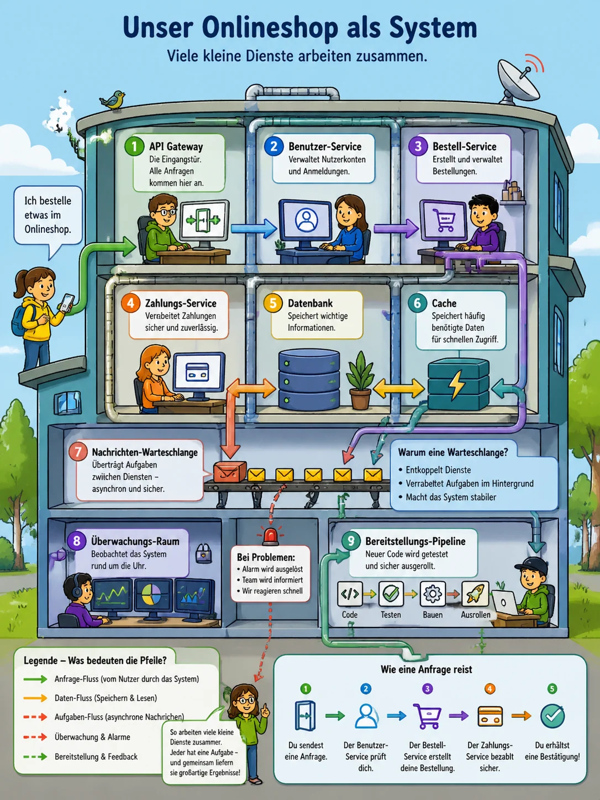


```text
使用 GPT Image 2 生成一张 3:4 竖版现代儿童科普绘本页，主题是“图书馆知识剖面”。目标用途：Explain a public building as internal zones and learning flows。画面必须同时呈现清楚的外部轮廓和内部剖面结构，包含功能分区、层级关系、短中文标题、箭头、编号、说明框和局部放大框。风格保持干净现代的儿童科普绘本插画，配色明亮柔和，细节丰富但不杂乱。根据主题自动选择切开、半透明、分层展开或内部空间揭示。避免纸张纹理、书页折痕、医学恐怖感、工业蓝图、假 logo 和不可读乱码。
```


### 9. 微服务架构剖面 (`microservice-architecture-cutaway`)


```text
使用 GPT Image 2 生成一张 3:4 竖版现代儿童科普绘本页，主题是“微服务架构剖面”。目标用途：Adapt the cutaway picture-book style to a technical system diagram。画面必须同时呈现清楚的外部轮廓和内部剖面结构，包含功能分区、层级关系、短中文标题、箭头、编号、说明框和局部放大框。风格保持干净现代的儿童科普绘本插画，配色明亮柔和，细节丰富但不杂乱。根据主题自动选择切开、半透明、分层展开或内部空间揭示。避免纸张纹理、书页折痕、医学恐怖感、工业蓝图、假 logo 和不可读乱码。
```


## 角色海报模板 (`double-exposure-character-posters`)

用可复用提示词生成双重曝光角色海报。


### 1. Mythic Guardian Poster (`mythic-guardian-poster`)


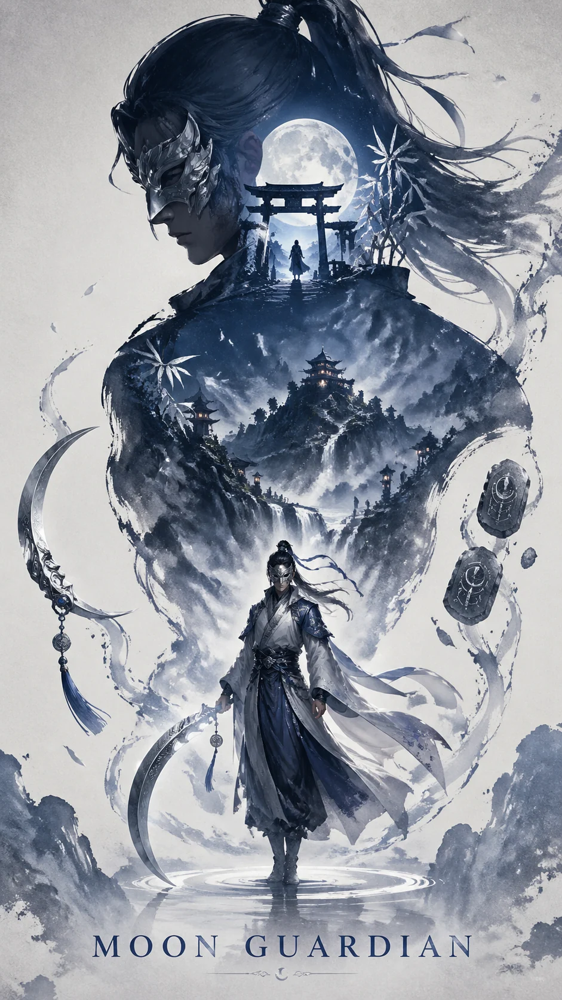


```text
为原创角色「[角色名]」生成一张 9:16 角色宣传海报，用途：Premium vertical key visual for an original fantasy guardian。采用上方巨大剪影、下方较小全身角色的层级构图；剪影内加入双重曝光叙事拼贴，包括[世界/地点]、[核心符号]、[故事片段1]、[故事片段2]和环境细节。左右两侧放置平衡元素，并用一条从上到下的流动视觉线连接剪影、内部场景和角色。保留大面积留白、雾气、水墨扩散、柔焦和碎片化淡出。所有可见文字使用简体中文，只保留短标题「[海报标题]」。不要使用已有 IP、真人名人、logo 或随机文字。
```


### 2. Wuxia Moon Guardian (`wuxia-moon-guardian`)


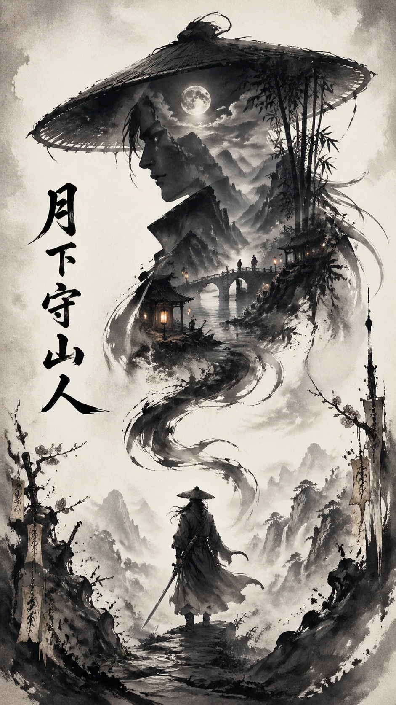


```text
为原创角色「[角色名]」生成一张 9:16 角色宣传海报，用途：Simplified Chinese martial fantasy character poster。采用上方巨大剪影、下方较小全身角色的层级构图；剪影内加入双重曝光叙事拼贴，包括[世界/地点]、[核心符号]、[故事片段1]、[故事片段2]和环境细节。左右两侧放置平衡元素，并用一条从上到下的流动视觉线连接剪影、内部场景和角色。保留大面积留白、雾气、水墨扩散、柔焦和碎片化淡出。所有可见文字使用简体中文，只保留短标题「[海报标题]」。不要使用已有 IP、真人名人、logo 或随机文字。
```


### 3. Neon City Heroine (`neon-city-heroine`)


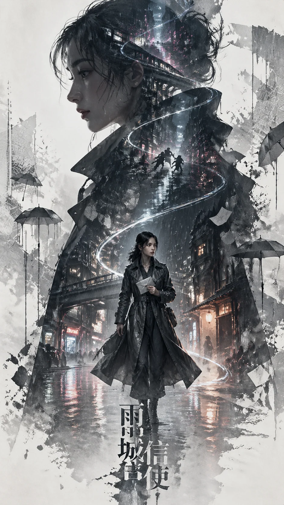


```text
为原创角色「[角色名]」生成一张 9:16 角色宣传海报，用途：Traditional Chinese urban heroine poster。采用上方巨大剪影、下方较小全身角色的层级构图；剪影内加入双重曝光叙事拼贴，包括[世界/地点]、[核心符号]、[故事片段1]、[故事片段2]和环境细节。左右两侧放置平衡元素，并用一条从上到下的流动视觉线连接剪影、内部场景和角色。保留大面积留白、雾气、水墨扩散、柔焦和碎片化淡出。所有可见文字使用简体中文，只保留短标题「[海报标题]」。不要使用已有 IP、真人名人、logo 或随机文字。
```


### 4. Korean Cyber Sentinel (`korean-cyber-sentinel`)


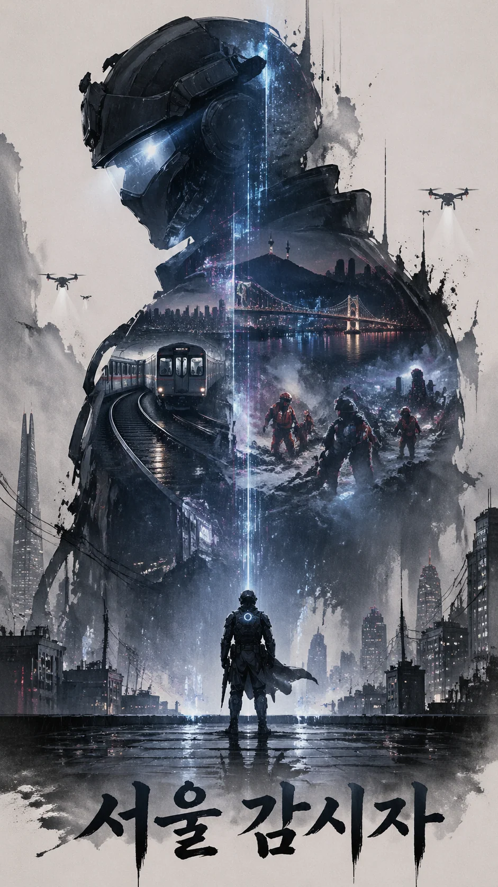


```text
为原创角色「[角色名]」生成一张 9:16 角色宣传海报，用途：Korean sci-fi protector character poster。采用上方巨大剪影、下方较小全身角色的层级构图；剪影内加入双重曝光叙事拼贴，包括[世界/地点]、[核心符号]、[故事片段1]、[故事片段2]和环境细节。左右两侧放置平衡元素，并用一条从上到下的流动视觉线连接剪影、内部场景和角色。保留大面积留白、雾气、水墨扩散、柔焦和碎片化淡出。所有可见文字使用简体中文，只保留短标题「[海报标题]」。不要使用已有 IP、真人名人、logo 或随机文字。
```


### 5. Japanese Spirit Swordswoman (`japanese-spirit-swordswoman`)


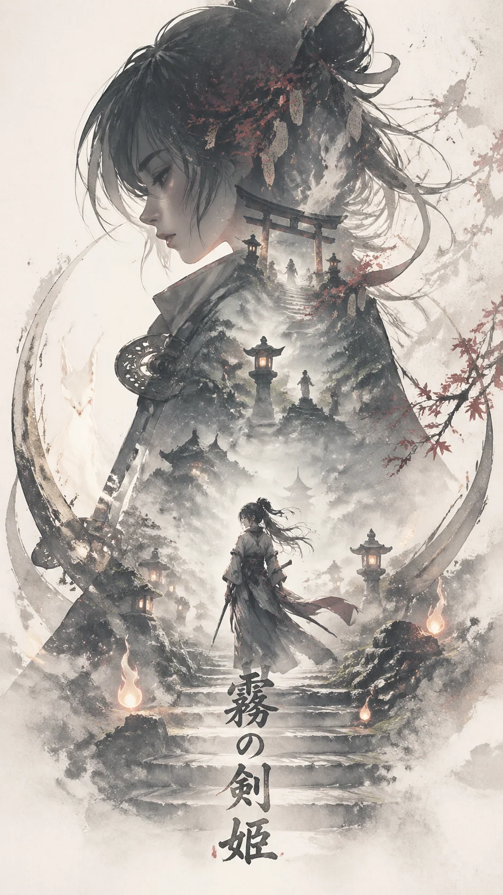


```text
为原创角色「[角色名]」生成一张 9:16 角色宣传海报，用途：Japanese fantasy swordswoman poster。采用上方巨大剪影、下方较小全身角色的层级构图；剪影内加入双重曝光叙事拼贴，包括[世界/地点]、[核心符号]、[故事片段1]、[故事片段2]和环境细节。左右两侧放置平衡元素，并用一条从上到下的流动视觉线连接剪影、内部场景和角色。保留大面积留白、雾气、水墨扩散、柔焦和碎片化淡出。所有可见文字使用简体中文，只保留短标题「[海报标题]」。不要使用已有 IP、真人名人、logo 或随机文字。
```


### 6. Portuguese Ocean Navigator (`portuguese-ocean-navigator`)


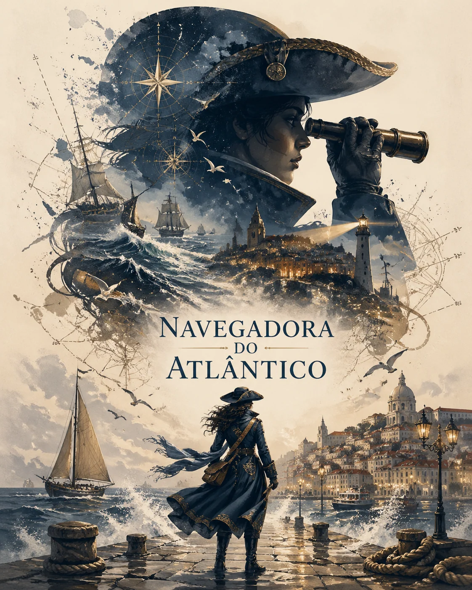


```text
为原创角色「[角色名]」生成一张 4:5 角色宣传海报，用途：Portuguese-language maritime hero poster。采用上方巨大剪影、下方较小全身角色的层级构图；剪影内加入双重曝光叙事拼贴，包括[世界/地点]、[核心符号]、[故事片段1]、[故事片段2]和环境细节。左右两侧放置平衡元素，并用一条从上到下的流动视觉线连接剪影、内部场景和角色。保留大面积留白、雾气、水墨扩散、柔焦和碎片化淡出。所有可见文字使用简体中文，只保留短标题「[海报标题]」。不要使用已有 IP、真人名人、logo 或随机文字。
```


### 7. Spanish Desert Vigilante (`spanish-desert-vigilante`)


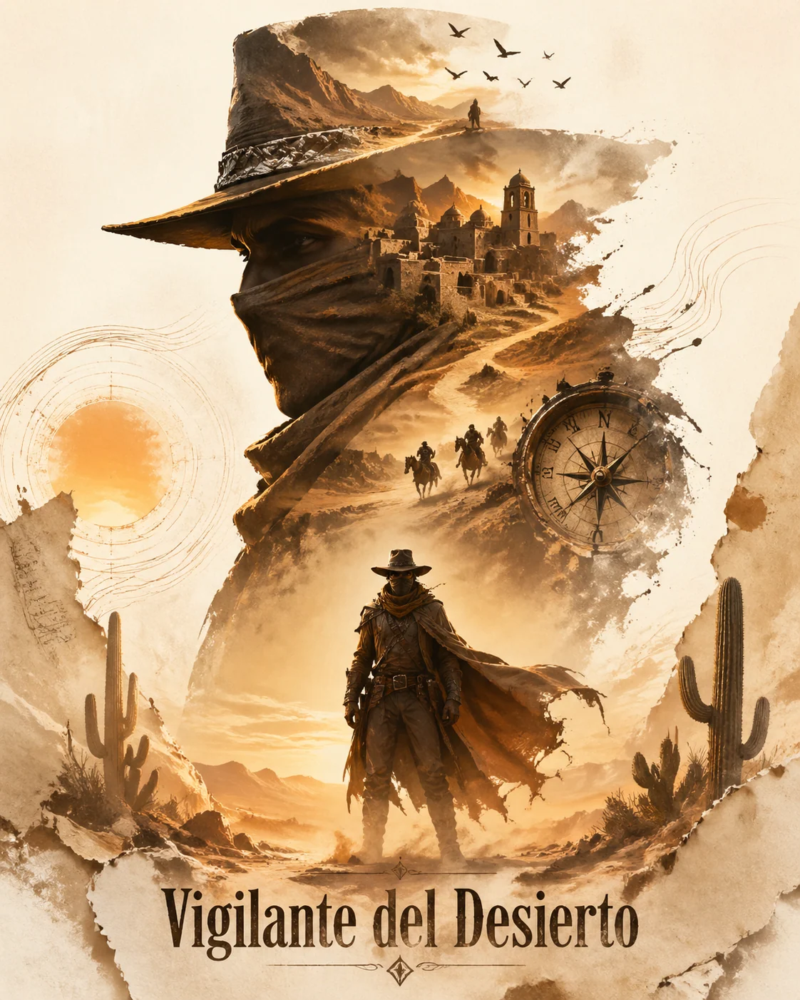


```text
为原创角色「[角色名]」生成一张 4:5 角色宣传海报，用途：Spanish-language western fantasy poster。采用上方巨大剪影、下方较小全身角色的层级构图；剪影内加入双重曝光叙事拼贴，包括[世界/地点]、[核心符号]、[故事片段1]、[故事片段2]和环境细节。左右两侧放置平衡元素，并用一条从上到下的流动视觉线连接剪影、内部场景和角色。保留大面积留白、雾气、水墨扩散、柔焦和碎片化淡出。所有可见文字使用简体中文，只保留短标题「[海报标题]」。不要使用已有 IP、真人名人、logo 或随机文字。
```


### 8. German Alpine Inventor (`german-alpine-inventor`)


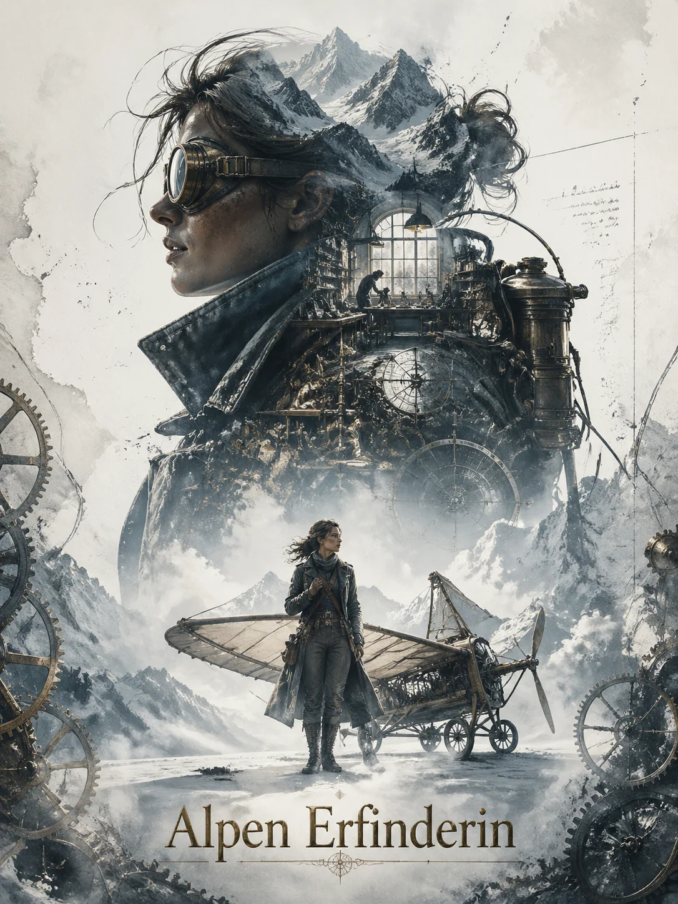


```text
为原创角色「[角色名]」生成一张 3:4 角色宣传海报，用途：German steampunk inventor character poster。采用上方巨大剪影、下方较小全身角色的层级构图；剪影内加入双重曝光叙事拼贴，包括[世界/地点]、[核心符号]、[故事片段1]、[故事片段2]和环境细节。左右两侧放置平衡元素，并用一条从上到下的流动视觉线连接剪影、内部场景和角色。保留大面积留白、雾气、水墨扩散、柔焦和碎片化淡出。所有可见文字使用简体中文，只保留短标题「[海报标题]」。不要使用已有 IP、真人名人、logo 或随机文字。
```


### 9. French Archive Detective (`french-archive-detective`)


```text
为原创角色「[角色名]」生成一张 16:9 角色宣传海报，用途：French literary detective campaign poster。采用上方巨大剪影、下方较小全身角色的层级构图；剪影内加入双重曝光叙事拼贴，包括[世界/地点]、[核心符号]、[故事片段1]、[故事片段2]和环境细节。左右两侧放置平衡元素，并用一条从上到下的流动视觉线连接剪影、内部场景和角色。保留大面积留白、雾气、水墨扩散、柔焦和碎片化淡出。所有可见文字使用简体中文，只保留短标题「[海报标题]」。不要使用已有 IP、真人名人、logo 或随机文字。
```


## 神话肖像海报 (`eastern-myth-portraits`)

用 GPT Image 2 模板生成东方神话肖像。


### 1. 仙女海报 (`celestial-maiden-poster`)


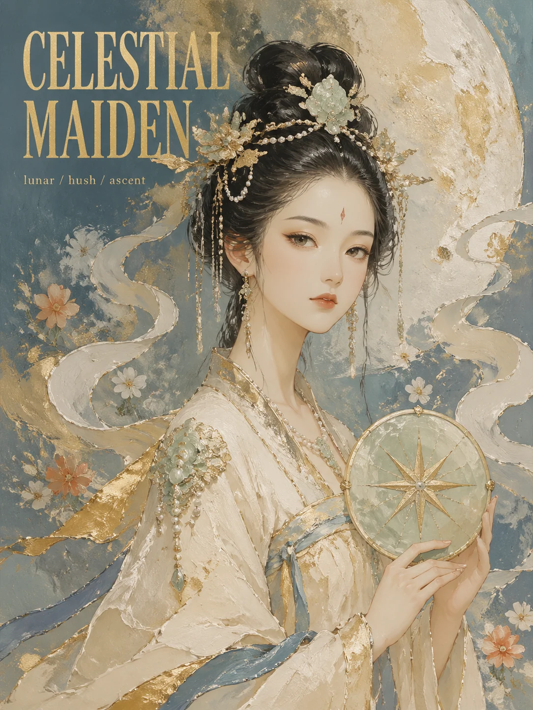


```text
使用 GPT Image 2 创建「仙女海报」。可替换 [角色/主题]、[海报标题]、[神话符号]、[矿物色配色]、[服饰细节] 和 [背景材质]。画面应是现代东方装饰厚涂半身神话肖像，修长东方椭圆脸，五官简练，面部留白干净，细长上挑眼，神情古雅克制。用大色块组织头发、脸部、服饰、肩部和背景，柔和明亮光源让面部、颈肩和上半身比背景更亮。精绘眼睛、发饰、宝石、肩部纹样和金色细节；衣袖、披帛、云纹、植物和背景保持写意。使用米白、象牙白、雾石青、柔石绿、浅朱砂、柔赭、浅古金等矿物色。可见文字使用简体中文，标题短而清晰。避免 logo、随机文字、受保护角色、写实名人脸和深黑暗部。
```


### 2. 女娲造物海报 (`nuwa-creation-poster`)


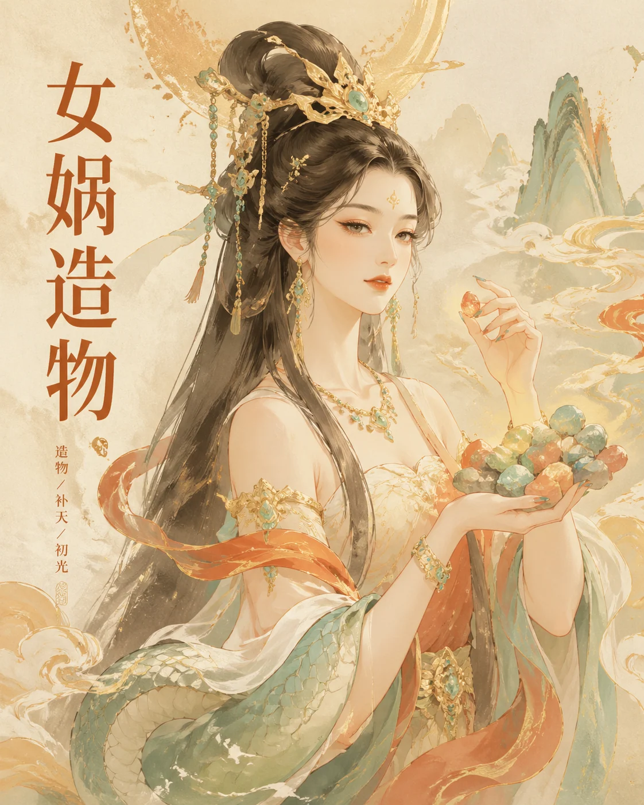


```text
使用 GPT Image 2 创建「女娲造物海报」。可替换 [角色/主题]、[海报标题]、[神话符号]、[矿物色配色]、[服饰细节] 和 [背景材质]。画面应是现代东方装饰厚涂半身神话肖像，修长东方椭圆脸，五官简练，面部留白干净，细长上挑眼，神情古雅克制。用大色块组织头发、脸部、服饰、肩部和背景，柔和明亮光源让面部、颈肩和上半身比背景更亮。精绘眼睛、发饰、宝石、肩部纹样和金色细节；衣袖、披帛、云纹、植物和背景保持写意。使用米白、象牙白、雾石青、柔石绿、浅朱砂、柔赭、浅古金等矿物色。可见文字使用简体中文，标题短而清晰。避免 logo、随机文字、受保护角色、写实名人脸和深黑暗部。
```


### 3. 妈祖海神守护 (`mazu-sea-guardian`)


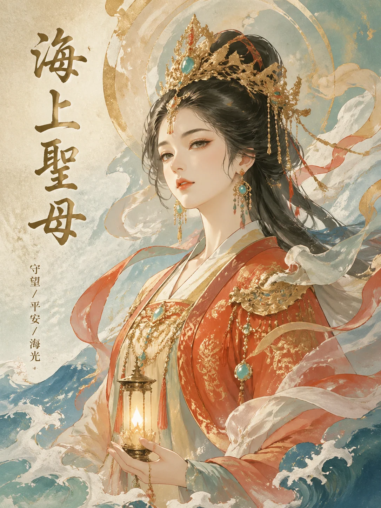


```text
使用 GPT Image 2 创建「妈祖海神守护」。可替换 [角色/主题]、[海报标题]、[神话符号]、[矿物色配色]、[服饰细节] 和 [背景材质]。画面应是现代东方装饰厚涂半身神话肖像，修长东方椭圆脸，五官简练，面部留白干净，细长上挑眼，神情古雅克制。用大色块组织头发、脸部、服饰、肩部和背景，柔和明亮光源让面部、颈肩和上半身比背景更亮。精绘眼睛、发饰、宝石、肩部纹样和金色细节；衣袖、披帛、云纹、植物和背景保持写意。使用米白、象牙白、雾石青、柔石绿、浅朱砂、柔赭、浅古金等矿物色。可见文字使用简体中文，标题短而清晰。避免 logo、随机文字、受保护角色、写实名人脸和深黑暗部。
```


### 4. 山神守护者肖像 (`mountain-spirit-portrait`)


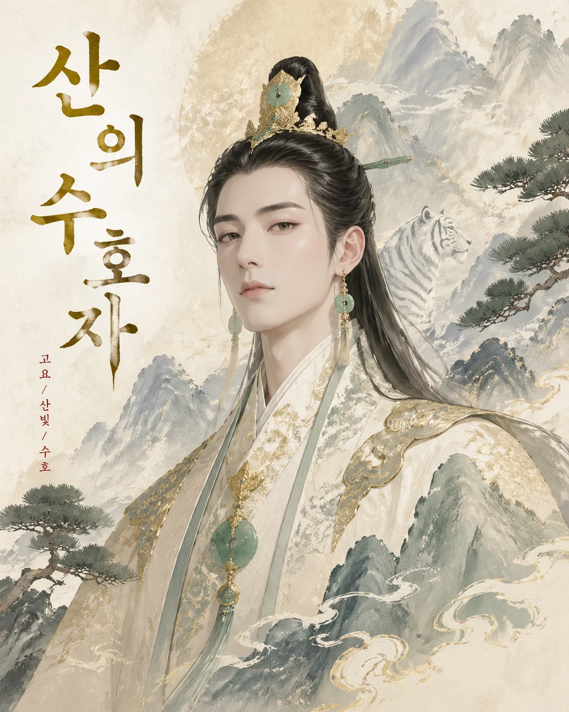


```text
使用 GPT Image 2 创建「山神守护者肖像」。可替换 [角色/主题]、[海报标题]、[神话符号]、[矿物色配色]、[服饰细节] 和 [背景材质]。画面应是现代东方装饰厚涂半身神话肖像，修长东方椭圆脸，五官简练，面部留白干净，细长上挑眼，神情古雅克制。用大色块组织头发、脸部、服饰、肩部和背景，柔和明亮光源让面部、颈肩和上半身比背景更亮。精绘眼睛、发饰、宝石、肩部纹样和金色细节；衣袖、披帛、云纹、植物和背景保持写意。使用米白、象牙白、雾石青、柔石绿、浅朱砂、柔赭、浅古金等矿物色。可见文字使用简体中文，标题短而清晰。避免 logo、随机文字、受保护角色、写实名人脸和深黑暗部。
```


### 5. 太阳女神海报 (`sun-goddess-poster`)


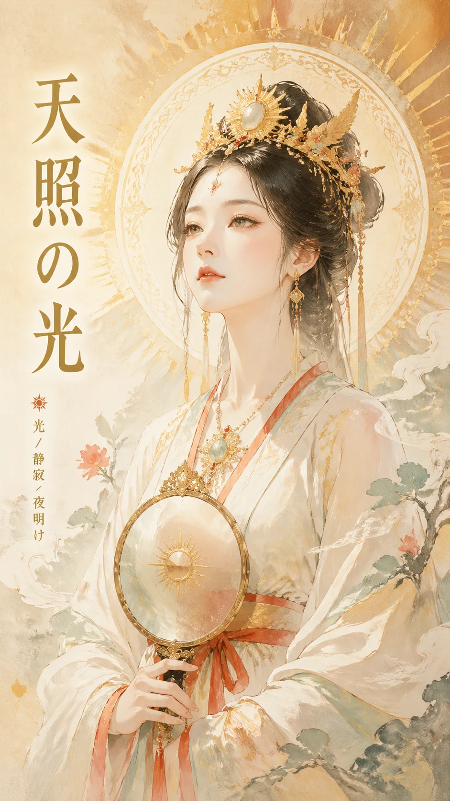


```text
使用 GPT Image 2 创建「太阳女神海报」。可替换 [角色/主题]、[海报标题]、[神话符号]、[矿物色配色]、[服饰细节] 和 [背景材质]。画面应是现代东方装饰厚涂半身神话肖像，修长东方椭圆脸，五官简练，面部留白干净，细长上挑眼，神情古雅克制。用大色块组织头发、脸部、服饰、肩部和背景，柔和明亮光源让面部、颈肩和上半身比背景更亮。精绘眼睛、发饰、宝石、肩部纹样和金色细节；衣袖、披帛、云纹、植物和背景保持写意。使用米白、象牙白、雾石青、柔石绿、浅朱砂、柔赭、浅古金等矿物色。可见文字使用简体中文，标题短而清晰。避免 logo、随机文字、受保护角色、写实名人脸和深黑暗部。
```


### 6. 海洋神谕海报 (`ocean-oracle-poster`)


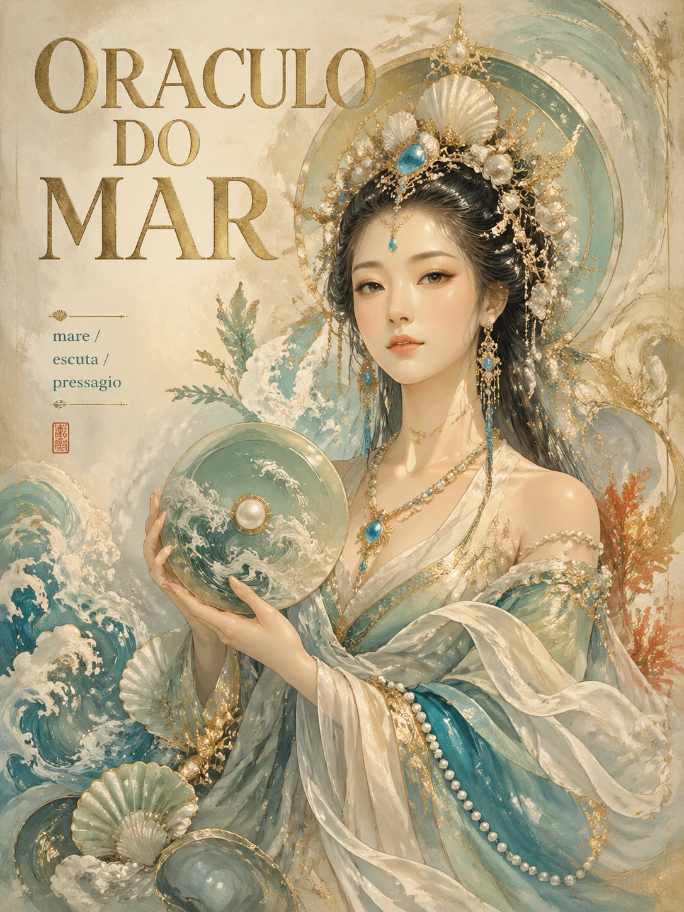


```text
使用 GPT Image 2 创建「海洋神谕海报」。可替换 [角色/主题]、[海报标题]、[神话符号]、[矿物色配色]、[服饰细节] 和 [背景材质]。画面应是现代东方装饰厚涂半身神话肖像，修长东方椭圆脸，五官简练，面部留白干净，细长上挑眼，神情古雅克制。用大色块组织头发、脸部、服饰、肩部和背景，柔和明亮光源让面部、颈肩和上半身比背景更亮。精绘眼睛、发饰、宝石、肩部纹样和金色细节；衣袖、披帛、云纹、植物和背景保持写意。使用米白、象牙白、雾石青、柔石绿、浅朱砂、柔赭、浅古金等矿物色。可见文字使用简体中文，标题短而清晰。避免 logo、随机文字、受保护角色、写实名人脸和深黑暗部。
```


### 7. 月亮守护者海报 (`moon-guardian-poster`)


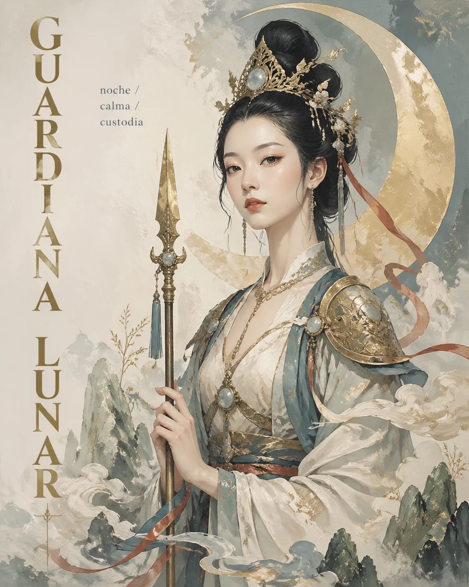


```text
使用 GPT Image 2 创建「月亮守护者海报」。可替换 [角色/主题]、[海报标题]、[神话符号]、[矿物色配色]、[服饰细节] 和 [背景材质]。画面应是现代东方装饰厚涂半身神话肖像，修长东方椭圆脸，五官简练，面部留白干净，细长上挑眼，神情古雅克制。用大色块组织头发、脸部、服饰、肩部和背景，柔和明亮光源让面部、颈肩和上半身比背景更亮。精绘眼睛、发饰、宝石、肩部纹样和金色细节；衣袖、披帛、云纹、植物和背景保持写意。使用米白、象牙白、雾石青、柔石绿、浅朱砂、柔赭、浅古金等矿物色。可见文字使用简体中文，标题短而清晰。避免 logo、随机文字、受保护角色、写实名人脸和深黑暗部。
```


### 8. 河流精灵海报 (`river-spirit-poster`)


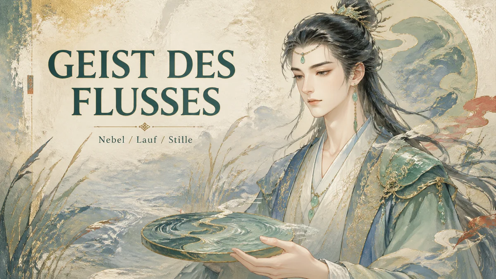


```text
使用 GPT Image 2 创建「河流精灵海报」。可替换 [角色/主题]、[海报标题]、[神话符号]、[矿物色配色]、[服饰细节] 和 [背景材质]。画面应是现代东方装饰厚涂半身神话肖像，修长东方椭圆脸，五官简练，面部留白干净，细长上挑眼，神情古雅克制。用大色块组织头发、脸部、服饰、肩部和背景，柔和明亮光源让面部、颈肩和上半身比背景更亮。精绘眼睛、发饰、宝石、肩部纹样和金色细节；衣袖、披帛、云纹、植物和背景保持写意。使用米白、象牙白、雾石青、柔石绿、浅朱砂、柔赭、浅古金等矿物色。可见文字使用简体中文，标题短而清晰。避免 logo、随机文字、受保护角色、写实名人脸和深黑暗部。
```


### 9. 神话缪斯海报 (`mythic-muse-poster`)


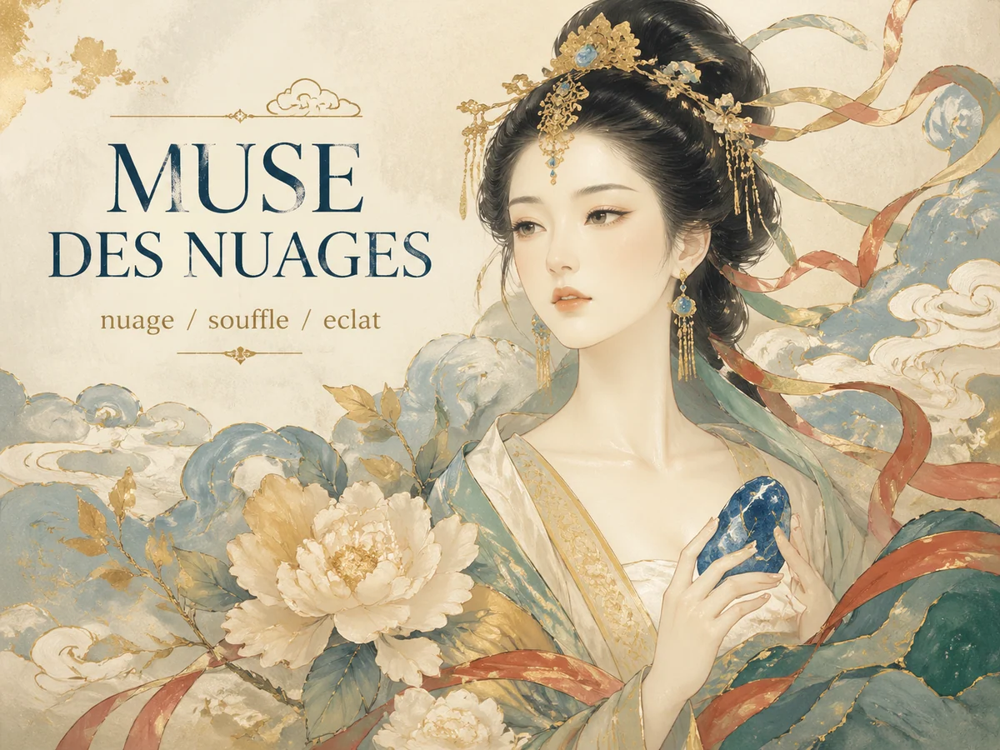


```text
使用 GPT Image 2 创建「神话缪斯海报」。可替换 [角色/主题]、[海报标题]、[神话符号]、[矿物色配色]、[服饰细节] 和 [背景材质]。画面应是现代东方装饰厚涂半身神话肖像，修长东方椭圆脸，五官简练，面部留白干净，细长上挑眼，神情古雅克制。用大色块组织头发、脸部、服饰、肩部和背景，柔和明亮光源让面部、颈肩和上半身比背景更亮。精绘眼睛、发饰、宝石、肩部纹样和金色细节；衣袖、披帛、云纹、植物和背景保持写意。使用米白、象牙白、雾石青、柔石绿、浅朱砂、柔赭、浅古金等矿物色。可见文字使用简体中文，标题短而清晰。避免 logo、随机文字、受保护角色、写实名人脸和深黑暗部。
```


## 进化史信息图 (`evolution-history-infographics`)

把任意主题进化史变成结构化信息图。


### 1. 法国香水瓶进化史 (`french-perfume-bottle-evolution`)


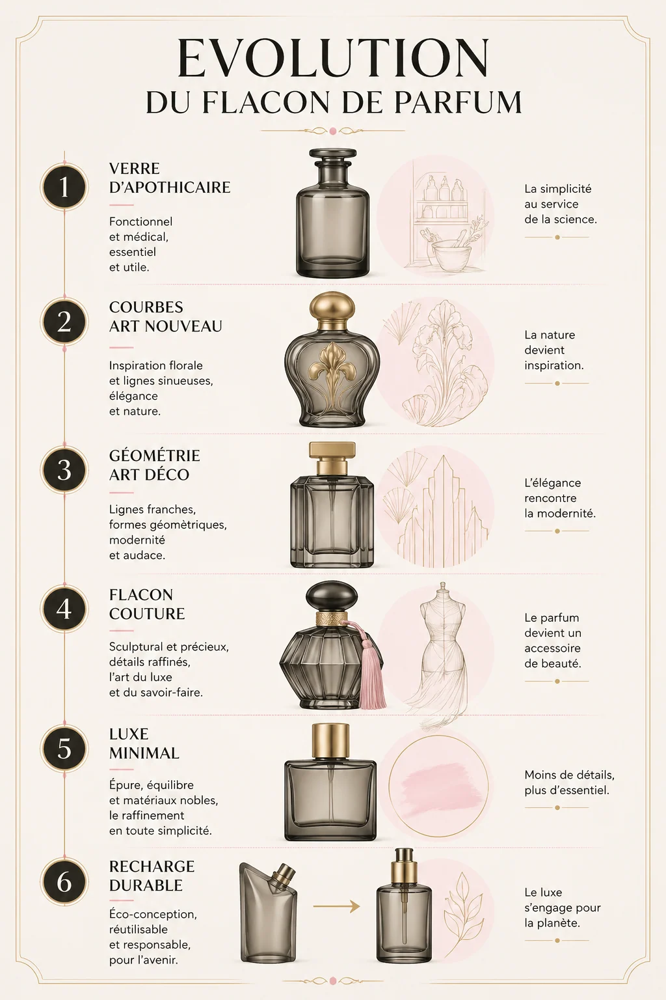


```text
创建一张竖版 2:3 信息图，主题是「法国香水瓶进化史」。开始绘制前，先像信息设计总监一样梳理主题：划分 5-7 个关键阶段，明确时间逻辑、代表性物件、重要转折、配色系统、字体气质和阅读路径。画面应包含主标题、清晰时间线、阶段卡片、小型物件插画、短标签和克制注释。所有可见文字使用简体中文，保持短句、清晰、可读。不要加入真实品牌标志、随机水印或未经验证的精确数据。
```


### 2. 包豪斯椅子进化史 (`bauhaus-chair-evolution`)


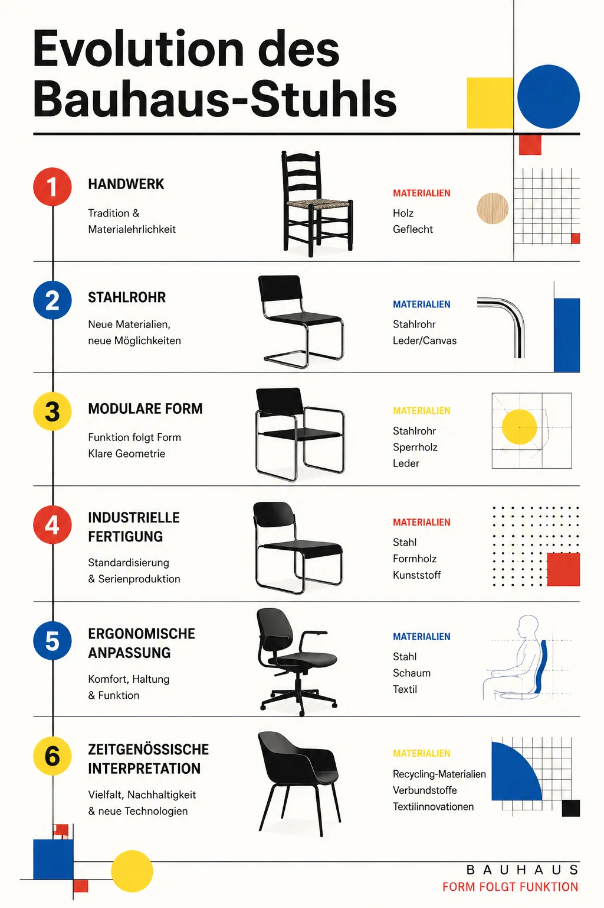


```text
创建一张竖版 2:3 信息图，主题是「包豪斯椅子进化史」。开始绘制前，先像信息设计总监一样梳理主题：划分 5-7 个关键阶段，明确时间逻辑、代表性物件、重要转折、配色系统、字体气质和阅读路径。画面应包含主标题、清晰时间线、阶段卡片、小型物件插画、短标签和克制注释。所有可见文字使用简体中文，保持短句、清晰、可读。不要加入真实品牌标志、随机水印或未经验证的精确数据。
```


### 3. 墨西哥可可进化史 (`mexican-cacao-evolution`)


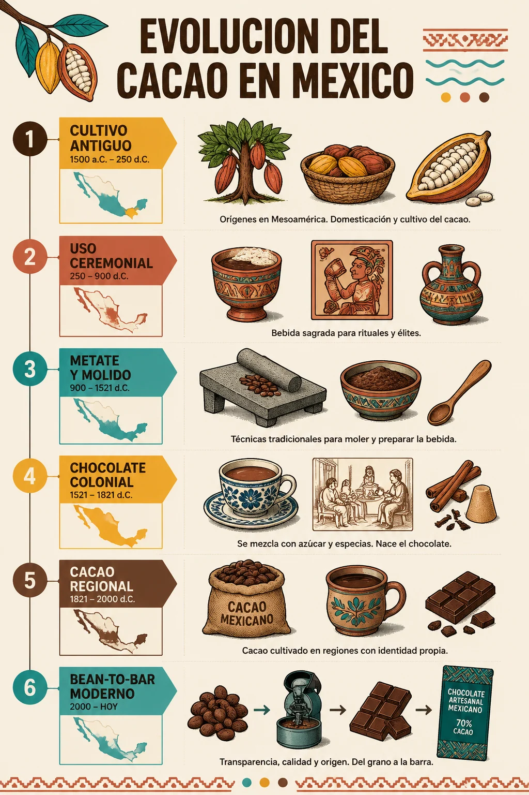


```text
创建一张竖版 2:3 信息图，主题是「墨西哥可可进化史」。开始绘制前，先像信息设计总监一样梳理主题：划分 5-7 个关键阶段，明确时间逻辑、代表性物件、重要转折、配色系统、字体气质和阅读路径。画面应包含主标题、清晰时间线、阶段卡片、小型物件插画、短标签和克制注释。所有可见文字使用简体中文，保持短句、清晰、可读。不要加入真实品牌标志、随机水印或未经验证的精确数据。
```


### 4. 巴西足球球衣进化史 (`brazil-football-shirt-evolution`)


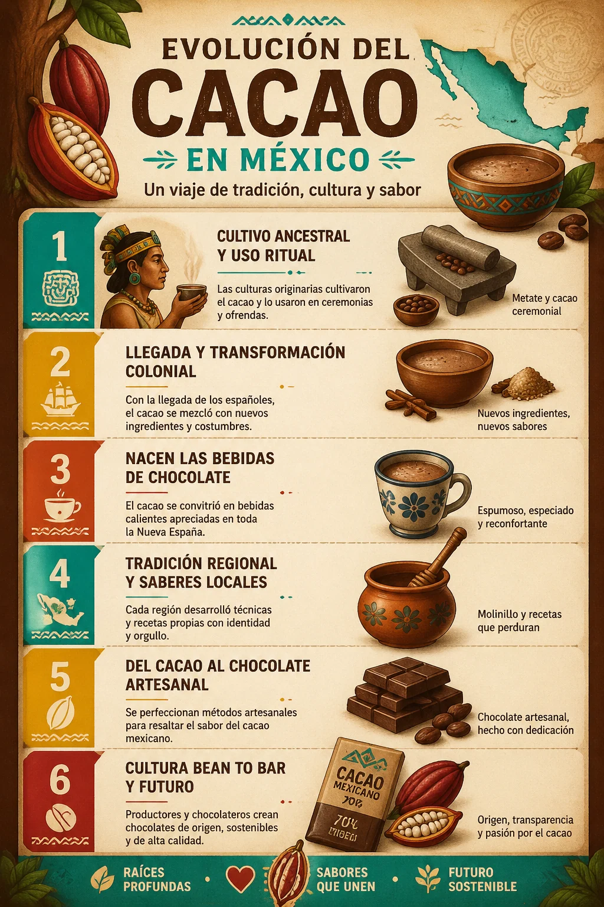


```text
创建一张竖版 2:3 信息图，主题是「巴西足球球衣进化史」。开始绘制前，先像信息设计总监一样梳理主题：划分 5-7 个关键阶段，明确时间逻辑、代表性物件、重要转折、配色系统、字体气质和阅读路径。画面应包含主标题、清晰时间线、阶段卡片、小型物件插画、短标签和克制注释。所有可见文字使用简体中文，保持短句、清晰、可读。不要加入真实品牌标志、随机水印或未经验证的精确数据。
```


### 5. 日本游戏机进化史 (`japanese-game-console-evolution`)


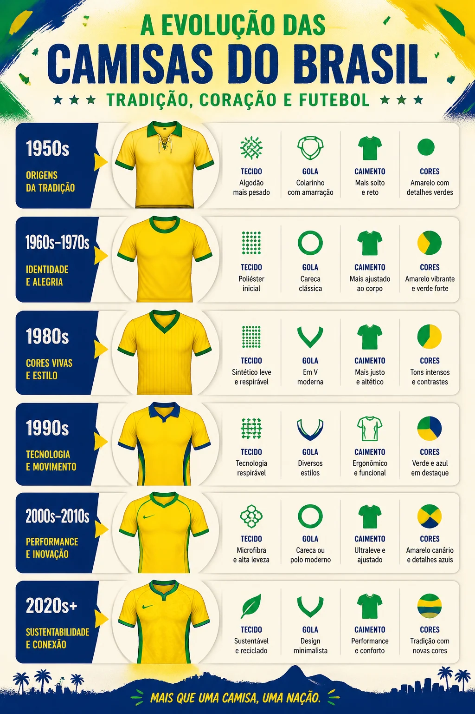


```text
创建一张竖版 2:3 信息图，主题是「日本游戏机进化史」。开始绘制前，先像信息设计总监一样梳理主题：划分 5-7 个关键阶段，明确时间逻辑、代表性物件、重要转折、配色系统、字体气质和阅读路径。画面应包含主标题、清晰时间线、阶段卡片、小型物件插画、短标签和克制注释。所有可见文字使用简体中文，保持短句、清晰、可读。不要加入真实品牌标志、随机水印或未经验证的精确数据。
```


### 6. 韩国街头小吃进化史 (`korean-street-food-evolution`)


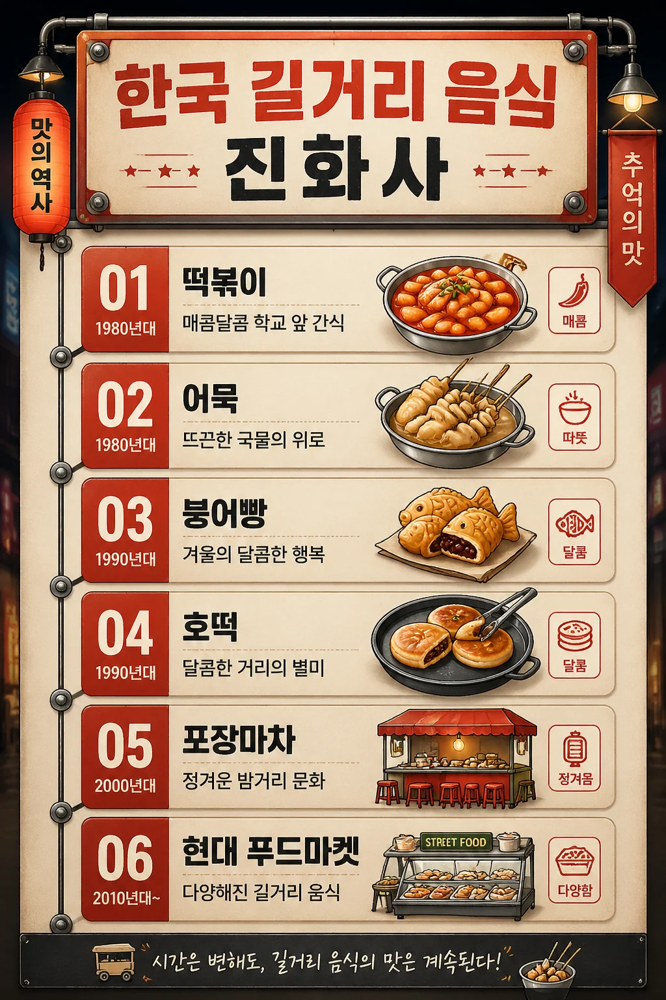


```text
创建一张竖版 2:3 信息图，主题是「韩国街头小吃进化史」。开始绘制前，先像信息设计总监一样梳理主题：划分 5-7 个关键阶段，明确时间逻辑、代表性物件、重要转折、配色系统、字体气质和阅读路径。画面应包含主标题、清晰时间线、阶段卡片、小型物件插画、短标签和克制注释。所有可见文字使用简体中文，保持短句、清晰、可读。不要加入真实品牌标志、随机水印或未经验证的精确数据。
```


### 7. 台湾茶文化进化史 (`taiwan-tea-evolution`)


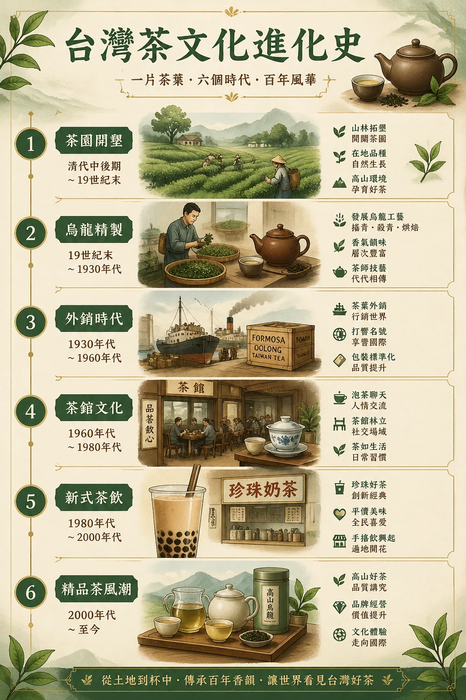


```text
创建一张竖版 2:3 信息图，主题是「台湾茶文化进化史」。开始绘制前，先像信息设计总监一样梳理主题：划分 5-7 个关键阶段，明确时间逻辑、代表性物件、重要转折、配色系统、字体气质和阅读路径。画面应包含主标题、清晰时间线、阶段卡片、小型物件插画、短标签和克制注释。所有可见文字使用简体中文，保持短句、清晰、可读。不要加入真实品牌标志、随机水印或未经验证的精确数据。
```


### 8. 中国火器进化史 (`chinese-firearms-evolution`)


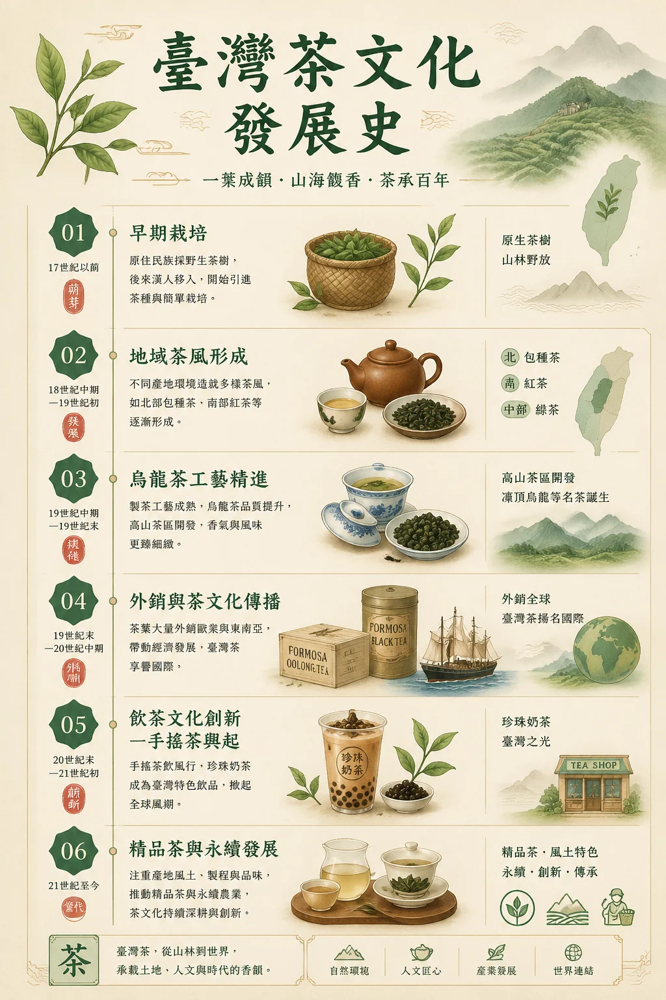


```text
创建一张竖版 2:3 信息图，主题是「中国火器进化史」。开始绘制前，先像信息设计总监一样梳理主题：划分 5-7 个关键阶段，明确时间逻辑、代表性物件、重要转折、配色系统、字体气质和阅读路径。画面应包含主标题、清晰时间线、阶段卡片、小型物件插画、短标签和克制注释。所有可见文字使用简体中文，保持短句、清晰、可读。不要加入真实品牌标志、随机水印或未经验证的精确数据。
```


### 9. 咖啡豆进化史 (`coffee-bean-evolution`)


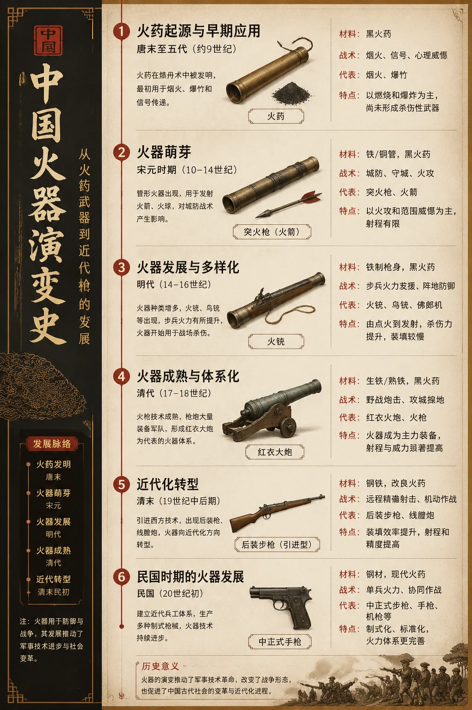


```text
创建一张竖版 2:3 信息图，主题是「咖啡豆进化史」。开始绘制前，先像信息设计总监一样梳理主题：划分 5-7 个关键阶段，明确时间逻辑、代表性物件、重要转折、配色系统、字体气质和阅读路径。画面应包含主标题、清晰时间线、阶段卡片、小型物件插画、短标签和克制注释。所有可见文字使用简体中文，保持短句、清晰、可读。不要加入真实品牌标志、随机水印或未经验证的精确数据。
```


## 爆炸结构模板 (`exploded-assembly-drawings`)

用 GPT Image 2 生成清晰拆解图。


### 1. 旅行箱爆炸结构图 (`travel-suitcase-exploded-view`)


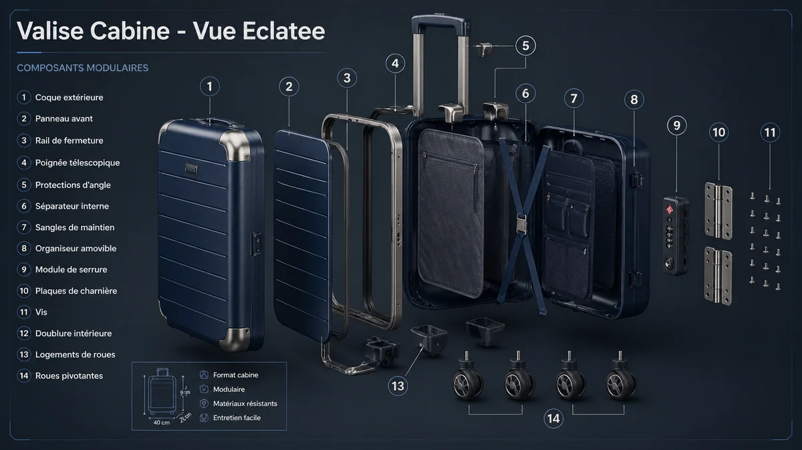


```text
生成一张16:9爆炸结构图，主题是模块化登机箱。展示外壳、核心模块、连接件、电路或机械零件、螺丝、密封件和支架等关键组件，按清晰轴线分离排列。使用真实 3D 产品渲染、细引线、编号标注、零件清单和简洁技术海报排版。所有可见文字必须使用简体中文，标签短而清楚。不要出现真实品牌、Logo、认证标志、危险维修步骤或夸张规格。
```


### 2. 人体工学鼠标拆解图 (`ergonomic-mouse-breakdown`)


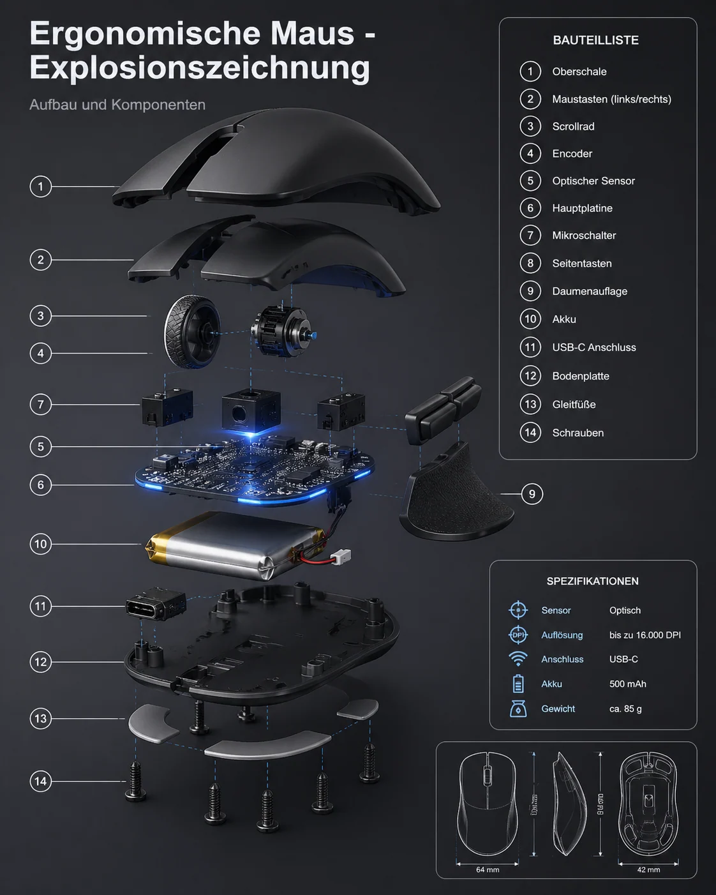


```text
生成一张4:5爆炸结构图，主题是人体工学鼠标。展示外壳、核心模块、连接件、电路或机械零件、螺丝、密封件和支架等关键组件，按清晰轴线分离排列。使用真实 3D 产品渲染、细引线、编号标注、零件清单和简洁技术海报排版。所有可见文字必须使用简体中文，标签短而清楚。不要出现真实品牌、Logo、认证标志、危险维修步骤或夸张规格。
```


### 3. 自行车灯拆解图 (`bicycle-light-teardown`)


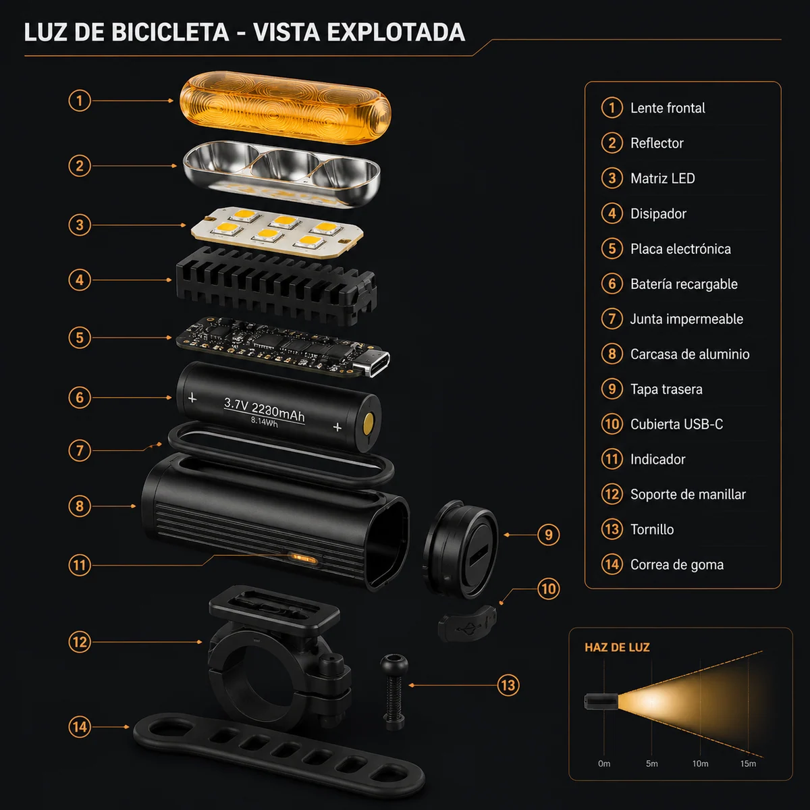


```text
生成一张1:1爆炸结构图，主题是可充电自行车灯。展示外壳、核心模块、连接件、电路或机械零件、螺丝、密封件和支架等关键组件，按清晰轴线分离排列。使用真实 3D 产品渲染、细引线、编号标注、零件清单和简洁技术海报排版。所有可见文字必须使用简体中文，标签短而清楚。不要出现真实品牌、Logo、认证标志、危险维修步骤或夸张规格。
```


### 4. 咖啡机拆解图 (`espresso-machine-cutaway`)


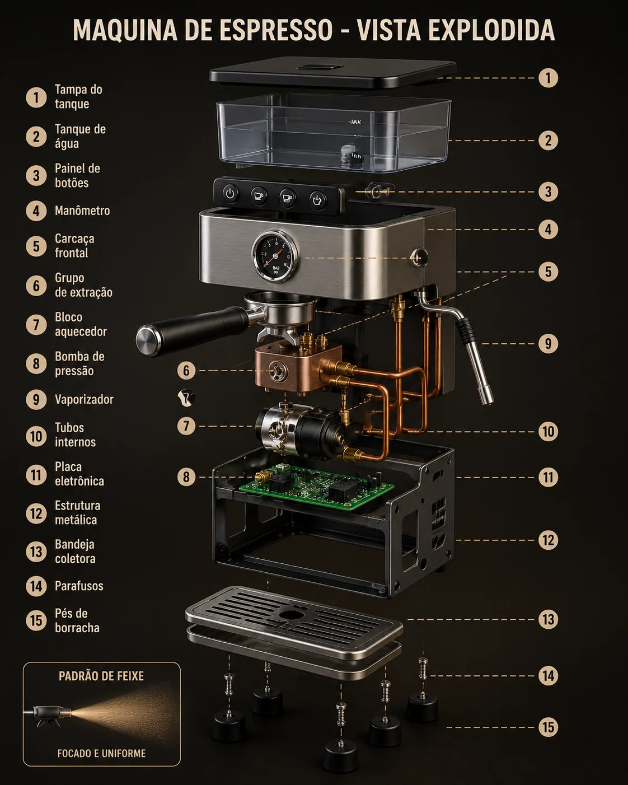


```text
生成一张4:5爆炸结构图，主题是紧凑咖啡机。展示外壳、核心模块、连接件、电路或机械零件、螺丝、密封件和支架等关键组件，按清晰轴线分离排列。使用真实 3D 产品渲染、细引线、编号标注、零件清单和简洁技术海报排版。所有可见文字必须使用简体中文，标签短而清楚。不要出现真实品牌、Logo、认证标志、危险维修步骤或夸张规格。
```


### 5. 便携风扇爆炸结构图 (`portable-fan-exploded-view`)


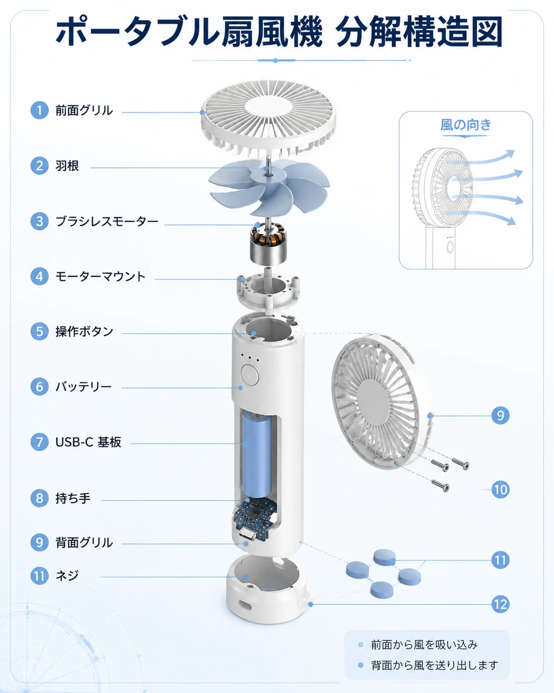


```text
生成一张4:5爆炸结构图，主题是便携充电风扇。展示外壳、核心模块、连接件、电路或机械零件、螺丝、密封件和支架等关键组件，按清晰轴线分离排列。使用真实 3D 产品渲染、细引线、编号标注、零件清单和简洁技术海报排版。所有可见文字必须使用简体中文，标签短而清楚。不要出现真实品牌、Logo、认证标志、危险维修步骤或夸张规格。
```


### 6. 无线路由器拆解图 (`wireless-router-breakdown`)


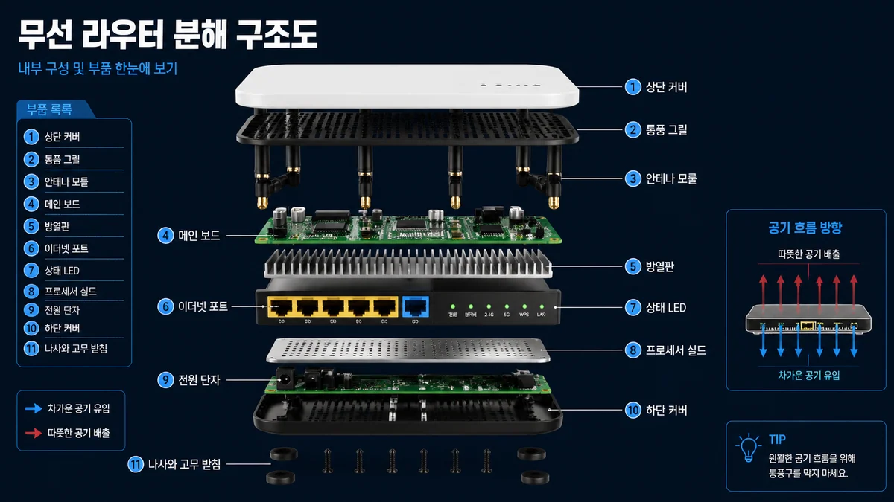


```text
生成一张16:9爆炸结构图，主题是无线路由器。展示外壳、核心模块、连接件、电路或机械零件、螺丝、密封件和支架等关键组件，按清晰轴线分离排列。使用真实 3D 产品渲染、细引线、编号标注、零件清单和简洁技术海报排版。所有可见文字必须使用简体中文，标签短而清楚。不要出现真实品牌、Logo、认证标志、危险维修步骤或夸张规格。
```


### 7. 模块化台灯组装图 (`modular-desk-lamp-assembly`)


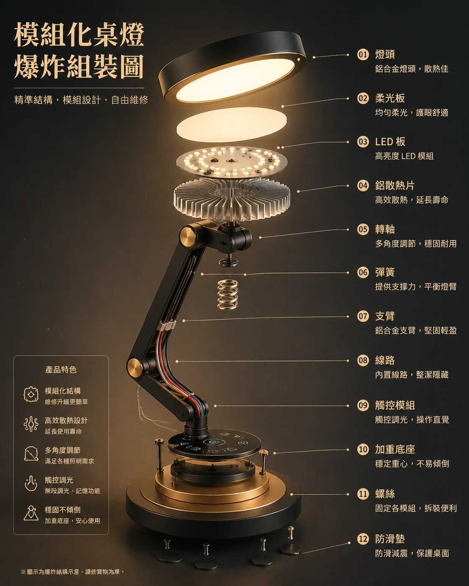


```text
生成一张4:5爆炸结构图，主题是模块化 LED 台灯。展示外壳、核心模块、连接件、电路或机械零件、螺丝、密封件和支架等关键组件，按清晰轴线分离排列。使用真实 3D 产品渲染、细引线、编号标注、零件清单和简洁技术海报排版。所有可见文字必须使用简体中文，标签短而清楚。不要出现真实品牌、Logo、认证标志、危险维修步骤或夸张规格。
```


### 8. 智能家居传感器拆解图 (`smart-home-sensor-teardown`)


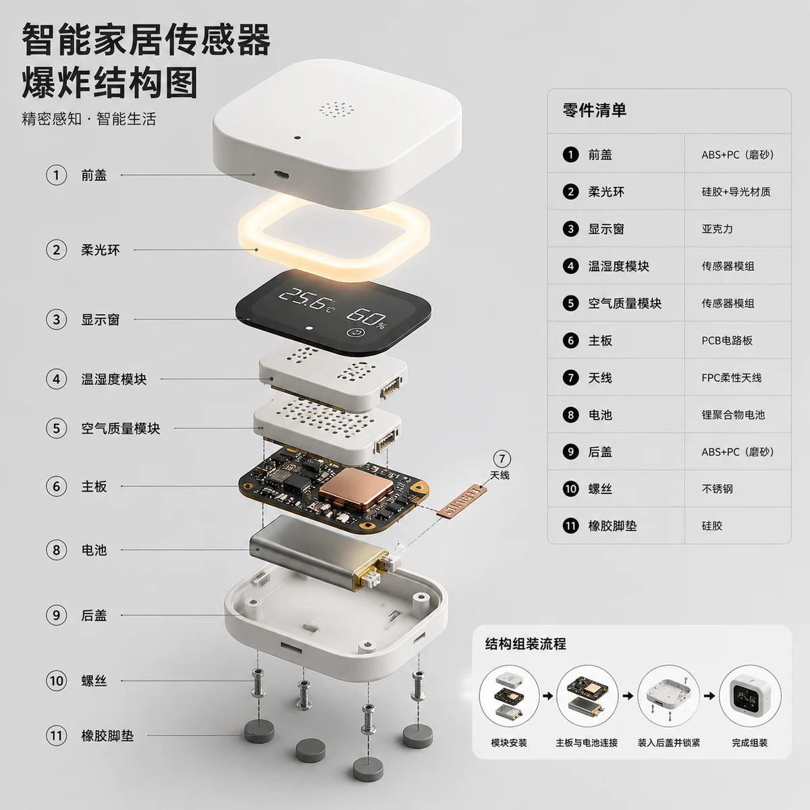


```text
生成一张1:1爆炸结构图，主题是智能家居传感器。展示外壳、核心模块、连接件、电路或机械零件、螺丝、密封件和支架等关键组件，按清晰轴线分离排列。使用真实 3D 产品渲染、细引线、编号标注、零件清单和简洁技术海报排版。所有可见文字必须使用简体中文，标签短而清楚。不要出现真实品牌、Logo、认证标志、危险维修步骤或夸张规格。
```


### 9. 紧凑相机爆炸结构图 (`compact-camera-exploded-view`)


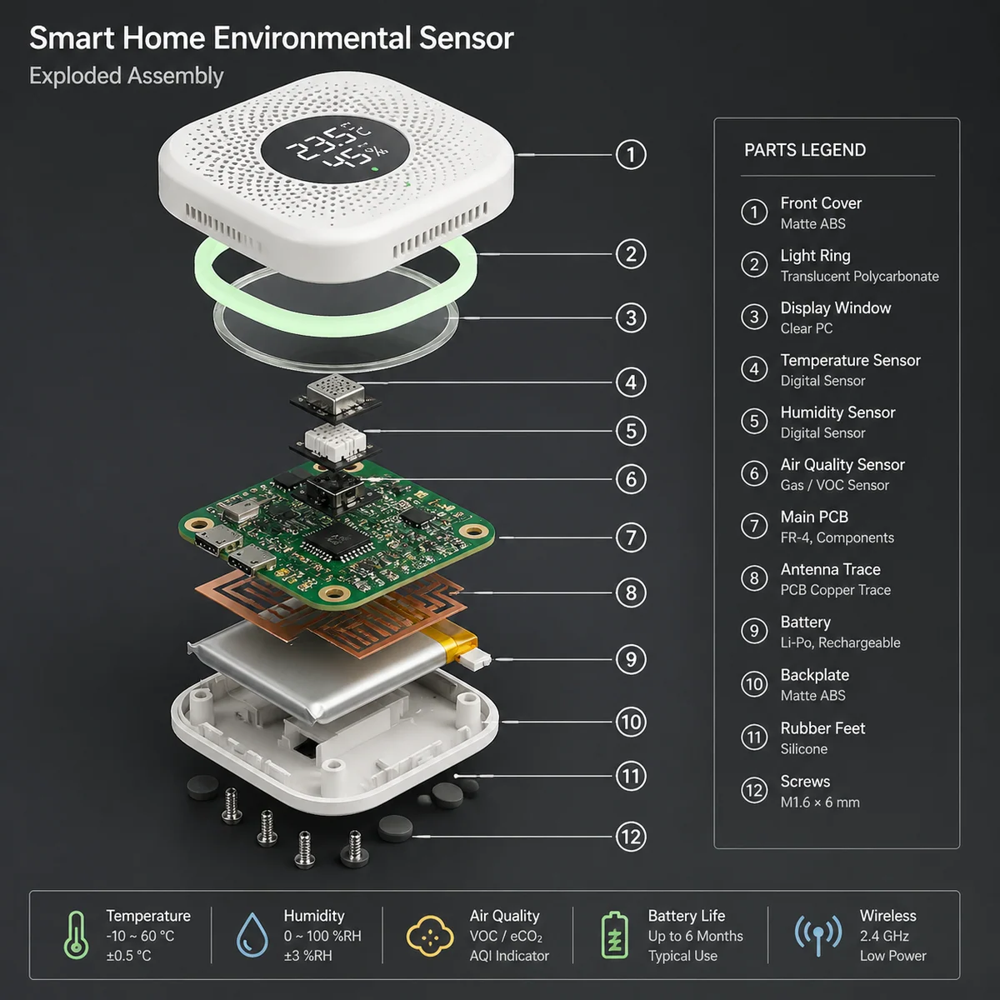


```text
生成一张4:5爆炸结构图，主题是通用紧凑相机。展示外壳、核心模块、连接件、电路或机械零件、螺丝、密封件和支架等关键组件，按清晰轴线分离排列。使用真实 3D 产品渲染、细引线、编号标注、零件清单和简洁技术海报排版。所有可见文字必须使用简体中文，标签短而清楚。不要出现真实品牌、Logo、认证标志、危险维修步骤或夸张规格。
```


## 五官报告模板 (`facial-aesthetic-report`)

用 GPT Image 2 生成自然五官报告。


### 1. 肤质轮廓矩阵 (`skin-contour-priority-matrix`)


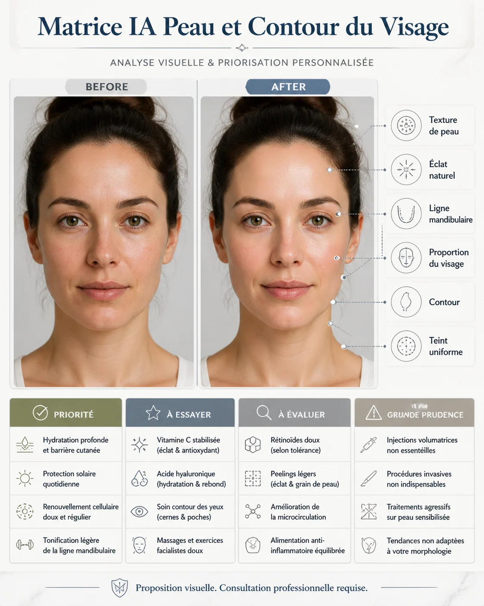


```text
生成一张 4:5 的「肤质轮廓矩阵」图像，用于：Make a skin texture and contour priority matrix with cautious action levels。基于用户上传的正面人像或真实感合成人像，严格保留同一人的身份特征、年龄感、五官核心轮廓和真实皮肤纹理。画面应呈现 Before 与 After 的自然五官美学升级报告，After 更清爽、精神、立体、精致，但不能像换头、网红脸或明显整形。所有可见文字使用简体中文，重点标注眉毛、眼部、鼻部、面部轮廓、唇部与口周、皮肤质感六大区域。使用白色、米白、浅灰、银色、灰蓝和浅橄榄绿，高端医美咨询提案板风格。避免颜值打分、医疗诊断、手术承诺、过度磨皮、V脸模板和衣品改造。页脚加入“本报告为视觉提案，不替代专业面诊”。
```


### 2. 眉眼细节报告 (`brow-eye-detail-report`)


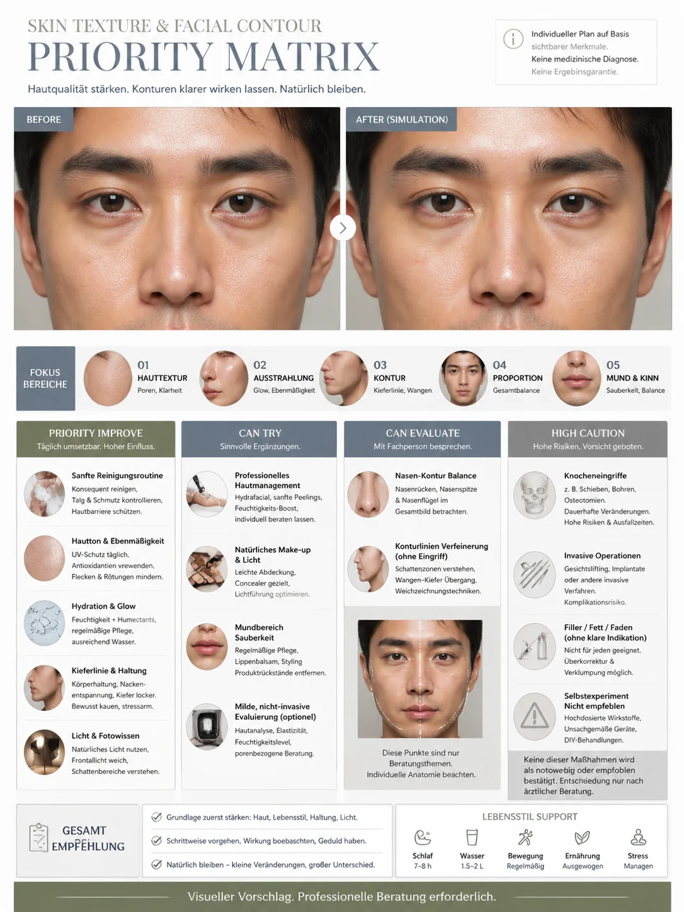


```text
生成一张 3:4 的「眉眼细节报告」图像，用于：Create a focused brow and eye spirit optimization report。基于用户上传的正面人像或真实感合成人像，严格保留同一人的身份特征、年龄感、五官核心轮廓和真实皮肤纹理。画面应呈现 Before 与 After 的自然五官美学升级报告，After 更清爽、精神、立体、精致，但不能像换头、网红脸或明显整形。所有可见文字使用简体中文，重点标注眉毛、眼部、鼻部、面部轮廓、唇部与口周、皮肤质感六大区域。使用白色、米白、浅灰、银色、灰蓝和浅橄榄绿，高端医美咨询提案板风格。避免颜值打分、医疗诊断、手术承诺、过度磨皮、V脸模板和衣品改造。页脚加入“本报告为视觉提案，不替代专业面诊”。
```


### 3. 竖版手机五官报告 (`vertical-mobile-face-report`)


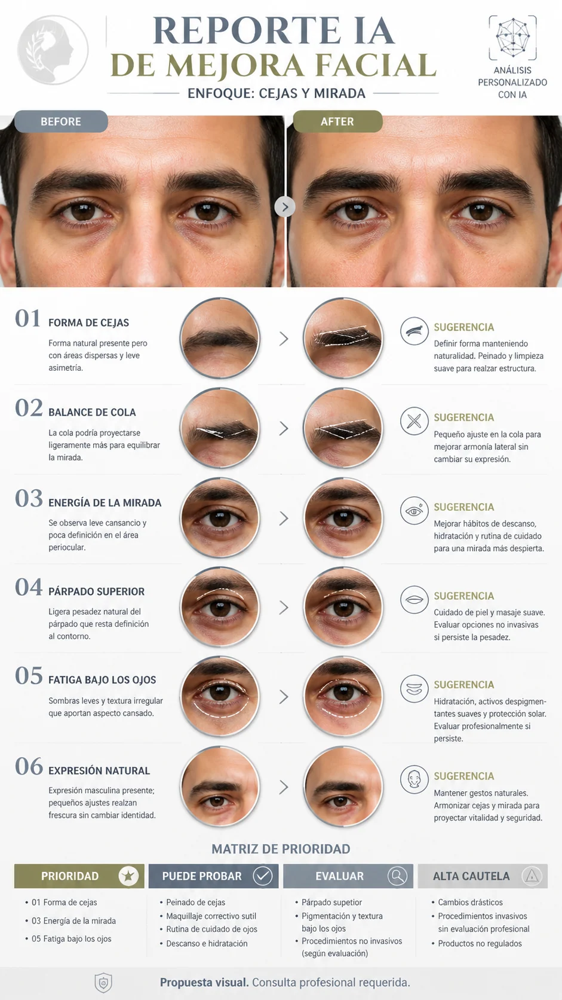


```text
生成一张 9:16 的「竖版手机五官报告」图像，用于：Generate a phone-story version of the facial aesthetic report。基于用户上传的正面人像或真实感合成人像，严格保留同一人的身份特征、年龄感、五官核心轮廓和真实皮肤纹理。画面应呈现 Before 与 After 的自然五官美学升级报告，After 更清爽、精神、立体、精致，但不能像换头、网红脸或明显整形。所有可见文字使用简体中文，重点标注眉毛、眼部、鼻部、面部轮廓、唇部与口周、皮肤质感六大区域。使用白色、米白、浅灰、银色、灰蓝和浅橄榄绿，高端医美咨询提案板风格。避免颜值打分、医疗诊断、手术承诺、过度磨皮、V脸模板和衣品改造。页脚加入“本报告为视觉提案，不替代专业面诊”。
```


### 4. 方形五官评分卡 (`square-feature-scorecard`)


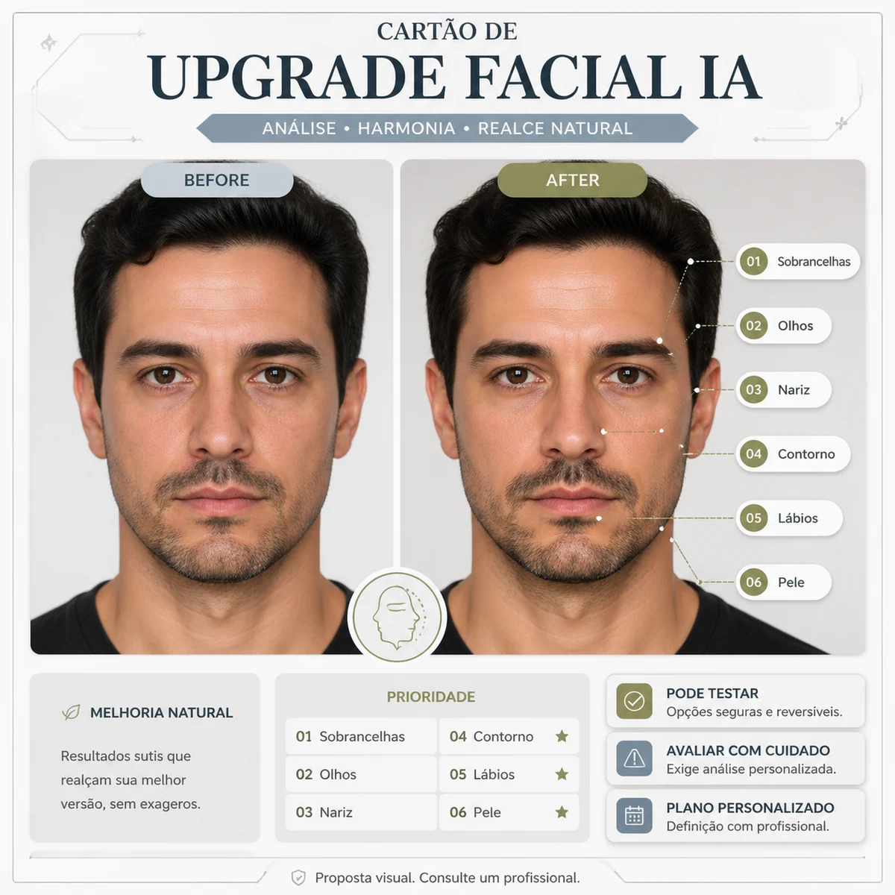


```text
生成一张 1:1 的「方形五官评分卡」图像，用于：Make a compact square six-zone face scorecard for social posts。基于用户上传的正面人像或真实感合成人像，严格保留同一人的身份特征、年龄感、五官核心轮廓和真实皮肤纹理。画面应呈现 Before 与 After 的自然五官美学升级报告，After 更清爽、精神、立体、精致，但不能像换头、网红脸或明显整形。所有可见文字使用简体中文，重点标注眉毛、眼部、鼻部、面部轮廓、唇部与口周、皮肤质感六大区域。使用白色、米白、浅灰、银色、灰蓝和浅橄榄绿，高端医美咨询提案板风格。避免颜值打分、医疗诊断、手术承诺、过度磨皮、V脸模板和衣品改造。页脚加入“本报告为视觉提案，不替代专业面诊”。
```


### 5. 日系脸部平衡报告 (`japanese-face-balance-report`)


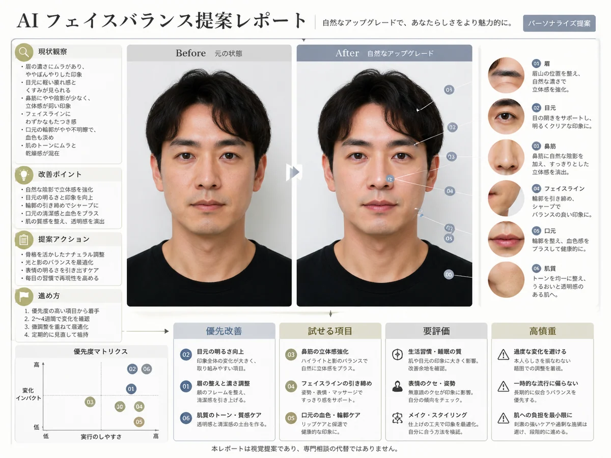


```text
生成一张 4:3 的「日系脸部平衡报告」图像，用于：Create a Japanese clean facial balance proposal board。基于用户上传的正面人像或真实感合成人像，严格保留同一人的身份特征、年龄感、五官核心轮廓和真实皮肤纹理。画面应呈现 Before 与 After 的自然五官美学升级报告，After 更清爽、精神、立体、精致，但不能像换头、网红脸或明显整形。所有可见文字使用简体中文，重点标注眉毛、眼部、鼻部、面部轮廓、唇部与口周、皮肤质感六大区域。使用白色、米白、浅灰、银色、灰蓝和浅橄榄绿，高端医美咨询提案板风格。避免颜值打分、医疗诊断、手术承诺、过度磨皮、V脸模板和衣品改造。页脚加入“本报告为视觉提案，不替代专业面诊”。
```


### 6. 韩系自然咨询板 (`korean-natural-clinic-board`)


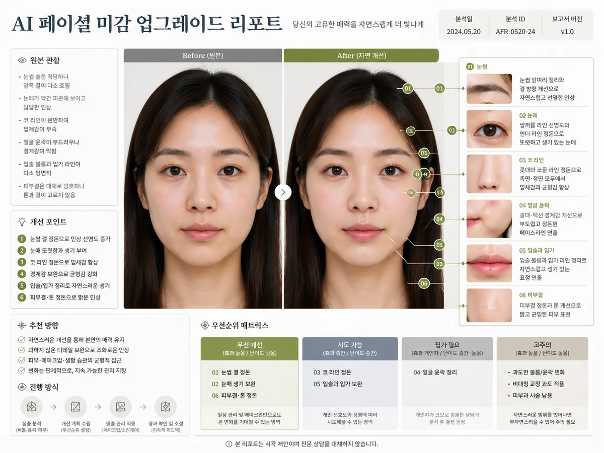


```text
生成一张 4:3 的「韩系自然咨询板」图像，用于：Build a Korean natural medical-aesthetic consultation board。基于用户上传的正面人像或真实感合成人像，严格保留同一人的身份特征、年龄感、五官核心轮廓和真实皮肤纹理。画面应呈现 Before 与 After 的自然五官美学升级报告，After 更清爽、精神、立体、精致，但不能像换头、网红脸或明显整形。所有可见文字使用简体中文，重点标注眉毛、眼部、鼻部、面部轮廓、唇部与口周、皮肤质感六大区域。使用白色、米白、浅灰、银色、灰蓝和浅橄榄绿，高端医美咨询提案板风格。避免颜值打分、医疗诊断、手术承诺、过度磨皮、V脸模板和衣品改造。页脚加入“本报告为视觉提案，不替代专业面诊”。
```


### 7. 繁中五官重塑报告 (`traditional-face-reset-board`)


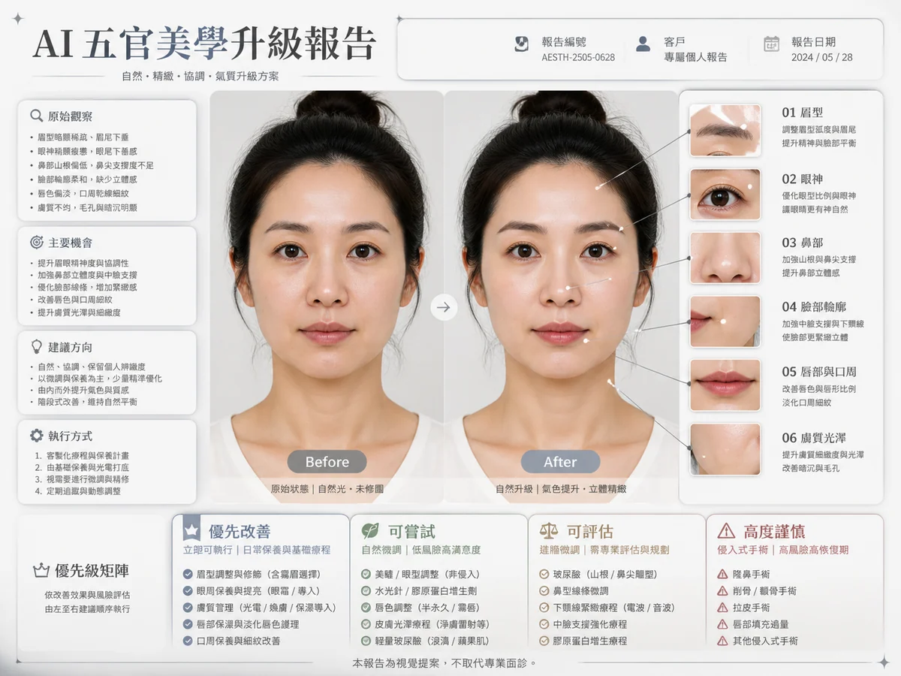


```text
生成一张 4:3 的「繁中五官重塑报告」图像，用于：Create a traditional Chinese facial reset report for Taiwan or Hong Kong users。基于用户上传的正面人像或真实感合成人像，严格保留同一人的身份特征、年龄感、五官核心轮廓和真实皮肤纹理。画面应呈现 Before 与 After 的自然五官美学升级报告，After 更清爽、精神、立体、精致，但不能像换头、网红脸或明显整形。所有可见文字使用简体中文，重点标注眉毛、眼部、鼻部、面部轮廓、唇部与口周、皮肤质感六大区域。使用白色、米白、浅灰、银色、灰蓝和浅橄榄绿，高端医美咨询提案板风格。避免颜值打分、医疗诊断、手术承诺、过度磨皮、V脸模板和衣品改造。页脚加入“本报告为视觉提案，不替代专业面诊”。
```


### 8. 简中清爽医美报告 (`chinese-clean-beauty-report`)


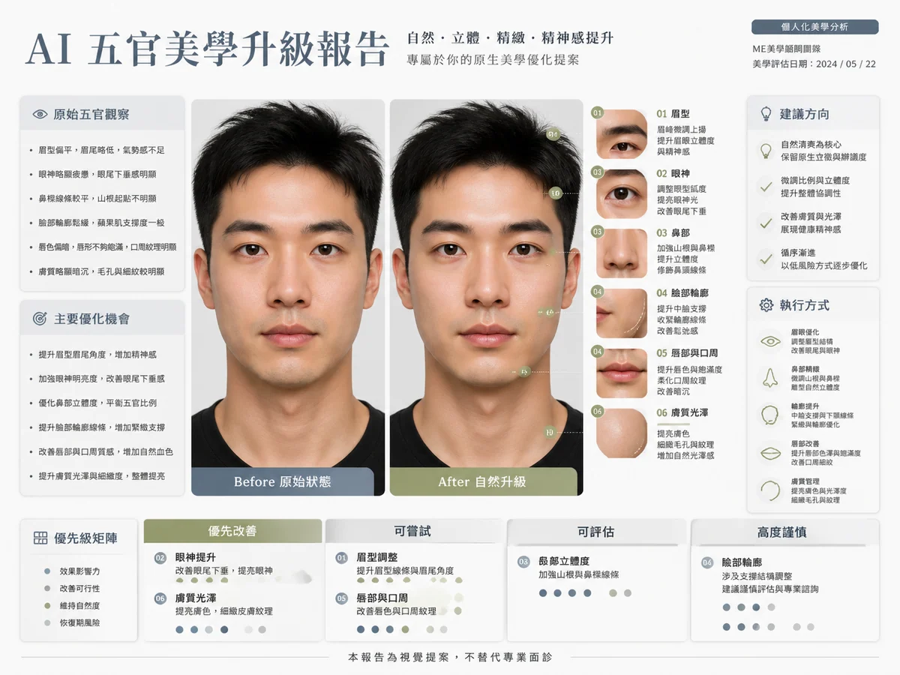


```text
生成一张 4:3 的「简中清爽医美报告」图像，用于：Generate a simplified Chinese clinic-style clean beauty report。基于用户上传的正面人像或真实感合成人像，严格保留同一人的身份特征、年龄感、五官核心轮廓和真实皮肤纹理。画面应呈现 Before 与 After 的自然五官美学升级报告，After 更清爽、精神、立体、精致，但不能像换头、网红脸或明显整形。所有可见文字使用简体中文，重点标注眉毛、眼部、鼻部、面部轮廓、唇部与口周、皮肤质感六大区域。使用白色、米白、浅灰、银色、灰蓝和浅橄榄绿，高端医美咨询提案板风格。避免颜值打分、医疗诊断、手术承诺、过度磨皮、V脸模板和衣品改造。页脚加入“本报告为视觉提案，不替代专业面诊”。
```


### 9. 完整五官美学报告 (`full-facial-aesthetic-report`)


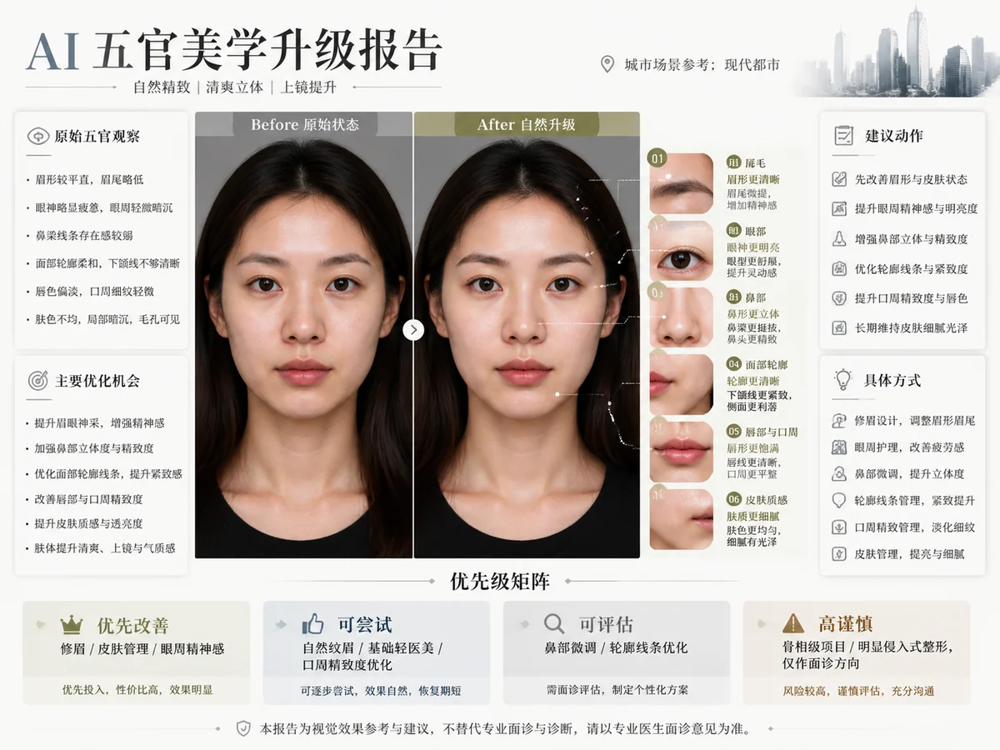


```text
生成一张 4:3 的「完整五官美学报告」图像，用于：Create the complete Before/After facial aesthetic proposal board。基于用户上传的正面人像或真实感合成人像，严格保留同一人的身份特征、年龄感、五官核心轮廓和真实皮肤纹理。画面应呈现 Before 与 After 的自然五官美学升级报告，After 更清爽、精神、立体、精致，但不能像换头、网红脸或明显整形。所有可见文字使用简体中文，重点标注眉毛、眼部、鼻部、面部轮廓、唇部与口周、皮肤质感六大区域。使用白色、米白、浅灰、银色、灰蓝和浅橄榄绿，高端医美咨询提案板风格。避免颜值打分、医疗诊断、手术承诺、过度磨皮、V脸模板和衣品改造。页脚加入“本报告为视觉提案，不替代专业面诊”。
```


## 发型报告模板 (`hairstyle-upgrade-report`)

上传头像，用 GPT Image 2 生成发型升级报告。


### 1. 发型打理指南 (`maintenance-and-styling-guide`)


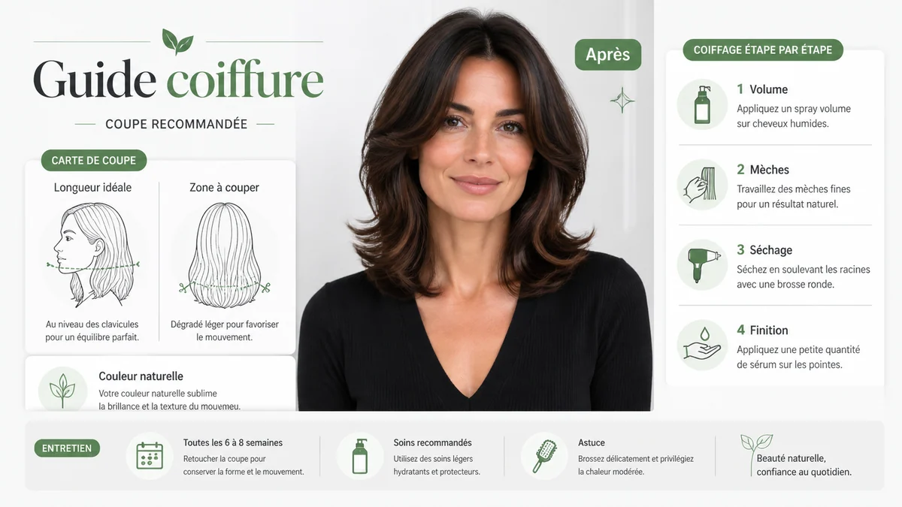


```text
请基于用户上传的正面形象照片生成「发型打理指南」。严格保留本人脸部辨识度、五官结构、脸型比例、年龄感、皮肤质感、表情、穿搭和气质，只改变发型相关内容。可调整发长、刘海、头顶蓬松度、两侧体积、层次、发尾质感和自然发色。所有可见文字使用简体中文，使用短标题和短标签，不要大段文字。画面要像高端发型顾问提案板，专业、干净、真实可执行。不要瘦脸、换脸、磨皮、美妆改造、换衣服、夸张发型、恶搞或羞辱人物。
```


### 2. 竖版社媒发型报告 (`vertical-social-hairstyle-report`)


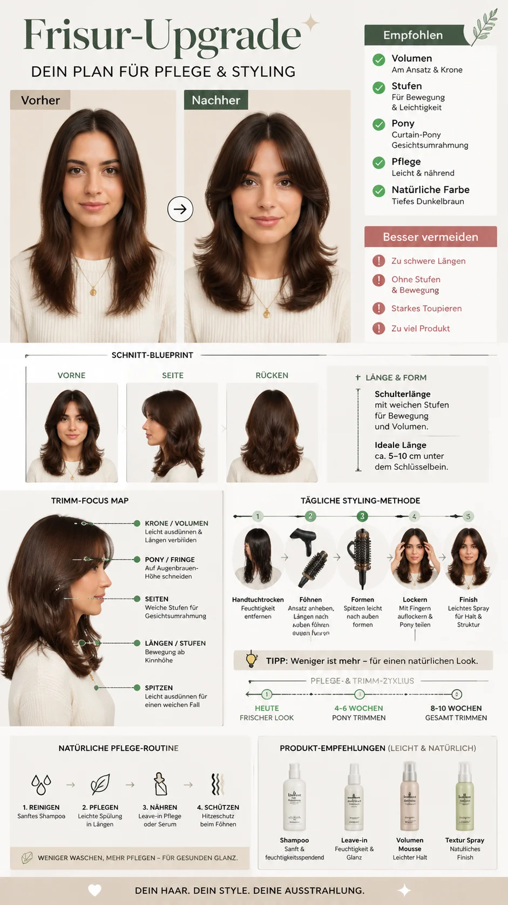


```text
请基于用户上传的正面形象照片生成「竖版社媒发型报告」。严格保留本人脸部辨识度、五官结构、脸型比例、年龄感、皮肤质感、表情、穿搭和气质，只改变发型相关内容。可调整发长、刘海、头顶蓬松度、两侧体积、层次、发尾质感和自然发色。所有可见文字使用简体中文，使用短标题和短标签，不要大段文字。画面要像高端发型顾问提案板，专业、干净、真实可执行。不要瘦脸、换脸、磨皮、美妆改造、换衣服、夸张发型、恶搞或羞辱人物。
```


### 3. 发型避雷提案板 (`less-flattering-avoidance-board`)


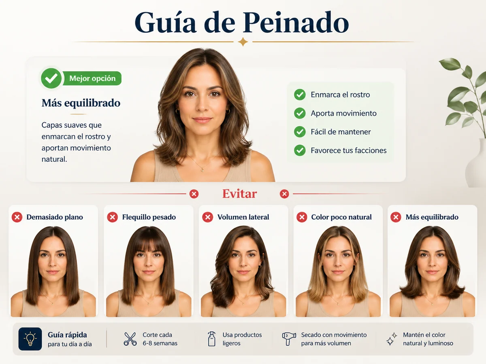


```text
请基于用户上传的正面形象照片生成「发型避雷提案板」。严格保留本人脸部辨识度、五官结构、脸型比例、年龄感、皮肤质感、表情、穿搭和气质，只改变发型相关内容。可调整发长、刘海、头顶蓬松度、两侧体积、层次、发尾质感和自然发色。所有可见文字使用简体中文，使用短标题和短标签，不要大段文字。画面要像高端发型顾问提案板，专业、干净、真实可执行。不要瘦脸、换脸、磨皮、美妆改造、换衣服、夸张发型、恶搞或羞辱人物。
```


### 4. 自然发色指南 (`hair-color-palette-guide`)


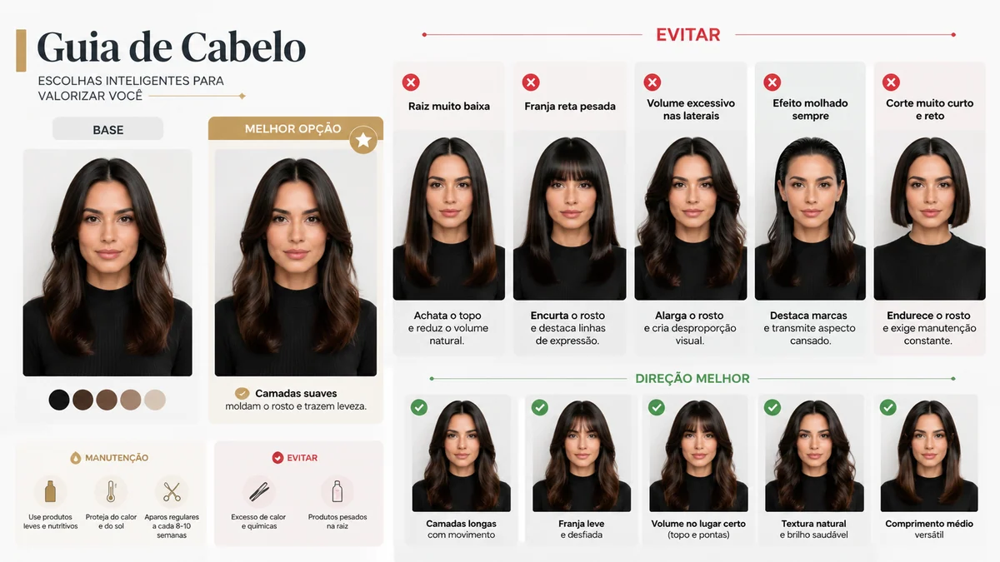


```text
请基于用户上传的正面形象照片生成「自然发色指南」。严格保留本人脸部辨识度、五官结构、脸型比例、年龄感、皮肤质感、表情、穿搭和气质，只改变发型相关内容。可调整发长、刘海、头顶蓬松度、两侧体积、层次、发尾质感和自然发色。所有可见文字使用简体中文，使用短标题和短标签，不要大段文字。画面要像高端发型顾问提案板，专业、干净、真实可执行。不要瘦脸、换脸、磨皮、美妆改造、换衣服、夸张发型、恶搞或羞辱人物。
```


### 5. 女士柔和层次升级 (`soft-layer-womens-upgrade`)


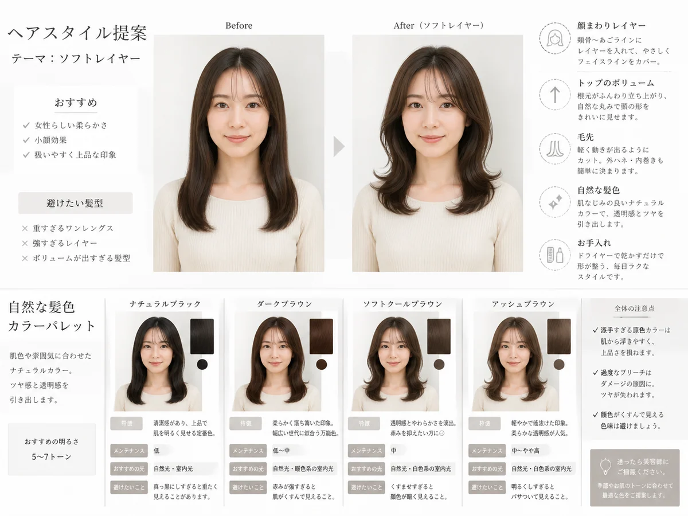


```text
请基于用户上传的正面形象照片生成「女士柔和层次升级」。严格保留本人脸部辨识度、五官结构、脸型比例、年龄感、皮肤质感、表情、穿搭和气质，只改变发型相关内容。可调整发长、刘海、头顶蓬松度、两侧体积、层次、发尾质感和自然发色。所有可见文字使用简体中文，使用短标题和短标签，不要大段文字。画面要像高端发型顾问提案板，专业、干净、真实可执行。不要瘦脸、换脸、磨皮、美妆改造、换衣服、夸张发型、恶搞或羞辱人物。
```


### 6. 男士清爽发型升级 (`clean-cut-mens-upgrade`)


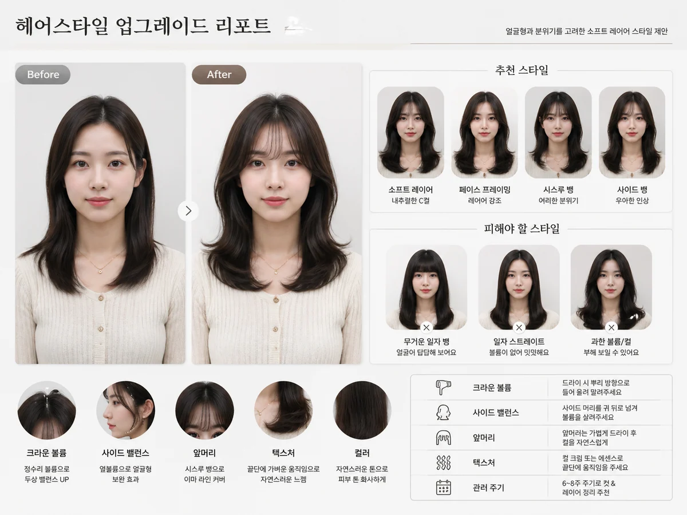


```text
请基于用户上传的正面形象照片生成「男士清爽发型升级」。严格保留本人脸部辨识度、五官结构、脸型比例、年龄感、皮肤质感、表情、穿搭和气质，只改变发型相关内容。可调整发长、刘海、头顶蓬松度、两侧体积、层次、发尾质感和自然发色。所有可见文字使用简体中文，使用短标题和短标签，不要大段文字。画面要像高端发型顾问提案板，专业、干净、真实可执行。不要瘦脸、换脸、磨皮、美妆改造、换衣服、夸张发型、恶搞或羞辱人物。
```


### 7. 刘海脸型分析 (`bangs-and-face-shape-report`)


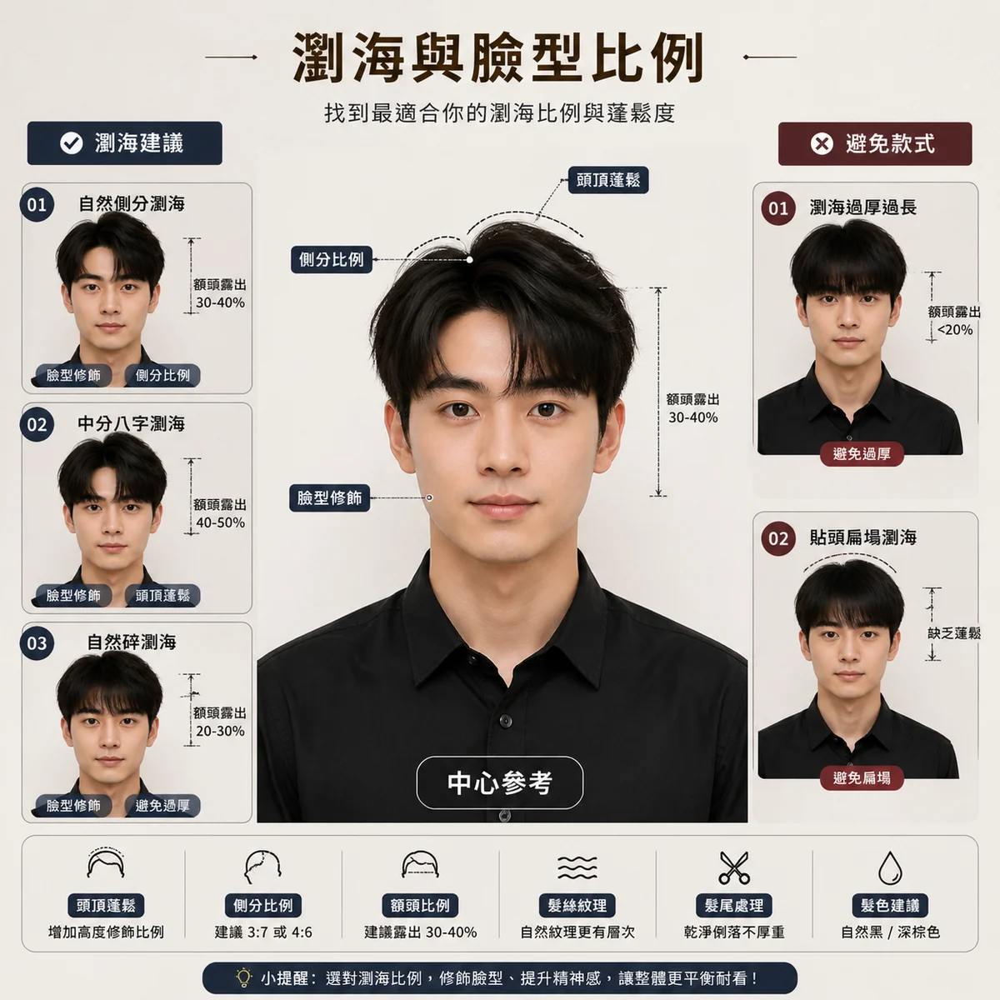


```text
请基于用户上传的正面形象照片生成「刘海脸型分析」。严格保留本人脸部辨识度、五官结构、脸型比例、年龄感、皮肤质感、表情、穿搭和气质，只改变发型相关内容。可调整发长、刘海、头顶蓬松度、两侧体积、层次、发尾质感和自然发色。所有可见文字使用简体中文，使用短标题和短标签，不要大段文字。画面要像高端发型顾问提案板，专业、干净、真实可执行。不要瘦脸、换脸、磨皮、美妆改造、换衣服、夸张发型、恶搞或羞辱人物。
```


### 8. 发廊顾问提案板 (`salon-consultation-board`)


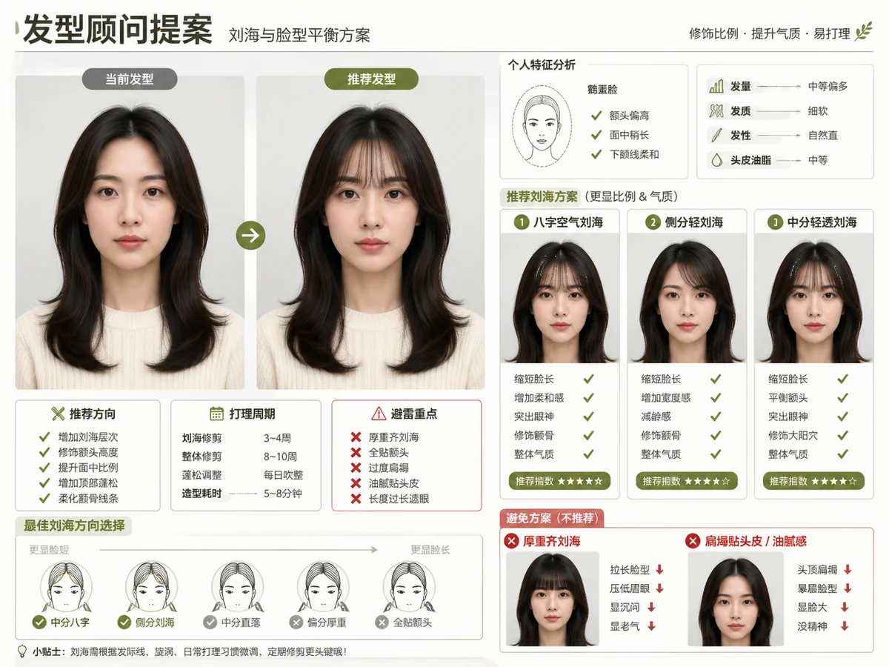


```text
请基于用户上传的正面形象照片生成「发廊顾问提案板」。严格保留本人脸部辨识度、五官结构、脸型比例、年龄感、皮肤质感、表情、穿搭和气质，只改变发型相关内容。可调整发长、刘海、头顶蓬松度、两侧体积、层次、发尾质感和自然发色。所有可见文字使用简体中文，使用短标题和短标签，不要大段文字。画面要像高端发型顾问提案板，专业、干净、真实可执行。不要瘦脸、换脸、磨皮、美妆改造、换衣服、夸张发型、恶搞或羞辱人物。
```


### 9. 完整发型升级报告 (`full-hairstyle-upgrade-report`)


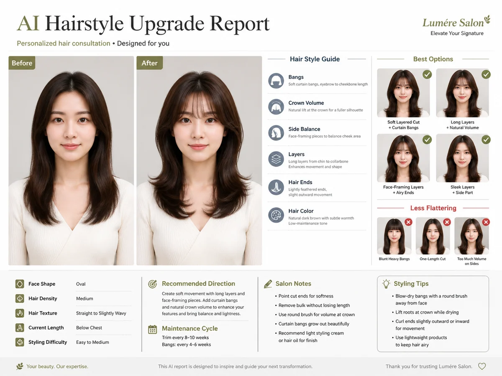


```text
请基于用户上传的正面形象照片生成「完整发型升级报告」。严格保留本人脸部辨识度、五官结构、脸型比例、年龄感、皮肤质感、表情、穿搭和气质，只改变发型相关内容。可调整发长、刘海、头顶蓬松度、两侧体积、层次、发尾质感和自然发色。所有可见文字使用简体中文，使用短标题和短标签，不要大段文字。画面要像高端发型顾问提案板，专业、干净、真实可执行。不要瘦脸、换脸、磨皮、美妆改造、换衣服、夸张发型、恶搞或羞辱人物。
```


## 汉服人像模板 (`hanfu-outfit-portraits`)

用参考服装生成全身汉服人像。


### 1. 影棚汉服参考人像 (`studio-hanfu-reference-portrait`)


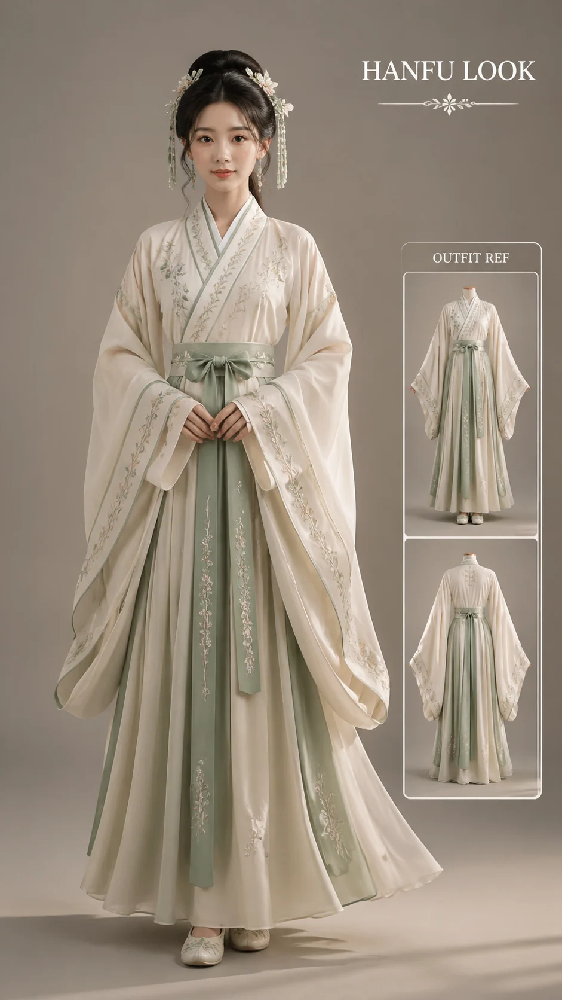


```text
请以[参考服装图]为主要服装依据，生成一张成年模特的全身文化服饰人像。模板方向：影棚汉服参考人像。保留参考图中的服装轮廓、衣袖层次、领口、腰部结构、配色、发型、头饰、鞋子和姿势关系，并放入适合该主题的背景。画面文字只使用简体中文并保持简短。风格应端庄、尊重、服装细节清楚。避免名人脸、受版权保护的角色服装、真实品牌标志、暴露造型、身体夸张、未经验证的历史宣称、手部错误和裁掉脚部。默认比例：9:16。
```


### 2. 春日花园汉服人像 (`spring-garden-hanfu-portrait`)


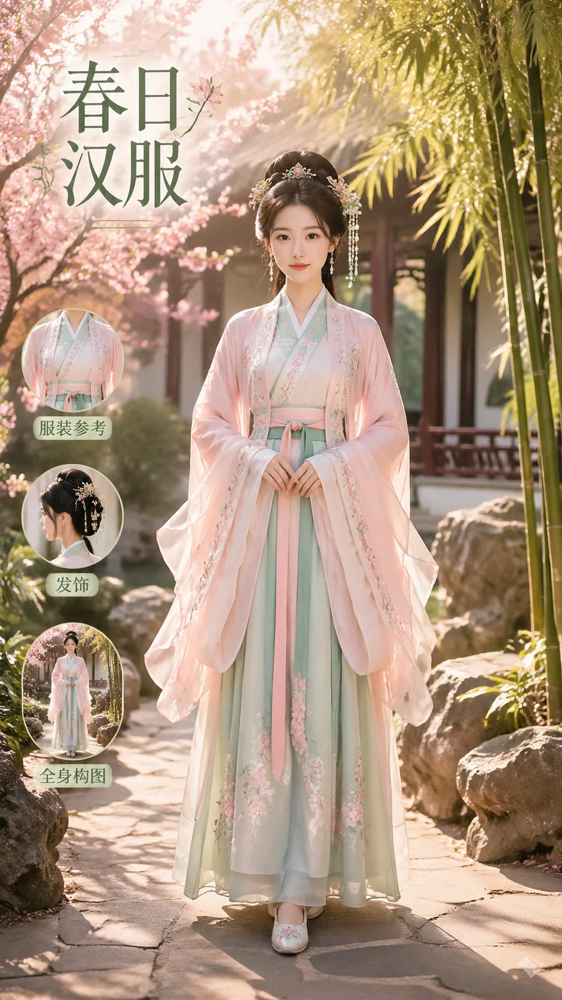


```text
请以[参考服装图]为主要服装依据，生成一张成年模特的全身文化服饰人像。模板方向：春日花园汉服人像。保留参考图中的服装轮廓、衣袖层次、领口、腰部结构、配色、发型、头饰、鞋子和姿势关系，并放入适合该主题的背景。画面文字只使用简体中文并保持简短。风格应端庄、尊重、服装细节清楚。避免名人脸、受版权保护的角色服装、真实品牌标志、暴露造型、身体夸张、未经验证的历史宣称、手部错误和裁掉脚部。默认比例：9:16。
```


### 3. 灯会汉服造型 (`lantern-festival-hanfu-look`)


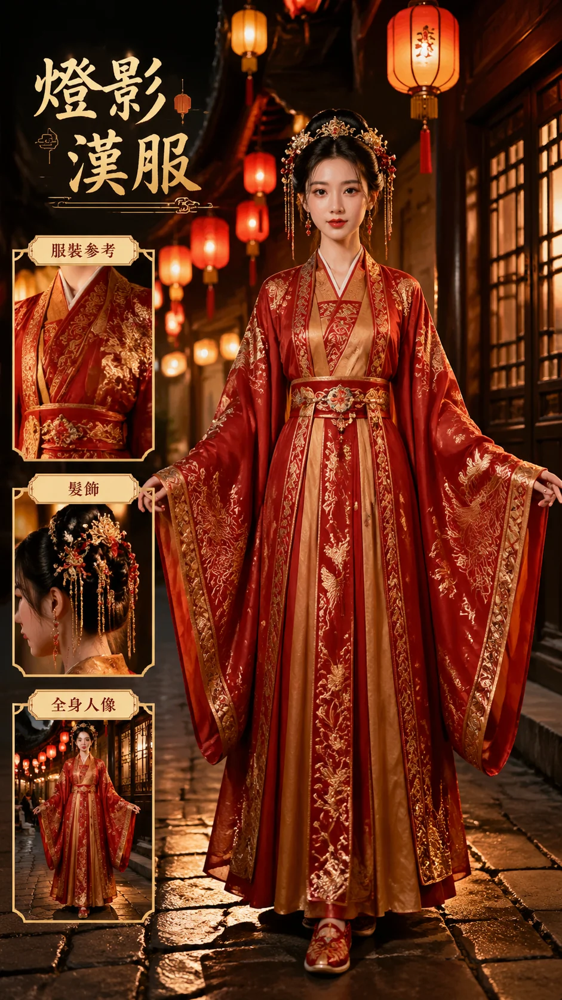


```text
请以[参考服装图]为主要服装依据，生成一张成年模特的全身文化服饰人像。模板方向：灯会汉服造型。保留参考图中的服装轮廓、衣袖层次、领口、腰部结构、配色、发型、头饰、鞋子和姿势关系，并放入适合该主题的背景。画面文字只使用简体中文并保持简短。风格应端庄、尊重、服装细节清楚。避免名人脸、受版权保护的角色服装、真实品牌标志、暴露造型、身体夸张、未经验证的历史宣称、手部错误和裁掉脚部。默认比例：9:16。
```


### 4. 韩式传统服饰人像 (`korean-traditional-outfit-portrait`)


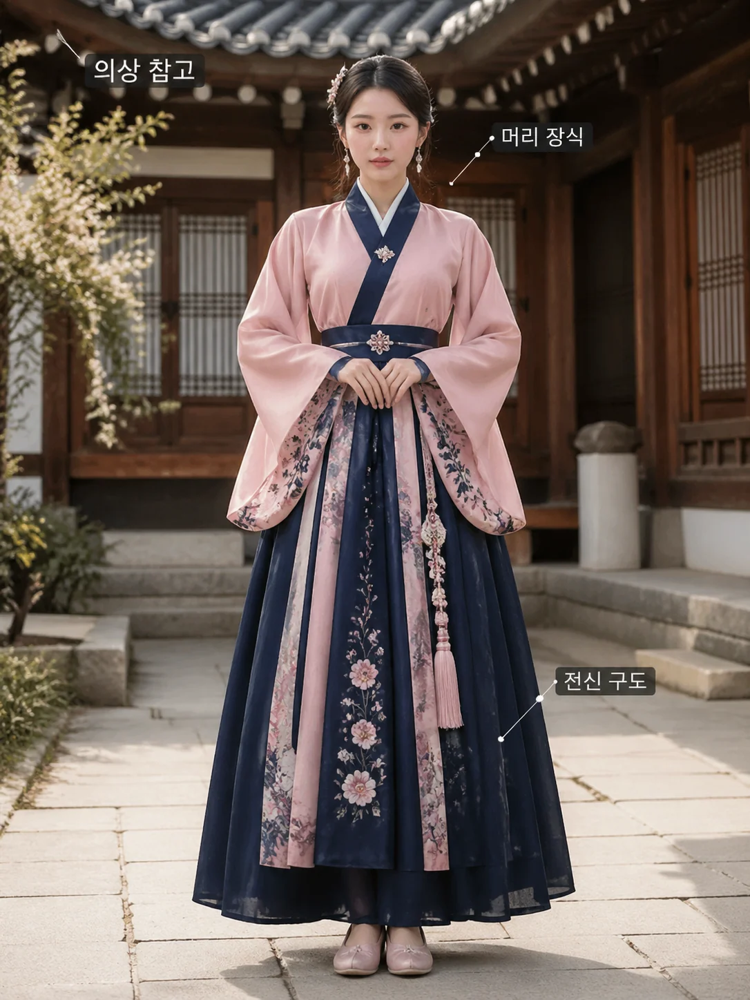


```text
请以[参考服装图]为主要服装依据，生成一张成年模特的全身文化服饰人像。模板方向：韩式传统服饰人像。保留参考图中的服装轮廓、衣袖层次、领口、腰部结构、配色、发型、头饰、鞋子和姿势关系，并放入适合该主题的背景。画面文字只使用简体中文并保持简短。风格应端庄、尊重、服装细节清楚。避免名人脸、受版权保护的角色服装、真实品牌标志、暴露造型、身体夸张、未经验证的历史宣称、手部错误和裁掉脚部。默认比例：3:4。
```


### 5. 日式编辑服饰人像 (`japanese-editorial-outfit-portrait`)


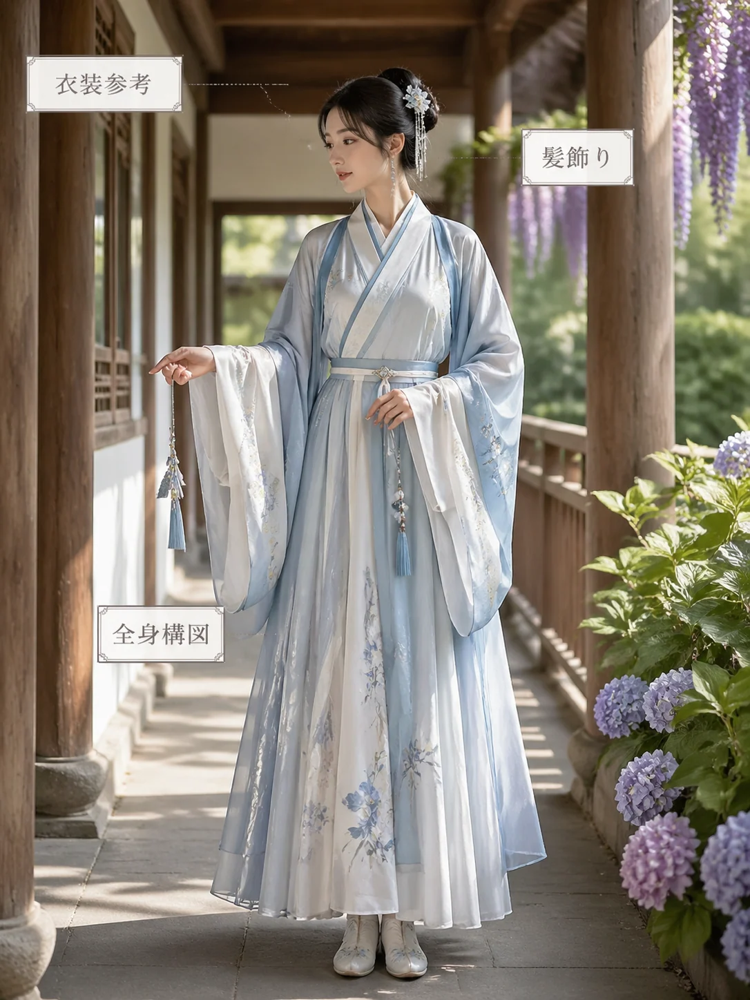


```text
请以[参考服装图]为主要服装依据，生成一张成年模特的全身文化服饰人像。模板方向：日式编辑服饰人像。保留参考图中的服装轮廓、衣袖层次、领口、腰部结构、配色、发型、头饰、鞋子和姿势关系，并放入适合该主题的背景。画面文字只使用简体中文并保持简短。风格应端庄、尊重、服装细节清楚。避免名人脸、受版权保护的角色服装、真实品牌标志、暴露造型、身体夸张、未经验证的历史宣称、手部错误和裁掉脚部。默认比例：3:4。
```


### 6. 葡语文化画册人像 (`portuguese-cultural-lookbook`)


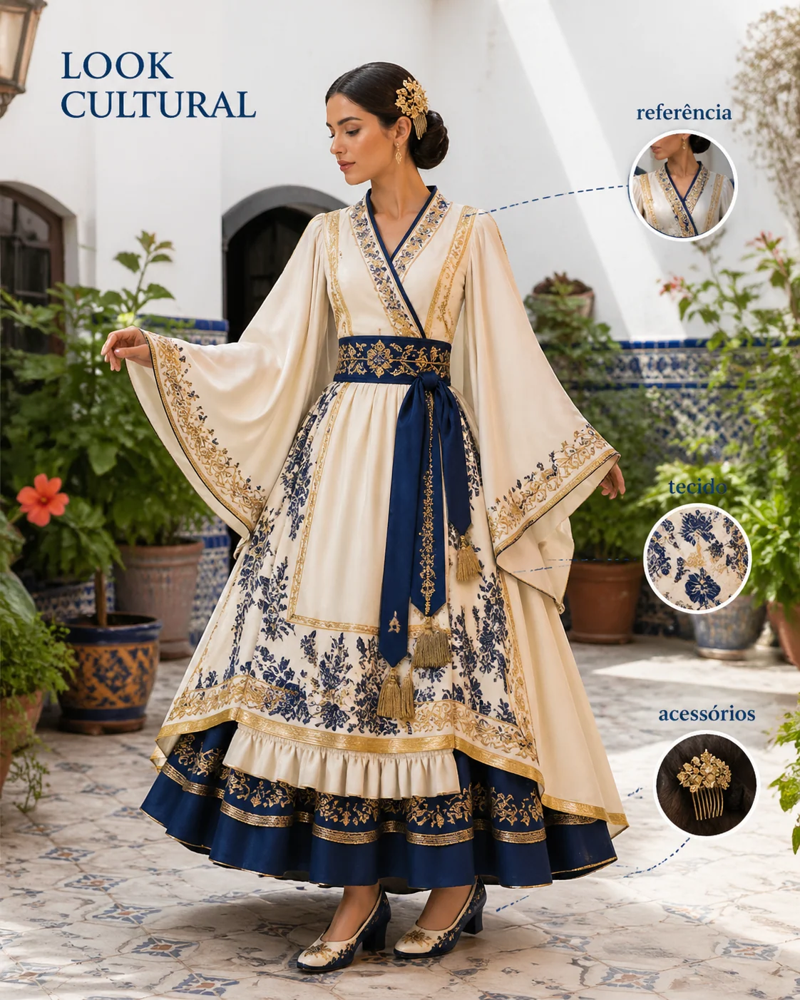


```text
请以[参考服装图]为主要服装依据，生成一张成年模特的全身文化服饰人像。模板方向：葡语文化画册人像。保留参考图中的服装轮廓、衣袖层次、领口、腰部结构、配色、发型、头饰、鞋子和姿势关系，并放入适合该主题的背景。画面文字只使用简体中文并保持简短。风格应端庄、尊重、服装细节清楚。避免名人脸、受版权保护的角色服装、真实品牌标志、暴露造型、身体夸张、未经验证的历史宣称、手部错误和裁掉脚部。默认比例：4:5。
```


### 7. 西语传统服饰人像 (`spanish-heritage-outfit-portrait`)


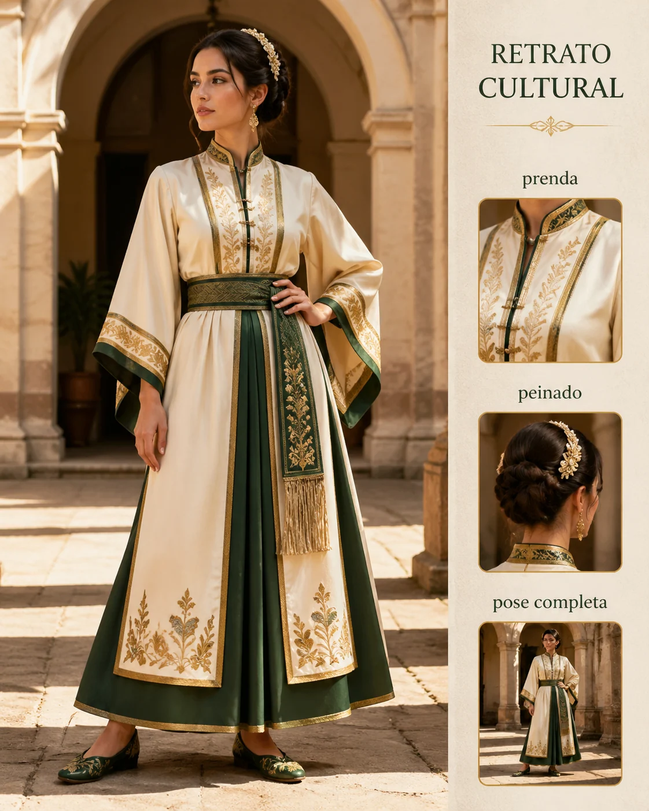


```text
请以[参考服装图]为主要服装依据，生成一张成年模特的全身文化服饰人像。模板方向：西语传统服饰人像。保留参考图中的服装轮廓、衣袖层次、领口、腰部结构、配色、发型、头饰、鞋子和姿势关系，并放入适合该主题的背景。画面文字只使用简体中文并保持简短。风格应端庄、尊重、服装细节清楚。避免名人脸、受版权保护的角色服装、真实品牌标志、暴露造型、身体夸张、未经验证的历史宣称、手部错误和裁掉脚部。默认比例：4:5。
```


### 8. 德语博物馆服饰研究 (`german-museum-costume-study`)


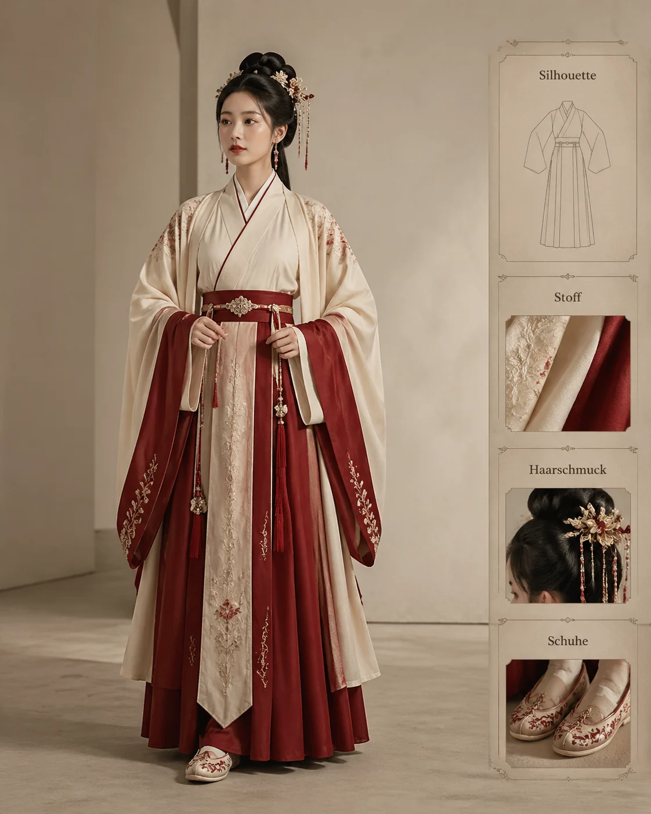


```text
请以[参考服装图]为主要服装依据，生成一张成年模特的全身文化服饰人像。模板方向：德语博物馆服饰研究。保留参考图中的服装轮廓、衣袖层次、领口、腰部结构、配色、发型、头饰、鞋子和姿势关系，并放入适合该主题的背景。画面文字只使用简体中文并保持简短。风格应端庄、尊重、服装细节清楚。避免名人脸、受版权保护的角色服装、真实品牌标志、暴露造型、身体夸张、未经验证的历史宣称、手部错误和裁掉脚部。默认比例：4:5。
```


### 9. 法语庭院汉服人像 (`french-courtyard-hanfu-portrait`)


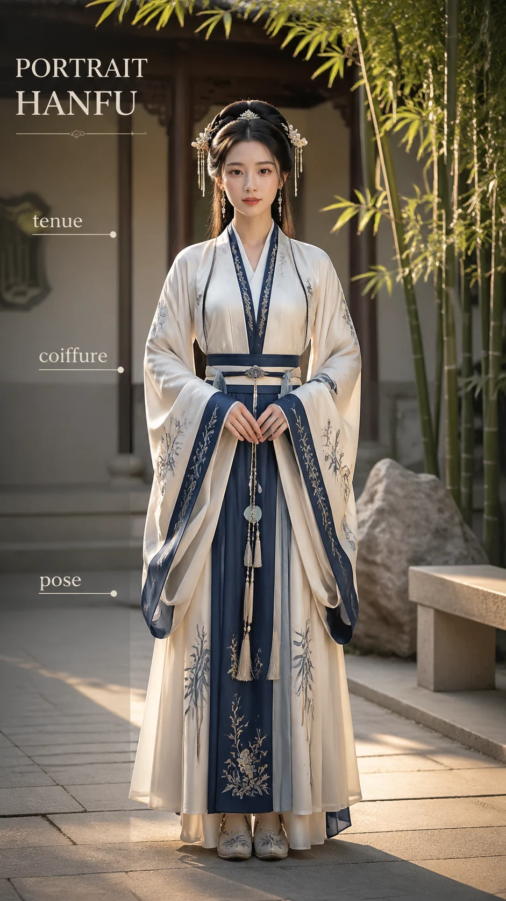


```text
请以[参考服装图]为主要服装依据，生成一张成年模特的全身文化服饰人像。模板方向：法语庭院汉服人像。保留参考图中的服装轮廓、衣袖层次、领口、腰部结构、配色、发型、头饰、鞋子和姿势关系，并放入适合该主题的背景。画面文字只使用简体中文并保持简短。风格应端庄、尊重、服装细节清楚。避免名人脸、受版权保护的角色服装、真实品牌标志、暴露造型、身体夸张、未经验证的历史宣称、手部错误和裁掉脚部。默认比例：9:16。
```


## 镭射角色卡 (`holographic-anime-cards`)

用 GPT Image 2 生成原创闪卡角色。


### 1. Original Energy Hero Card (`original-energy-hero-card`)


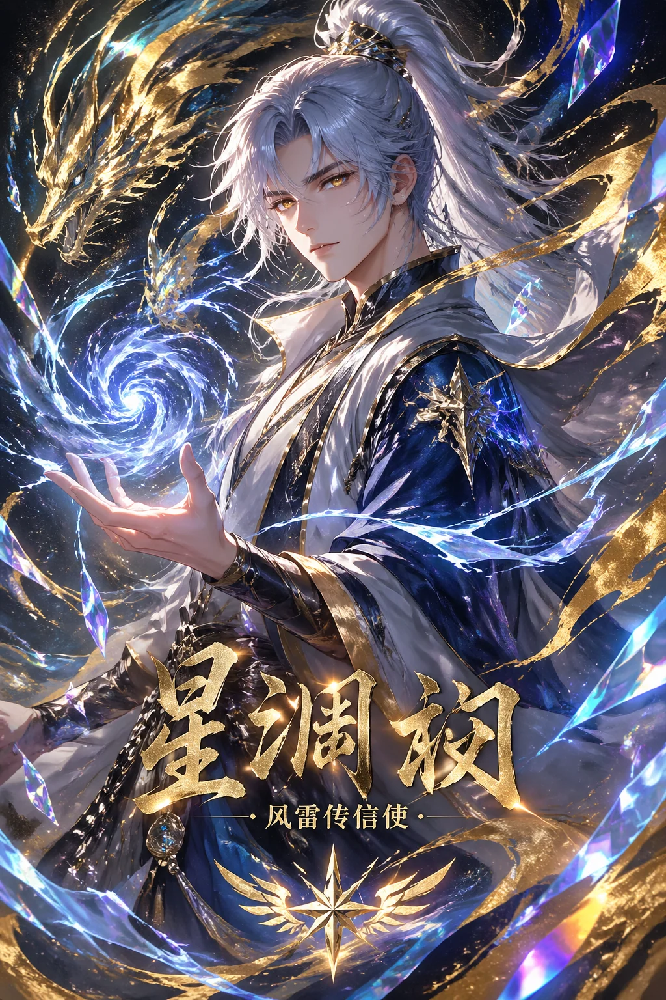


```text
创建一张高端镭射动漫收藏卡海报。主体必须是原创角色，不得使用版权角色、官方标志、真实品牌或系列符号。所有可见文字使用简体中文，只保留角色名和短副标题。画面包含金色流动笔触、能量旋涡、虹彩棱镜碎片、七彩镭射反光、镜面高光、金箔飞溅、发光粒子和深色抽象能量背景。替换变量：原创角色名、角色身份、发色与眼神、服装、能量主题、原创纹样、辅助色。保持商业动漫插画质感、收藏级闪卡质感、清晰角色姿态和强视觉冲击。\n\nUse case: Create an English vertical holographic hero card for an original anime character. Aspect ratio: 2:3. If the prompt asks for visible text, use simplified Chinese only.
```


### 2. Xianxia Foil Hero Card (`xianxia-foil-hero-card`)


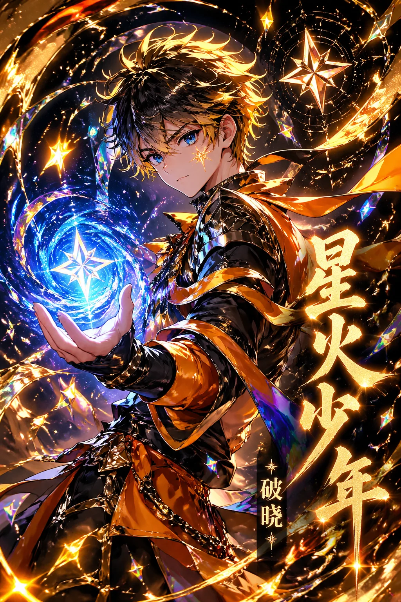


```text
创建一张高端镭射动漫收藏卡海报。主体必须是原创角色，不得使用版权角色、官方标志、真实品牌或系列符号。所有可见文字使用简体中文，只保留角色名和短副标题。画面包含金色流动笔触、能量旋涡、虹彩棱镜碎片、七彩镭射反光、镜面高光、金箔飞溅、发光粒子和深色抽象能量背景。替换变量：原创角色名、角色身份、发色与眼神、服装、能量主题、原创纹样、辅助色。保持商业动漫插画质感、收藏级闪卡质感、清晰角色姿态和强视觉冲击。\n\nUse case: Create a simplified Chinese fantasy hero card with gold foil energy and short title text. Aspect ratio: 2:3. If the prompt asks for visible text, use simplified Chinese only.
```


### 3. Neon Idol Foil Card (`neon-idol-foil-card`)


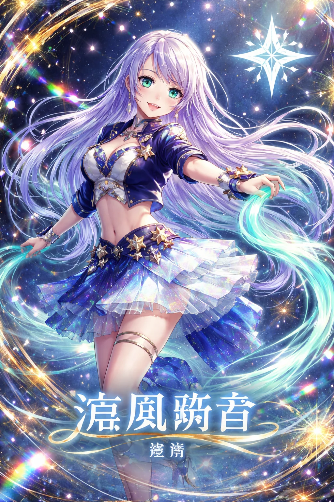


```text
创建一张高端镭射动漫收藏卡海报。主体必须是原创角色，不得使用版权角色、官方标志、真实品牌或系列符号。所有可见文字使用简体中文，只保留角色名和短副标题。画面包含金色流动笔触、能量旋涡、虹彩棱镜碎片、七彩镭射反光、镜面高光、金箔飞溅、发光粒子和深色抽象能量背景。替换变量：原创角色名、角色身份、发色与眼神、服装、能量主题、原创纹样、辅助色。保持商业动漫插画质感、收藏级闪卡质感、清晰角色姿态和强视觉冲击。\n\nUse case: Create a traditional Chinese neon idol collectible card with prism reflections. Aspect ratio: 3:4. If the prompt asks for visible text, use simplified Chinese only.
```


### 4. Guardian Spirit Card (`guardian-spirit-card`)


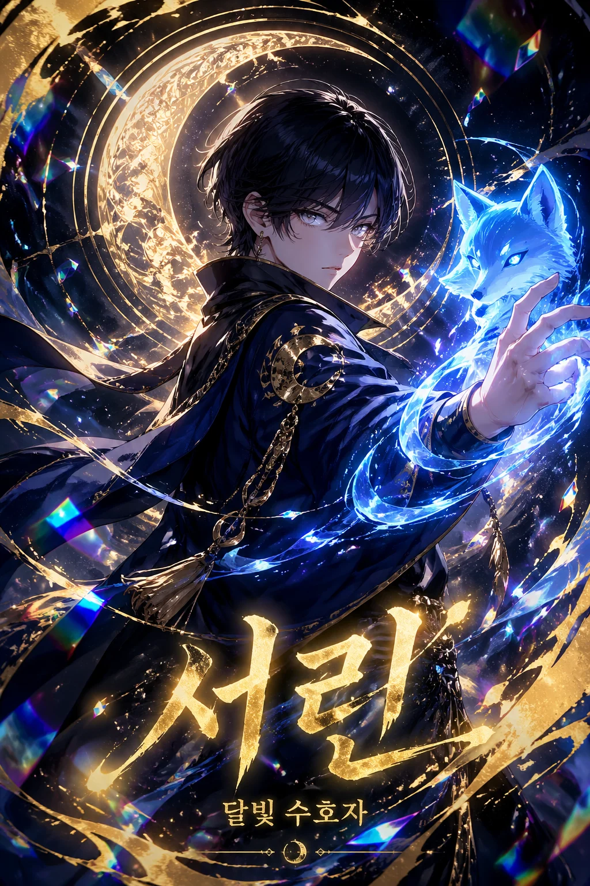


```text
创建一张高端镭射动漫收藏卡海报。主体必须是原创角色，不得使用版权角色、官方标志、真实品牌或系列符号。所有可见文字使用简体中文，只保留角色名和短副标题。画面包含金色流动笔触、能量旋涡、虹彩棱镜碎片、七彩镭射反光、镜面高光、金箔飞溅、发光粒子和深色抽象能量背景。替换变量：原创角色名、角色身份、发色与眼神、服装、能量主题、原创纹样、辅助色。保持商业动漫插画质感、收藏级闪卡质感、清晰角色姿态和强视觉冲击。\n\nUse case: Create a Korean spirit guardian card with premium holographic foil. Aspect ratio: 2:3. If the prompt asks for visible text, use simplified Chinese only.
```


### 5. Shonen Rival Energy Card (`shonen-rival-energy-card`)


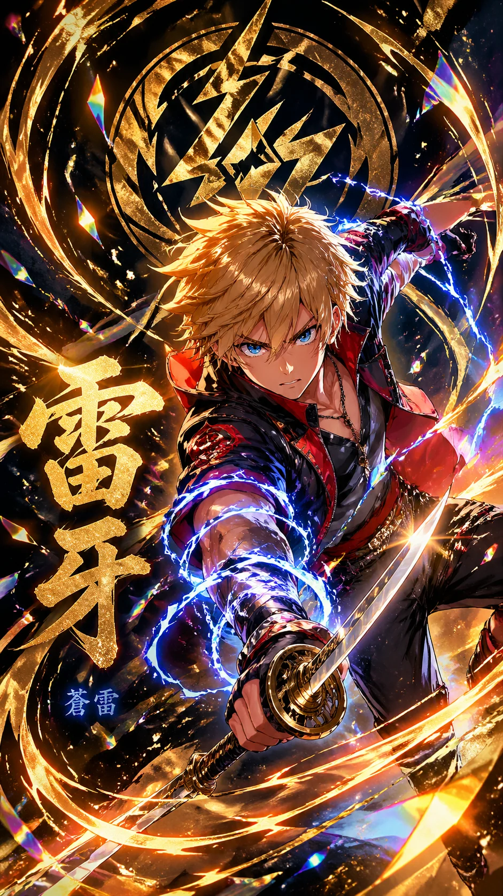


```text
创建一张高端镭射动漫收藏卡海报。主体必须是原创角色，不得使用版权角色、官方标志、真实品牌或系列符号。所有可见文字使用简体中文，只保留角色名和短副标题。画面包含金色流动笔触、能量旋涡、虹彩棱镜碎片、七彩镭射反光、镜面高光、金箔飞溅、发光粒子和深色抽象能量背景。替换变量：原创角色名、角色身份、发色与眼神、服装、能量主题、原创纹样、辅助色。保持商业动漫插画质感、收藏级闪卡质感、清晰角色姿态和强视觉冲击。\n\nUse case: Create a Japanese rival character card with explosive energy trails. Aspect ratio: 9:16. If the prompt asks for visible text, use simplified Chinese only.
```


### 6. Capoeira Sun Card (`capoeira-sun-card`)


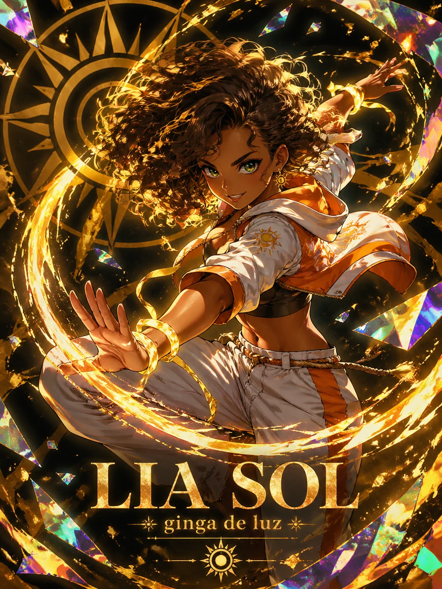


```text
创建一张高端镭射动漫收藏卡海报。主体必须是原创角色，不得使用版权角色、官方标志、真实品牌或系列符号。所有可见文字使用简体中文，只保留角色名和短副标题。画面包含金色流动笔触、能量旋涡、虹彩棱镜碎片、七彩镭射反光、镜面高光、金箔飞溅、发光粒子和深色抽象能量背景。替换变量：原创角色名、角色身份、发色与眼神、服装、能量主题、原创纹样、辅助色。保持商业动漫插画质感、收藏级闪卡质感、清晰角色姿态和强视觉冲击。\n\nUse case: Create a Portuguese original fighter card with sunlit foil motion. Aspect ratio: 3:4. If the prompt asks for visible text, use simplified Chinese only.
```


### 7. Urban Moon Guardian Card (`urban-moon-guardian-card`)


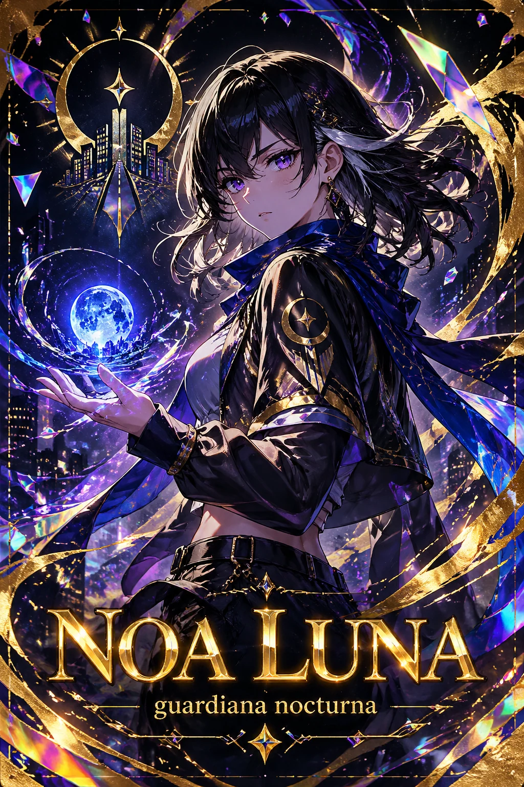


```text
创建一张高端镭射动漫收藏卡海报。主体必须是原创角色，不得使用版权角色、官方标志、真实品牌或系列符号。所有可见文字使用简体中文，只保留角色名和短副标题。画面包含金色流动笔触、能量旋涡、虹彩棱镜碎片、七彩镭射反光、镜面高光、金箔飞溅、发光粒子和深色抽象能量背景。替换变量：原创角色名、角色身份、发色与眼神、服装、能量主题、原创纹样、辅助色。保持商业动漫插画质感、收藏级闪卡质感、清晰角色姿态和强视觉冲击。\n\nUse case: Create a Spanish urban guardian card with moonlight prism shards. Aspect ratio: 2:3. If the prompt asks for visible text, use simplified Chinese only.
```


### 8. Cyber Knight Foil Card (`cyber-knight-foil-card`)


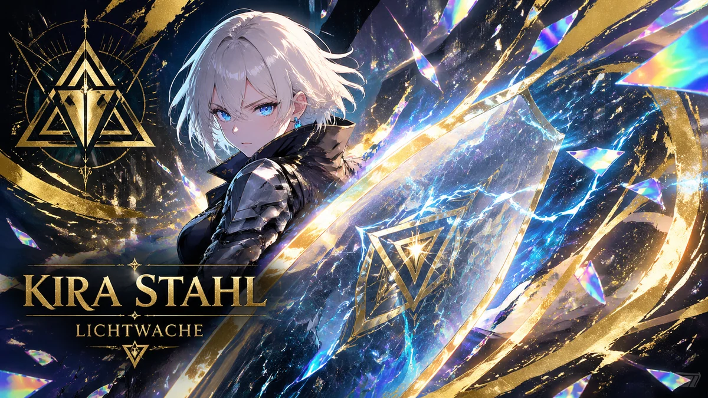


```text
创建一张高端镭射动漫收藏卡海报。主体必须是原创角色，不得使用版权角色、官方标志、真实品牌或系列符号。所有可见文字使用简体中文，只保留角色名和短副标题。画面包含金色流动笔触、能量旋涡、虹彩棱镜碎片、七彩镭射反光、镜面高光、金箔飞溅、发光粒子和深色抽象能量背景。替换变量：原创角色名、角色身份、发色与眼神、服装、能量主题、原创纹样、辅助色。保持商业动漫插画质感、收藏级闪卡质感、清晰角色姿态和强视觉冲击。\n\nUse case: Create a German cyber knight card with metallic highlights and foil fragments. Aspect ratio: 16:9. If the prompt asks for visible text, use simplified Chinese only.
```


### 9. Ballet Mage Prism Card (`ballet-mage-prism-card`)


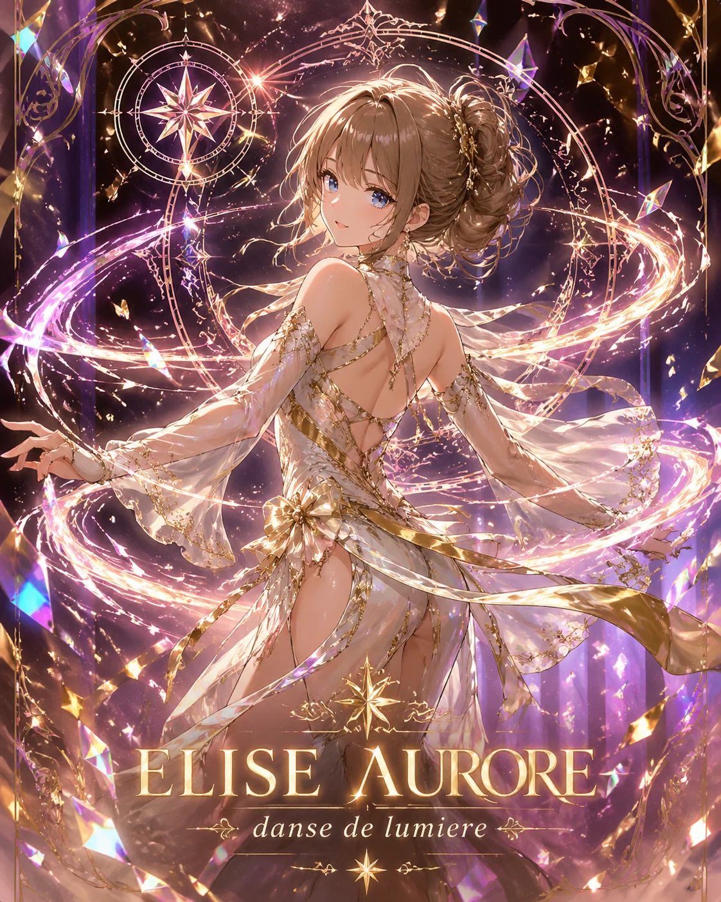


```text
创建一张高端镭射动漫收藏卡海报。主体必须是原创角色，不得使用版权角色、官方标志、真实品牌或系列符号。所有可见文字使用简体中文，只保留角色名和短副标题。画面包含金色流动笔触、能量旋涡、虹彩棱镜碎片、七彩镭射反光、镜面高光、金箔飞溅、发光粒子和深色抽象能量背景。替换变量：原创角色名、角色身份、发色与眼神、服装、能量主题、原创纹样、辅助色。保持商业动漫插画质感、收藏级闪卡质感、清晰角色姿态和强视觉冲击。\n\nUse case: Create a French ballet mage card with elegant prism foil and gold particles. Aspect ratio: 4:5. If the prompt asks for visible text, use simplified Chinese only.
```


## 口红报告模板 (`lipstick-recommendation-report`)

用提示词生成口红试色推荐报告。


### 1. 法式编辑唇色指南 (`french-editorial-lip-guide`)


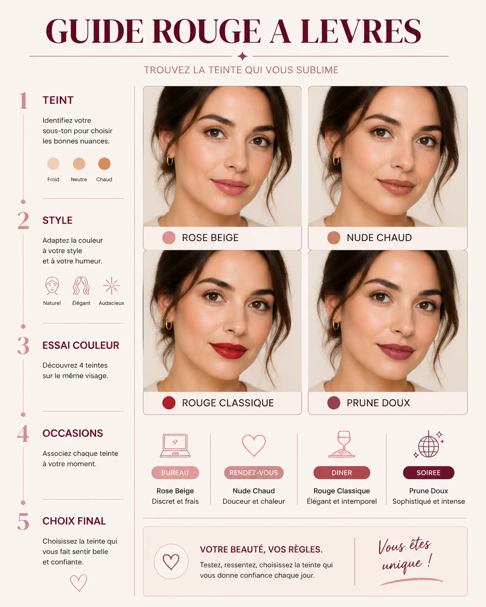


```text
基于 [人像参考图] 生成一张4:5口红推荐报告图。所有可见文字使用简体中文。主题是“法式编辑唇色指南”。请保留真实自然的肤质和统一光线，展示同一张脸的 3-5 个口红试色对比，仅改变唇色。加入肤色方向、气质关键词、色号/色系、适用场景和最终建议。使用干净高级的美妆信息图排版，避免真实品牌 logo、商标包装、颜值打分、医学结论、拥挤文字和失真的人脸。
```


### 2. 德语极简口红板 (`german-minimal-lipstick-board`)


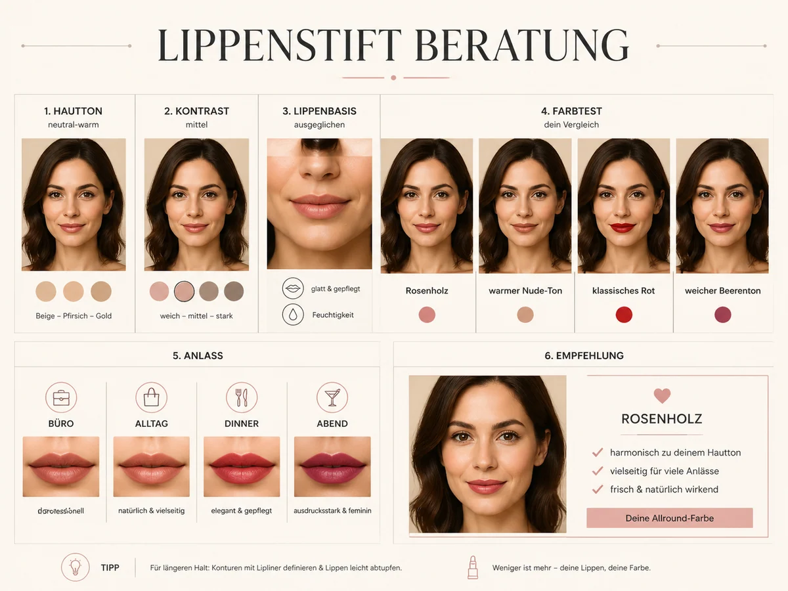


```text
基于 [人像参考图] 生成一张4:3口红推荐报告图。所有可见文字使用简体中文。主题是“德语极简口红板”。请保留真实自然的肤质和统一光线，展示同一张脸的 3-5 个口红试色对比，仅改变唇色。加入肤色方向、气质关键词、色号/色系、适用场景和最终建议。使用干净高级的美妆信息图排版，避免真实品牌 logo、商标包装、颜值打分、医学结论、拥挤文字和失真的人脸。
```


### 3. 西语派对唇色报告 (`spanish-fiesta-lipstick-report`)


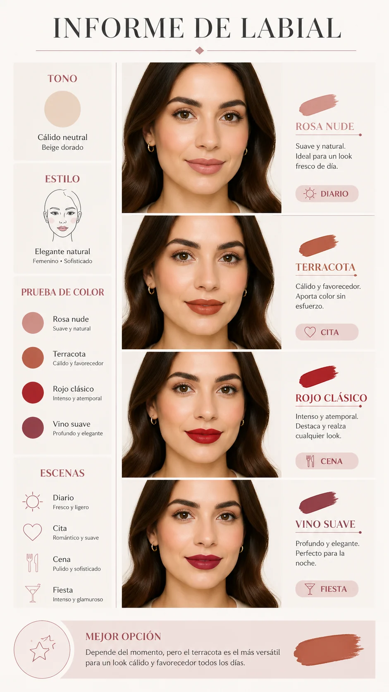


```text
基于 [人像参考图] 生成一张9:16口红推荐报告图。所有可见文字使用简体中文。主题是“西语派对唇色报告”。请保留真实自然的肤质和统一光线，展示同一张脸的 3-5 个口红试色对比，仅改变唇色。加入肤色方向、气质关键词、色号/色系、适用场景和最终建议。使用干净高级的美妆信息图排版，避免真实品牌 logo、商标包装、颜值打分、医学结论、拥挤文字和失真的人脸。
```


### 4. 葡语口红购物指南 (`portuguese-beauty-shop-guide`)


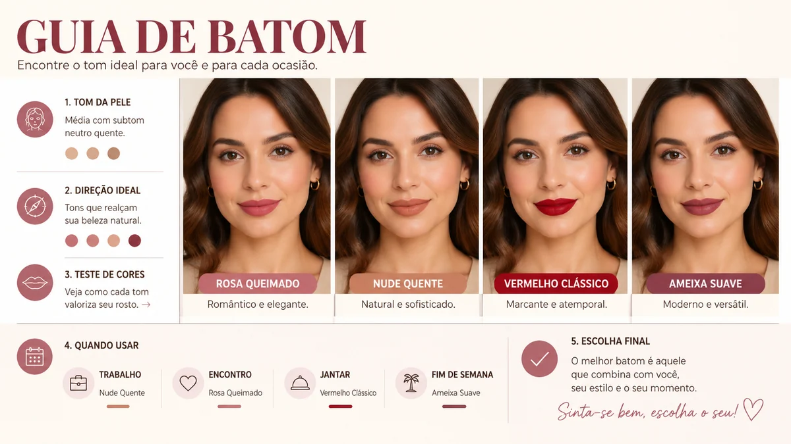


```text
基于 [人像参考图] 生成一张16:9口红推荐报告图。所有可见文字使用简体中文。主题是“葡语口红购物指南”。请保留真实自然的肤质和统一光线，展示同一张脸的 3-5 个口红试色对比，仅改变唇色。加入肤色方向、气质关键词、色号/色系、适用场景和最终建议。使用干净高级的美妆信息图排版，避免真实品牌 logo、商标包装、颜值打分、医学结论、拥挤文字和失真的人脸。
```


### 5. 日常通勤唇色卡 (`japanese-commute-lip-report`)


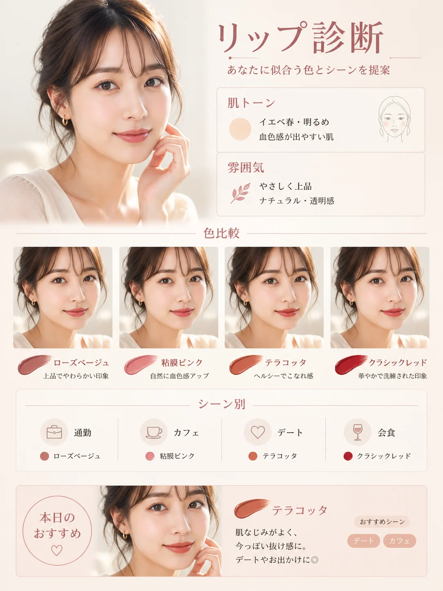


```text
基于 [人像参考图] 生成一张3:4口红推荐报告图。所有可见文字使用简体中文。主题是“日常通勤唇色卡”。请保留真实自然的肤质和统一光线，展示同一张脸的 3-5 个口红试色对比，仅改变唇色。加入肤色方向、气质关键词、色号/色系、适用场景和最终建议。使用干净高级的美妆信息图排版，避免真实品牌 logo、商标包装、颜值打分、医学结论、拥挤文字和失真的人脸。
```


### 6. 韩系 MLBB 报告 (`korean-mlbb-shade-report`)


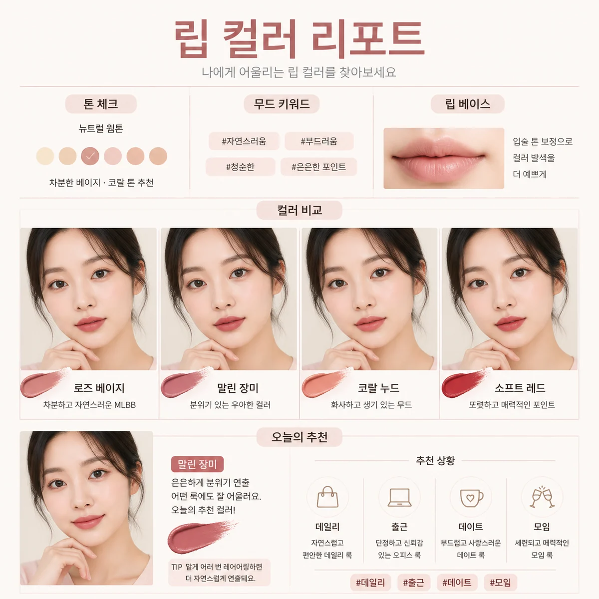


```text
基于 [人像参考图] 生成一张1:1口红推荐报告图。所有可见文字使用简体中文。主题是“韩系 MLBB 报告”。请保留真实自然的肤质和统一光线，展示同一张脸的 3-5 个口红试色对比，仅改变唇色。加入肤色方向、气质关键词、色号/色系、适用场景和最终建议。使用干净高级的美妆信息图排版，避免真实品牌 logo、商标包装、颜值打分、医学结论、拥挤文字和失真的人脸。
```


### 7. 繁中专柜唇色报告 (`taipei-beauty-counter-zh-tw`)


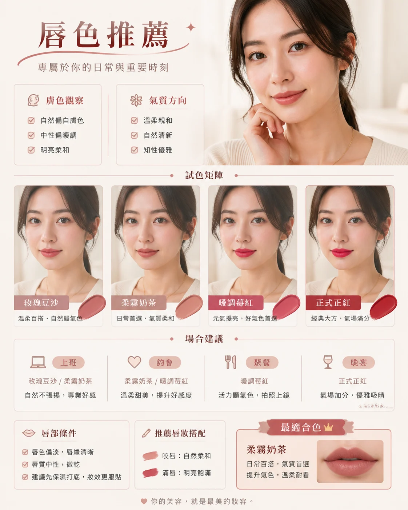


```text
基于 [人像参考图] 生成一张4:5口红推荐报告图。所有可见文字使用简体中文。主题是“繁中专柜唇色报告”。请保留真实自然的肤质和统一光线，展示同一张脸的 3-5 个口红试色对比，仅改变唇色。加入肤色方向、气质关键词、色号/色系、适用场景和最终建议。使用干净高级的美妆信息图排版，避免真实品牌 logo、商标包装、颜值打分、医学结论、拥挤文字和失真的人脸。
```


### 8. 中文种草口红指南 (`xiaohongshu-lipstick-guide-zh`)


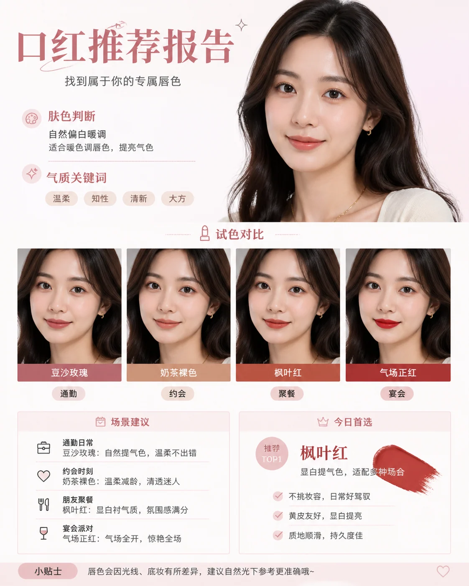


```text
基于 [人像参考图] 生成一张4:5口红推荐报告图。所有可见文字使用简体中文。主题是“中文种草口红指南”。请保留真实自然的肤质和统一光线，展示同一张脸的 3-5 个口红试色对比，仅改变唇色。加入肤色方向、气质关键词、色号/色系、适用场景和最终建议。使用干净高级的美妆信息图排版，避免真实品牌 logo、商标包装、颜值打分、医学结论、拥挤文字和失真的人脸。
```


### 9. 高级口红报告 (`premium-lipstick-report`)


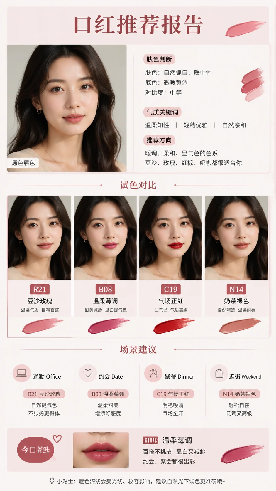


```text
基于 [人像参考图] 生成一张9:16口红推荐报告图。所有可见文字使用简体中文。主题是“高级口红报告”。请保留真实自然的肤质和统一光线，展示同一张脸的 3-5 个口红试色对比，仅改变唇色。加入肤色方向、气质关键词、色号/色系、适用场景和最终建议。使用干净高级的美妆信息图排版，避免真实品牌 logo、商标包装、颜值打分、医学结论、拥挤文字和失真的人脸。
```


## 护肤分镜模板 (`luxury-skincare-storyboards`)

用 GPT Image 2 生成高端护肤视觉。


### 1. 奶白护肤拼贴 (`milky-skincare-campaign-collage`)


```text
使用 GPT Image 2 生成「奶白护肤拼贴」。根据需要替换产品名、产品类型、成分、模特、质地、光线、语言和广告短句。画面目标：创建 12 格高端护肤 campaign board. 保持奶白柔光、浅米色、通透肤色、极简奢华构图和电影美容画报质感。所有可见文字使用简体中文，文字要短且为虚构品牌。不要真实 logo、医疗功效宣称或杂乱背景。
```


### 2. 柔光身体乳分镜 (`soft-body-lotion-storyboard`)


```text
使用 GPT Image 2 生成「柔光身体乳分镜」。根据需要替换产品名、产品类型、成分、模特、质地、光线、语言和广告短句。画面目标：用电影分镜展示身体乳护理流程. 保持奶白柔光、浅米色、通透肤色、极简奢华构图和电影美容画报质感。所有可见文字使用简体中文，文字要短且为虚构品牌。不要真实 logo、医疗功效宣称或杂乱背景。
```


### 3. 脸霜仪式版面 (`cream-ritual-editorial-spread`)


```text
使用 GPT Image 2 生成「脸霜仪式版面」。根据需要替换产品名、产品类型、成分、模特、质地、光线、语言和广告短句。画面目标：制作脸霜仪式感杂志跨页. 保持奶白柔光、浅米色、通透肤色、极简奢华构图和电影美容画报质感。所有可见文字使用简体中文，文字要短且为虚构品牌。不要真实 logo、医疗功效宣称或杂乱背景。
```


### 4. 精华上市 Moodboard (`serum-launch-moodboard`)


```text
使用 GPT Image 2 生成「精华上市 Moodboard」。根据需要替换产品名、产品类型、成分、模特、质地、光线、语言和广告短句。画面目标：创建精华上市 moodboard. 保持奶白柔光、浅米色、通透肤色、极简奢华构图和电影美容画报质感。所有可见文字使用简体中文，文字要短且为虚构品牌。不要真实 logo、医疗功效宣称或杂乱背景。
```


### 5. 乳液质地研究 (`lotion-texture-study`)


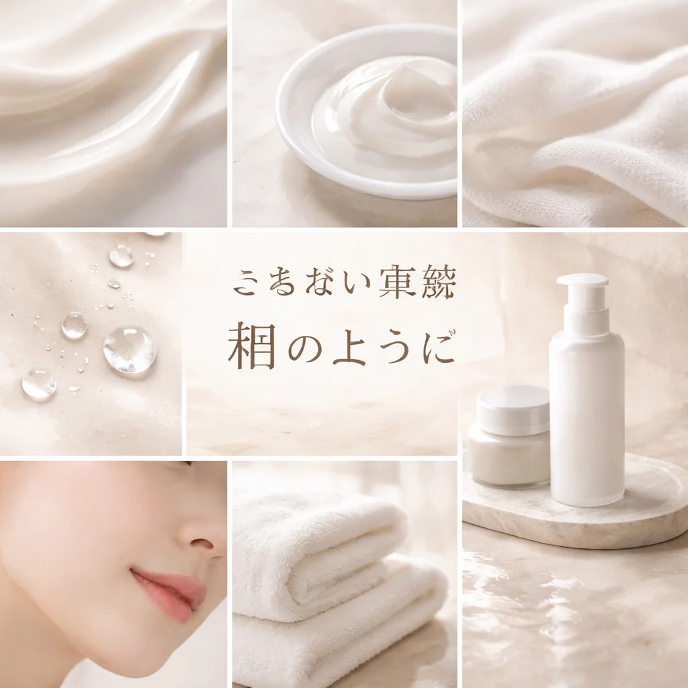


```text
使用 GPT Image 2 生成「乳液质地研究」。根据需要替换产品名、产品类型、成分、模特、质地、光线、语言和广告短句。画面目标：展示乳液和肌肤水润质地. 保持奶白柔光、浅米色、通透肤色、极简奢华构图和电影美容画报质感。所有可见文字使用简体中文，文字要短且为虚构品牌。不要真实 logo、医疗功效宣称或杂乱背景。
```


### 6. SPA 护肤 Campaign (`spa-product-campaign-board`)


```text
使用 GPT Image 2 生成「SPA 护肤 Campaign」。根据需要替换产品名、产品类型、成分、模特、质地、光线、语言和广告短句。画面目标：制作平静的 SPA 护肤 campaign board. 保持奶白柔光、浅米色、通透肤色、极简奢华构图和电影美容画报质感。所有可见文字使用简体中文，文字要短且为虚构品牌。不要真实 logo、医疗功效宣称或杂乱背景。
```


### 7. 晨间护肤大片 (`morning-skincare-editorial`)


```text
使用 GPT Image 2 生成「晨间护肤大片」。根据需要替换产品名、产品类型、成分、模特、质地、光线、语言和广告短句。画面目标：生成竖版晨间护肤社媒大片. 保持奶白柔光、浅米色、通透肤色、极简奢华构图和电影美容画报质感。所有可见文字使用简体中文，文字要短且为虚构品牌。不要真实 logo、医疗功效宣称或杂乱背景。
```


### 8. Clean Beauty 静物 (`clean-beauty-still-life`)


```text
使用 GPT Image 2 生成「Clean Beauty 静物」。根据需要替换产品名、产品类型、成分、模特、质地、光线、语言和广告短句。画面目标：制作可持续 clean beauty 静物分镜. 保持奶白柔光、浅米色、通透肤色、极简奢华构图和电影美容画报质感。所有可见文字使用简体中文，文字要短且为虚构品牌。不要真实 logo、医疗功效宣称或杂乱背景。
```


### 9. 面部喷雾分镜 (`facial-mist-luxury-film`)


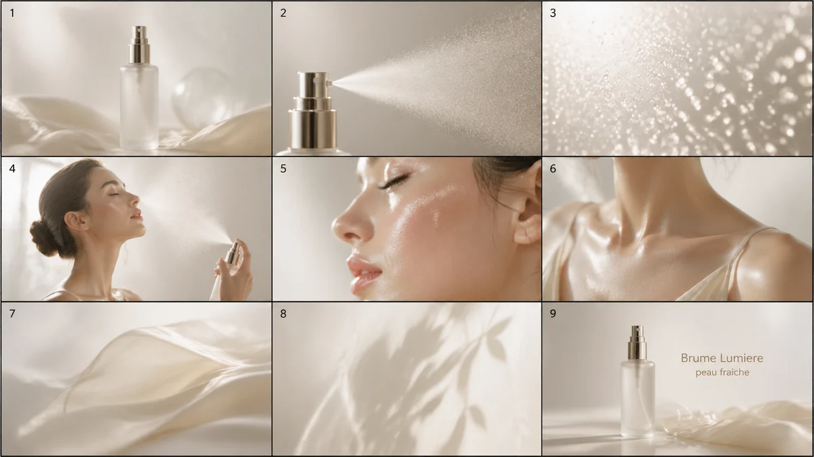


```text
使用 GPT Image 2 生成「面部喷雾分镜」。根据需要替换产品名、产品类型、成分、模特、质地、光线、语言和广告短句。画面目标：创建面部喷雾电影感分镜. 保持奶白柔光、浅米色、通透肤色、极简奢华构图和电影美容画报质感。所有可见文字使用简体中文，文字要短且为虚构品牌。不要真实 logo、医疗功效宣称或杂乱背景。
```


## 赛日海报模板 (`matchday-posters`)

用 GPT Image 2 生成球队赛日海报。


### 1. 阿根廷足球应援海报 (`argentina-football-pride-poster`)


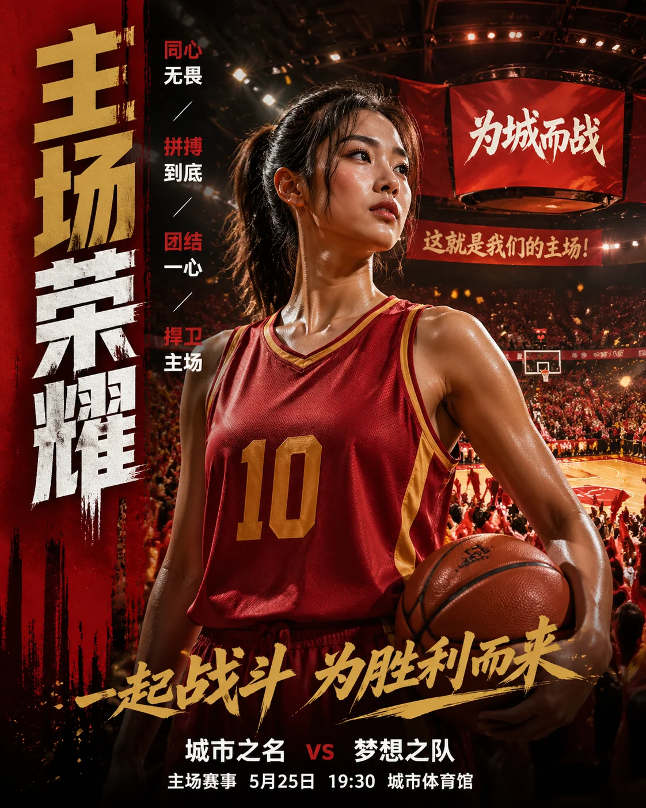


```text
创建「阿根廷足球应援海报」。用途：Vertical national-team inspired football poster。请用当前语言写清可见标题、口号和短标签，生成高级体育赛日海报。保留可编辑变量：队伍或城市、队伍颜色、球迷或运动员描述、场馆氛围、主标题、口号、底部文案。画面包含真实人物细节、体育场灯光、观众、旗帜、纸屑、围巾或横幅，避免真实队徽、赞助商、名人脸、政治和博彩内容。
```


### 2. 中国篮球主场海报 (`china-basketball-home-court-poster`)


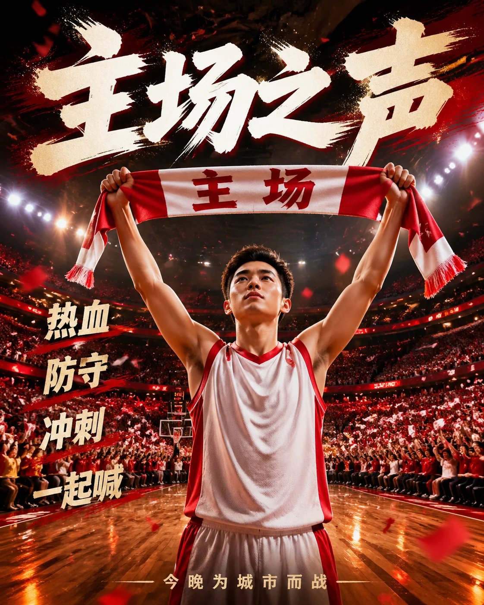


```text
创建「中国篮球主场海报」。用途：Simplified Chinese home-court basketball poster。请用当前语言写清可见标题、口号和短标签，生成高级体育赛日海报。保留可编辑变量：队伍或城市、队伍颜色、球迷或运动员描述、场馆氛围、主标题、口号、底部文案。画面包含真实人物细节、体育场灯光、观众、旗帜、纸屑、围巾或横幅，避免真实队徽、赞助商、名人脸、政治和博彩内容。
```


### 3. 台湾棒球夜赛海报 (`taiwan-baseball-night-game-poster`)


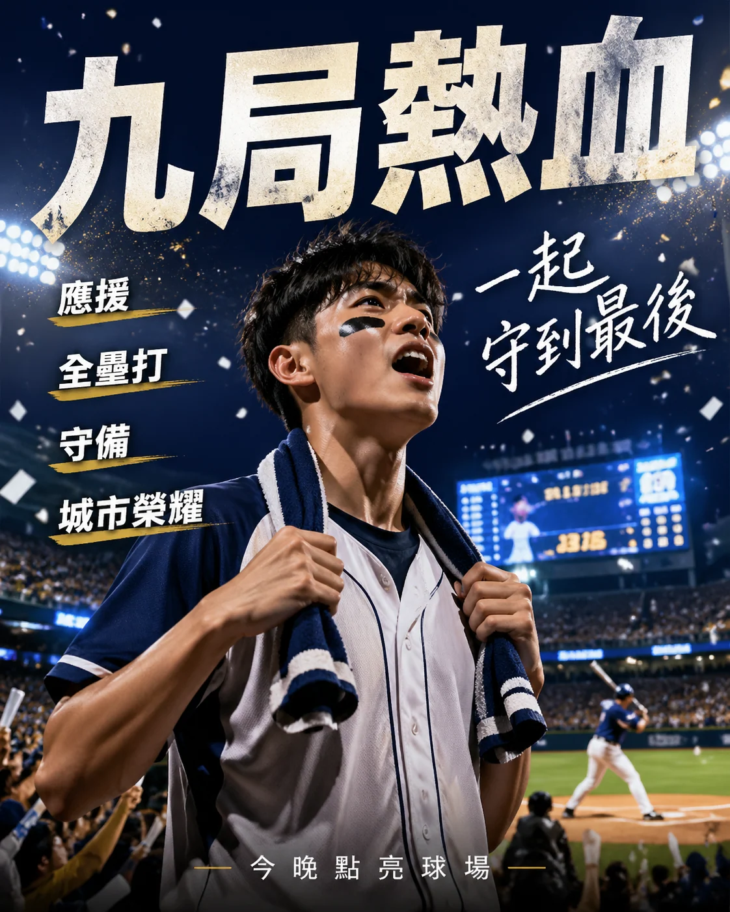


```text
创建「台湾棒球夜赛海报」。用途：Traditional Chinese baseball night-game poster。请用当前语言写清可见标题、口号和短标签，生成高级体育赛日海报。保留可编辑变量：队伍或城市、队伍颜色、球迷或运动员描述、场馆氛围、主标题、口号、底部文案。画面包含真实人物细节、体育场灯光、观众、旗帜、纸屑、围巾或横幅，避免真实队徽、赞助商、名人脸、政治和博彩内容。
```


### 4. 韩国红潮足球海报 (`korea-red-wave-football-poster`)


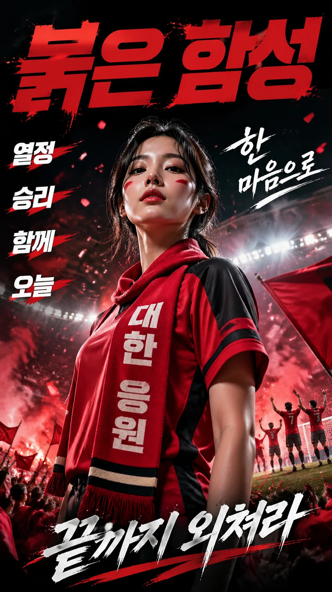


```text
创建「韩国红潮足球海报」。用途：Korean football supporter poster。请用当前语言写清可见标题、口号和短标签，生成高级体育赛日海报。保留可编辑变量：队伍或城市、队伍颜色、球迷或运动员描述、场馆氛围、主标题、口号、底部文案。画面包含真实人物细节、体育场灯光、观众、旗帜、纸屑、围巾或横幅，避免真实队徽、赞助商、名人脸、政治和博彩内容。
```


### 5. 日本蓝色赛日海报 (`japan-blue-matchday-poster`)


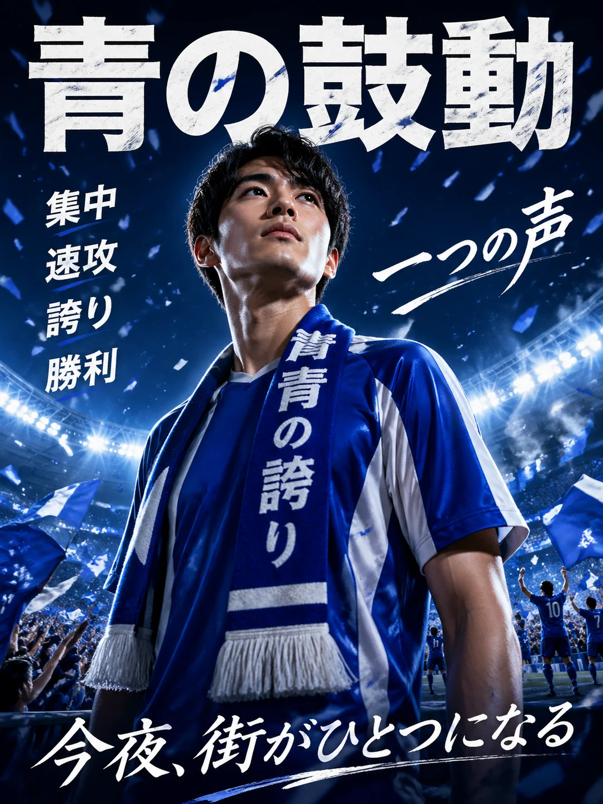


```text
创建「日本蓝色赛日海报」。用途：Japanese national-color football poster。请用当前语言写清可见标题、口号和短标签，生成高级体育赛日海报。保留可编辑变量：队伍或城市、队伍颜色、球迷或运动员描述、场馆氛围、主标题、口号、底部文案。画面包含真实人物细节、体育场灯光、观众、旗帜、纸屑、围巾或横幅，避免真实队徽、赞助商、名人脸、政治和博彩内容。
```


### 6. 巴西足球狂欢海报 (`brazil-futebol-carnival-poster`)


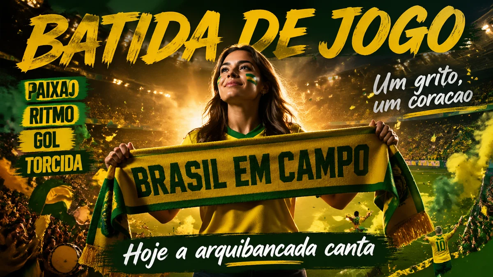


```text
创建「巴西足球狂欢海报」。用途：Portuguese football carnival matchday poster。请用当前语言写清可见标题、口号和短标签，生成高级体育赛日海报。保留可编辑变量：队伍或城市、队伍颜色、球迷或运动员描述、场馆氛围、主标题、口号、底部文案。画面包含真实人物细节、体育场灯光、观众、旗帜、纸屑、围巾或横幅，避免真实队徽、赞助商、名人脸、政治和博彩内容。
```


### 7. 西班牙德比夜海报 (`spanish-derby-night-poster`)


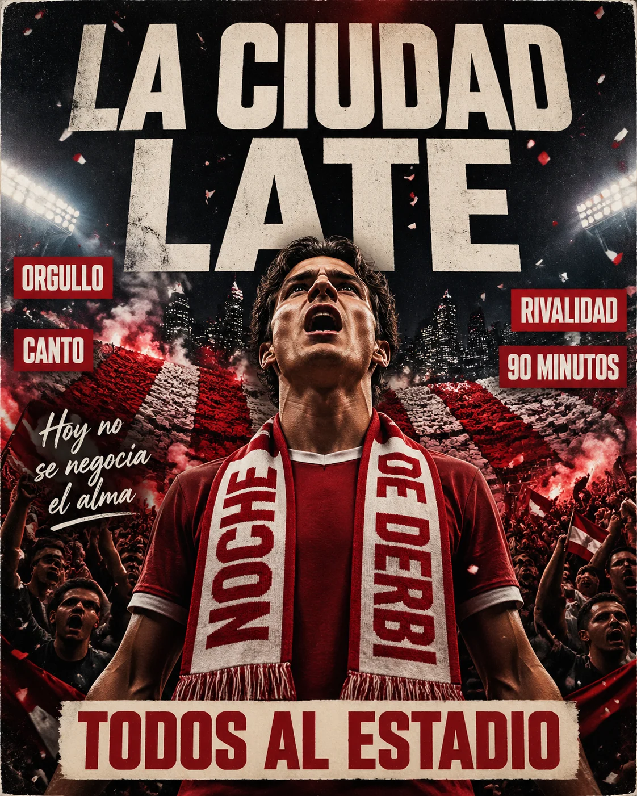


```text
创建「西班牙德比夜海报」。用途：Spanish derby-night stadium poster。请用当前语言写清可见标题、口号和短标签，生成高级体育赛日海报。保留可编辑变量：队伍或城市、队伍颜色、球迷或运动员描述、场馆氛围、主标题、口号、底部文案。画面包含真实人物细节、体育场灯光、观众、旗帜、纸屑、围巾或横幅，避免真实队徽、赞助商、名人脸、政治和博彩内容。
```


### 8. 柏林俱乐部 TIFO 海报 (`berlin-club-tifo-poster`)


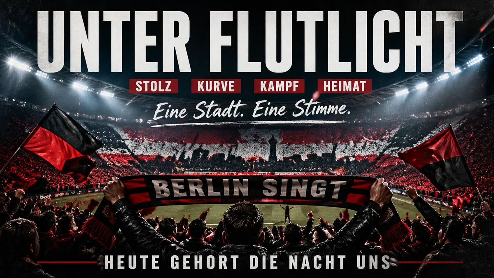


```text
创建「柏林俱乐部 TIFO 海报」。用途：German fictional club tifo poster。请用当前语言写清可见标题、口号和短标签，生成高级体育赛日海报。保留可编辑变量：队伍或城市、队伍颜色、球迷或运动员描述、场馆氛围、主标题、口号、底部文案。画面包含真实人物细节、体育场灯光、观众、旗帜、纸屑、围巾或横幅，避免真实队徽、赞助商、名人脸、政治和博彩内容。
```


### 9. 巴黎终场哨海报 (`paris-final-whistle-poster`)


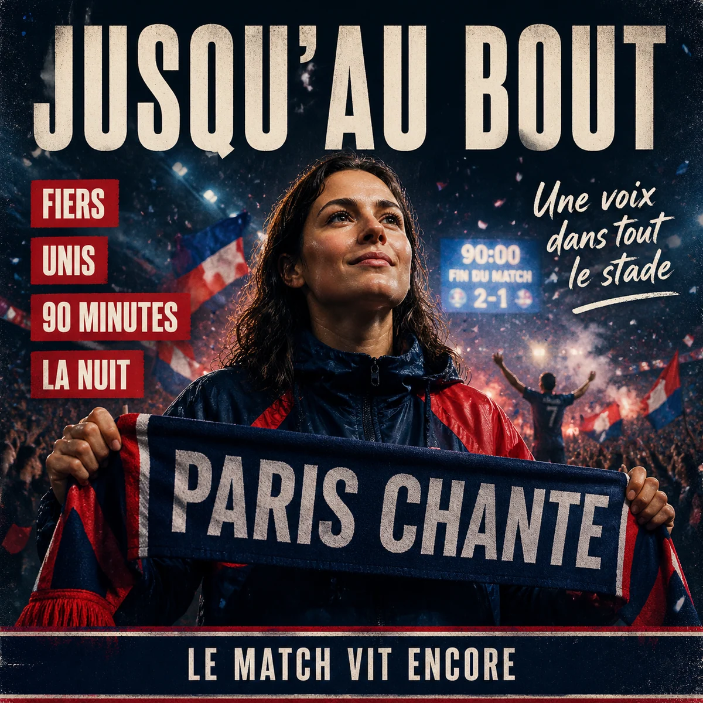


```text
创建「巴黎终场哨海报」。用途：French final-whistle fan poster。请用当前语言写清可见标题、口号和短标签，生成高级体育赛日海报。保留可编辑变量：队伍或城市、队伍颜色、球迷或运动员描述、场馆氛围、主标题、口号、底部文案。画面包含真实人物细节、体育场灯光、观众、旗帜、纸屑、围巾或横幅，避免真实队徽、赞助商、名人脸、政治和博彩内容。
```


## 物品时装提示词 (`object-fashion-concepts`)

用 GPT Image 2 把参考物变成服装概念。


### 1. 文物粗花呢套装 (`museum-artifact-tweed-outfit`)


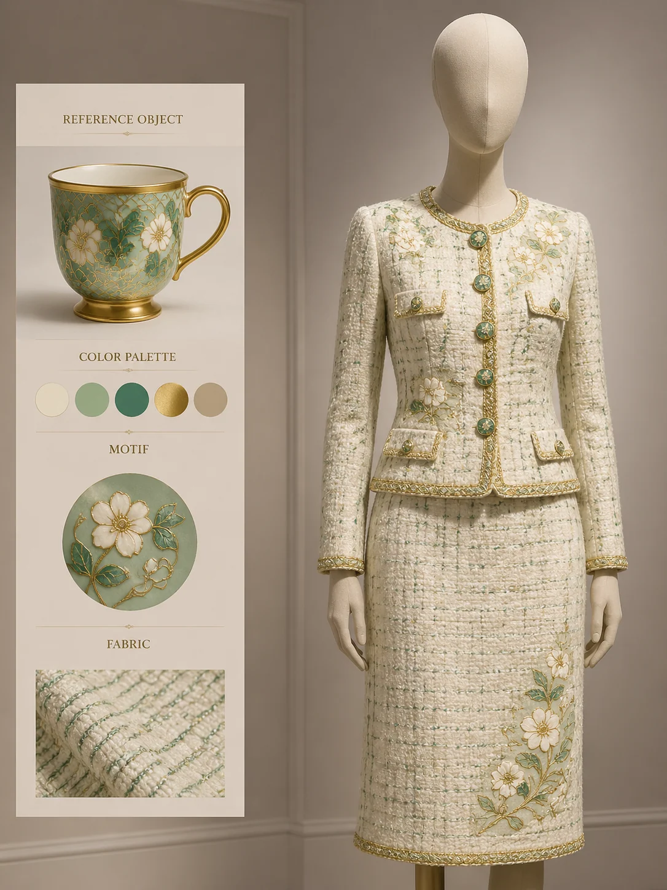


```text
请以 [REFERENCE_OBJECT] 为视觉灵感，生成「文物粗花呢套装」。重点表现：文物的色彩、纹样和材质。把参考物的颜色、形状、纹样、材质和情绪转化为成人时装概念，画面包含成衣造型、设计板、色卡、面料和细节草图。如出现文字，全部使用简体中文。避免真实品牌、Logo、复制标签、暴露姿势和虚假联名。
```


### 2. 包装度假造型 (`product-packaging-resort-look`)


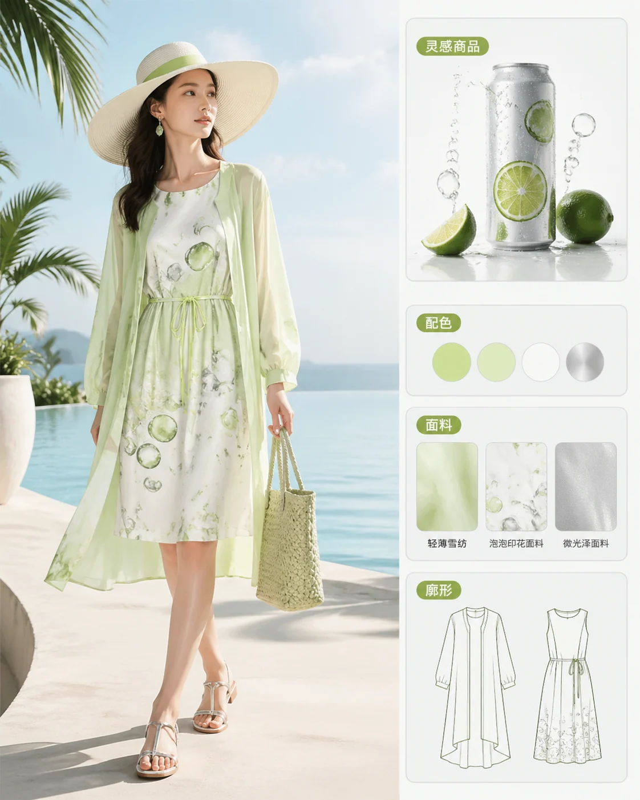


```text
请以 [REFERENCE_OBJECT] 为视觉灵感，生成「包装度假造型」。重点表现：包装的色块、曲线和清爽情绪。把参考物的颜色、形状、纹样、材质和情绪转化为成人时装概念，画面包含成衣造型、设计板、色卡、面料和细节草图。如出现文字，全部使用简体中文。避免真实品牌、Logo、复制标签、暴露姿势和虚假联名。
```


### 3. 植物流动洋装 (`botanical-flowing-dress`)


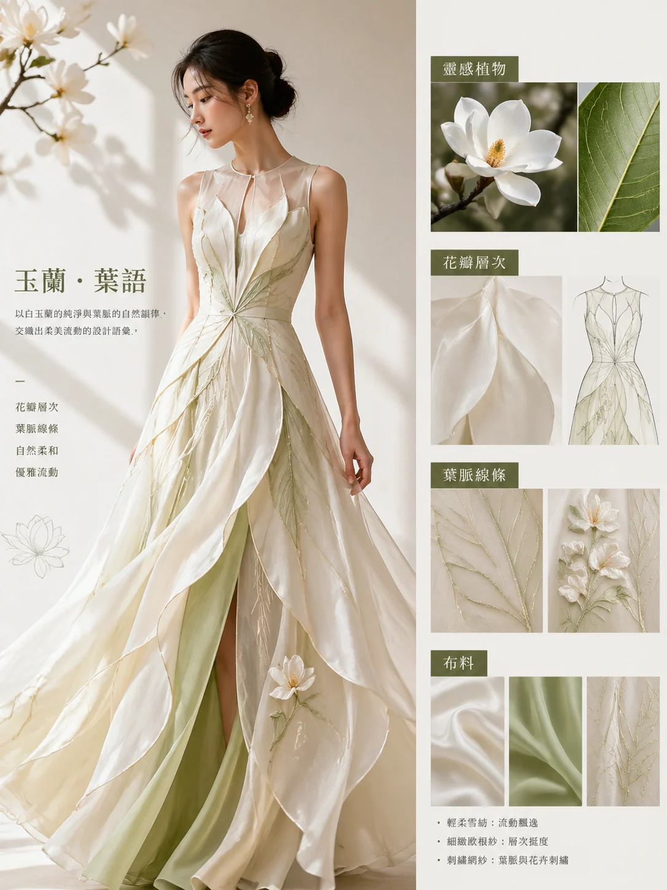


```text
请以 [REFERENCE_OBJECT] 为视觉灵感，生成「植物流动洋装」。重点表现：花瓣、叶脉和自然渐变。把参考物的颜色、形状、纹样、材质和情绪转化为成人时装概念，画面包含成衣造型、设计板、色卡、面料和细节草图。如出现文字，全部使用简体中文。避免真实品牌、Logo、复制标签、暴露姿势和虚假联名。
```


### 4. 陶瓷秀场造型 (`ceramic-vessel-runway-look`)


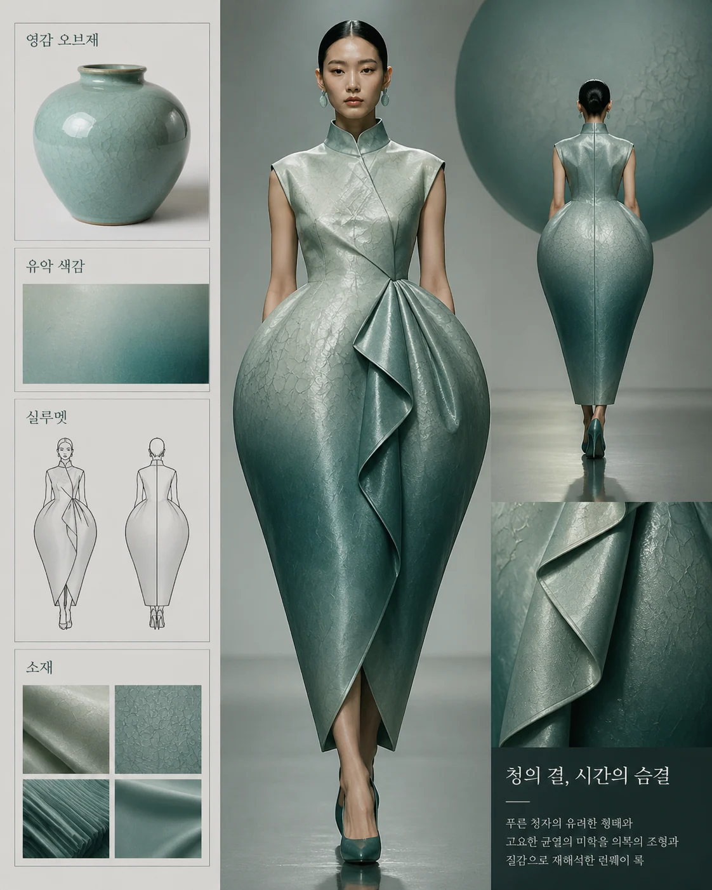


```text
请以 [REFERENCE_OBJECT] 为视觉灵感，生成「陶瓷秀场造型」。重点表现：器物廓形、釉色和裂纹质感。把参考物的颜色、形状、纹样、材质和情绪转化为成人时装概念，画面包含成衣造型、设计板、色卡、面料和细节草图。如出现文字，全部使用简体中文。避免真实品牌、Logo、复制标签、暴露姿势和虚假联名。
```


### 5. 山水分层外套 (`landscape-painting-layered-coat`)


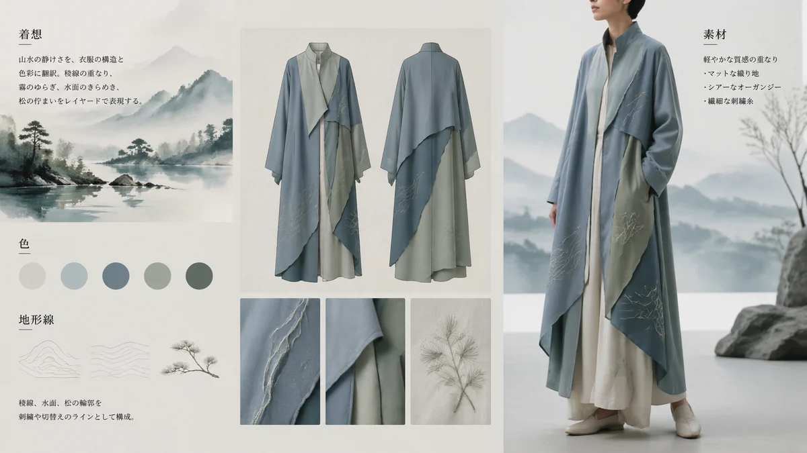


```text
请以 [REFERENCE_OBJECT] 为视觉灵感，生成「山水分层外套」。重点表现：地形层次、云水和外套分片。把参考物的颜色、形状、纹样、材质和情绪转化为成人时装概念，画面包含成衣造型、设计板、色卡、面料和细节草图。如出现文字，全部使用简体中文。避免真实品牌、Logo、复制标签、暴露姿势和虚假联名。
```


### 6. 珠宝晚装套装 (`jewelry-motif-evening-ensemble`)


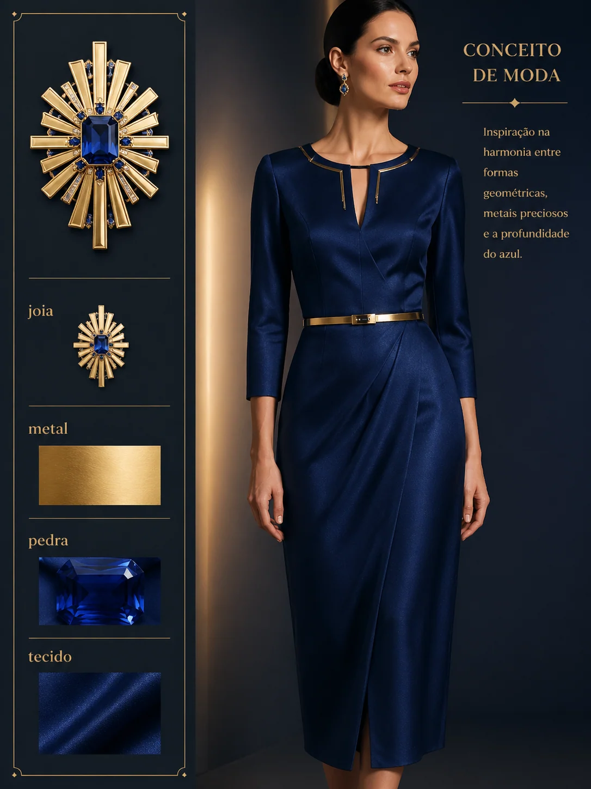


```text
请以 [REFERENCE_OBJECT] 为视觉灵感，生成「珠宝晚装套装」。重点表现：金属、宝石和链条节奏。把参考物的颜色、形状、纹样、材质和情绪转化为成人时装概念，画面包含成衣造型、设计板、色卡、面料和细节草图。如出现文字，全部使用简体中文。避免真实品牌、Logo、复制标签、暴露姿势和虚假联名。
```


### 7. 科技都市外套 (`tech-object-urban-outerwear`)


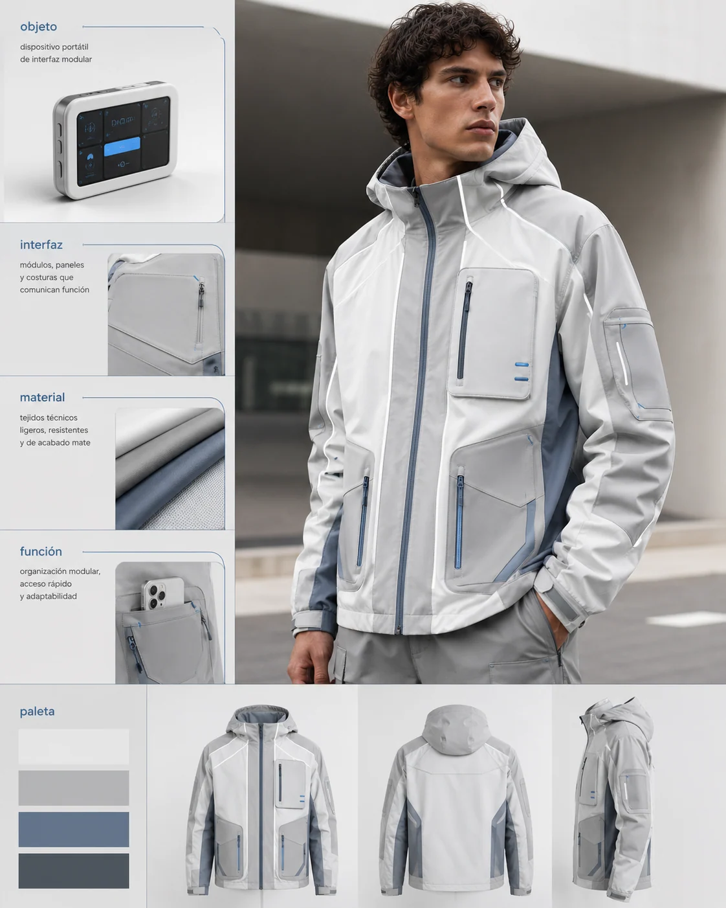


```text
请以 [REFERENCE_OBJECT] 为视觉灵感，生成「科技都市外套」。重点表现：界面网格、按钮和功能口袋。把参考物的颜色、形状、纹样、材质和情绪转化为成人时装概念，画面包含成衣造型、设计板、色卡、面料和细节草图。如出现文字，全部使用简体中文。避免真实品牌、Logo、复制标签、暴露姿势和虚假联名。
```


### 8. 包装街头穿搭 (`food-packaging-streetwear`)


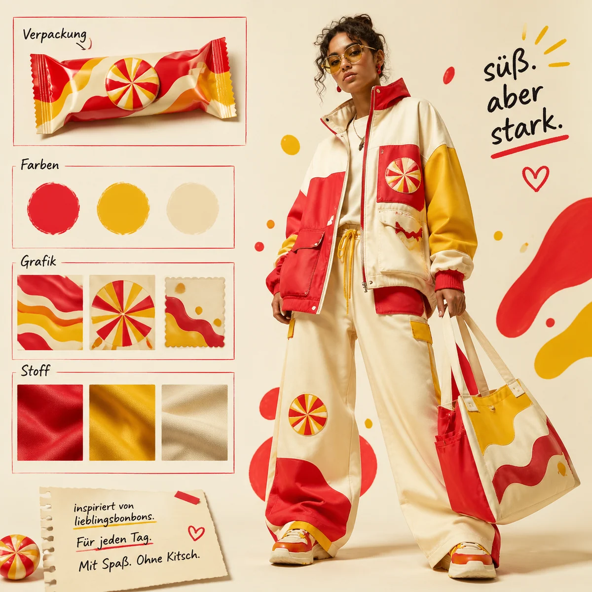


```text
请以 [REFERENCE_OBJECT] 为视觉灵感，生成「包装街头穿搭」。重点表现：包装图形、色块和贴布。把参考物的颜色、形状、纹样、材质和情绪转化为成人时装概念，画面包含成衣造型、设计板、色卡、面料和细节草图。如出现文字，全部使用简体中文。避免真实品牌、Logo、复制标签、暴露姿势和虚假联名。
```


### 9. 建筑剪裁造型 (`architecture-facade-tailored-look`)


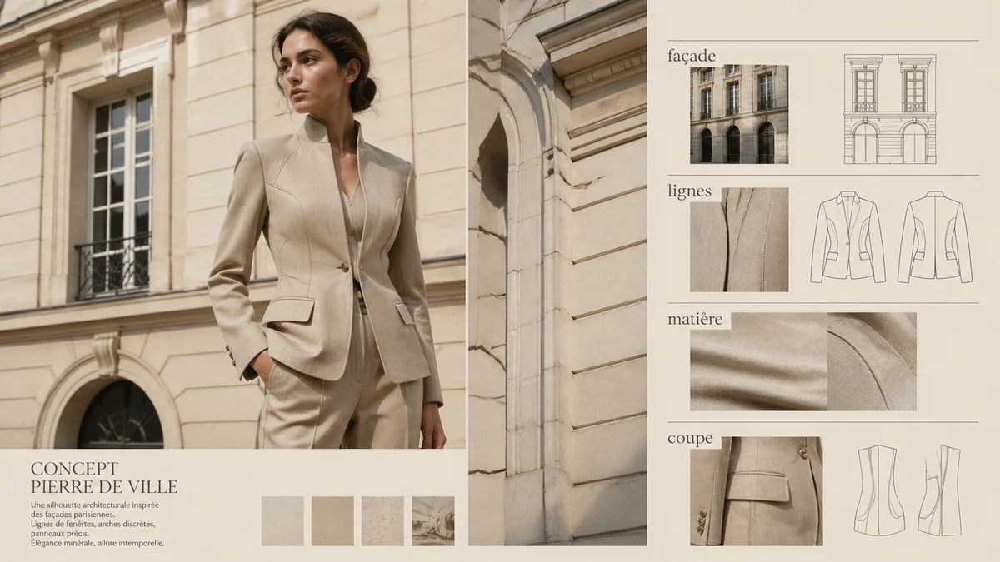


```text
请以 [REFERENCE_OBJECT] 为视觉灵感，生成「建筑剪裁造型」。重点表现：窗格、拱形、石材和剪裁线。把参考物的颜色、形状、纹样、材质和情绪转化为成人时装概念，画面包含成衣造型、设计板、色卡、面料和细节草图。如出现文字，全部使用简体中文。避免真实品牌、Logo、复制标签、暴露姿势和虚假联名。
```


## 老照片修复 (`old-photo-restoration`)

用 GPT Image 2 修复旧照并保留人物特征。


### 1. 经典家庭照修复 (`classic-family-portrait-restoration`)


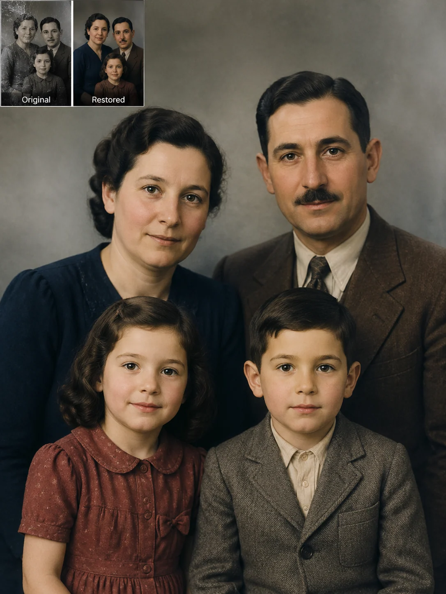


```text
请以上传的老照片作为严格参考，执行「经典家庭照修复」。目标任务：Restore a damaged family portrait with natural color。修复划痕、折痕、污渍、灰尘、模糊和褪色，提升清晰度、自然色彩和细节，同时保留人物身份、年龄、表情、姿势、服装年代感和原始构图。只重建原图明确暗示的受损区域，不要美颜过度，不要改变脸型、身材、发型或背景时代，不要加入现代物件、Logo 或虚构人物。输出应自然、可信、适合家庭相册或记忆整理。
```


### 2. 划痕人像修复 (`scratched-portrait-repair`)


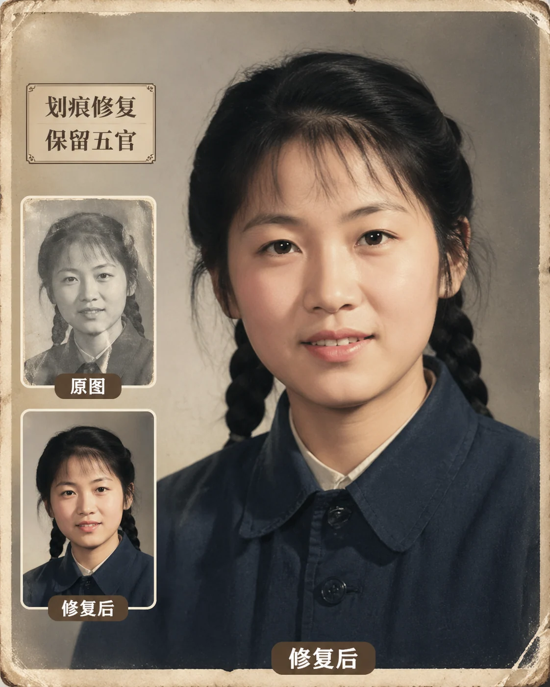


```text
请以上传的老照片作为严格参考，执行「划痕人像修复」。目标任务：Repair cracks, folds, dust, and face damage。修复划痕、折痕、污渍、灰尘、模糊和褪色，提升清晰度、自然色彩和细节，同时保留人物身份、年龄、表情、姿势、服装年代感和原始构图。只重建原图明确暗示的受损区域，不要美颜过度，不要改变脸型、身材、发型或背景时代，不要加入现代物件、Logo 或虚构人物。输出应自然、可信、适合家庭相册或记忆整理。
```


### 3. 褪色婚礼照上色 (`faded-wedding-photo-colorization`)


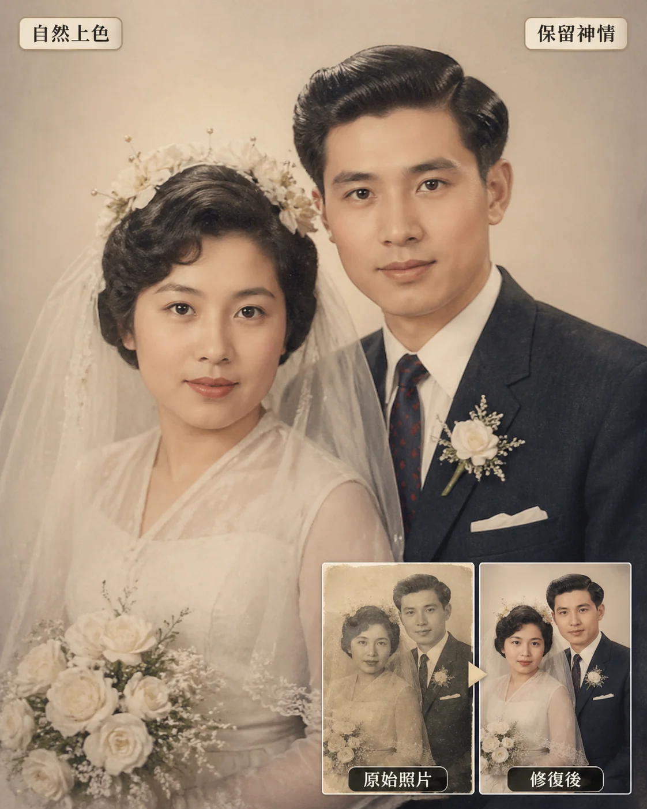


```text
请以上传的老照片作为严格参考，执行「褪色婚礼照上色」。目标任务：Colorize and restore an old wedding portrait。修复划痕、折痕、污渍、灰尘、模糊和褪色，提升清晰度、自然色彩和细节，同时保留人物身份、年龄、表情、姿势、服装年代感和原始构图。只重建原图明确暗示的受损区域，不要美颜过度，不要改变脸型、身材、发型或背景时代，不要加入现代物件、Logo 或虚构人物。输出应自然、可信、适合家庭相册或记忆整理。
```


### 4. 影楼头像修复 (`studio-headshot-restoration`)


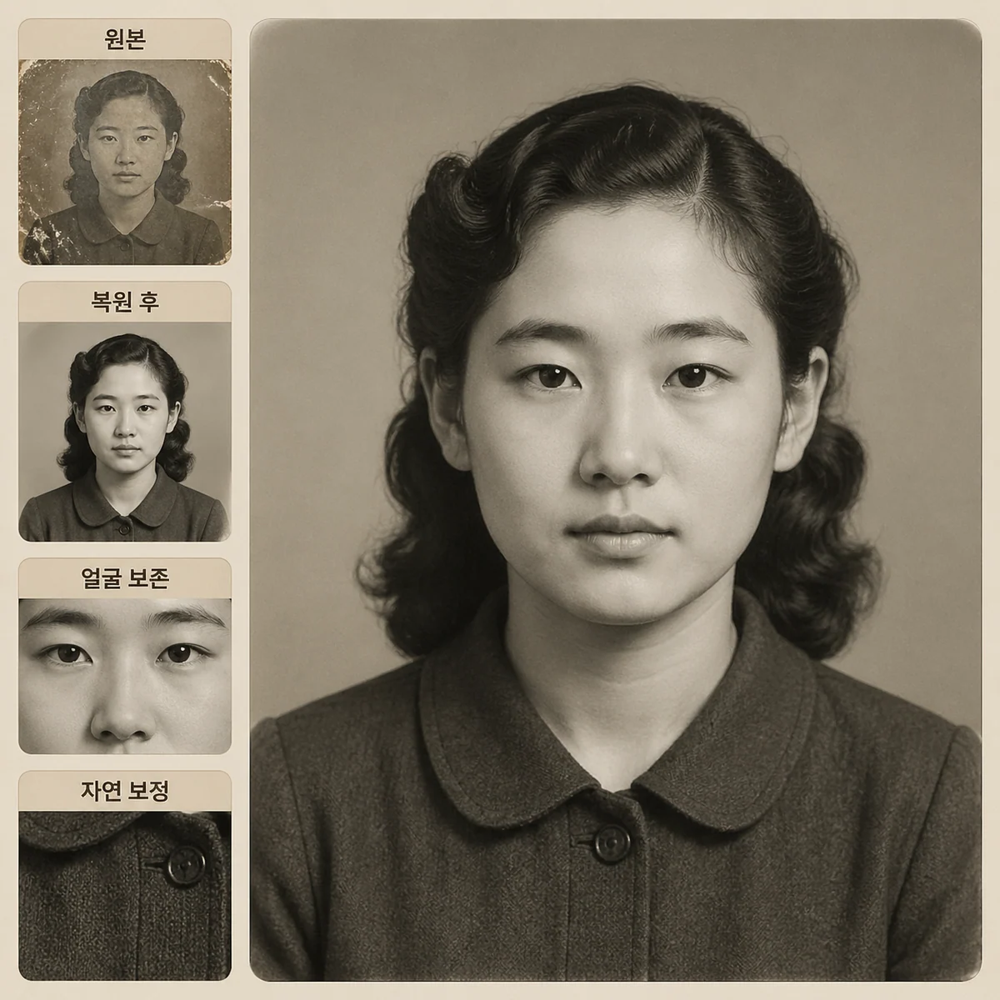


```text
请以上传的老照片作为严格参考，执行「影楼头像修复」。目标任务：Restore a formal studio or ID-style portrait。修复划痕、折痕、污渍、灰尘、模糊和褪色，提升清晰度、自然色彩和细节，同时保留人物身份、年龄、表情、姿势、服装年代感和原始构图。只重建原图明确暗示的受损区域，不要美颜过度，不要改变脸型、身材、发型或背景时代，不要加入现代物件、Logo 或虚构人物。输出应自然、可信、适合家庭相册或记忆整理。
```


### 5. 历史街景修复 (`heritage-street-scene-recovery`)


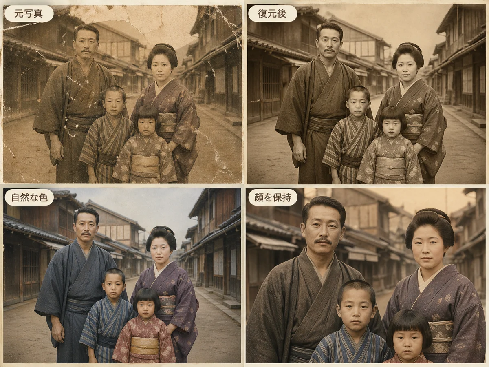


```text
请以上传的老照片作为严格参考，执行「历史街景修复」。目标任务：Restore a historical street or family scene。修复划痕、折痕、污渍、灰尘、模糊和褪色，提升清晰度、自然色彩和细节，同时保留人物身份、年龄、表情、姿势、服装年代感和原始构图。只重建原图明确暗示的受损区域，不要美颜过度，不要改变脸型、身材、发型或背景时代，不要加入现代物件、Logo 或虚构人物。输出应自然、可信、适合家庭相册或记忆整理。
```


### 6. 棕褐相册清理 (`sepia-family-album-cleanup`)


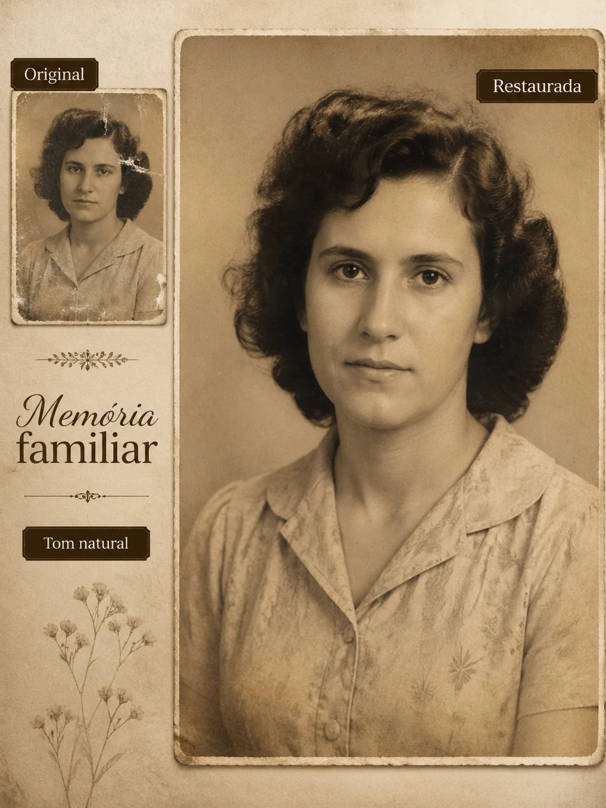


```text
请以上传的老照片作为严格参考，执行「棕褐相册清理」。目标任务：Clean up a sepia album photo without over-modernizing。修复划痕、折痕、污渍、灰尘、模糊和褪色，提升清晰度、自然色彩和细节，同时保留人物身份、年龄、表情、姿势、服装年代感和原始构图。只重建原图明确暗示的受损区域，不要美颜过度，不要改变脸型、身材、发型或背景时代，不要加入现代物件、Logo 或虚构人物。输出应自然、可信、适合家庭相册或记忆整理。
```


### 7. 纪实人像修复 (`damaged-documentary-portrait`)


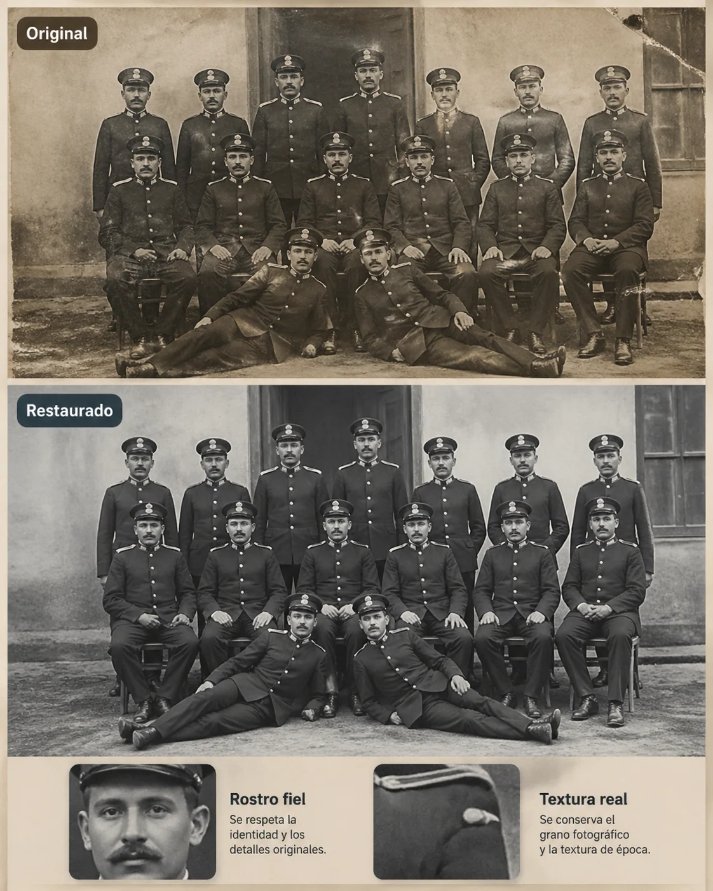


```text
请以上传的老照片作为严格参考，执行「纪实人像修复」。目标任务：Restore a documentary-style portrait with grain intact。修复划痕、折痕、污渍、灰尘、模糊和褪色，提升清晰度、自然色彩和细节，同时保留人物身份、年龄、表情、姿势、服装年代感和原始构图。只重建原图明确暗示的受损区域，不要美颜过度，不要改变脸型、身材、发型或背景时代，不要加入现代物件、Logo 或虚构人物。输出应自然、可信、适合家庭相册或记忆整理。
```


### 8. 档案群像修复 (`archival-group-photo-restoration`)


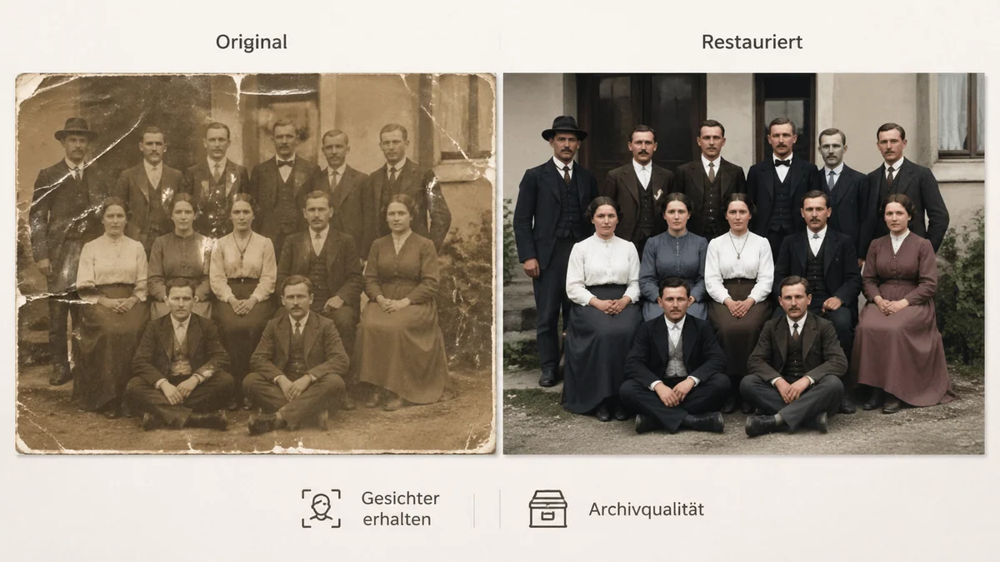


```text
请以上传的老照片作为严格参考，执行「档案群像修复」。目标任务：Restore a multi-person group photo evenly。修复划痕、折痕、污渍、灰尘、模糊和褪色，提升清晰度、自然色彩和细节，同时保留人物身份、年龄、表情、姿势、服装年代感和原始构图。只重建原图明确暗示的受损区域，不要美颜过度，不要改变脸型、身材、发型或背景时代，不要加入现代物件、Logo 或虚构人物。输出应自然、可信、适合家庭相册或记忆整理。
```


### 9. 老证件照修复 (`vintage-id-photo-restoration`)


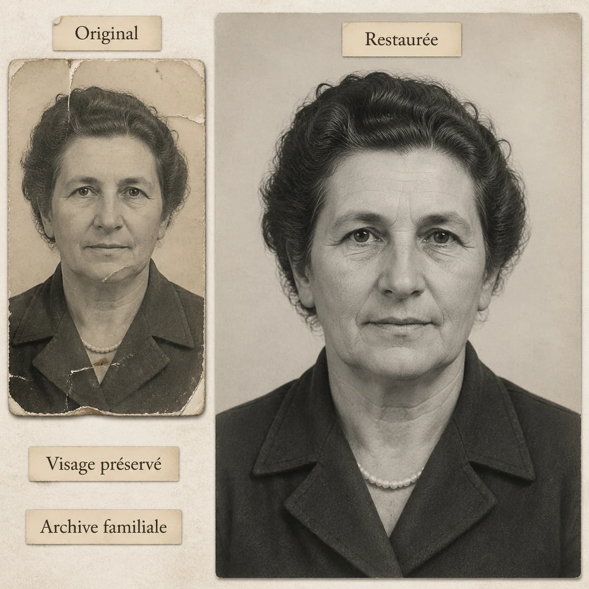


```text
请以上传的老照片作为严格参考，执行「老证件照修复」。目标任务：Restore an old ID or passport-style photo。修复划痕、折痕、污渍、灰尘、模糊和褪色，提升清晰度、自然色彩和细节，同时保留人物身份、年龄、表情、姿势、服装年代感和原始构图。只重建原图明确暗示的受损区域，不要美颜过度，不要改变脸型、身材、发型或背景时代，不要加入现代物件、Logo 或虚构人物。输出应自然、可信、适合家庭相册或记忆整理。
```


## 手相图解模板 (`palmistry-infographics`)

用手掌照片生成娱乐手相报告。


### 1. 法语手相画室 (`french-palmistry-atelier`)


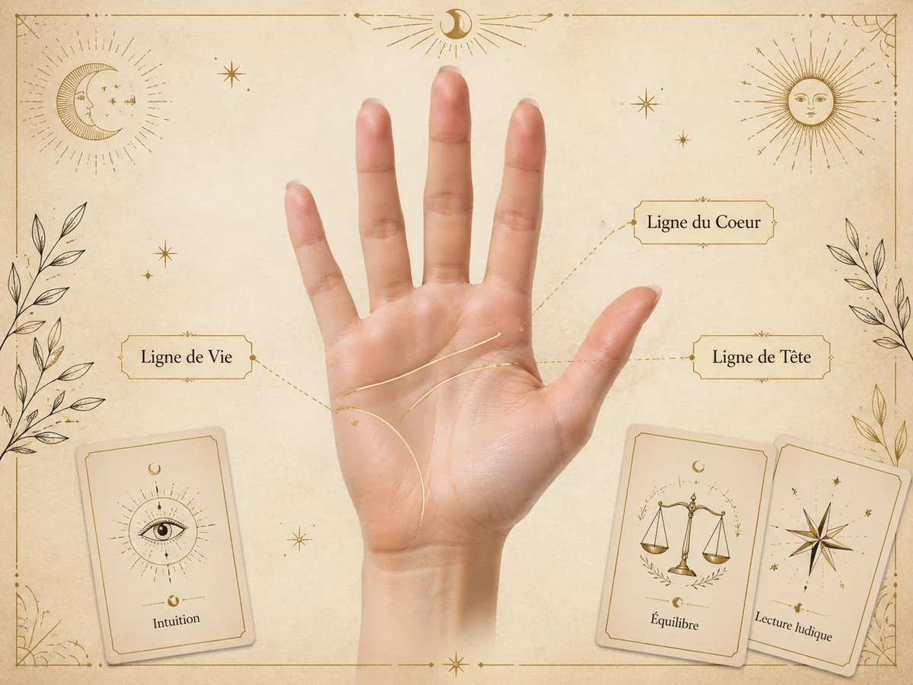


```text
根据上传的手掌照片生成“法语手相画室”视觉模板。画面重点：French boutique-style palm reading layout。请标注生命线、智慧线、感情线、事业线和财运线，并加入手型、五行象征、性格倾向、工作节奏、关系模式和自我观察提示。所有可见文字使用简体中文，保持短标签和清晰分层。整体仅用于娱乐和自我反思，不要写医疗诊断、财务承诺、确定命运或精确年份。
```


### 2. 西语神秘海报 (`spanish-mystic-palm-poster`)


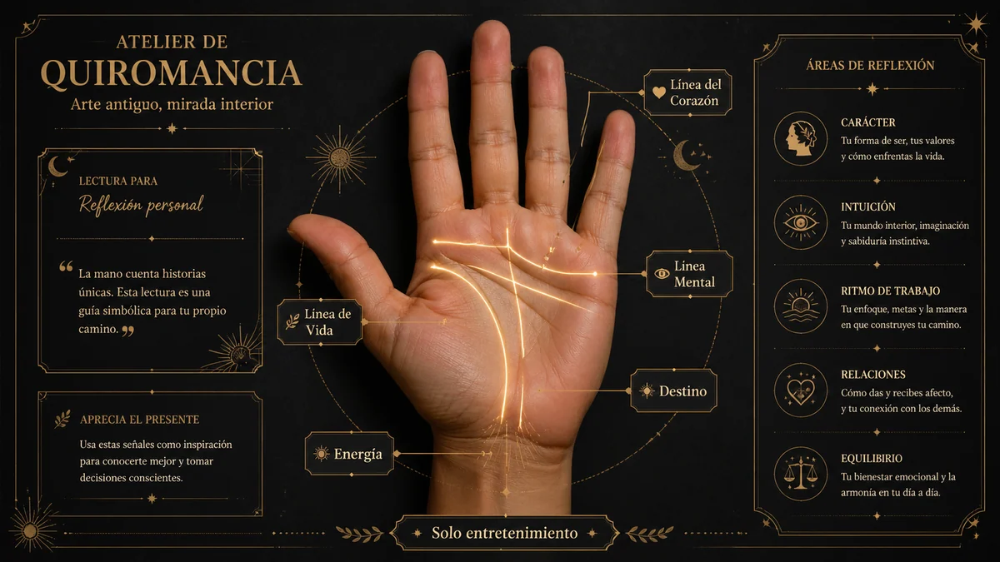


```text
根据上传的手掌照片生成“西语神秘海报”视觉模板。画面重点：Spanish mystical palmistry poster。请标注生命线、智慧线、感情线、事业线和财运线，并加入手型、五行象征、性格倾向、工作节奏、关系模式和自我观察提示。所有可见文字使用简体中文，保持短标签和清晰分层。整体仅用于娱乐和自我反思，不要写医疗诊断、财务承诺、确定命运或精确年份。
```


### 3. 葡语反思报告 (`portuguese-reflection-report`)


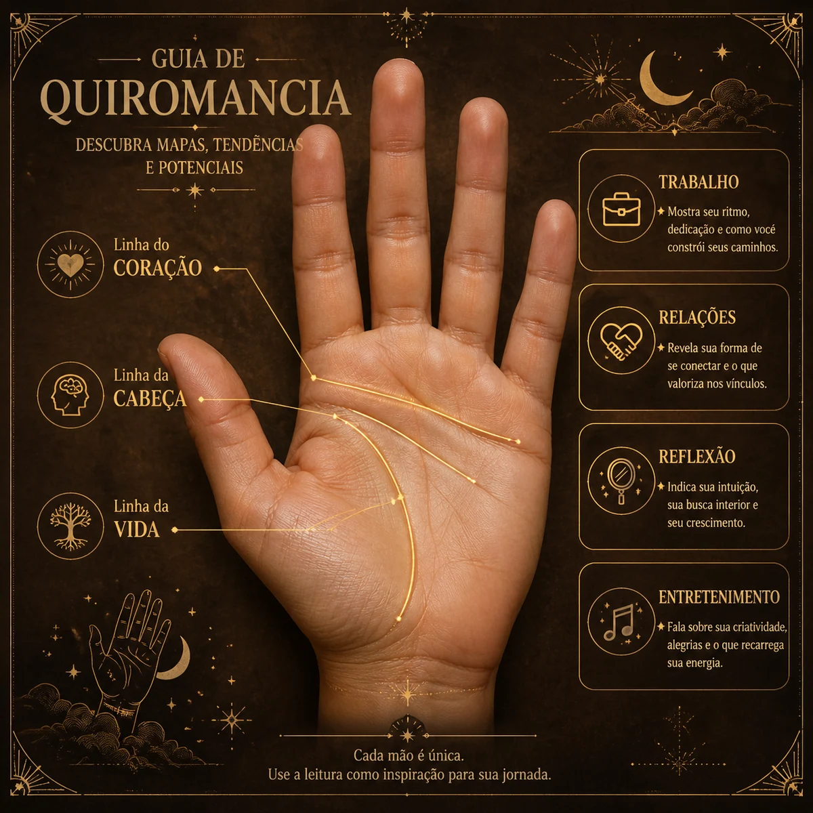


```text
根据上传的手掌照片生成“葡语反思报告”视觉模板。画面重点：Portuguese self-reflection palm report。请标注生命线、智慧线、感情线、事业线和财运线，并加入手型、五行象征、性格倾向、工作节奏、关系模式和自我观察提示。所有可见文字使用简体中文，保持短标签和清晰分层。整体仅用于娱乐和自我反思，不要写医疗诊断、财务承诺、确定命运或精确年份。
```


### 4. 日语掌纹指南 (`japanese-palm-line-guide`)


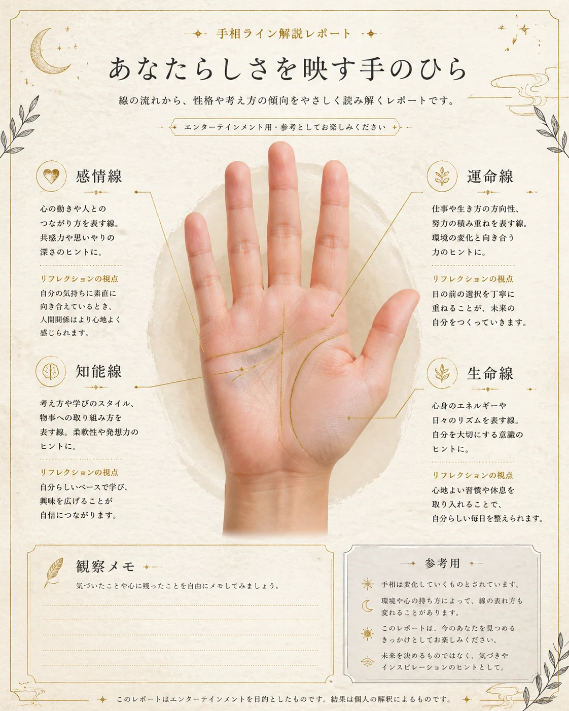


```text
根据上传的手掌照片生成“日语掌纹指南”视觉模板。画面重点：Japanese palm-line educational guide。请标注生命线、智慧线、感情线、事业线和财运线，并加入手型、五行象征、性格倾向、工作节奏、关系模式和自我观察提示。所有可见文字使用简体中文，保持短标签和清晰分层。整体仅用于娱乐和自我反思，不要写医疗诊断、财务承诺、确定命运或精确年份。
```


### 5. 韩语手相简报 (`korean-palmistry-brief`)


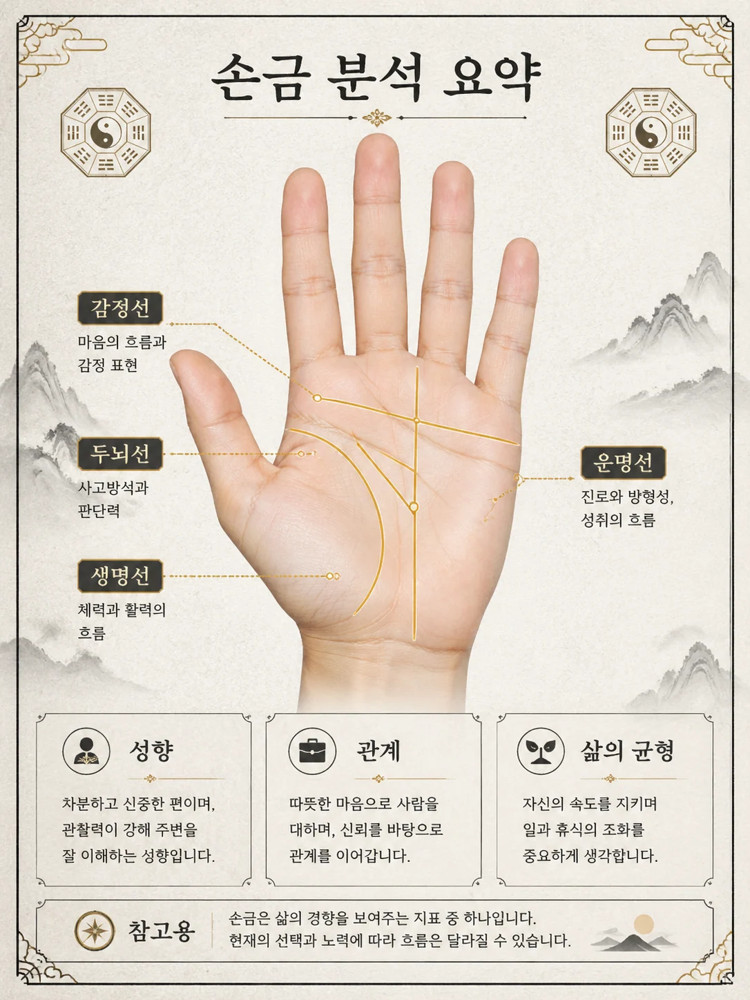


```text
根据上传的手掌照片生成“韩语手相简报”视觉模板。画面重点：Korean palm-reading summary card。请标注生命线、智慧线、感情线、事业线和财运线，并加入手型、五行象征、性格倾向、工作节奏、关系模式和自我观察提示。所有可见文字使用简体中文，保持短标签和清晰分层。整体仅用于娱乐和自我反思，不要写医疗诊断、财务承诺、确定命运或精确年份。
```


### 6. 命运线旅程 (`destiny-line-journey`)


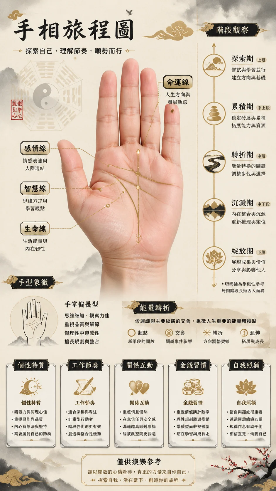


```text
根据上传的手掌照片生成“命运线旅程”视觉模板。画面重点：Traditional Chinese timeline-style palm report。请标注生命线、智慧线、感情线、事业线和财运线，并加入手型、五行象征、性格倾向、工作节奏、关系模式和自我观察提示。所有可见文字使用简体中文，保持短标签和清晰分层。整体仅用于娱乐和自我反思，不要写医疗诊断、财务承诺、确定命运或精确年份。
```


### 7. 五行手型图 (`five-elements-hand-map`)


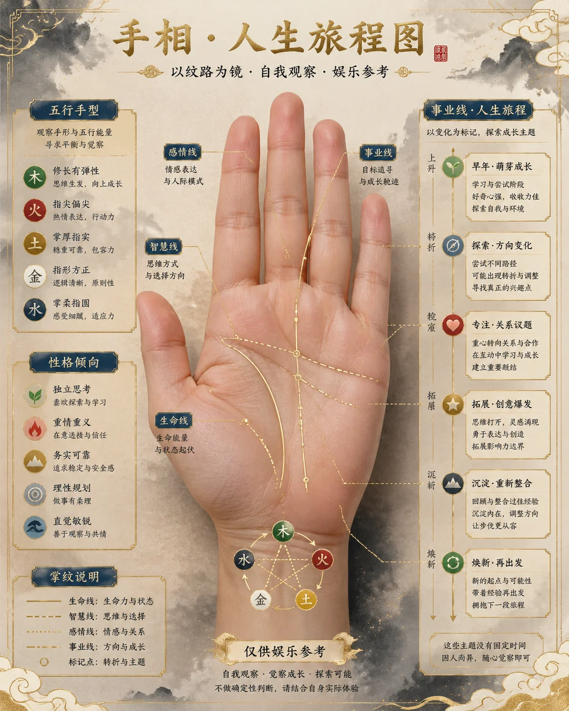


```text
根据上传的手掌照片生成“五行手型图”视觉模板。画面重点：Simplified Chinese five-element hand trait map。请标注生命线、智慧线、感情线、事业线和财运线，并加入手型、五行象征、性格倾向、工作节奏、关系模式和自我观察提示。所有可见文字使用简体中文，保持短标签和清晰分层。整体仅用于娱乐和自我反思，不要写医疗诊断、财务承诺、确定命运或精确年份。
```


### 8. 社媒手相卡片 (`social-palm-reading-card`)


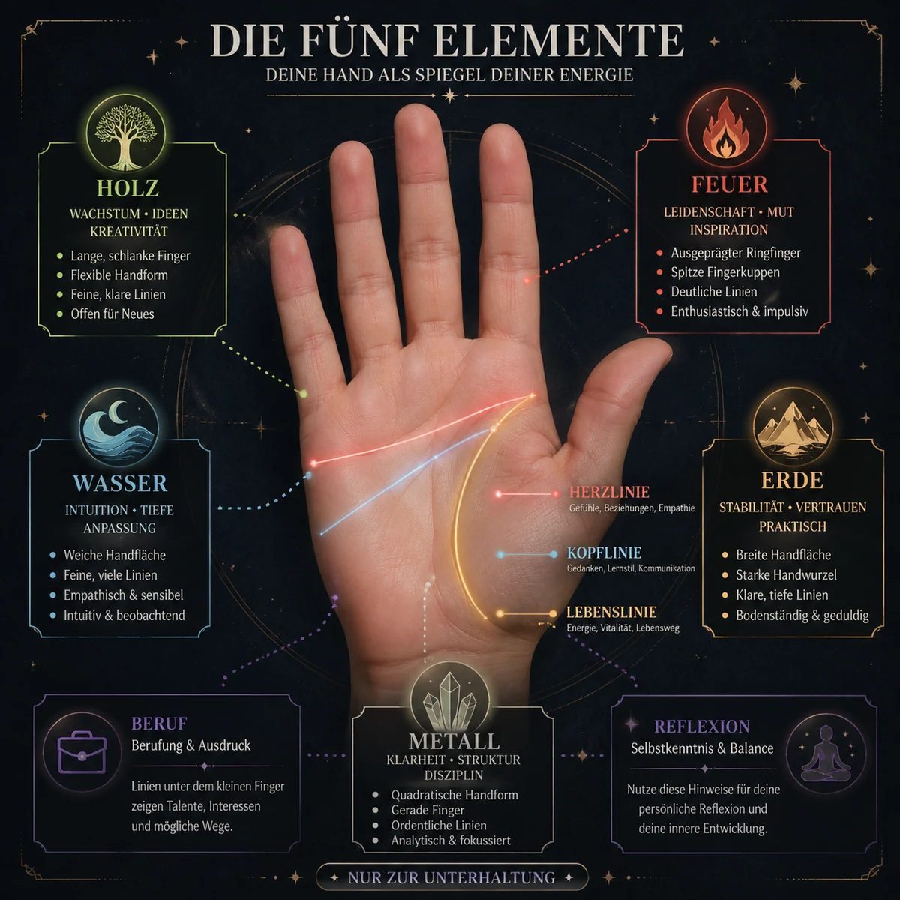


```text
根据上传的手掌照片生成“社媒手相卡片”视觉模板。画面重点：Shareable English social post。请标注生命线、智慧线、感情线、事业线和财运线，并加入手型、五行象征、性格倾向、工作节奏、关系模式和自我观察提示。所有可见文字使用简体中文，保持短标签和清晰分层。整体仅用于娱乐和自我反思，不要写医疗诊断、财务承诺、确定命运或精确年份。
```


### 9. 中式手相报告 (`chinese-palmistry-report`)


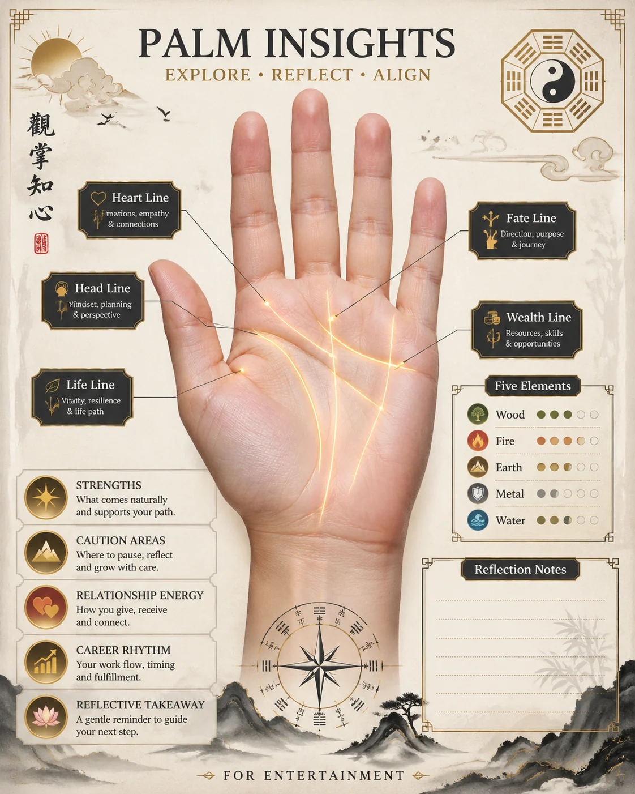


```text
根据上传的手掌照片生成“中式手相报告”视觉模板。画面重点：Traditional Chinese palm-reading infographic。请标注生命线、智慧线、感情线、事业线和财运线，并加入手型、五行象征、性格倾向、工作节奏、关系模式和自我观察提示。所有可见文字使用简体中文，保持短标签和清晰分层。整体仅用于娱乐和自我反思，不要写医疗诊断、财务承诺、确定命运或精确年份。
```


## 色彩分析模板 (`personal-color-analysis`)

用 GPT Image 2 生成个人色盘报告。


### 1. 法语胶囊色盘指南 (`french-capsule-palette-guide`)


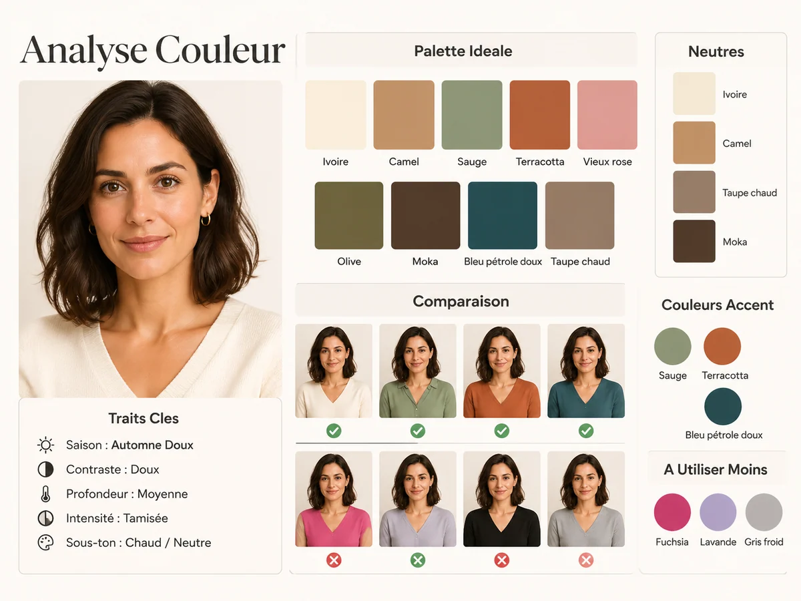


```text
生成一张4:3的「法语胶囊色盘指南」。根据参考人像或合成模特制作个人色彩分析图，保持自然肤色和真实五官。所有可见文字使用简体中文，保留短标题、色票名称、对比标签、勾叉标记和一句简短建议。画面包含人像、关键特征、推荐色盘、上身颜色对比、最佳中性色和少用颜色。风格干净、现代、可读，避免商标、医学判断、颜值评分、乱码文字和变形人脸。
```


### 2. 德语对比冷暖板 (`german-contrast-undertone-board`)


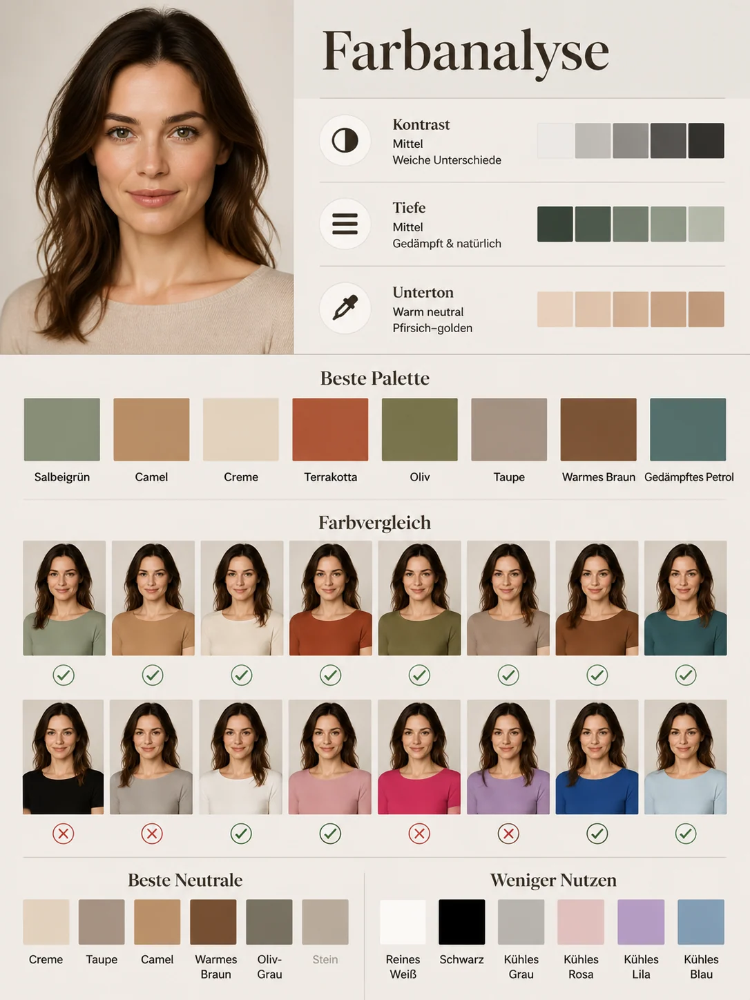


```text
生成一张3:4的「德语对比冷暖板」。根据参考人像或合成模特制作个人色彩分析图，保持自然肤色和真实五官。所有可见文字使用简体中文，保留短标题、色票名称、对比标签、勾叉标记和一句简短建议。画面包含人像、关键特征、推荐色盘、上身颜色对比、最佳中性色和少用颜色。风格干净、现代、可读，避免商标、医学判断、颜值评分、乱码文字和变形人脸。
```


### 3. 西语衣橱色彩图 (`spanish-wardrobe-color-map`)


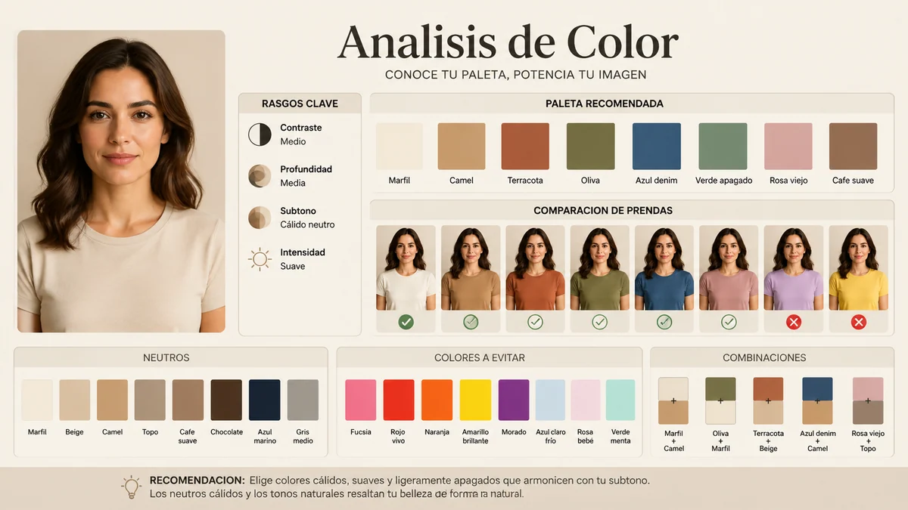


```text
生成一张16:9的「西语衣橱色彩图」。根据参考人像或合成模特制作个人色彩分析图，保持自然肤色和真实五官。所有可见文字使用简体中文，保留短标题、色票名称、对比标签、勾叉标记和一句简短建议。画面包含人像、关键特征、推荐色盘、上身颜色对比、最佳中性色和少用颜色。风格干净、现代、可读，避免商标、医学判断、颜值评分、乱码文字和变形人脸。
```


### 4. 葡语暖调竖版图 (`portuguese-warm-palette-story`)


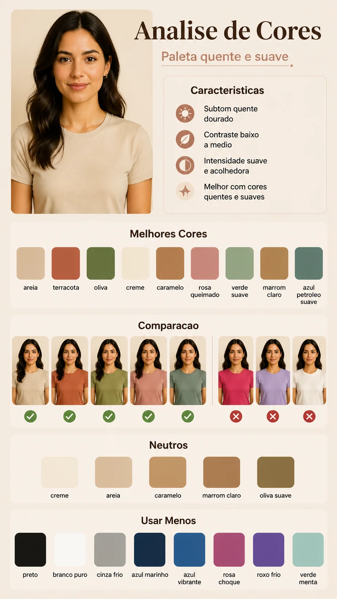


```text
生成一张9:16的「葡语暖调竖版图」。根据参考人像或合成模特制作个人色彩分析图，保持自然肤色和真实五官。所有可见文字使用简体中文，保留短标题、色票名称、对比标签、勾叉标记和一句简短建议。画面包含人像、关键特征、推荐色盘、上身颜色对比、最佳中性色和少用颜色。风格干净、现代、可读，避免商标、医学判断、颜值评分、乱码文字和变形人脸。
```


### 5. 日式色彩诊断卡 (`japanese-personal-color-card`)


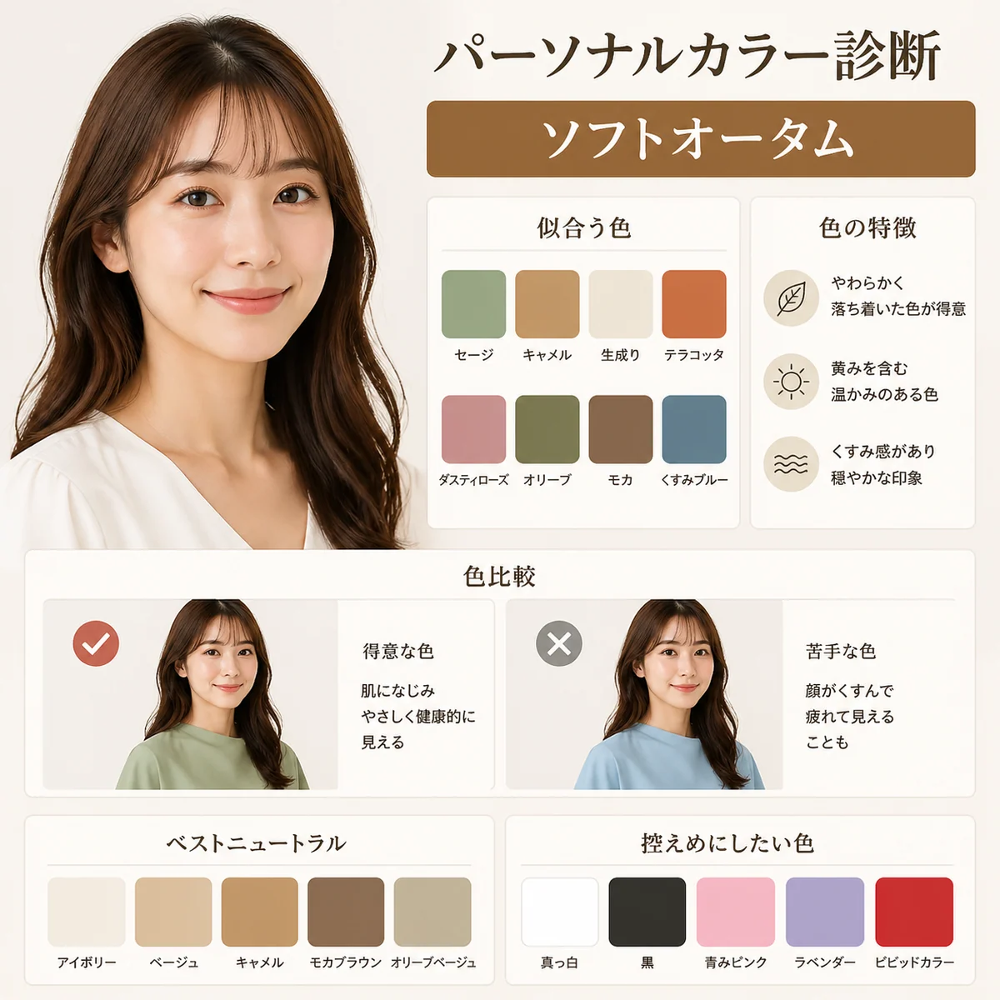


```text
生成一张1:1的「日式色彩诊断卡」。根据参考人像或合成模特制作个人色彩分析图，保持自然肤色和真实五官。所有可见文字使用简体中文，保留短标题、色票名称、对比标签、勾叉标记和一句简短建议。画面包含人像、关键特征、推荐色盘、上身颜色对比、最佳中性色和少用颜色。风格干净、现代、可读，避免商标、医学判断、颜值评分、乱码文字和变形人脸。
```


### 6. 韩式冷冬分析 (`korean-cool-winter-analysis`)


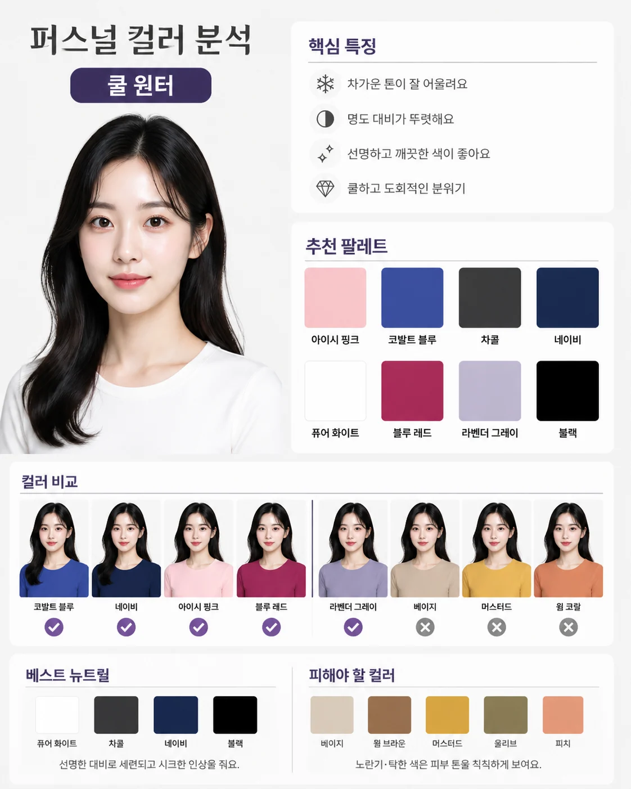


```text
生成一张4:5的「韩式冷冬分析」。根据参考人像或合成模特制作个人色彩分析图，保持自然肤色和真实五官。所有可见文字使用简体中文，保留短标题、色票名称、对比标签、勾叉标记和一句简短建议。画面包含人像、关键特征、推荐色盘、上身颜色对比、最佳中性色和少用颜色。风格干净、现代、可读，避免商标、医学判断、颜值评分、乱码文字和变形人脸。
```


### 7. 都市中性色板 (`urban-neutral-board-zh-tw`)


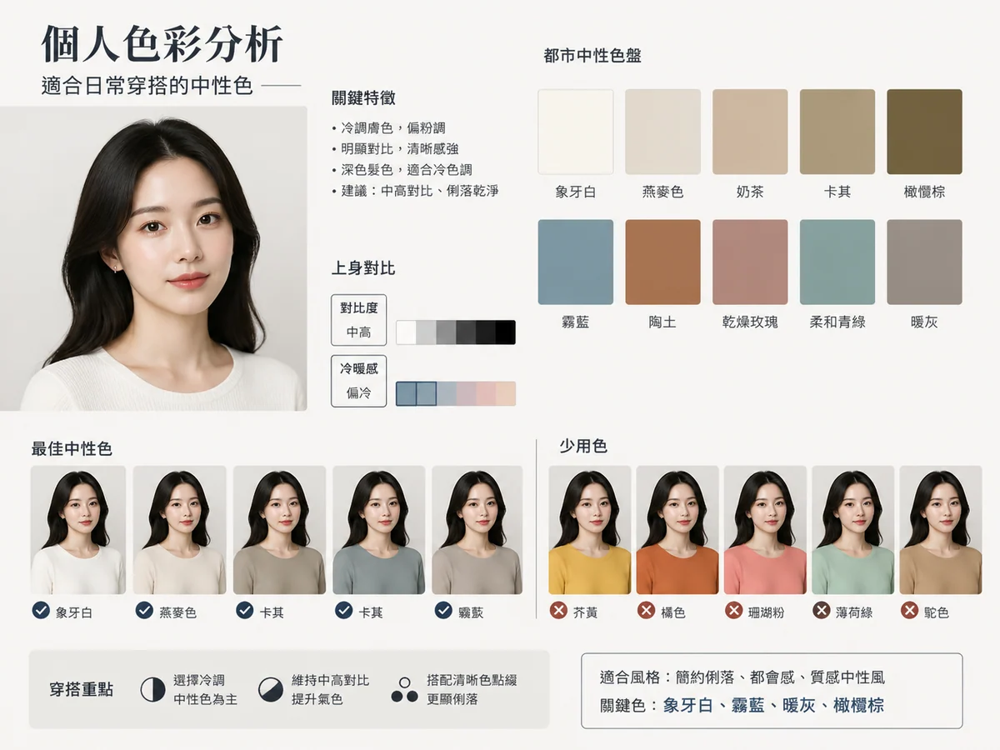


```text
生成一张4:3的「都市中性色板」。根据参考人像或合成模特制作个人色彩分析图，保持自然肤色和真实五官。所有可见文字使用简体中文，保留短标题、色票名称、对比标签、勾叉标记和一句简短建议。画面包含人像、关键特征、推荐色盘、上身颜色对比、最佳中性色和少用颜色。风格干净、现代、可读，避免商标、医学判断、颜值评分、乱码文字和变形人脸。
```


### 8. 春日色盘报告 (`spring-palette-report-zh`)


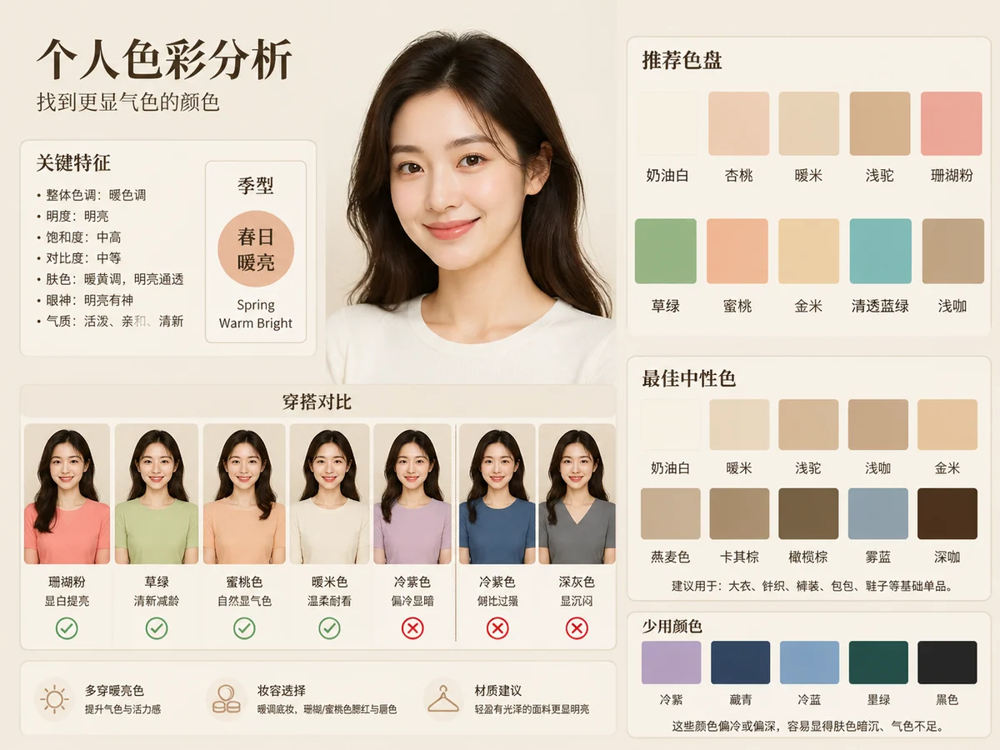


```text
生成一张4:3的「春日色盘报告」。根据参考人像或合成模特制作个人色彩分析图，保持自然肤色和真实五官。所有可见文字使用简体中文，保留短标题、色票名称、对比标签、勾叉标记和一句简短建议。画面包含人像、关键特征、推荐色盘、上身颜色对比、最佳中性色和少用颜色。风格干净、现代、可读，避免商标、医学判断、颜值评分、乱码文字和变形人脸。
```


### 9. 暖秋色彩海报 (`soft-autumn-color-analysis`)


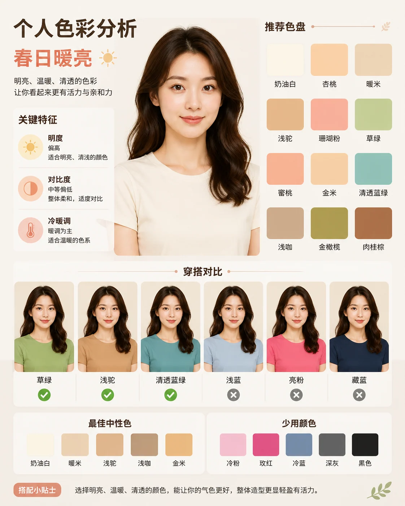


```text
生成一张4:5的「暖秋色彩海报」。根据参考人像或合成模特制作个人色彩分析图，保持自然肤色和真实五官。所有可见文字使用简体中文，保留短标题、色票名称、对比标签、勾叉标记和一句简短建议。画面包含人像、关键特征、推荐色盘、上身颜色对比、最佳中性色和少用颜色。风格干净、现代、可读，避免商标、医学判断、颜值评分、乱码文字和变形人脸。
```


## 透视字海报 (`perspective-type-posters`)

用 GPT Image 2 生成斜面字体海报。


### 1. 斜面字体 9 (`french-editorial-axis`)


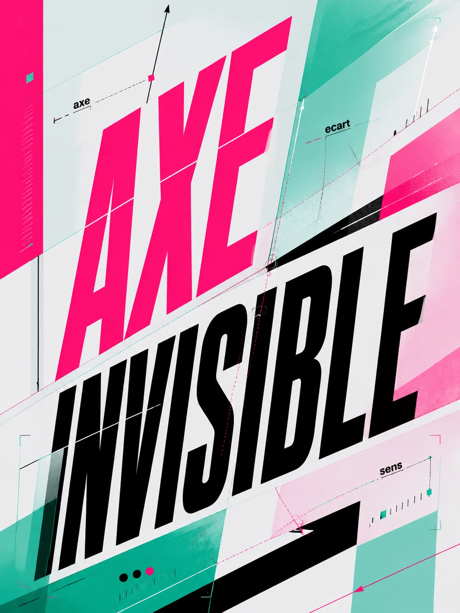


```text
创建一张 3:4 的斜向透视平面字体海报。模板用途：Create a French editorial type poster with angled annotation systems。用户会替换核心文字、语言、情绪、配色和禁用元素。所有可见文字必须使用目标语言，并保持短、清晰、可读。画面以文字为第一视觉，使用倾斜二维平面、透视压缩、错位切片、方向箭头、半透明几何面、模块化色块和少量索引标签。整体应现代、清亮、锐利、高对比。不要做真实 3D 挤出字、金属字、玻璃字、复古纸纹、写实摄影、假 logo、长段落或不可读装饰字。
```


### 2. 斜面字体 8 (`german-order-break`)


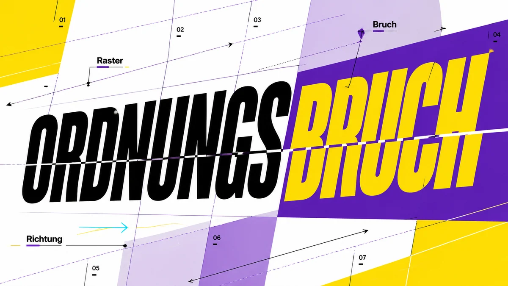


```text
创建一张 16:9 的斜向透视平面字体海报。模板用途：Create a German abstract concept poster about order and rupture。用户会替换核心文字、语言、情绪、配色和禁用元素。所有可见文字必须使用目标语言，并保持短、清晰、可读。画面以文字为第一视觉，使用倾斜二维平面、透视压缩、错位切片、方向箭头、半透明几何面、模块化色块和少量索引标签。整体应现代、清亮、锐利、高对比。不要做真实 3D 挤出字、金属字、玻璃字、复古纸纹、写实摄影、假 logo、长段落或不可读装饰字。
```


### 3. 斜面字体 7 (`spanish-relationship-tension`)


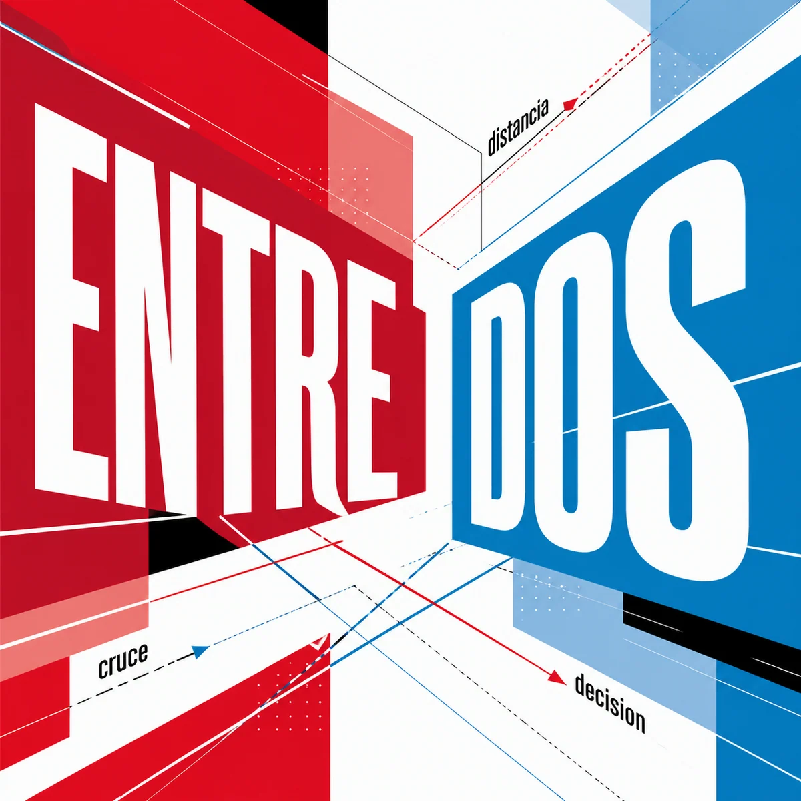


```text
创建一张 1:1 的斜向透视平面字体海报。模板用途：Create a Spanish relationship-theme poster with crossing planes。用户会替换核心文字、语言、情绪、配色和禁用元素。所有可见文字必须使用目标语言，并保持短、清晰、可读。画面以文字为第一视觉，使用倾斜二维平面、透视压缩、错位切片、方向箭头、半透明几何面、模块化色块和少量索引标签。整体应现代、清亮、锐利、高对比。不要做真实 3D 挤出字、金属字、玻璃字、复古纸纹、写实摄影、假 logo、长段落或不可读装饰字。
```


### 4. 斜面字体 6 (`portuguese-neon-system`)


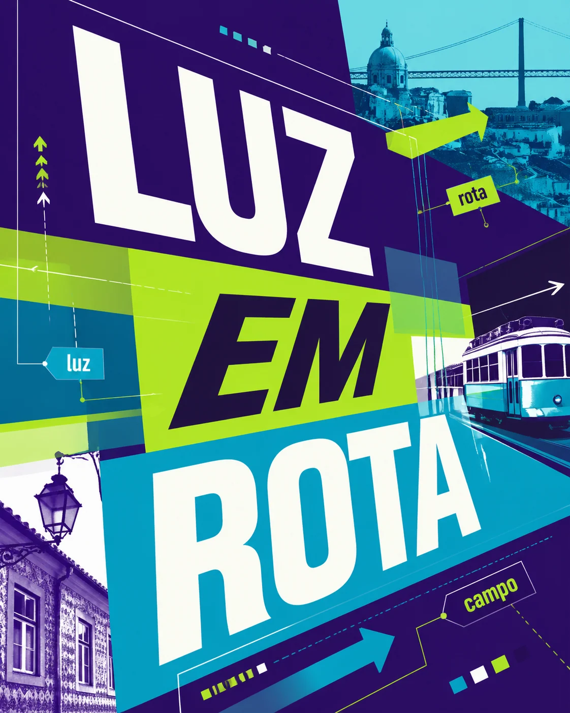


```text
创建一张 4:5 的斜向透视平面字体海报。模板用途：Create a Portuguese high-contrast type system poster。用户会替换核心文字、语言、情绪、配色和禁用元素。所有可见文字必须使用目标语言，并保持短、清晰、可读。画面以文字为第一视觉，使用倾斜二维平面、透视压缩、错位切片、方向箭头、半透明几何面、模块化色块和少量索引标签。整体应现代、清亮、锐利、高对比。不要做真实 3D 挤出字、金属字、玻璃字、复古纸纹、写实摄影、假 logo、长段落或不可读装饰字。
```


### 5. 斜面字体 5 (`japanese-plane-cut`)


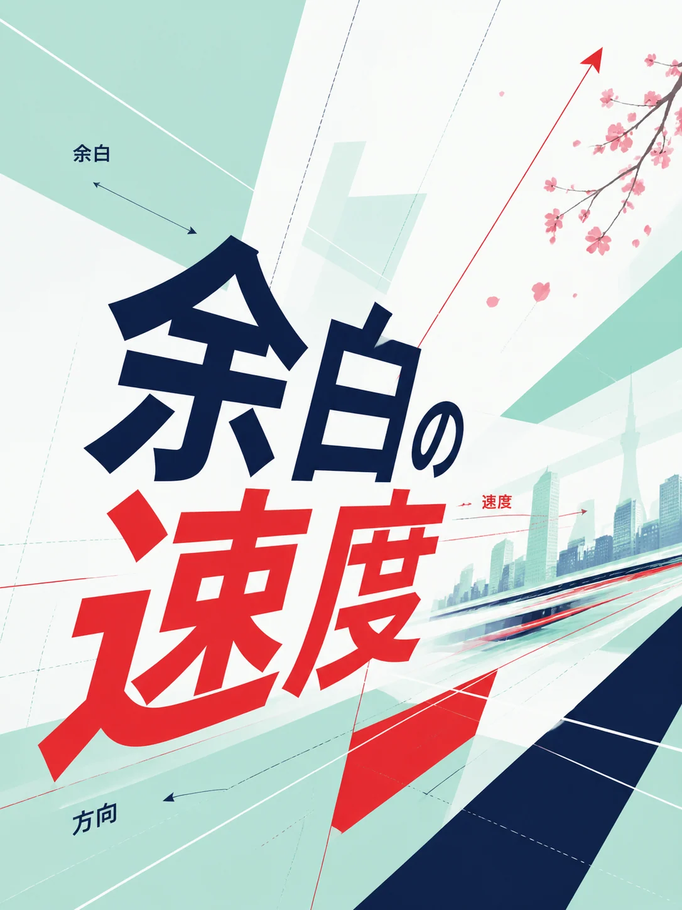


```text
创建一张 3:4 的斜向透视平面字体海报。模板用途：Create a Japanese short phrase poster with tilted planes。用户会替换核心文字、语言、情绪、配色和禁用元素。所有可见文字必须使用目标语言，并保持短、清晰、可读。画面以文字为第一视觉，使用倾斜二维平面、透视压缩、错位切片、方向箭头、半透明几何面、模块化色块和少量索引标签。整体应现代、清亮、锐利、高对比。不要做真实 3D 挤出字、金属字、玻璃字、复古纸纹、写实摄影、假 logo、长段落或不可读装饰字。
```


### 6. 斜面字体 4 (`korean-angled-emotion`)


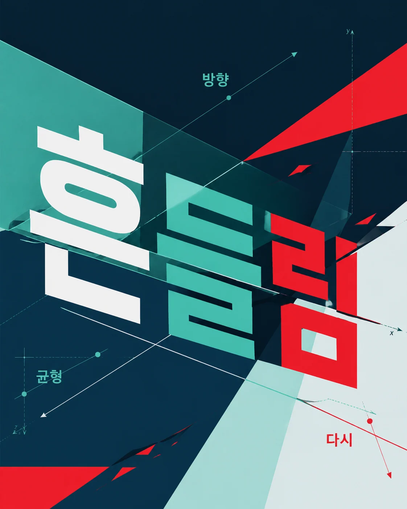


```text
创建一张 4:5 的斜向透视平面字体海报。模板用途：Create a Korean emotion-word poster with vector direction。用户会替换核心文字、语言、情绪、配色和禁用元素。所有可见文字必须使用目标语言，并保持短、清晰、可读。画面以文字为第一视觉，使用倾斜二维平面、透视压缩、错位切片、方向箭头、半透明几何面、模块化色块和少量索引标签。整体应现代、清亮、锐利、高对比。不要做真实 3D 挤出字、金属字、玻璃字、复古纸纹、写实摄影、假 logo、长段落或不可读装饰字。
```


### 7. 斜面字体 3 (`traditional-motion-phrase`)


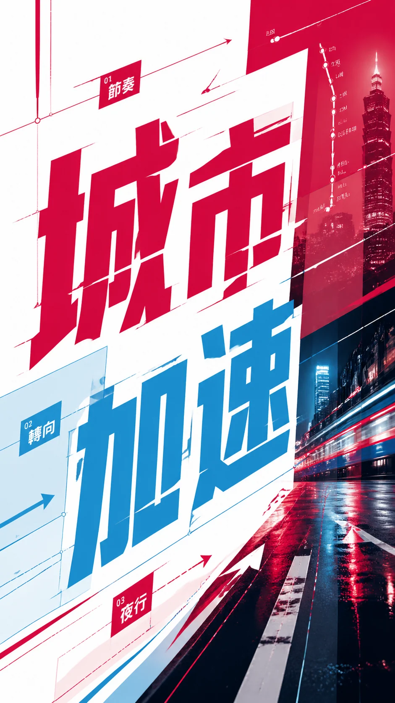


```text
创建一张 9:16 的斜向透视平面字体海报。模板用途：Create a traditional Chinese motion phrase poster。用户会替换核心文字、语言、情绪、配色和禁用元素。所有可见文字必须使用目标语言，并保持短、清晰、可读。画面以文字为第一视觉，使用倾斜二维平面、透视压缩、错位切片、方向箭头、半透明几何面、模块化色块和少量索引标签。整体应现代、清亮、锐利、高对比。不要做真实 3D 挤出字、金属字、玻璃字、复古纸纹、写实摄影、假 logo、长段落或不可读装饰字。
```


### 8. 斜面字体 2 (`chinese-vector-slogan`)


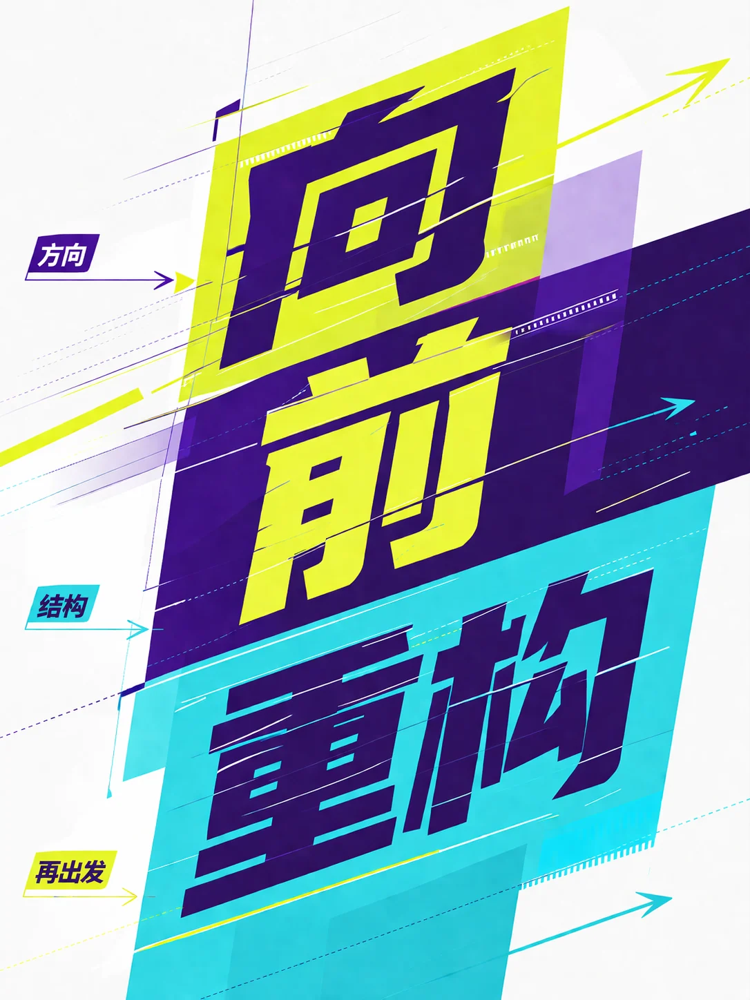


```text
创建一张 3:4 的斜向透视平面字体海报。模板用途：Create a simplified Chinese slogan poster with sliced planar type。用户会替换核心文字、语言、情绪、配色和禁用元素。所有可见文字必须使用目标语言，并保持短、清晰、可读。画面以文字为第一视觉，使用倾斜二维平面、透视压缩、错位切片、方向箭头、半透明几何面、模块化色块和少量索引标签。整体应现代、清亮、锐利、高对比。不要做真实 3D 挤出字、金属字、玻璃字、复古纸纹、写实摄影、假 logo、长段落或不可读装饰字。
```


### 9. 斜面字体 1 (`oblique-conflict-title`)


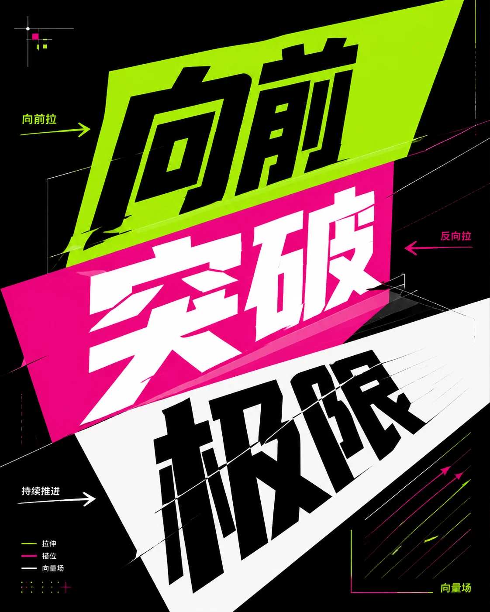


```text
创建一张 4:5 的斜向透视平面字体海报。模板用途：Turn an emotional word into a tilted tension poster。用户会替换核心文字、语言、情绪、配色和禁用元素。所有可见文字必须使用目标语言，并保持短、清晰、可读。画面以文字为第一视觉，使用倾斜二维平面、透视压缩、错位切片、方向箭头、半透明几何面、模块化色块和少量索引标签。整体应现代、清亮、锐利、高对比。不要做真实 3D 挤出字、金属字、玻璃字、复古纸纹、写实摄影、假 logo、长段落或不可读装饰字。
```


## 诗歌海报模板 (`poetry-analysis-posters`)

用 GPT Image 2 提示词生成诗歌解析海报。


### 1. 经典诗歌解析海报 (`classic-poem-analysis-poster`)


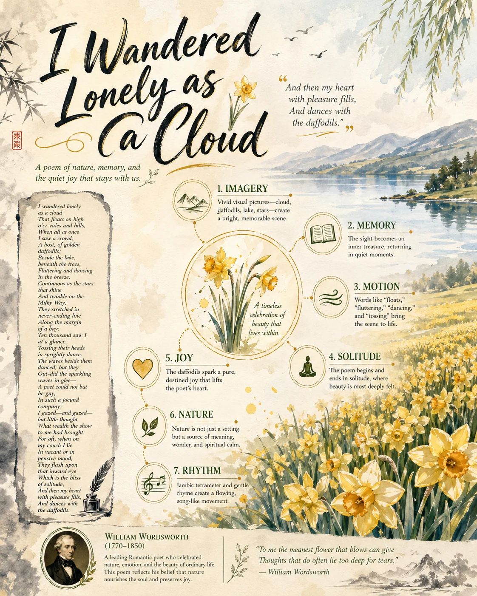


```text
生成一张可编辑的文学解析海报。所有可见文字使用简体中文。主题变量为[诗题/诗句/作者/意象]，并根据[情绪方向]、[知识点数量]和[海报比例]调整画面。 模板方向 / Template direction: 经典诗歌解析海报. 顶部使用有表现力的手写标题，下面安排短注释、象征图形和 5 到 10 个知识点，涵盖背景、意象、情绪、结构和解读。层次丰富但不要拥挤，适合 GPT Image 2 生成。
```


### 2. 水墨古诗解析海报 (`chinese-poem-ink-poster`)


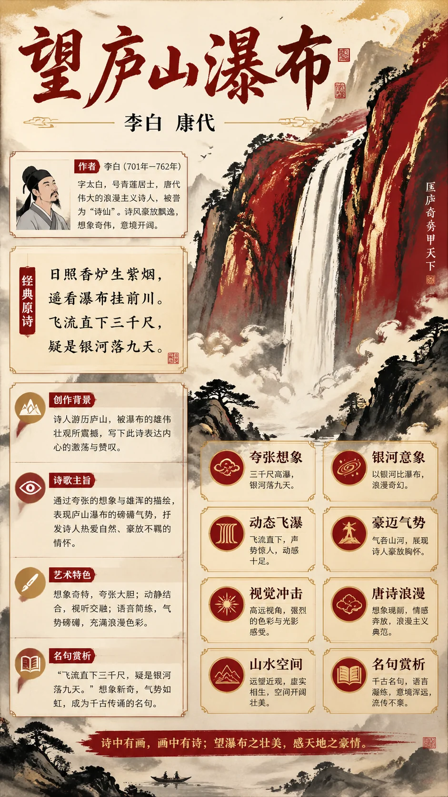


```text
生成一张可编辑的文学解析海报。所有可见文字使用简体中文。主题变量为[诗题/诗句/作者/意象]，并根据[情绪方向]、[知识点数量]和[海报比例]调整画面。 模板方向 / Template direction: 水墨古诗解析海报. 顶部使用有表现力的手写标题，下面安排短注释、象征图形和 5 到 10 个知识点，涵盖背景、意象、情绪、结构和解读。层次丰富但不要拥挤，适合 GPT Image 2 生成。
```


### 3. 繁体诗词学习海报 (`traditional-poetry-study-poster`)


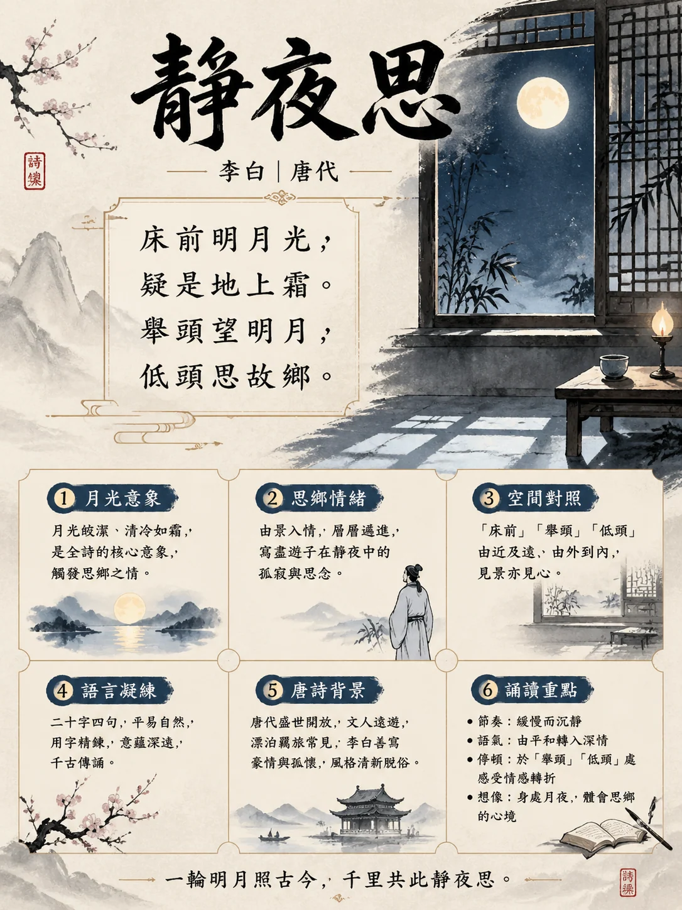


```text
生成一张可编辑的文学解析海报。所有可见文字使用简体中文。主题变量为[诗题/诗句/作者/意象]，并根据[情绪方向]、[知识点数量]和[海报比例]调整画面。 模板方向 / Template direction: 繁体诗词学习海报. 顶部使用有表现力的手写标题，下面安排短注释、象征图形和 5 到 10 个知识点，涵盖背景、意象、情绪、结构和解读。层次丰富但不要拥挤，适合 GPT Image 2 生成。
```


### 4. 韩语诗歌学习海报 (`korean-poem-study-poster`)


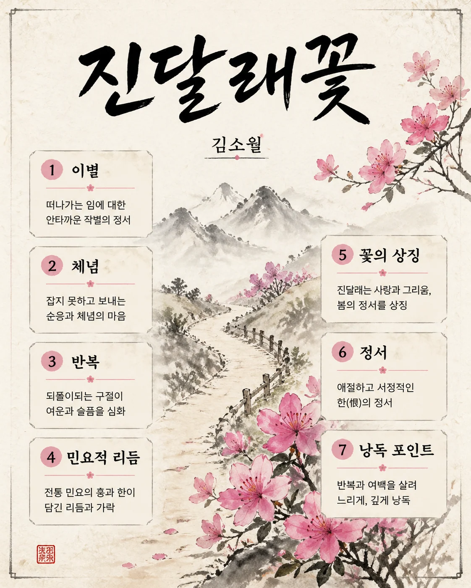


```text
生成一张可编辑的文学解析海报。所有可见文字使用简体中文。主题变量为[诗题/诗句/作者/意象]，并根据[情绪方向]、[知识点数量]和[海报比例]调整画面。 模板方向 / Template direction: 韩语诗歌学习海报. 顶部使用有表现力的手写标题，下面安排短注释、象征图形和 5 到 10 个知识点，涵盖背景、意象、情绪、结构和解读。层次丰富但不要拥挤，适合 GPT Image 2 生成。
```


### 5. 日语俳句解析海报 (`japanese-haiku-analysis-poster`)


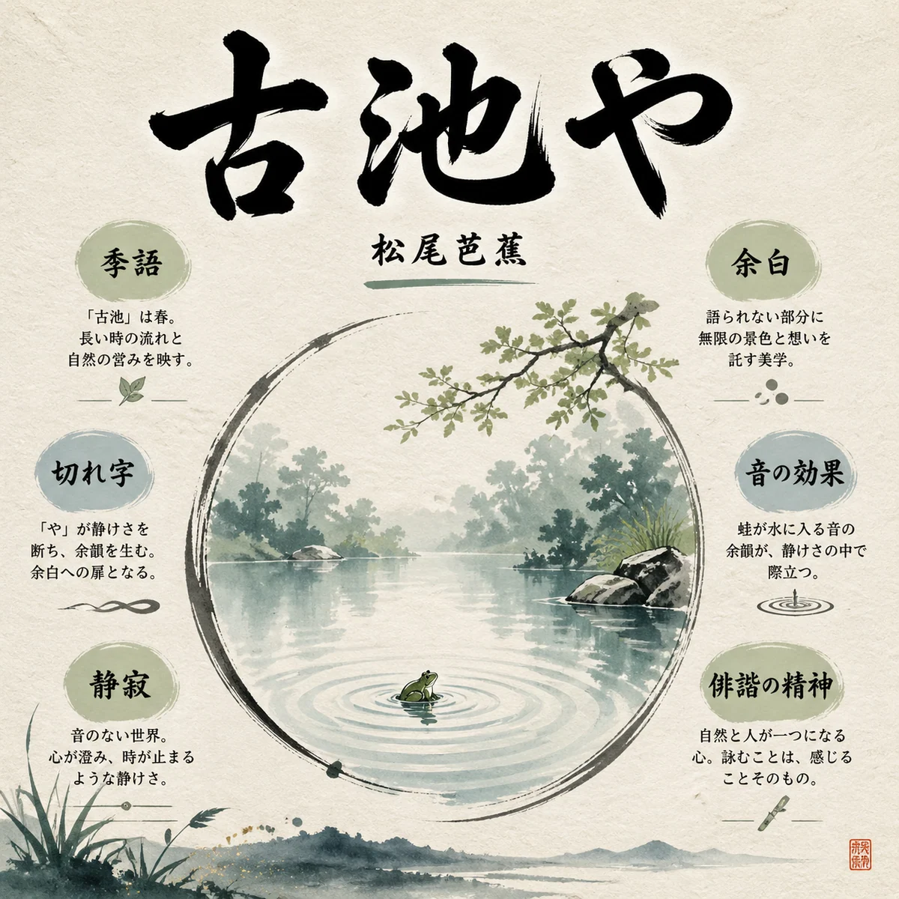


```text
生成一张可编辑的文学解析海报。所有可见文字使用简体中文。主题变量为[诗题/诗句/作者/意象]，并根据[情绪方向]、[知识点数量]和[海报比例]调整画面。 模板方向 / Template direction: 日语俳句解析海报. 顶部使用有表现力的手写标题，下面安排短注释、象征图形和 5 到 10 个知识点，涵盖背景、意象、情绪、结构和解读。层次丰富但不要拥挤，适合 GPT Image 2 生成。
```


### 6. 葡语十四行诗海报 (`portuguese-sonnet-poster`)


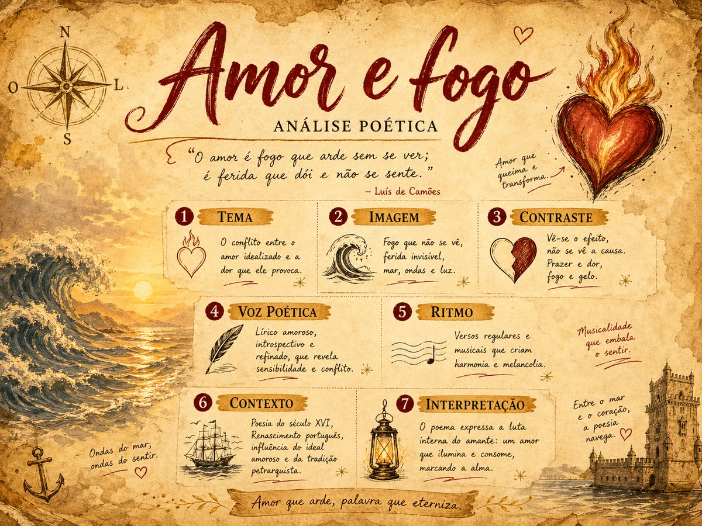


```text
生成一张可编辑的文学解析海报。所有可见文字使用简体中文。主题变量为[诗题/诗句/作者/意象]，并根据[情绪方向]、[知识点数量]和[海报比例]调整画面。 模板方向 / Template direction: 葡语十四行诗海报. 顶部使用有表现力的手写标题，下面安排短注释、象征图形和 5 到 10 个知识点，涵盖背景、意象、情绪、结构和解读。层次丰富但不要拥挤，适合 GPT Image 2 生成。
```


### 7. 西语诗歌课堂海报 (`spanish-poetry-classroom-poster`)


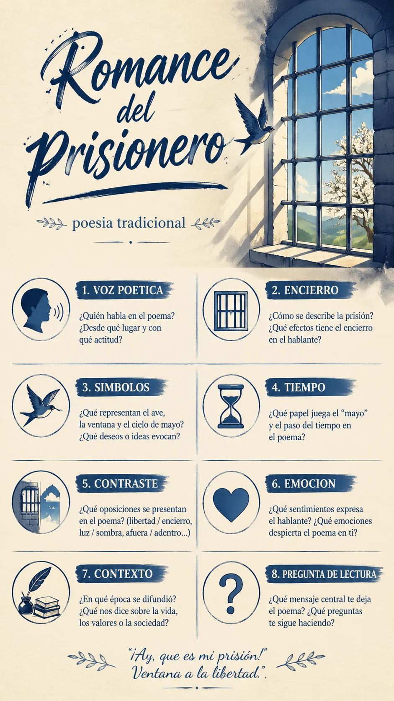


```text
生成一张可编辑的文学解析海报。所有可见文字使用简体中文。主题变量为[诗题/诗句/作者/意象]，并根据[情绪方向]、[知识点数量]和[海报比例]调整画面。 模板方向 / Template direction: 西语诗歌课堂海报. 顶部使用有表现力的手写标题，下面安排短注释、象征图形和 5 到 10 个知识点，涵盖背景、意象、情绪、结构和解读。层次丰富但不要拥挤，适合 GPT Image 2 生成。
```


### 8. 德语叙事诗解析海报 (`german-ballad-analysis-poster`)


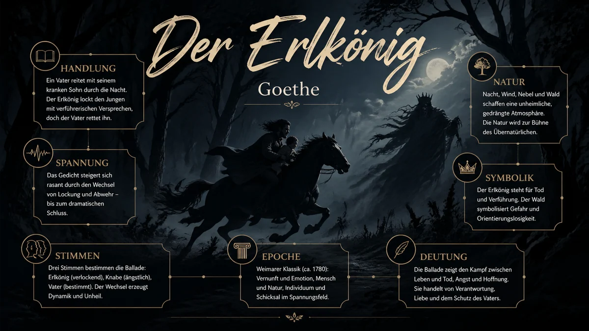


```text
生成一张可编辑的文学解析海报。所有可见文字使用简体中文。主题变量为[诗题/诗句/作者/意象]，并根据[情绪方向]、[知识点数量]和[海报比例]调整画面。 模板方向 / Template direction: 德语叙事诗解析海报. 顶部使用有表现力的手写标题，下面安排短注释、象征图形和 5 到 10 个知识点，涵盖背景、意象、情绪、结构和解读。层次丰富但不要拥挤，适合 GPT Image 2 生成。
```


### 9. 法语象征诗海报 (`french-symbolist-poem-poster`)


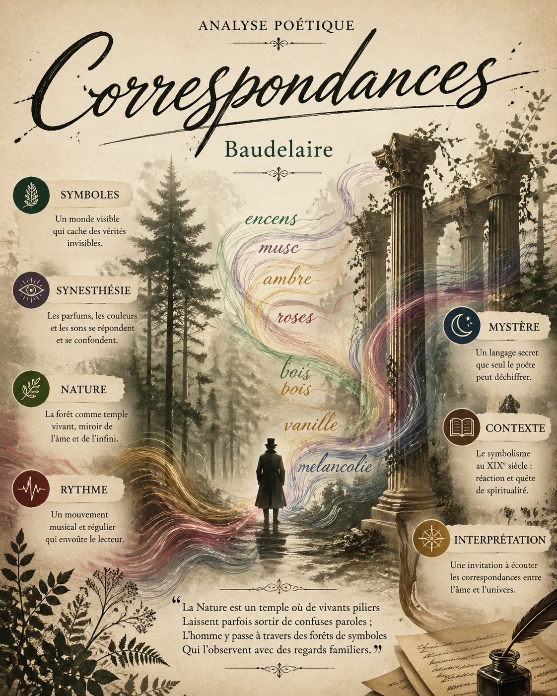


```text
生成一张可编辑的文学解析海报。所有可见文字使用简体中文。主题变量为[诗题/诗句/作者/意象]，并根据[情绪方向]、[知识点数量]和[海报比例]调整画面。 模板方向 / Template direction: 法语象征诗海报. 顶部使用有表现力的手写标题，下面安排短注释、象征图形和 5 到 10 个知识点，涵盖背景、意象、情绪、结构和解读。层次丰富但不要拥挤，适合 GPT Image 2 生成。
```


## 字体海报模板 (`premium-typography-posters`)

用 GPT Image 2 生成精确标题海报。


### 1. 法语画廊海报 (`french-title-gallery-poster`)


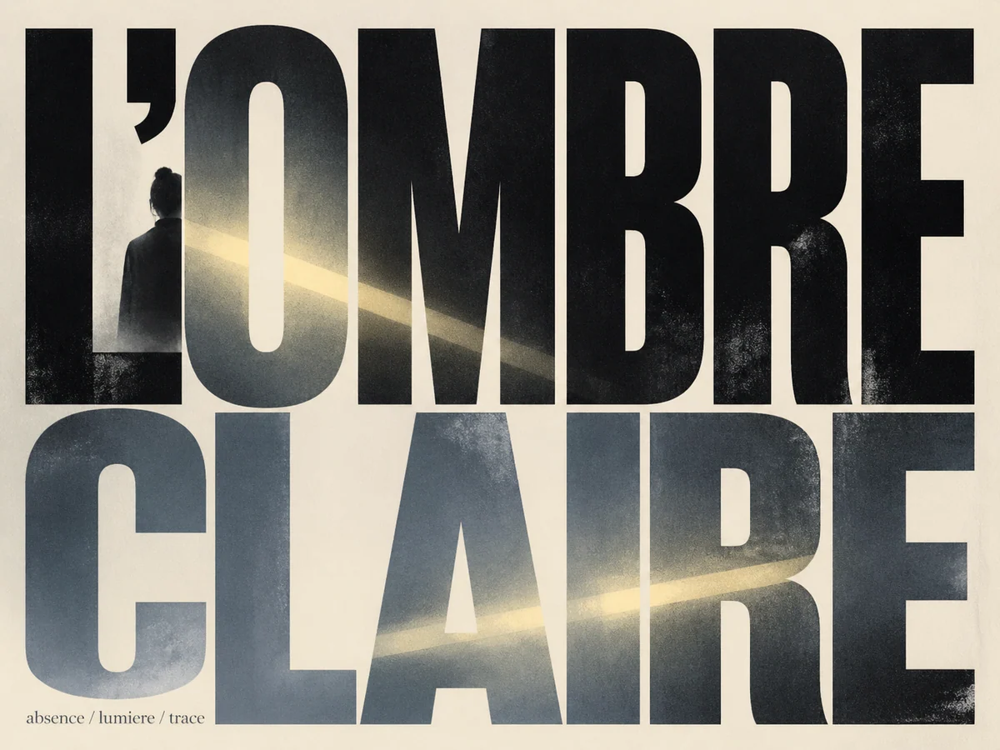


```text
创建一张高级概念字体海报，模板方向是「法语画廊海报」。将 [精确标题] 作为巨大、完整、清晰可读的主视觉结构，所有可见文字使用简体中文，除非用户明确要求其他语言。先理解标题的含义、情绪、文化气质、象征联想和心理张力，再转化为一个强视觉隐喻：[视觉隐喻]。设计定制感字形，让字重、间距、负空间、边缘和纸墨质感表达主题。可加入 [人物或物体]，但必须与字形重叠、遮挡、穿插或被字形框住。使用 [色彩系统]、纸张纤维、丝网或石版印刷颗粒和克制留白。避免随机英文、长段文字、假 logo、复制海报、无关装饰和不可读文字。
```


### 2. 德语标题海报 (`german-title-poster`)


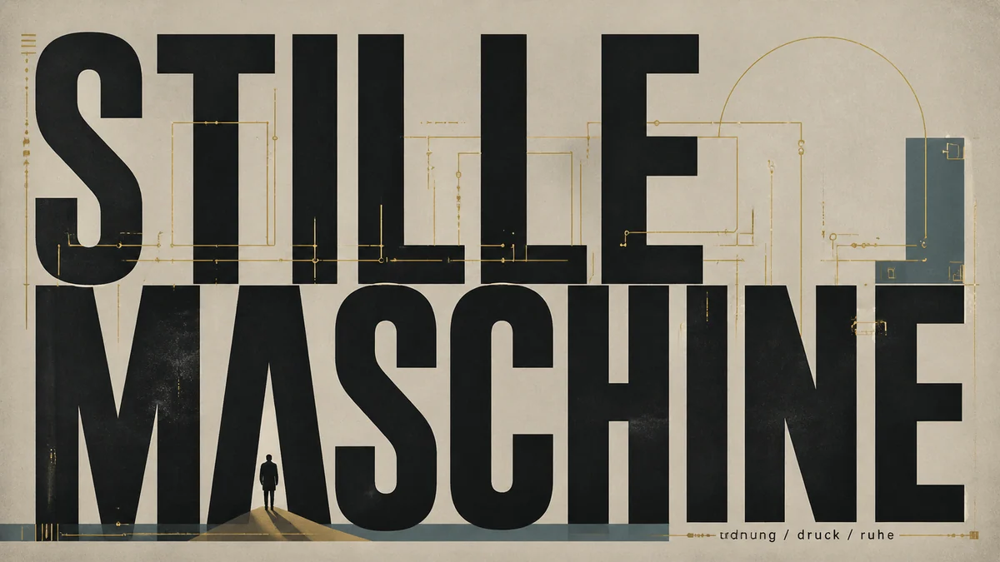


```text
创建一张高级概念字体海报，模板方向是「德语标题海报」。将 [精确标题] 作为巨大、完整、清晰可读的主视觉结构，所有可见文字使用简体中文，除非用户明确要求其他语言。先理解标题的含义、情绪、文化气质、象征联想和心理张力，再转化为一个强视觉隐喻：[视觉隐喻]。设计定制感字形，让字重、间距、负空间、边缘和纸墨质感表达主题。可加入 [人物或物体]，但必须与字形重叠、遮挡、穿插或被字形框住。使用 [色彩系统]、纸张纤维、丝网或石版印刷颗粒和克制留白。避免随机英文、长段文字、假 logo、复制海报、无关装饰和不可读文字。
```


### 3. 西语标题海报 (`spanish-title-poster`)


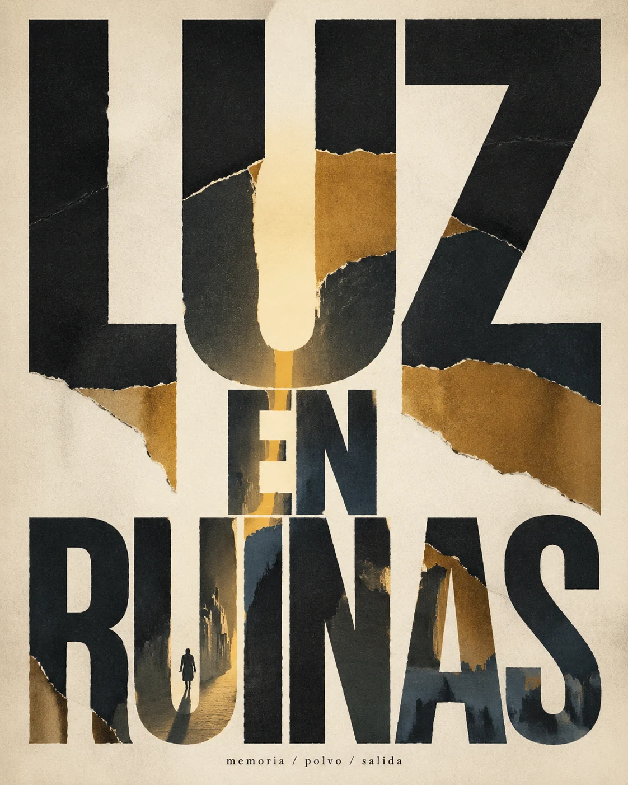


```text
创建一张高级概念字体海报，模板方向是「西语标题海报」。将 [精确标题] 作为巨大、完整、清晰可读的主视觉结构，所有可见文字使用简体中文，除非用户明确要求其他语言。先理解标题的含义、情绪、文化气质、象征联想和心理张力，再转化为一个强视觉隐喻：[视觉隐喻]。设计定制感字形，让字重、间距、负空间、边缘和纸墨质感表达主题。可加入 [人物或物体]，但必须与字形重叠、遮挡、穿插或被字形框住。使用 [色彩系统]、纸张纤维、丝网或石版印刷颗粒和克制留白。避免随机英文、长段文字、假 logo、复制海报、无关装饰和不可读文字。
```


### 4. 葡语标题海报 (`portuguese-title-poster`)


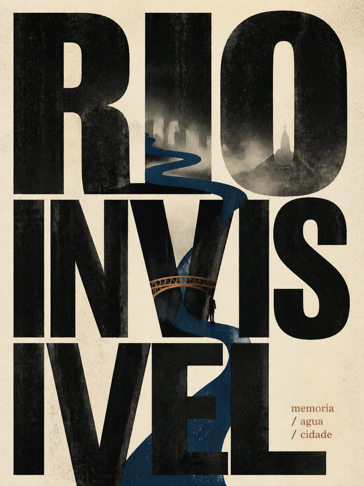


```text
创建一张高级概念字体海报，模板方向是「葡语标题海报」。将 [精确标题] 作为巨大、完整、清晰可读的主视觉结构，所有可见文字使用简体中文，除非用户明确要求其他语言。先理解标题的含义、情绪、文化气质、象征联想和心理张力，再转化为一个强视觉隐喻：[视觉隐喻]。设计定制感字形，让字重、间距、负空间、边缘和纸墨质感表达主题。可加入 [人物或物体]，但必须与字形重叠、遮挡、穿插或被字形框住。使用 [色彩系统]、纸张纤维、丝网或石版印刷颗粒和克制留白。避免随机英文、长段文字、假 logo、复制海报、无关装饰和不可读文字。
```


### 5. 日文标题节奏海报 (`japanese-title-rhythm-poster`)


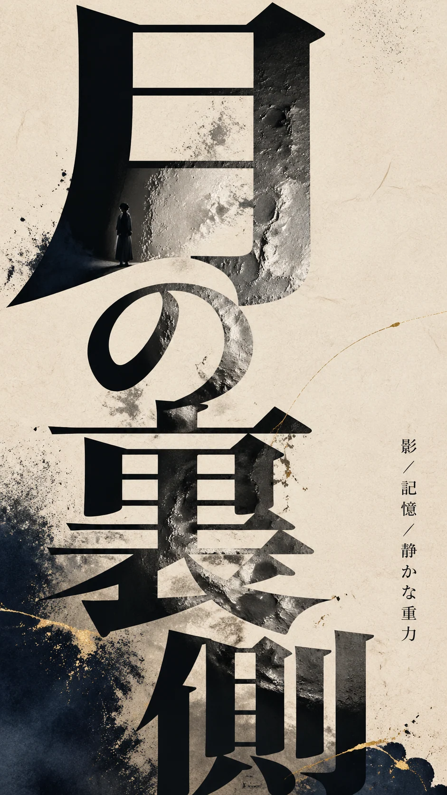


```text
创建一张高级概念字体海报，模板方向是「日文标题节奏海报」。将 [精确标题] 作为巨大、完整、清晰可读的主视觉结构，所有可见文字使用简体中文，除非用户明确要求其他语言。先理解标题的含义、情绪、文化气质、象征联想和心理张力，再转化为一个强视觉隐喻：[视觉隐喻]。设计定制感字形，让字重、间距、负空间、边缘和纸墨质感表达主题。可加入 [人物或物体]，但必须与字形重叠、遮挡、穿插或被字形框住。使用 [色彩系统]、纸张纤维、丝网或石版印刷颗粒和克制留白。避免随机英文、长段文字、假 logo、复制海报、无关装饰和不可读文字。
```


### 6. 韩文标题张力海报 (`korean-title-tension-poster`)


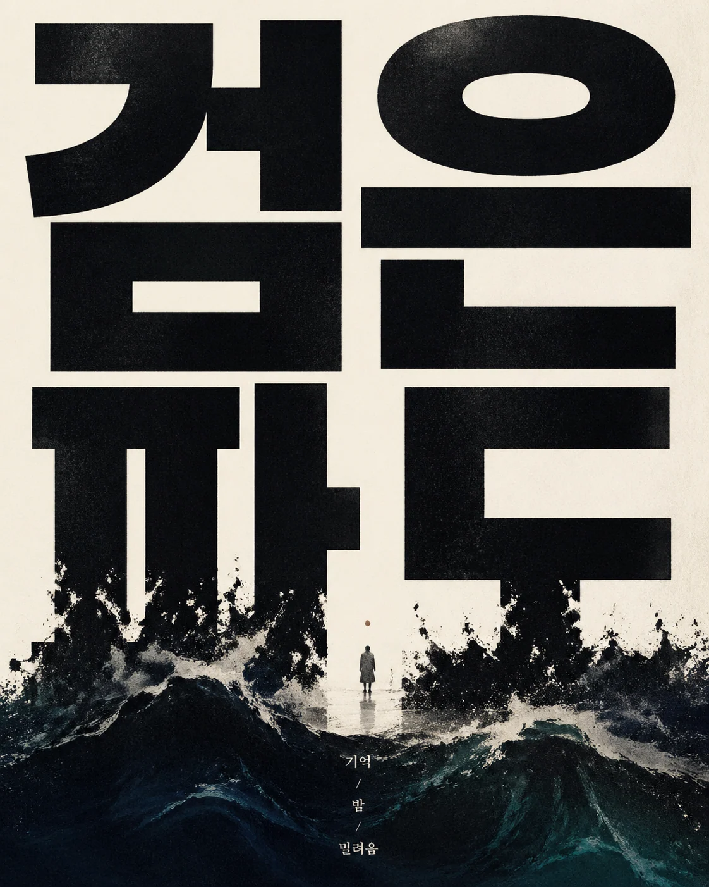


```text
创建一张高级概念字体海报，模板方向是「韩文标题张力海报」。将 [精确标题] 作为巨大、完整、清晰可读的主视觉结构，所有可见文字使用简体中文，除非用户明确要求其他语言。先理解标题的含义、情绪、文化气质、象征联想和心理张力，再转化为一个强视觉隐喻：[视觉隐喻]。设计定制感字形，让字重、间距、负空间、边缘和纸墨质感表达主题。可加入 [人物或物体]，但必须与字形重叠、遮挡、穿插或被字形框住。使用 [色彩系统]、纸张纤维、丝网或石版印刷颗粒和克制留白。避免随机英文、长段文字、假 logo、复制海报、无关装饰和不可读文字。
```


### 7. 繁体标题氛围海报 (`traditional-title-aura-poster`)


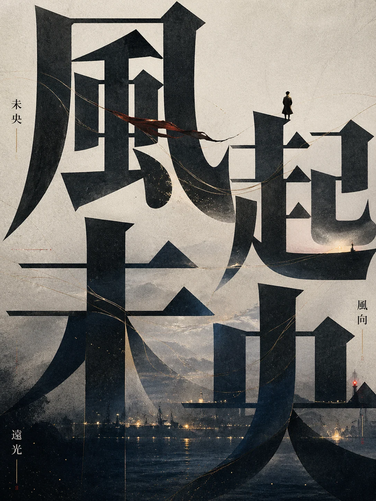


```text
创建一张高级概念字体海报，模板方向是「繁体标题氛围海报」。将 [精确标题] 作为巨大、完整、清晰可读的主视觉结构，所有可见文字使用简体中文，除非用户明确要求其他语言。先理解标题的含义、情绪、文化气质、象征联想和心理张力，再转化为一个强视觉隐喻：[视觉隐喻]。设计定制感字形，让字重、间距、负空间、边缘和纸墨质感表达主题。可加入 [人物或物体]，但必须与字形重叠、遮挡、穿插或被字形框住。使用 [色彩系统]、纸张纤维、丝网或石版印刷颗粒和克制留白。避免随机英文、长段文字、假 logo、复制海报、无关装饰和不可读文字。
```


### 8. 简体中文标题海报 (`simplified-chinese-title-poster`)


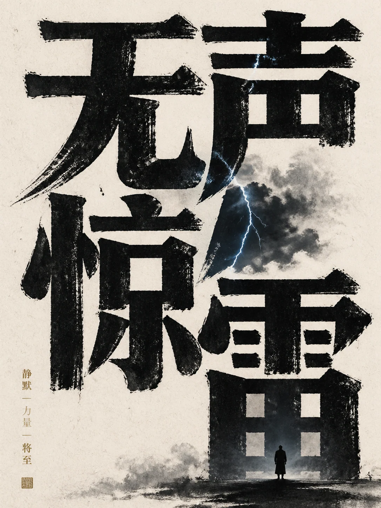


```text
创建一张高级概念字体海报，模板方向是「简体中文标题海报」。将 [精确标题] 作为巨大、完整、清晰可读的主视觉结构，所有可见文字使用简体中文，除非用户明确要求其他语言。先理解标题的含义、情绪、文化气质、象征联想和心理张力，再转化为一个强视觉隐喻：[视觉隐喻]。设计定制感字形，让字重、间距、负空间、边缘和纸墨质感表达主题。可加入 [人物或物体]，但必须与字形重叠、遮挡、穿插或被字形框住。使用 [色彩系统]、纸张纤维、丝网或石版印刷颗粒和克制留白。避免随机英文、长段文字、假 logo、复制海报、无关装饰和不可读文字。
```


### 9. 精确标题编辑海报 (`exact-title-editorial-poster`)


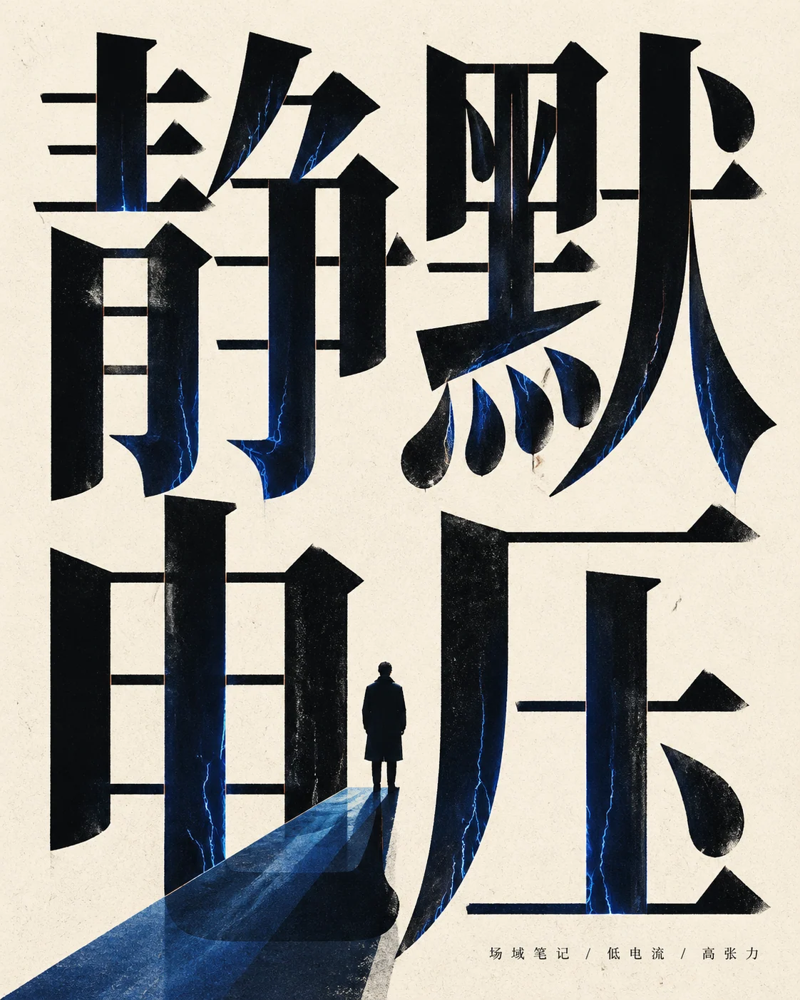


```text
创建一张高级概念字体海报，模板方向是「精确标题编辑海报」。将 [精确标题] 作为巨大、完整、清晰可读的主视觉结构，所有可见文字使用简体中文，除非用户明确要求其他语言。先理解标题的含义、情绪、文化气质、象征联想和心理张力，再转化为一个强视觉隐喻：[视觉隐喻]。设计定制感字形，让字重、间距、负空间、边缘和纸墨质感表达主题。可加入 [人物或物体]，但必须与字形重叠、遮挡、穿插或被字形框住。使用 [色彩系统]、纸张纤维、丝网或石版印刷颗粒和克制留白。避免随机英文、长段文字、假 logo、复制海报、无关装饰和不可读文字。
```


## 朋克海报模板 (`retro-punk-gig-posters`)

用 GPT Image 2 生成粗粝丝印海报。


### 1. Underground Band Gig Poster (`underground-band-gig-poster`)


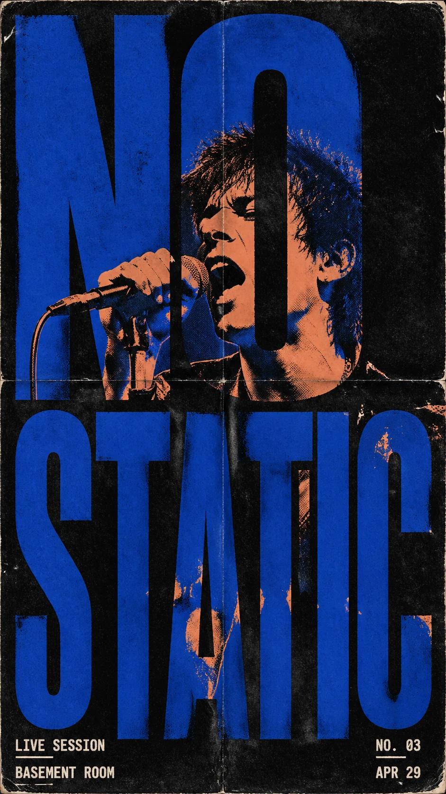


```text
使用 GPT Image 2 创建“Underground Band Gig Poster”风格的复古朋克丝网印刷海报。任务：Create a vertical fictional band or event poster with huge English type。把用户提供的主文字、名称或短语做成画面最大元素，占据约 70%-85%，字体必须极粗、压缩、可读，并像建筑结构一样支撑画面。人物、歌手、表演者或上传的人像参考要转成高对比双色油墨，从字母或汉字缝隙、负空间中穿出，局部被文字遮挡和切割。所有可见文字默认使用简体中文，除非用户要求其他语言；小字只保留 2-4 组短硬的传单信息。使用 2-3 种油墨色，加入半调网点、丝网印刷、复印机噪点、纸张纤维、套印错位、折痕和旧海报磨损。避免 logo、具体受版权保护的封面、乱码、3D 字、光滑商业摄影、赛博霓虹和过多颜色。
```


### 2. Chinese Poetry Punk Poster (`chinese-poetry-punk-poster`)


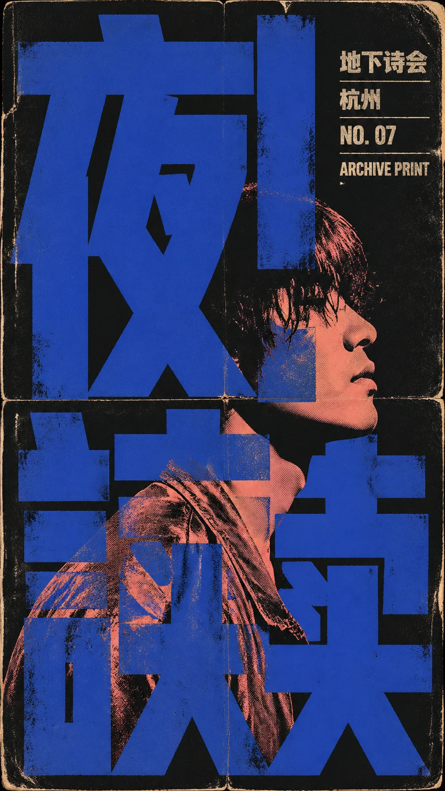


```text
使用 GPT Image 2 创建“Chinese Poetry Punk Poster”风格的复古朋克丝网印刷海报。任务：Turn a Chinese phrase or poetry theme into a gritty vertical poster。把用户提供的主文字、名称或短语做成画面最大元素，占据约 70%-85%，字体必须极粗、压缩、可读，并像建筑结构一样支撑画面。人物、歌手、表演者或上传的人像参考要转成高对比双色油墨，从字母或汉字缝隙、负空间中穿出，局部被文字遮挡和切割。所有可见文字默认使用简体中文，除非用户要求其他语言；小字只保留 2-4 组短硬的传单信息。使用 2-3 种油墨色，加入半调网点、丝网印刷、复印机噪点、纸张纤维、套印错位、折痕和旧海报磨损。避免 logo、具体受版权保护的封面、乱码、3D 字、光滑商业摄影、赛博霓虹和过多颜色。
```


### 3. Traditional Indie Film Poster (`traditional-indie-film-poster`)


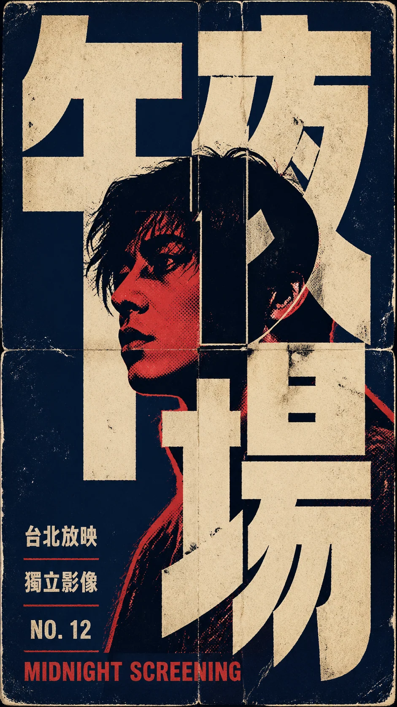


```text
使用 GPT Image 2 创建“Traditional Indie Film Poster”风格的复古朋克丝网印刷海报。任务：Create a Traditional Chinese indie film club poster with xerox texture。把用户提供的主文字、名称或短语做成画面最大元素，占据约 70%-85%，字体必须极粗、压缩、可读，并像建筑结构一样支撑画面。人物、歌手、表演者或上传的人像参考要转成高对比双色油墨，从字母或汉字缝隙、负空间中穿出，局部被文字遮挡和切割。所有可见文字默认使用简体中文，除非用户要求其他语言；小字只保留 2-4 组短硬的传单信息。使用 2-3 种油墨色，加入半调网点、丝网印刷、复印机噪点、纸张纤维、套印错位、折痕和旧海报磨损。避免 logo、具体受版权保护的封面、乱码、3D 字、光滑商业摄影、赛博霓虹和过多颜色。
```


### 4. Korean Noise Rock Zine (`korean-noise-rock-zine`)


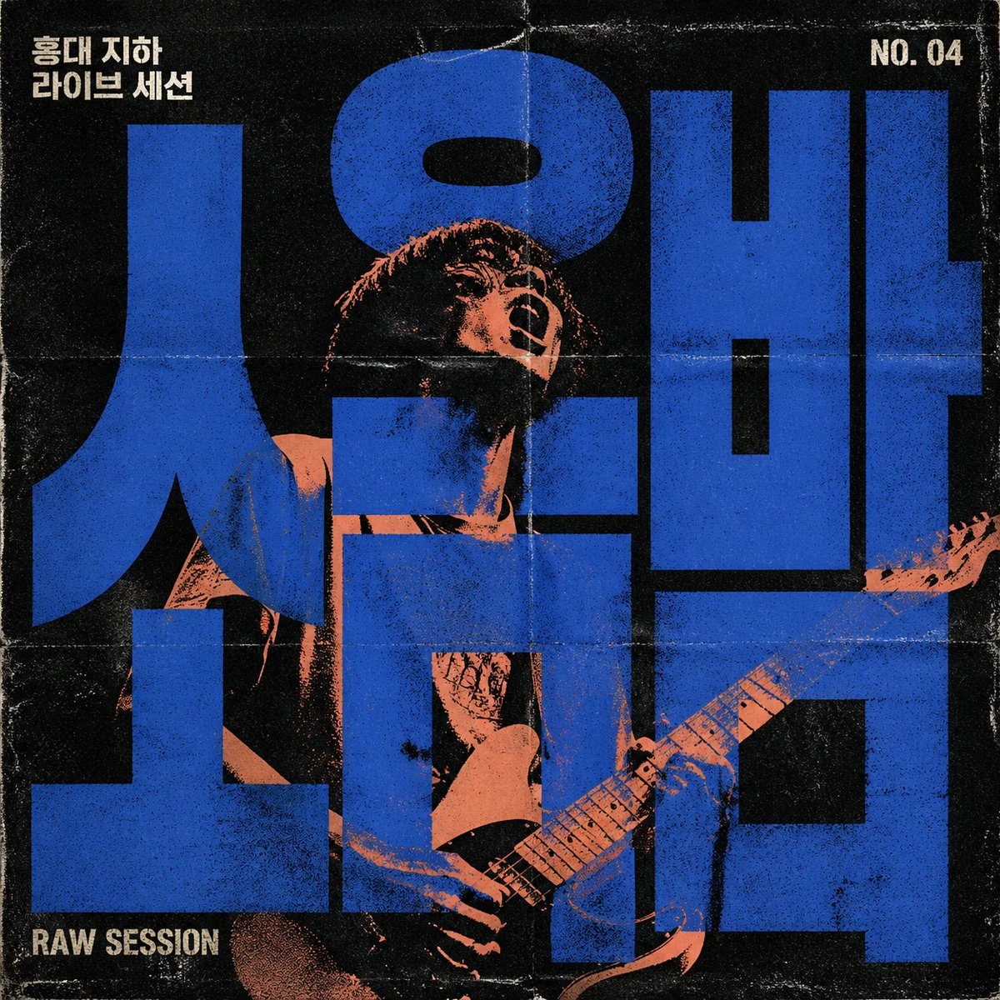


```text
使用 GPT Image 2 创建“Korean Noise Rock Zine”风格的复古朋克丝网印刷海报。任务：Make a Korean noise rock zine cover with condensed typography。把用户提供的主文字、名称或短语做成画面最大元素，占据约 70%-85%，字体必须极粗、压缩、可读，并像建筑结构一样支撑画面。人物、歌手、表演者或上传的人像参考要转成高对比双色油墨，从字母或汉字缝隙、负空间中穿出，局部被文字遮挡和切割。所有可见文字默认使用简体中文，除非用户要求其他语言；小字只保留 2-4 组短硬的传单信息。使用 2-3 种油墨色，加入半调网点、丝网印刷、复印机噪点、纸张纤维、套印错位、折痕和旧海报磨损。避免 logo、具体受版权保护的封面、乱码、3D 字、光滑商业摄影、赛博霓虹和过多颜色。
```


### 5. Japanese Garage Tour Poster (`japanese-garage-tour-poster`)


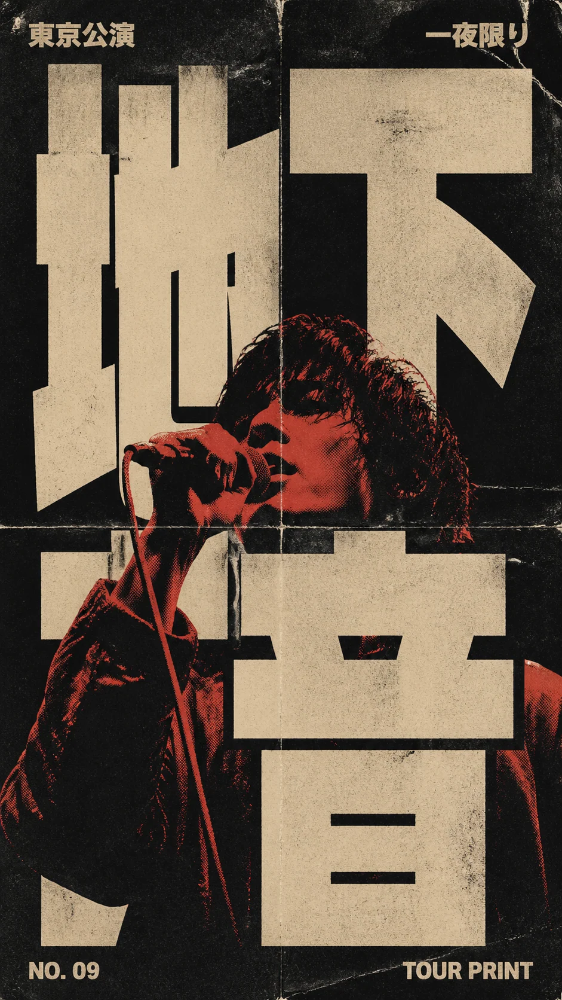


```text
使用 GPT Image 2 创建“Japanese Garage Tour Poster”风格的复古朋克丝网印刷海报。任务：Generate a Japanese garage band tour poster with bold vertical type。把用户提供的主文字、名称或短语做成画面最大元素，占据约 70%-85%，字体必须极粗、压缩、可读，并像建筑结构一样支撑画面。人物、歌手、表演者或上传的人像参考要转成高对比双色油墨，从字母或汉字缝隙、负空间中穿出，局部被文字遮挡和切割。所有可见文字默认使用简体中文，除非用户要求其他语言；小字只保留 2-4 组短硬的传单信息。使用 2-3 种油墨色，加入半调网点、丝网印刷、复印机噪点、纸张纤维、套印错位、折痕和旧海报磨损。避免 logo、具体受版权保护的封面、乱码、3D 字、光滑商业摄影、赛博霓虹和过多颜色。
```


### 6. Portuguese Protest Music Poster (`portuguese-protest-music-poster`)


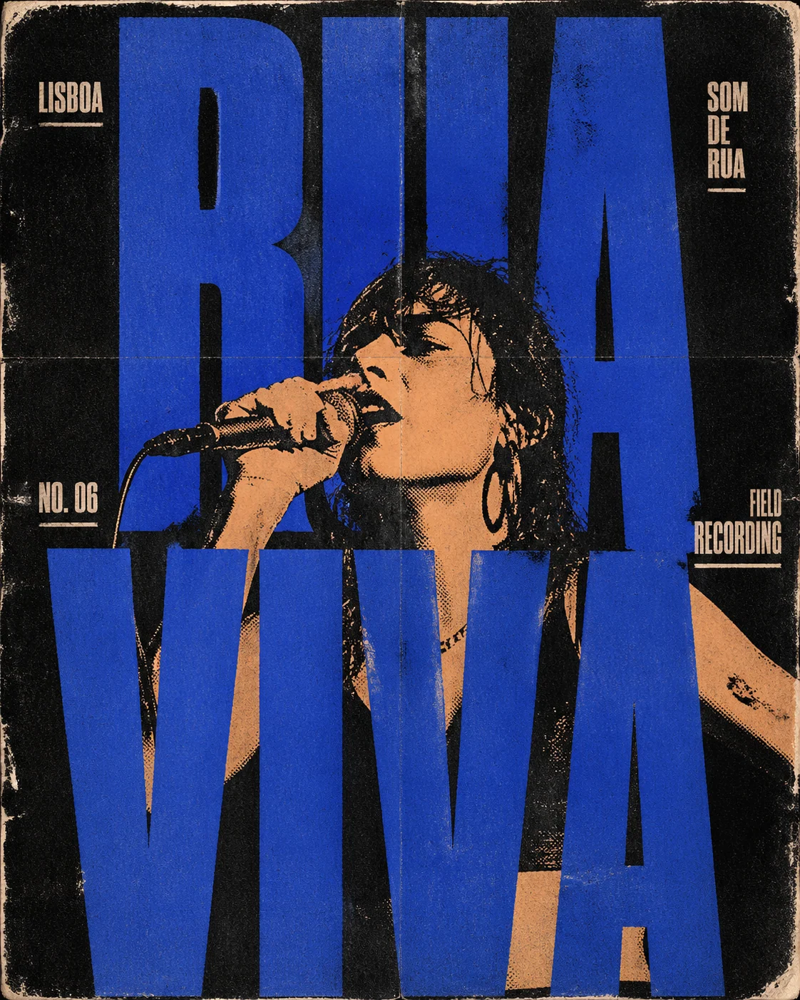


```text
使用 GPT Image 2 创建“Portuguese Protest Music Poster”风格的复古朋克丝网印刷海报。任务：Create a Portuguese protest music poster with tritone ink。把用户提供的主文字、名称或短语做成画面最大元素，占据约 70%-85%，字体必须极粗、压缩、可读，并像建筑结构一样支撑画面。人物、歌手、表演者或上传的人像参考要转成高对比双色油墨，从字母或汉字缝隙、负空间中穿出，局部被文字遮挡和切割。所有可见文字默认使用简体中文，除非用户要求其他语言；小字只保留 2-4 组短硬的传单信息。使用 2-3 种油墨色，加入半调网点、丝网印刷、复印机噪点、纸张纤维、套印错位、折痕和旧海报磨损。避免 logo、具体受版权保护的封面、乱码、3D 字、光滑商业摄影、赛博霓虹和过多颜色。
```


### 7. Spanish Night Radio Poster (`spanish-night-radio-poster`)


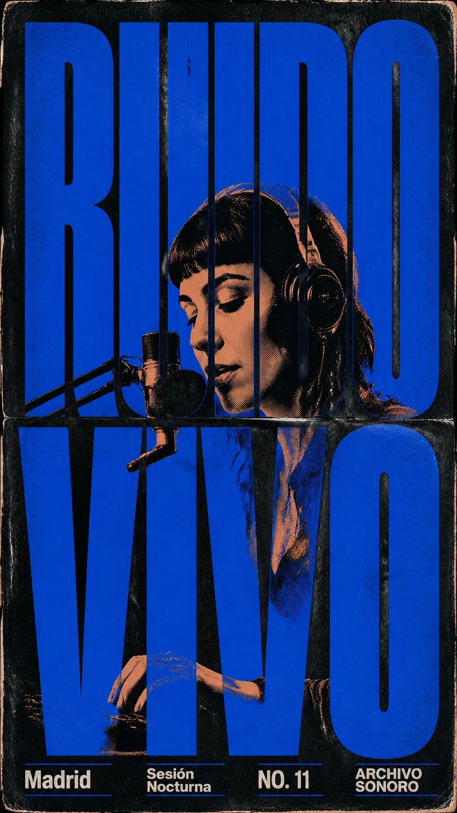


```text
使用 GPT Image 2 创建“Spanish Night Radio Poster”风格的复古朋克丝网印刷海报。任务：Make a Spanish late-night radio or club poster with worn flyer details。把用户提供的主文字、名称或短语做成画面最大元素，占据约 70%-85%，字体必须极粗、压缩、可读，并像建筑结构一样支撑画面。人物、歌手、表演者或上传的人像参考要转成高对比双色油墨，从字母或汉字缝隙、负空间中穿出，局部被文字遮挡和切割。所有可见文字默认使用简体中文，除非用户要求其他语言；小字只保留 2-4 组短硬的传单信息。使用 2-3 种油墨色，加入半调网点、丝网印刷、复印机噪点、纸张纤维、套印错位、折痕和旧海报磨损。避免 logo、具体受版权保护的封面、乱码、3D 字、光滑商业摄影、赛博霓虹和过多颜色。
```


### 8. German Warehouse Techno Flyer (`german-warehouse-techno-flyer`)


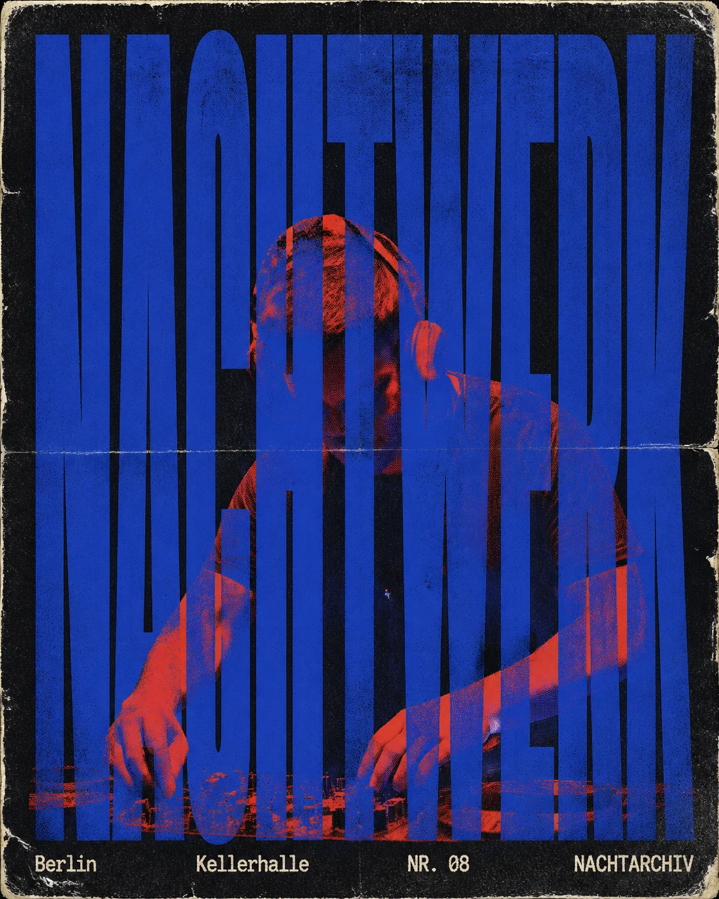


```text
使用 GPT Image 2 创建“German Warehouse Techno Flyer”风格的复古朋克丝网印刷海报。任务：Build a German warehouse event flyer with brutalist type and photocopy grain。把用户提供的主文字、名称或短语做成画面最大元素，占据约 70%-85%，字体必须极粗、压缩、可读，并像建筑结构一样支撑画面。人物、歌手、表演者或上传的人像参考要转成高对比双色油墨，从字母或汉字缝隙、负空间中穿出，局部被文字遮挡和切割。所有可见文字默认使用简体中文，除非用户要求其他语言；小字只保留 2-4 组短硬的传单信息。使用 2-3 种油墨色，加入半调网点、丝网印刷、复印机噪点、纸张纤维、套印错位、折痕和旧海报磨损。避免 logo、具体受版权保护的封面、乱码、3D 字、光滑商业摄影、赛博霓虹和过多颜色。
```


### 9. French Underground Theatre Poster (`french-underground-theatre-poster`)


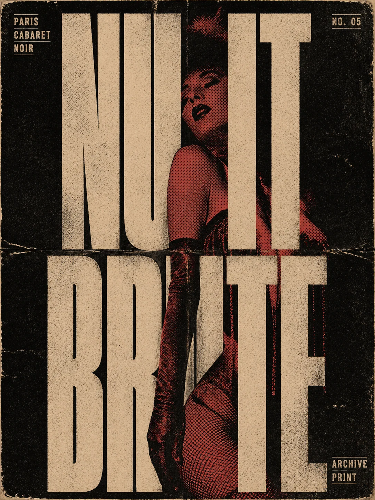


```text
使用 GPT Image 2 创建“French Underground Theatre Poster”风格的复古朋克丝网印刷海报。任务：Create a French underground theatre or cabaret poster with distressed ink。把用户提供的主文字、名称或短语做成画面最大元素，占据约 70%-85%，字体必须极粗、压缩、可读，并像建筑结构一样支撑画面。人物、歌手、表演者或上传的人像参考要转成高对比双色油墨，从字母或汉字缝隙、负空间中穿出，局部被文字遮挡和切割。所有可见文字默认使用简体中文，除非用户要求其他语言；小字只保留 2-4 组短硬的传单信息。使用 2-3 种油墨色，加入半调网点、丝网印刷、复印机噪点、纸张纤维、套印错位、折痕和旧海报磨损。避免 logo、具体受版权保护的封面、乱码、3D 字、光滑商业摄影、赛博霓虹和过多颜色。
```


## 讽刺线稿模板 (`satirical-line-illustrations`)

把主题变成讽刺线稿插画。


### 1. Absurd Article Cover (`absurd-article-cover`)


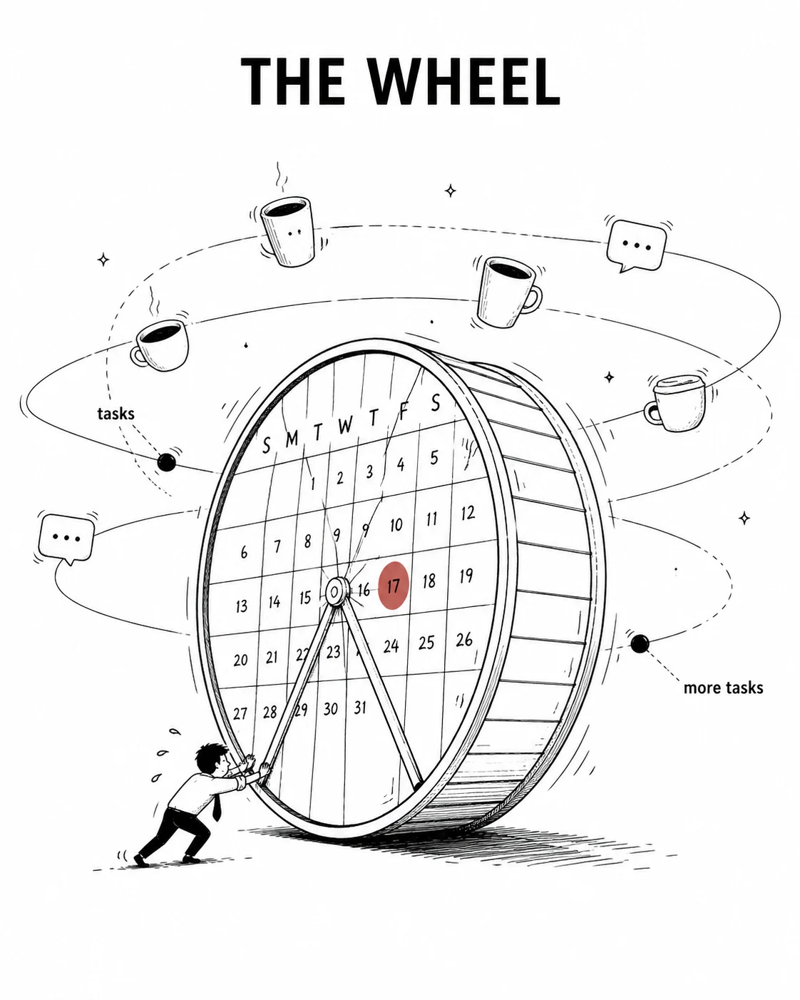


```text
为 [主题或文章摘要] 生成一张 GPT Image 2 讽刺社论线稿插画。主题方向：文章封面与荒诞视觉隐喻。请把核心矛盾转化为 [视觉隐喻]，使用黑色墨线、白色留白、小人物、荒诞比例和安静反讽。若出现可见文字，必须使用简体中文，只保留短标题和少量标签。可选择纯黑白或一个低饱和强调色。避免真实标志、名人脸、仇恨刻板印象、血腥、密集文字和模仿特定艺术家。
```


### 2. Chinese Workplace Pressure (`chinese-workplace-pressure`)


```text
为 [主题或文章摘要] 生成一张 GPT Image 2 讽刺社论线稿插画。主题方向：职场压力与打工循环。请把核心矛盾转化为 [视觉隐喻]，使用黑色墨线、白色留白、小人物、荒诞比例和安静反讽。若出现可见文字，必须使用简体中文，只保留短标题和少量标签。可选择纯黑白或一个低饱和强调色。避免真实标志、名人脸、仇恨刻板印象、血腥、密集文字和模仿特定艺术家。
```


### 3. Traditional Secrecy Metaphor (`traditional-secrecy-metaphor`)


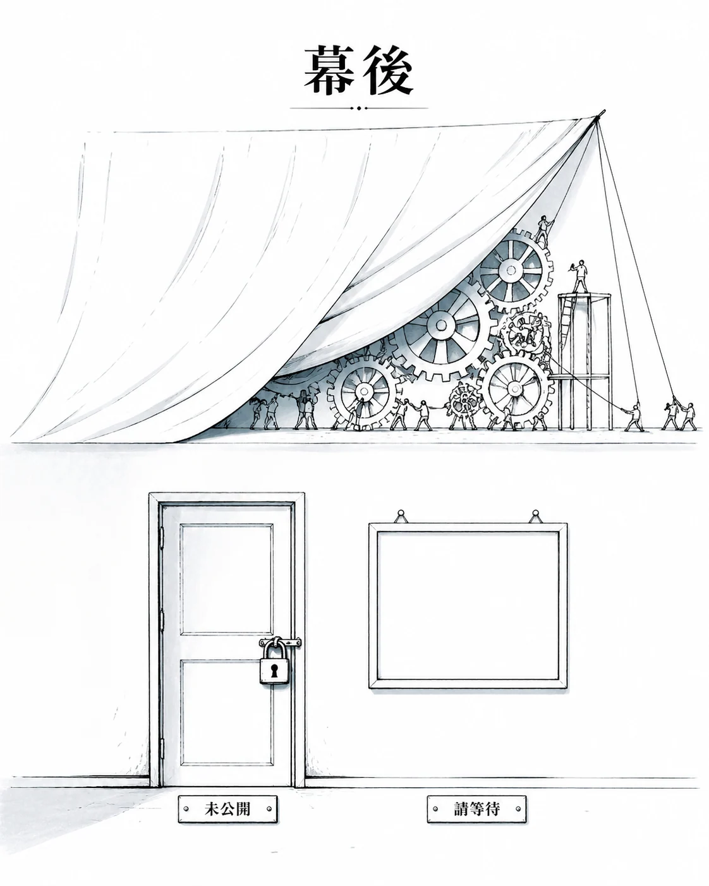


```text
为 [主题或文章摘要] 生成一张 GPT Image 2 讽刺社论线稿插画。主题方向：秘密、遮掩和幕后齿轮。请把核心矛盾转化为 [视觉隐喻]，使用黑色墨线、白色留白、小人物、荒诞比例和安静反讽。若出现可见文字，必须使用简体中文，只保留短标题和少量标签。可选择纯黑白或一个低饱和强调色。避免真实标志、名人脸、仇恨刻板印象、血腥、密集文字和模仿特定艺术家。
```


### 4. Korean AI Mirror (`korean-ai-mirror`)


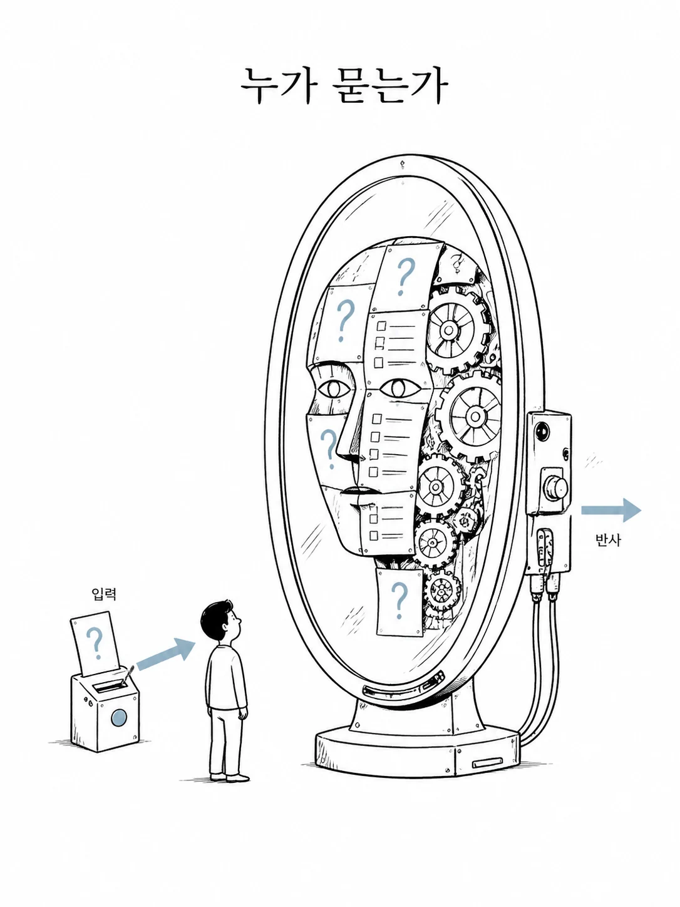


```text
为 [主题或文章摘要] 生成一张 GPT Image 2 讽刺社论线稿插画。主题方向：AI 镜像与自我反思。请把核心矛盾转化为 [视觉隐喻]，使用黑色墨线、白色留白、小人物、荒诞比例和安静反讽。若出现可见文字，必须使用简体中文，只保留短标题和少量标签。可选择纯黑白或一个低饱和强调色。避免真实标志、名人脸、仇恨刻板印象、血腥、密集文字和模仿特定艺术家。
```


### 5. Japanese Consumer Loop (`japanese-consumer-loop`)


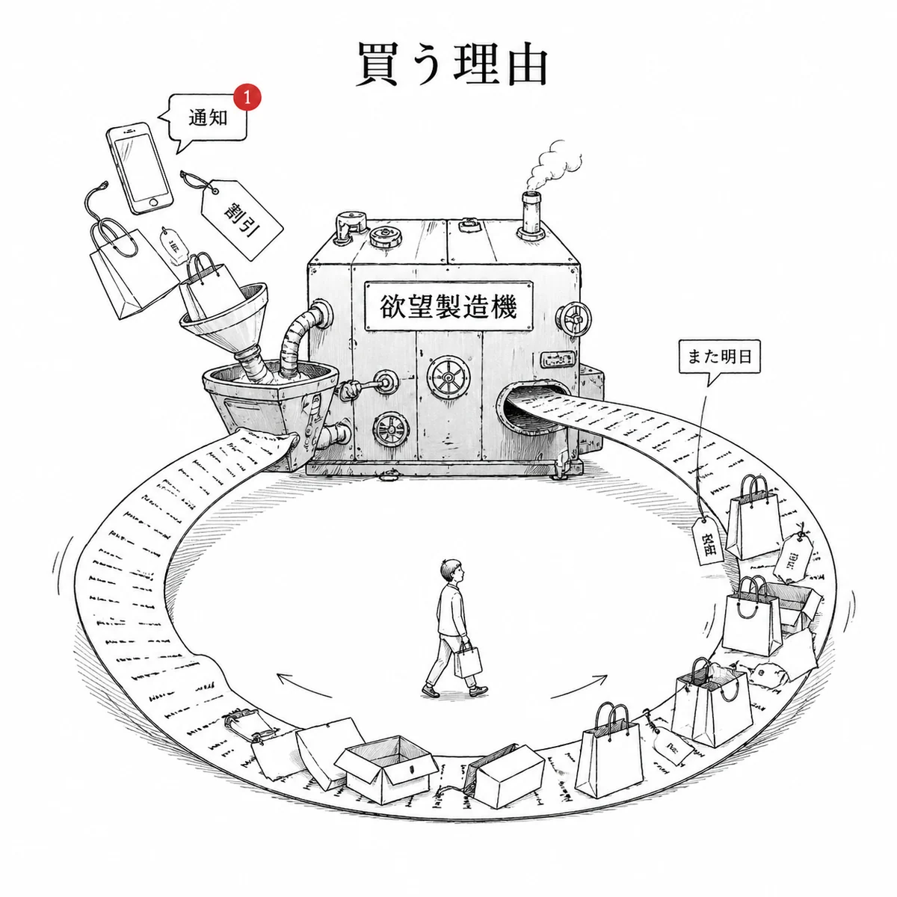


```text
为 [主题或文章摘要] 生成一张 GPT Image 2 讽刺社论线稿插画。主题方向：消费循环与通知诱导。请把核心矛盾转化为 [视觉隐喻]，使用黑色墨线、白色留白、小人物、荒诞比例和安静反讽。若出现可见文字，必须使用简体中文，只保留短标题和少量标签。可选择纯黑白或一个低饱和强调色。避免真实标志、名人脸、仇恨刻板印象、血腥、密集文字和模仿特定艺术家。
```


### 6. Portuguese Greed Machine (`portuguese-greed-machine`)


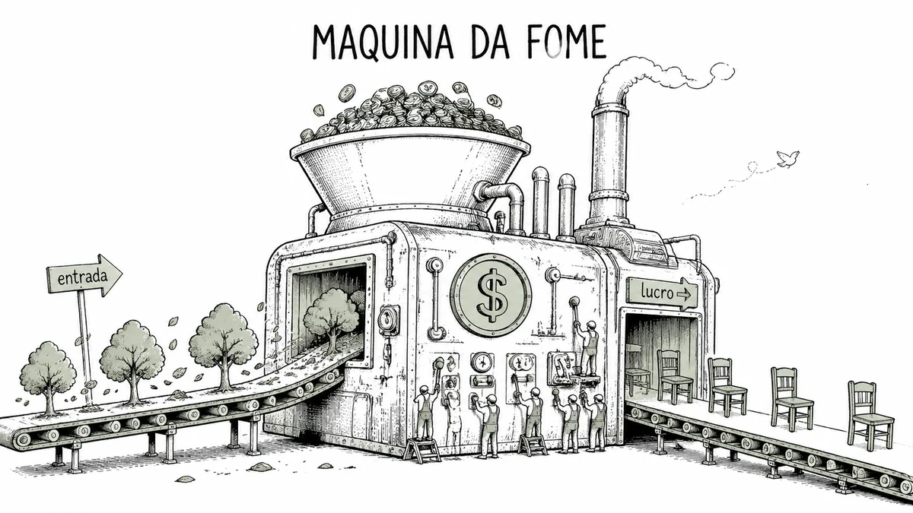


```text
为 [主题或文章摘要] 生成一张 GPT Image 2 讽刺社论线稿插画。主题方向：贪婪机器与资源交换。请把核心矛盾转化为 [视觉隐喻]，使用黑色墨线、白色留白、小人物、荒诞比例和安静反讽。若出现可见文字，必须使用简体中文，只保留短标题和少量标签。可选择纯黑白或一个低饱和强调色。避免真实标志、名人脸、仇恨刻板印象、血腥、密集文字和模仿特定艺术家。
```


### 7. Spanish Beauty Standard (`spanish-beauty-standard`)


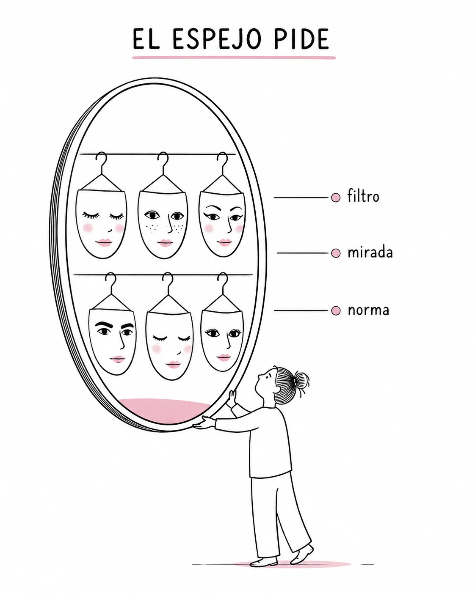


```text
为 [主题或文章摘要] 生成一张 GPT Image 2 讽刺社论线稿插画。主题方向：美貌标准与镜子压力。请把核心矛盾转化为 [视觉隐喻]，使用黑色墨线、白色留白、小人物、荒诞比例和安静反讽。若出现可见文字，必须使用简体中文，只保留短标题和少量标签。可选择纯黑白或一个低饱和强调色。避免真实标志、名人脸、仇恨刻板印象、血腥、密集文字和模仿特定艺术家。
```


### 8. German Bureaucracy Maze (`german-bureaucracy-maze`)


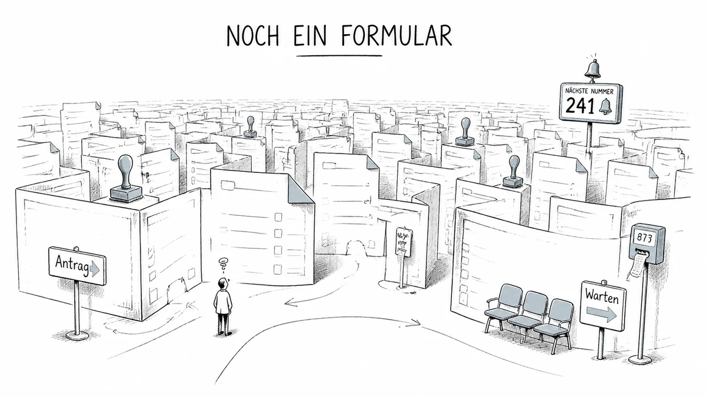


```text
为 [主题或文章摘要] 生成一张 GPT Image 2 讽刺社论线稿插画。主题方向：表格迷宫与流程等待。请把核心矛盾转化为 [视觉隐喻]，使用黑色墨线、白色留白、小人物、荒诞比例和安静反讽。若出现可见文字，必须使用简体中文，只保留短标题和少量标签。可选择纯黑白或一个低饱和强调色。避免真实标志、名人脸、仇恨刻板印象、血腥、密集文字和模仿特定艺术家。
```


### 9. French Attention Trap (`french-attention-trap`)


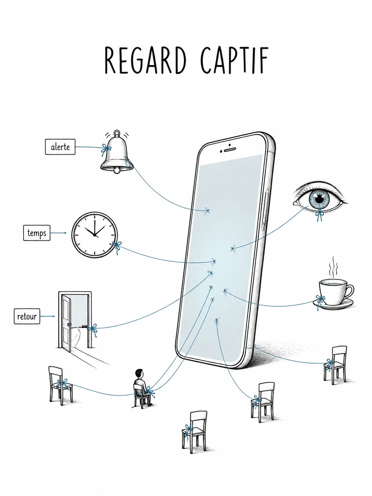


```text
为 [主题或文章摘要] 生成一张 GPT Image 2 讽刺社论线稿插画。主题方向：注意力陷阱与手机牵引。请把核心矛盾转化为 [视觉隐喻]，使用黑色墨线、白色留白、小人物、荒诞比例和安静反讽。若出现可见文字，必须使用简体中文，只保留短标题和少量标签。可选择纯黑白或一个低饱和强调色。避免真实标志、名人脸、仇恨刻板印象、血腥、密集文字和模仿特定艺术家。
```


## 剪影故事海报 (`silhouette-story-posters`)

用剪影世界生成个人叙事海报。


### 1. 毕业传说剪影 (`graduate-legend-silhouette`)


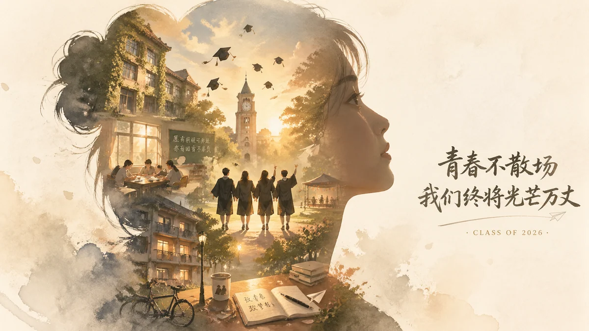


```text
请用自然简体中文改写并执行这个模板。所有可见文字必须使用简体中文，除 GPT Image 2 之外不要出现英文。\n\n模板名称：毕业传说剪影\n用途：创建一个人物侧脸剪影叙事海报，主题来自“Graduate Legend Silhouette”。请保留核心结构：巨大人物侧脸剪影作为外轮廓，剪影内部生成一个完整、统一、强绑定主题的世界。根据用户替换的人物、地点、人生阶段、符号、情绪和短标题来调整场景。风格保持电影海报与梦幻水彩插画融合，柔和雾气、纸张颗粒、浅色刷痕、大面积留白，安静、高级、怀旧、有史诗感。避免品牌标志、真实校徽、名人脸、版权角色、廉价奇幻素材、硬拼贴、杂乱背景和长段文字。
```


### 2. 校园告别剪影 (`campus-farewell-silhouette`)


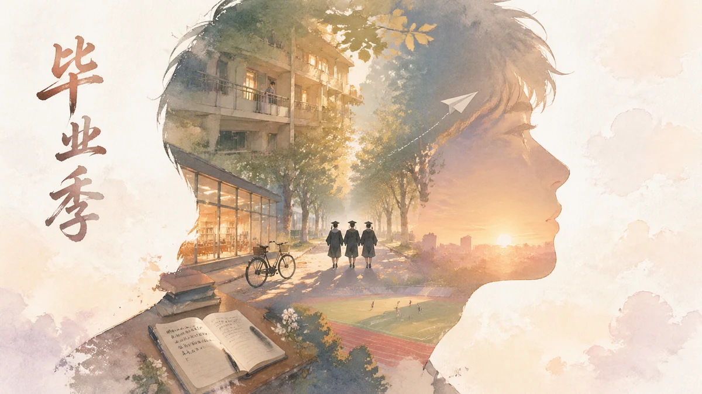


```text
请用自然简体中文改写并执行这个模板。所有可见文字必须使用简体中文，除 GPT Image 2 之外不要出现英文。\n\n模板名称：校园告别剪影\n用途：创建一个人物侧脸剪影叙事海报，主题来自“Campus Farewell Silhouette”。请保留核心结构：巨大人物侧脸剪影作为外轮廓，剪影内部生成一个完整、统一、强绑定主题的世界。根据用户替换的人物、地点、人生阶段、符号、情绪和短标题来调整场景。风格保持电影海报与梦幻水彩插画融合，柔和雾气、纸张颗粒、浅色刷痕、大面积留白，安静、高级、怀旧、有史诗感。避免品牌标志、真实校徽、名人脸、版权角色、廉价奇幻素材、硬拼贴、杂乱背景和长段文字。
```


### 3. 城市记忆侧影 (`city-memory-profile`)


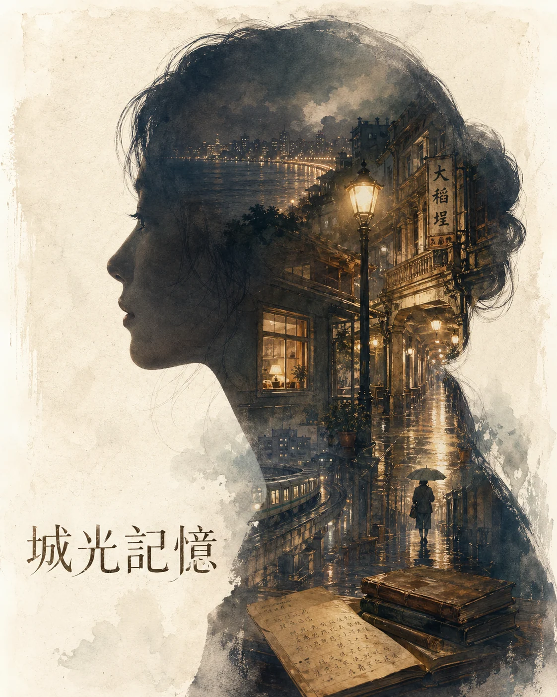


```text
请用自然简体中文改写并执行这个模板。所有可见文字必须使用简体中文，除 GPT Image 2 之外不要出现英文。\n\n模板名称：城市记忆侧影\n用途：创建一个人物侧脸剪影叙事海报，主题来自“City Memory Profile”。请保留核心结构：巨大人物侧脸剪影作为外轮廓，剪影内部生成一个完整、统一、强绑定主题的世界。根据用户替换的人物、地点、人生阶段、符号、情绪和短标题来调整场景。风格保持电影海报与梦幻水彩插画融合，柔和雾气、纸张颗粒、浅色刷痕、大面积留白，安静、高级、怀旧、有史诗感。避免品牌标志、真实校徽、名人脸、版权角色、廉价奇幻素材、硬拼贴、杂乱背景和长段文字。
```


### 4. 青春剧剪影 (`youth-drama-silhouette`)


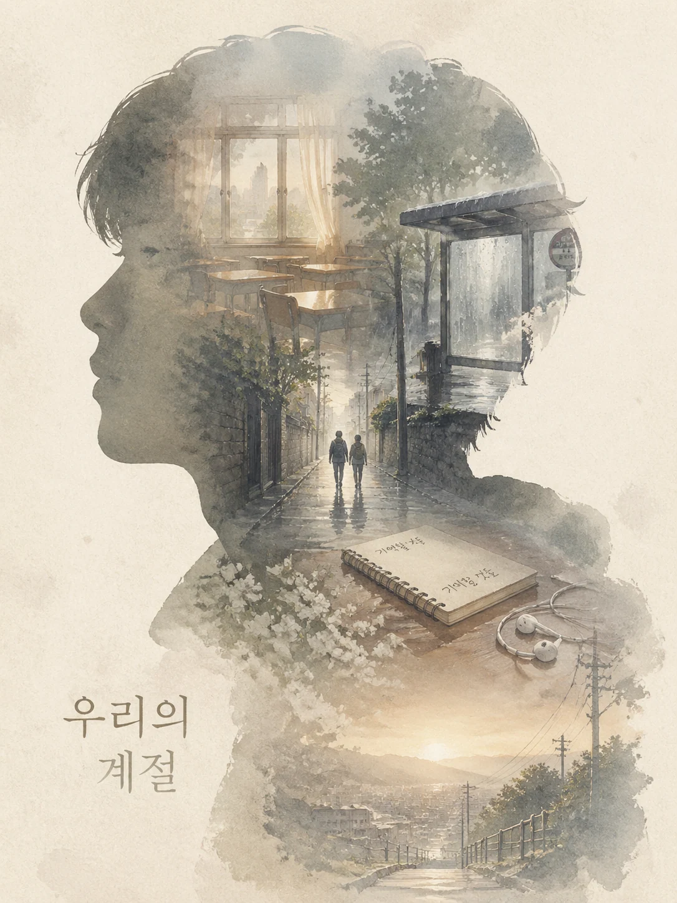


```text
请用自然简体中文改写并执行这个模板。所有可见文字必须使用简体中文，除 GPT Image 2 之外不要出现英文。\n\n模板名称：青春剧剪影\n用途：创建一个人物侧脸剪影叙事海报，主题来自“Youth Drama Silhouette”。请保留核心结构：巨大人物侧脸剪影作为外轮廓，剪影内部生成一个完整、统一、强绑定主题的世界。根据用户替换的人物、地点、人生阶段、符号、情绪和短标题来调整场景。风格保持电影海报与梦幻水彩插画融合，柔和雾气、纸张颗粒、浅色刷痕、大面积留白，安静、高级、怀旧、有史诗感。避免品牌标志、真实校徽、名人脸、版权角色、廉价奇幻素材、硬拼贴、杂乱背景和长段文字。
```


### 5. 静季侧影 (`quiet-season-profile`)


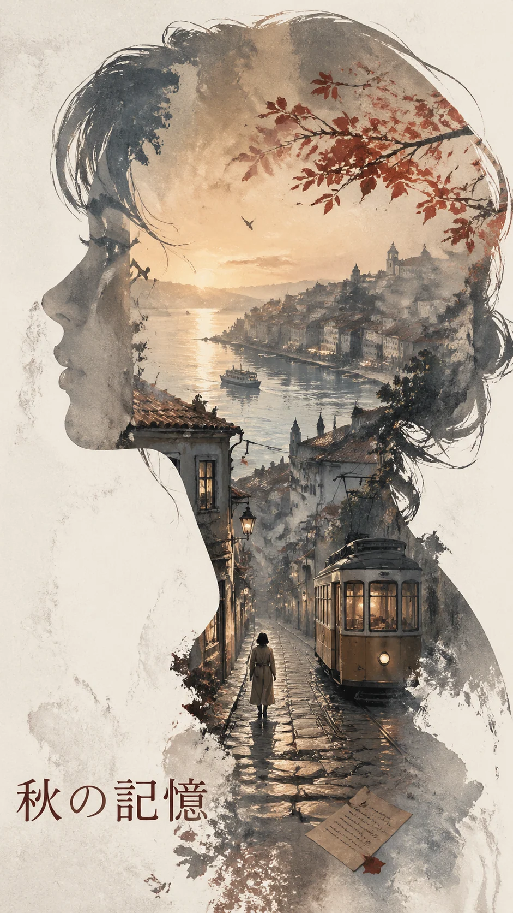


```text
请用自然简体中文改写并执行这个模板。所有可见文字必须使用简体中文，除 GPT Image 2 之外不要出现英文。\n\n模板名称：静季侧影\n用途：创建一个人物侧脸剪影叙事海报，主题来自“Quiet Season Profile”。请保留核心结构：巨大人物侧脸剪影作为外轮廓，剪影内部生成一个完整、统一、强绑定主题的世界。根据用户替换的人物、地点、人生阶段、符号、情绪和短标题来调整场景。风格保持电影海报与梦幻水彩插画融合，柔和雾气、纸张颗粒、浅色刷痕、大面积留白，安静、高级、怀旧、有史诗感。避免品牌标志、真实校徽、名人脸、版权角色、廉价奇幻素材、硬拼贴、杂乱背景和长段文字。
```


### 6. 海港思念剪影 (`saudade-harbor-silhouette`)


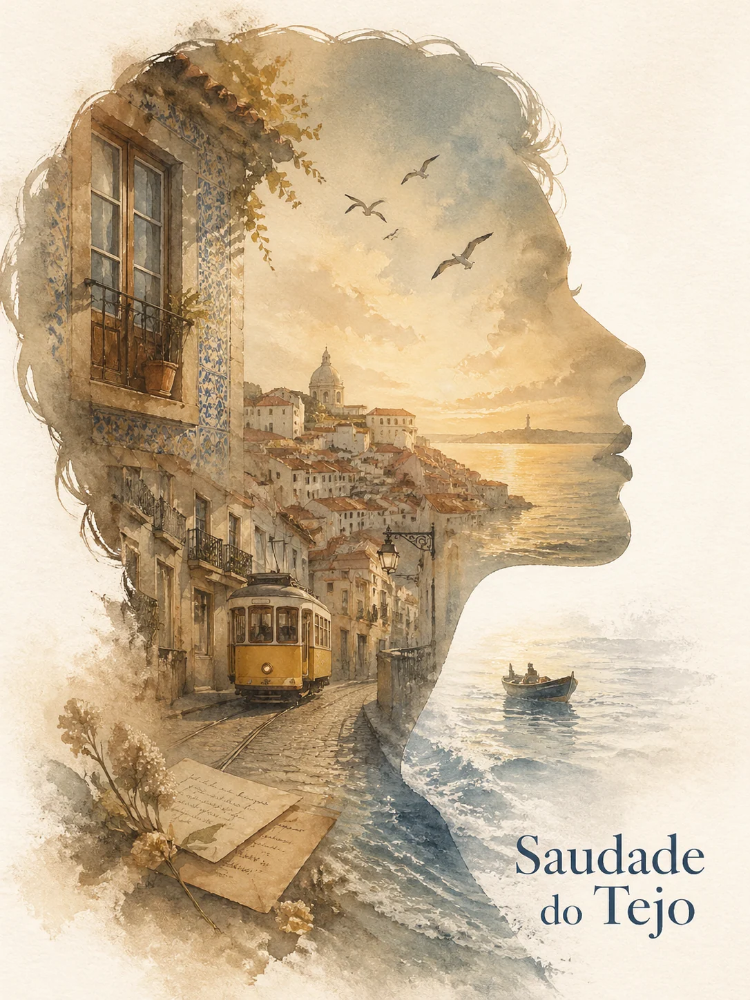


```text
请用自然简体中文改写并执行这个模板。所有可见文字必须使用简体中文，除 GPT Image 2 之外不要出现英文。\n\n模板名称：海港思念剪影\n用途：创建一个人物侧脸剪影叙事海报，主题来自“Saudade Harbor Silhouette”。请保留核心结构：巨大人物侧脸剪影作为外轮廓，剪影内部生成一个完整、统一、强绑定主题的世界。根据用户替换的人物、地点、人生阶段、符号、情绪和短标题来调整场景。风格保持电影海报与梦幻水彩插画融合，柔和雾气、纸张颗粒、浅色刷痕、大面积留白，安静、高级、怀旧、有史诗感。避免品牌标志、真实校徽、名人脸、版权角色、廉价奇幻素材、硬拼贴、杂乱背景和长段文字。
```


### 7. 节日记忆侧影 (`festival-memory-profile`)


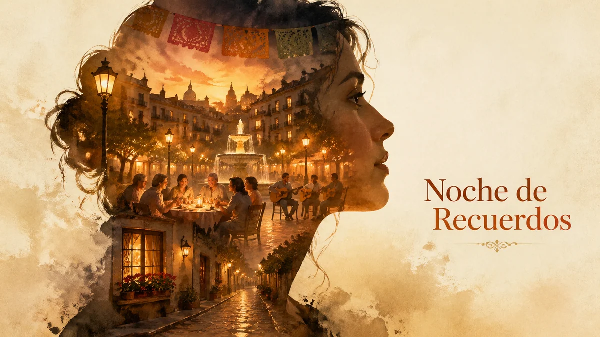


```text
请用自然简体中文改写并执行这个模板。所有可见文字必须使用简体中文，除 GPT Image 2 之外不要出现英文。\n\n模板名称：节日记忆侧影\n用途：创建一个人物侧脸剪影叙事海报，主题来自“Festival Memory Profile”。请保留核心结构：巨大人物侧脸剪影作为外轮廓，剪影内部生成一个完整、统一、强绑定主题的世界。根据用户替换的人物、地点、人生阶段、符号、情绪和短标题来调整场景。风格保持电影海报与梦幻水彩插画融合，柔和雾气、纸张颗粒、浅色刷痕、大面积留白，安静、高级、怀旧、有史诗感。避免品牌标志、真实校徽、名人脸、版权角色、廉价奇幻素材、硬拼贴、杂乱背景和长段文字。
```


### 8. 创作者起点剪影 (`maker-origin-silhouette`)


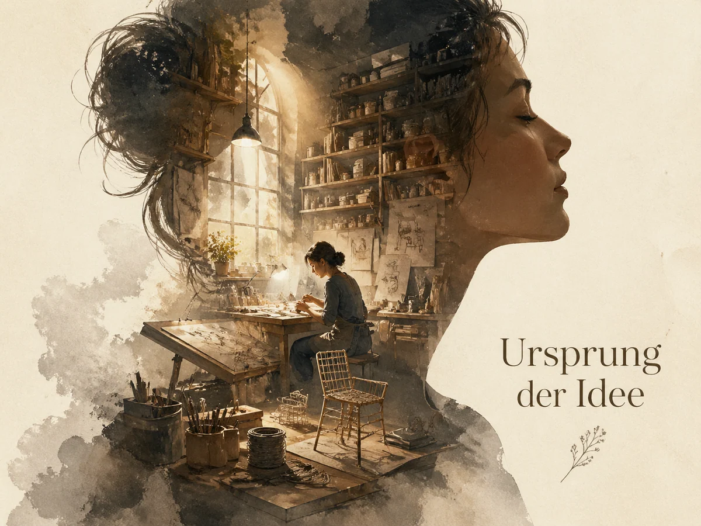


```text
请用自然简体中文改写并执行这个模板。所有可见文字必须使用简体中文，除 GPT Image 2 之外不要出现英文。\n\n模板名称：创作者起点剪影\n用途：创建一个人物侧脸剪影叙事海报，主题来自“Maker Origin Silhouette”。请保留核心结构：巨大人物侧脸剪影作为外轮廓，剪影内部生成一个完整、统一、强绑定主题的世界。根据用户替换的人物、地点、人生阶段、符号、情绪和短标题来调整场景。风格保持电影海报与梦幻水彩插画融合，柔和雾气、纸张颗粒、浅色刷痕、大面积留白，安静、高级、怀旧、有史诗感。避免品牌标志、真实校徽、名人脸、版权角色、廉价奇幻素材、硬拼贴、杂乱背景和长段文字。
```


### 9. 文学梦境侧影 (`literary-dream-profile`)


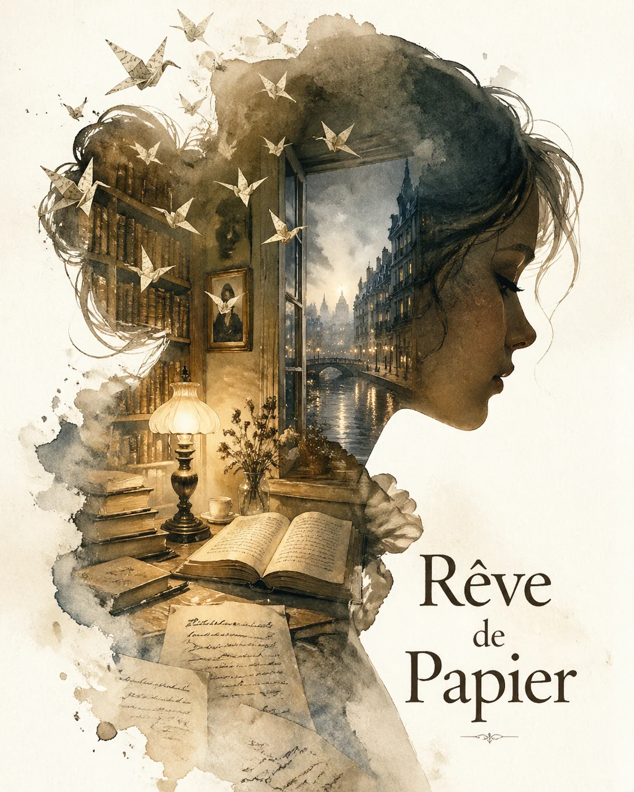


```text
请用自然简体中文改写并执行这个模板。所有可见文字必须使用简体中文，除 GPT Image 2 之外不要出现英文。\n\n模板名称：文学梦境侧影\n用途：创建一个人物侧脸剪影叙事海报，主题来自“Literary Dream Profile”。请保留核心结构：巨大人物侧脸剪影作为外轮廓，剪影内部生成一个完整、统一、强绑定主题的世界。根据用户替换的人物、地点、人生阶段、符号、情绪和短标题来调整场景。风格保持电影海报与梦幻水彩插画融合，柔和雾气、纸张颗粒、浅色刷痕、大面积留白，安静、高级、怀旧、有史诗感。避免品牌标志、真实校徽、名人脸、版权角色、廉价奇幻素材、硬拼贴、杂乱背景和长段文字。
```


## 丝绣花鸟模板 (`silk-embroidery-birds`)

用 GPT Image 2 生成柔和丝线花鸟图。


### 1. 高级花鸟胸针 (`couture-floral-brooch`)


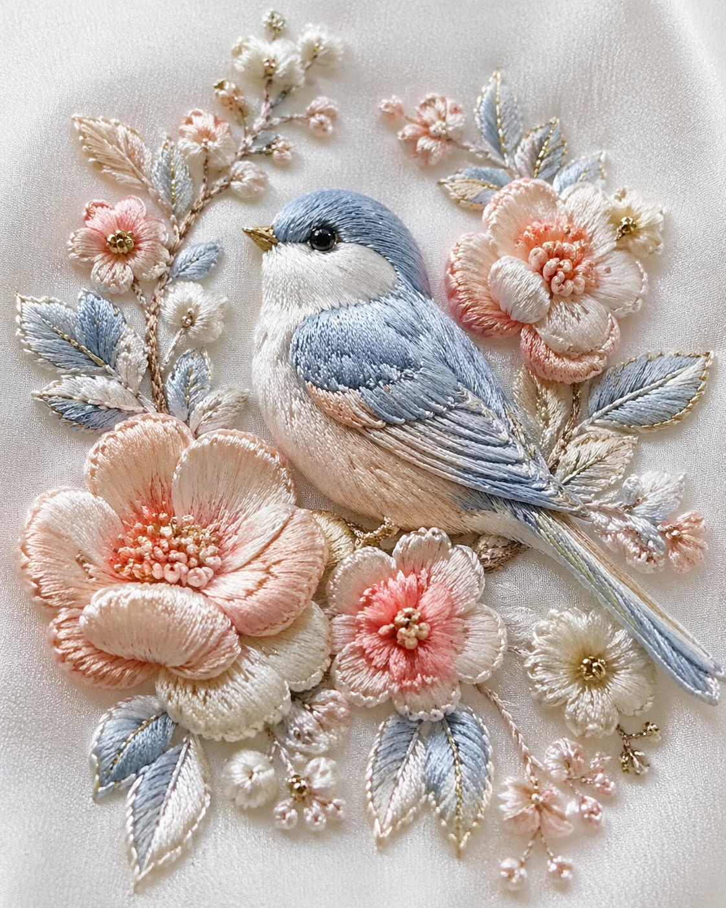


```text
创建一张《高级花鸟胸针》图像：花朵中的小鸟胸针或贴花特写。采用高级丝线刺绣和浅浮雕纤维艺术效果，背景为蚕丝白和奶白布面，使用奶白、浅蓝、淡粉、珊瑚粉、浅桃和淡金丝线。强调缎面针脚光泽、丝线堆叠、细腻投影、自然花枝、充足留白和温柔清新的手工质感。画面不要出现文字、logo、边框或随机符号；避免塑料白、过度甜腻的婚纱风、强反光和高饱和颜色。
```


### 2. 儿童房刺绣挂画 (`nursery-wall-textile`)


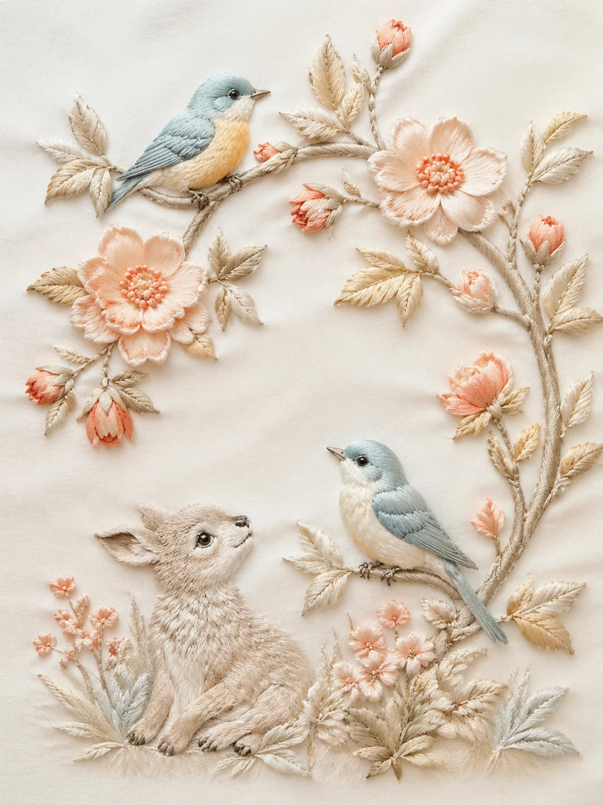


```text
创建一张《儿童房刺绣挂画》图像：小鸟和温柔林间动物组成的儿童房挂画。采用高级丝线刺绣和浅浮雕纤维艺术效果，背景为蚕丝白和奶白布面，使用奶白、浅蓝、淡粉、珊瑚粉、浅桃和淡金丝线。强调缎面针脚光泽、丝线堆叠、细腻投影、自然花枝、充足留白和温柔清新的手工质感。画面不要出现文字、logo、边框或随机符号；避免塑料白、过度甜腻的婚纱风、强反光和高饱和颜色。
```


### 3. 刺绣包装纹样 (`embroidered-product-wrap`)


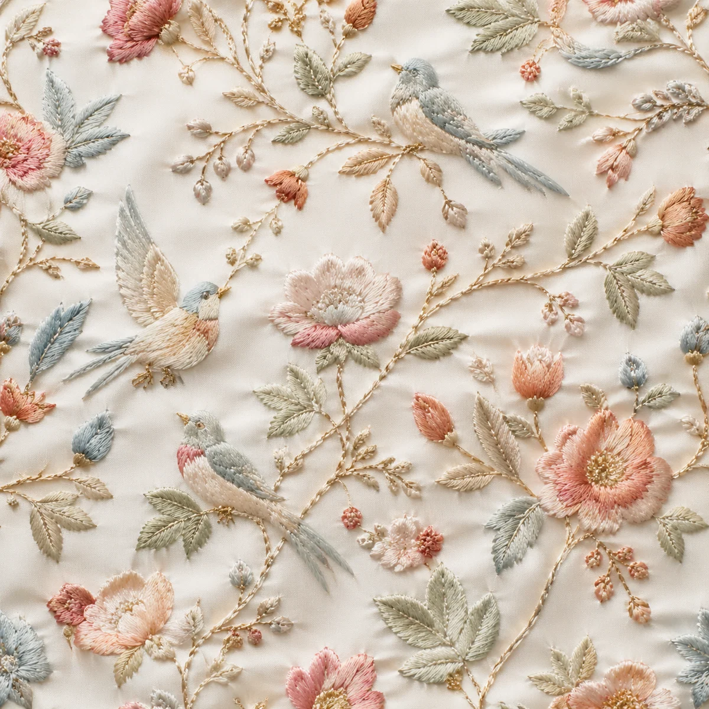


```text
创建一张《刺绣包装纹样》图像：小鸟、花枝、花瓣和叶片组成的高级包装纹样。采用高级丝线刺绣和浅浮雕纤维艺术效果，背景为蚕丝白和奶白布面，使用奶白、浅蓝、淡粉、珊瑚粉、浅桃和淡金丝线。强调缎面针脚光泽、丝线堆叠、细腻投影、自然花枝、充足留白和温柔清新的手工质感。画面不要出现文字、logo、边框或随机符号；避免塑料白、过度甜腻的婚纱风、强反光和高饱和颜色。
```


### 4. 月夜仙鹤丝绣 (`moonlit-crane-silkwork`)


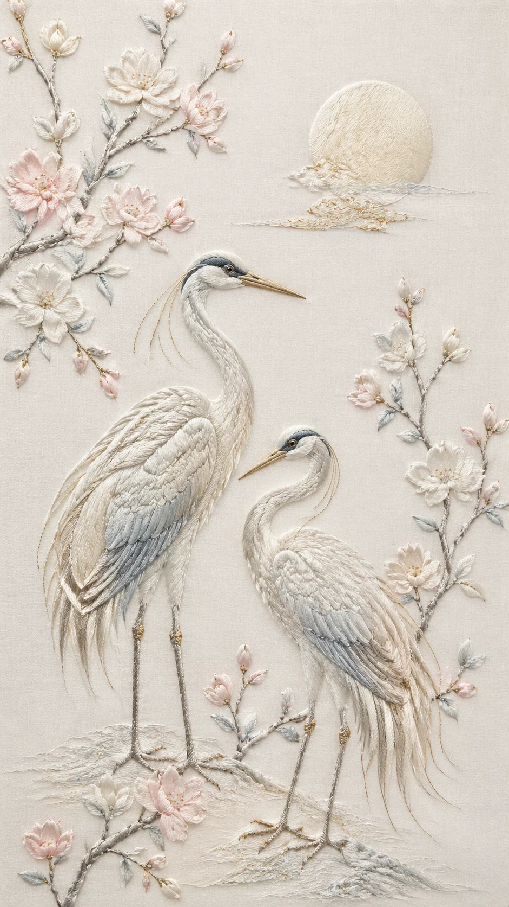


```text
创建一张《月夜仙鹤丝绣》图像：月光下的两只仙鹤和纤细花枝。采用高级丝线刺绣和浅浮雕纤维艺术效果，背景为蚕丝白和奶白布面，使用奶白、浅蓝、淡粉、珊瑚粉、浅桃和淡金丝线。强调缎面针脚光泽、丝线堆叠、细腻投影、自然花枝、充足留白和温柔清新的手工质感。画面不要出现文字、logo、边框或随机符号；避免塑料白、过度甜腻的婚纱风、强反光和高饱和颜色。
```


### 5. 贺卡花鸟 (`greeting-card-blossoms`)


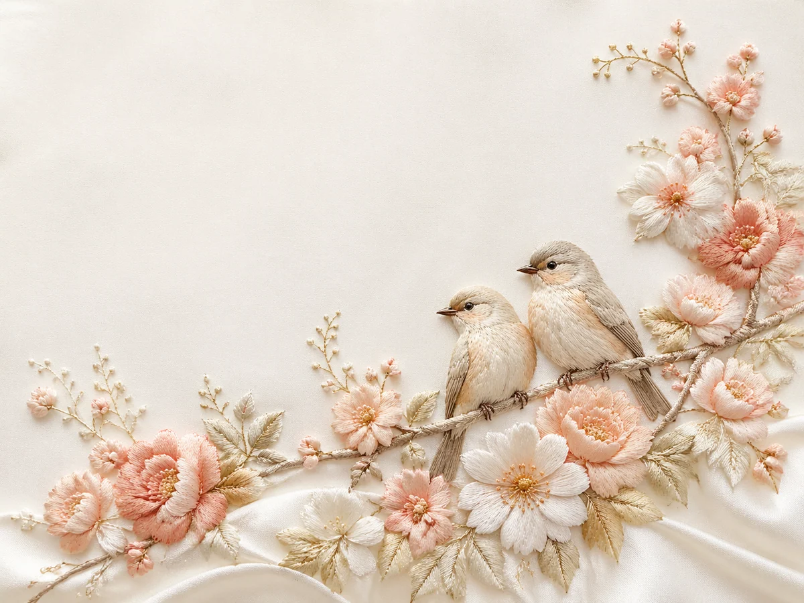


```text
创建一张《贺卡花鸟》图像：两只相依小鸟和轻柔花枝。采用高级丝线刺绣和浅浮雕纤维艺术效果，背景为蚕丝白和奶白布面，使用奶白、浅蓝、淡粉、珊瑚粉、浅桃和淡金丝线。强调缎面针脚光泽、丝线堆叠、细腻投影、自然花枝、充足留白和温柔清新的手工质感。画面不要出现文字、logo、边框或随机符号；避免塑料白、过度甜腻的婚纱风、强反光和高饱和颜色。
```


### 6. 宽幅花园枝条 (`wide-garden-branch-panel`)


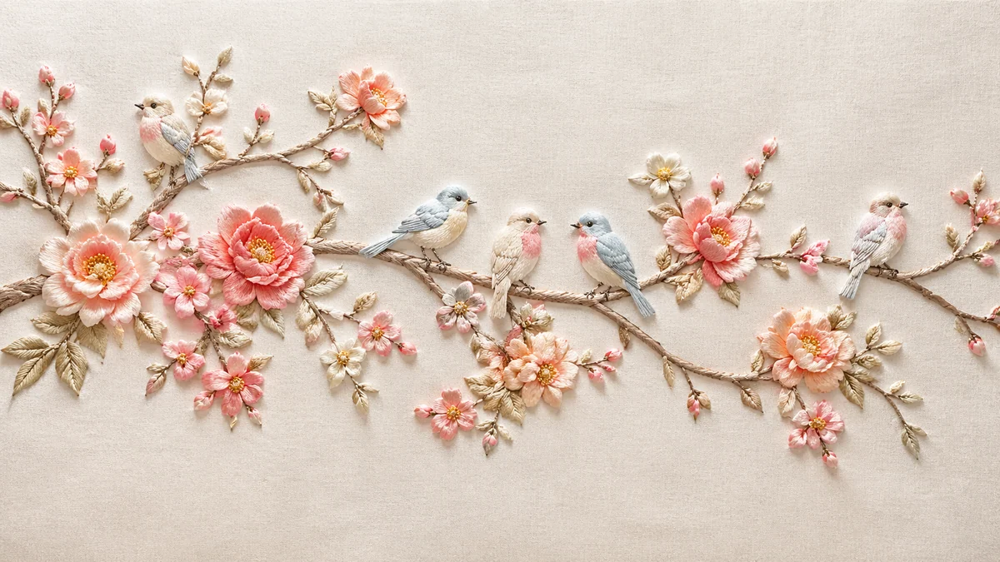


```text
创建一张《宽幅花园枝条》图像：横向延展的花园枝条和错落小鸟。采用高级丝线刺绣和浅浮雕纤维艺术效果，背景为蚕丝白和奶白布面，使用奶白、浅蓝、淡粉、珊瑚粉、浅桃和淡金丝线。强调缎面针脚光泽、丝线堆叠、细腻投影、自然花枝、充足留白和温柔清新的手工质感。画面不要出现文字、logo、边框或随机符号；避免塑料白、过度甜腻的婚纱风、强反光和高饱和颜色。
```


### 7. 竖幅玉兰鸣禽 (`vertical-magnolia-songbirds`)


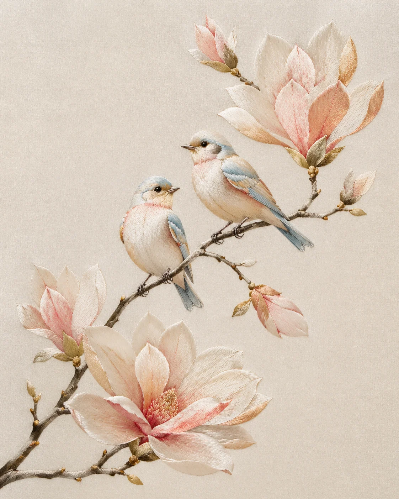


```text
创建一张《竖幅玉兰鸣禽》图像：一对鸣禽和竖向玉兰花枝。采用高级丝线刺绣和浅浮雕纤维艺术效果，背景为蚕丝白和奶白布面，使用奶白、浅蓝、淡粉、珊瑚粉、浅桃和淡金丝线。强调缎面针脚光泽、丝线堆叠、细腻投影、自然花枝、充足留白和温柔清新的手工质感。画面不要出现文字、logo、边框或随机符号；避免塑料白、过度甜腻的婚纱风、强反光和高饱和颜色。
```


### 8. 方形霜枝鸟群 (`square-frosted-aviary`)


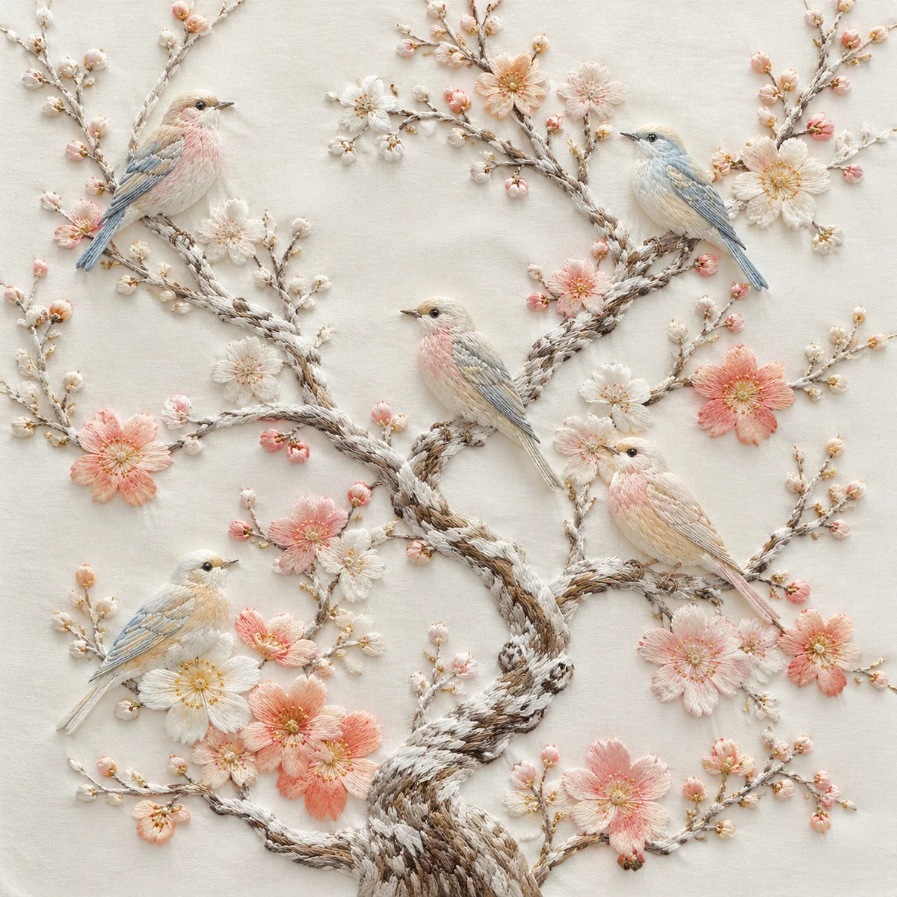


```text
创建一张《方形霜枝鸟群》图像：从下方向四角延展的霜雪花枝和五只小鸟。采用高级丝线刺绣和浅浮雕纤维艺术效果，背景为蚕丝白和奶白布面，使用奶白、浅蓝、淡粉、珊瑚粉、浅桃和淡金丝线。强调缎面针脚光泽、丝线堆叠、细腻投影、自然花枝、充足留白和温柔清新的手工质感。画面不要出现文字、logo、边框或随机符号；避免塑料白、过度甜腻的婚纱风、强反光和高饱和颜色。
```


### 9. 蚕丝白花鸟枝 (`silk-white-bird-branch`)


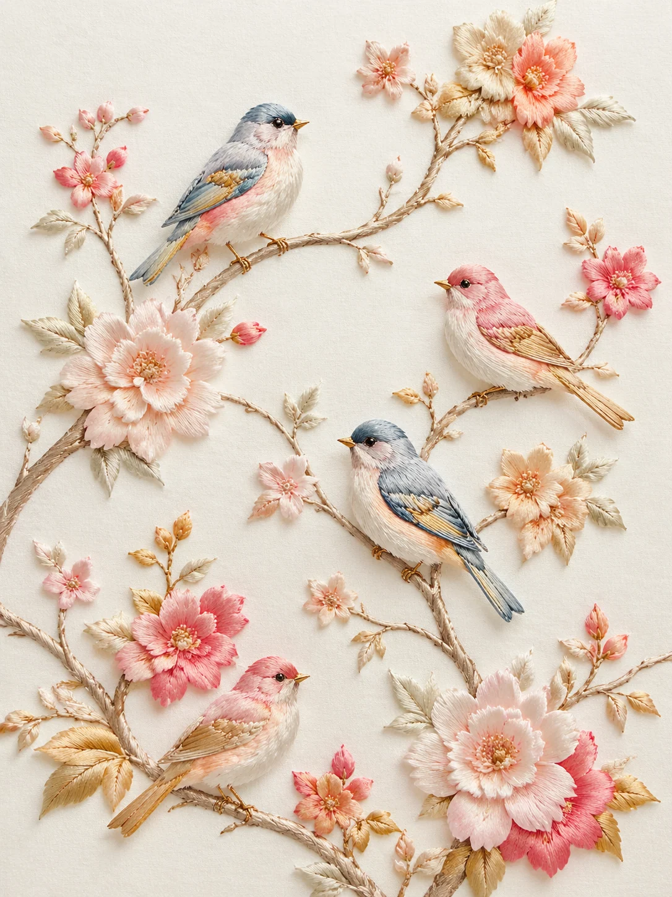


```text
创建一张《蚕丝白花鸟枝》图像：数只小鸟停在蜿蜒花枝上。采用高级丝线刺绣和浅浮雕纤维艺术效果，背景为蚕丝白和奶白布面，使用奶白、浅蓝、淡粉、珊瑚粉、浅桃和淡金丝线。强调缎面针脚光泽、丝线堆叠、细腻投影、自然花枝、充足留白和温柔清新的手工质感。画面不要出现文字、logo、边框或随机符号；避免塑料白、过度甜腻的婚纱风、强反光和高饱和颜色。
```


## 智能改图模板 (`smart-photo-remix`)

清理照片并生成适合社交分享的图片。


### 1. 暗色艺术海报 (`dark-artistic-photo-poster`)


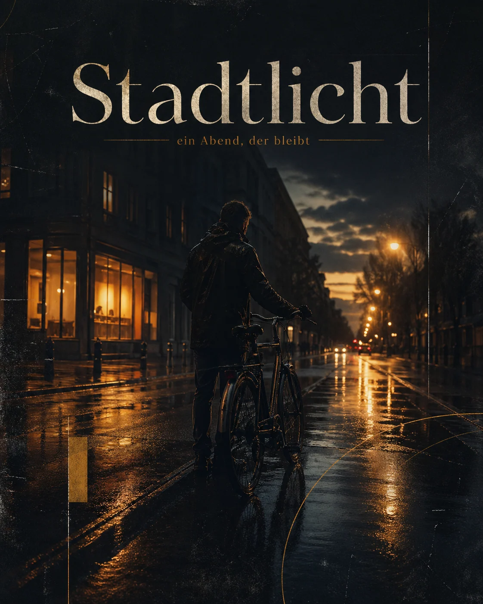


```text
使用 [参考图片] 作为源图，创建「暗色艺术海报」。先识别主体、背景、情绪和照片潜台词，保留真实主体、比例、表情、材质和记忆感，不要把主体换成另一个人、宠物、菜品、地点或产品。根据场景清理杂乱背景、弱化干扰物、改善光线和构图，并加入适合社交分享的短标题、花字、手绘标注或涂鸦。所有可见文字使用简体中文，文字要短、清楚、自然。可按用户补充要求加入日系明亮、韩系柔和、文艺 Instagram、可爱毛茸茸、暗色艺术等风格，但不要过度修图、不要伪造品牌标志或水印。
```


### 2. 产品生活方式图 (`product-lifestyle-soft-ad`)


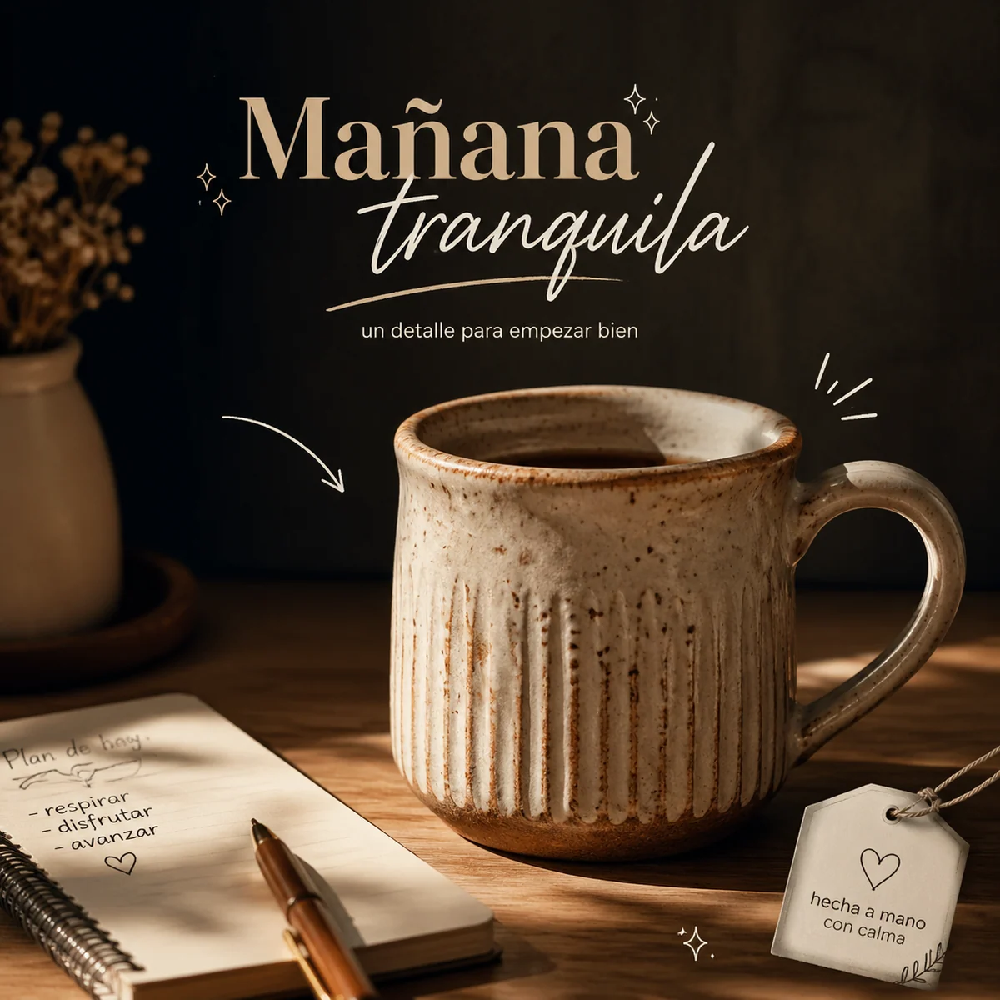


```text
使用 [参考图片] 作为源图，创建「产品生活方式图」。先识别主体、背景、情绪和照片潜台词，保留真实主体、比例、表情、材质和记忆感，不要把主体换成另一个人、宠物、菜品、地点或产品。根据场景清理杂乱背景、弱化干扰物、改善光线和构图，并加入适合社交分享的短标题、花字、手绘标注或涂鸦。所有可见文字使用简体中文，文字要短、清楚、自然。可按用户补充要求加入日系明亮、韩系柔和、文艺 Instagram、可爱毛茸茸、暗色艺术等风格，但不要过度修图、不要伪造品牌标志或水印。
```


### 3. 风景氛围刷新 (`landscape-mood-refresh`)


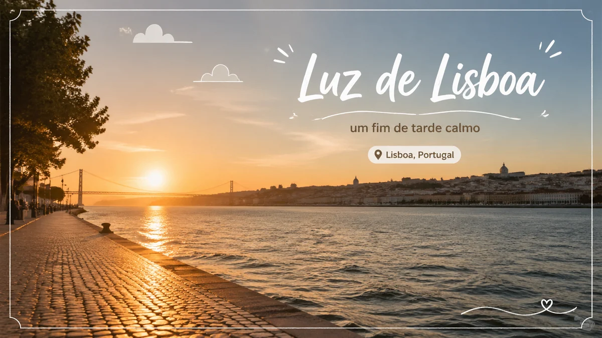


```text
使用 [参考图片] 作为源图，创建「风景氛围刷新」。先识别主体、背景、情绪和照片潜台词，保留真实主体、比例、表情、材质和记忆感，不要把主体换成另一个人、宠物、菜品、地点或产品。根据场景清理杂乱背景、弱化干扰物、改善光线和构图，并加入适合社交分享的短标题、花字、手绘标注或涂鸦。所有可见文字使用简体中文，文字要短、清楚、自然。可按用户补充要求加入日系明亮、韩系柔和、文艺 Instagram、可爱毛茸茸、暗色艺术等风格，但不要过度修图、不要伪造品牌标志或水印。
```


### 4. 情侣约会胶片 (`couple-date-film-edit`)


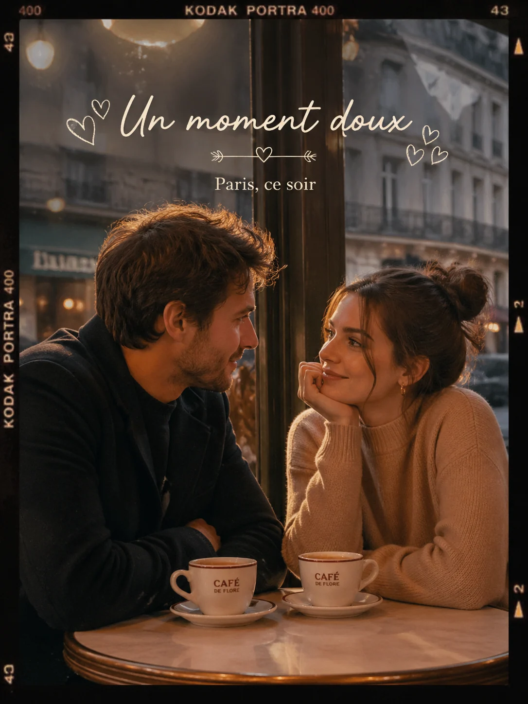


```text
使用 [参考图片] 作为源图，创建「情侣约会胶片」。先识别主体、背景、情绪和照片潜台词，保留真实主体、比例、表情、材质和记忆感，不要把主体换成另一个人、宠物、菜品、地点或产品。根据场景清理杂乱背景、弱化干扰物、改善光线和构图，并加入适合社交分享的短标题、花字、手绘标注或涂鸦。所有可见文字使用简体中文，文字要短、清楚、自然。可按用户补充要求加入日系明亮、韩系柔和、文艺 Instagram、可爱毛茸茸、暗色艺术等风格，但不要过度修图、不要伪造品牌标志或水印。
```


### 5. 旅行明信片改图 (`travel-postcard-cleanup`)


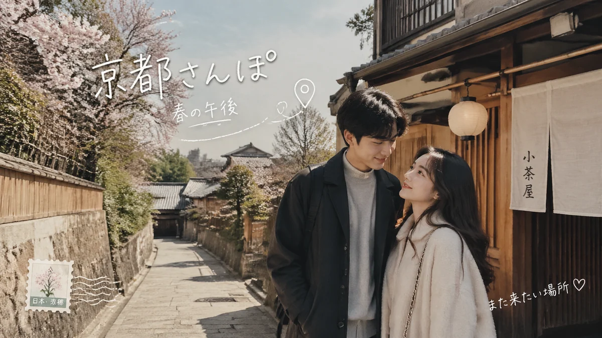


```text
使用 [参考图片] 作为源图，创建「旅行明信片改图」。先识别主体、背景、情绪和照片潜台词，保留真实主体、比例、表情、材质和记忆感，不要把主体换成另一个人、宠物、菜品、地点或产品。根据场景清理杂乱背景、弱化干扰物、改善光线和构图，并加入适合社交分享的短标题、花字、手绘标注或涂鸦。所有可见文字使用简体中文，文字要短、清楚、自然。可按用户补充要求加入日系明亮、韩系柔和、文艺 Instagram、可爱毛茸茸、暗色艺术等风格，但不要过度修图、不要伪造品牌标志或水印。
```


### 6. 亲子时刻卡片 (`family-moment-story-card`)


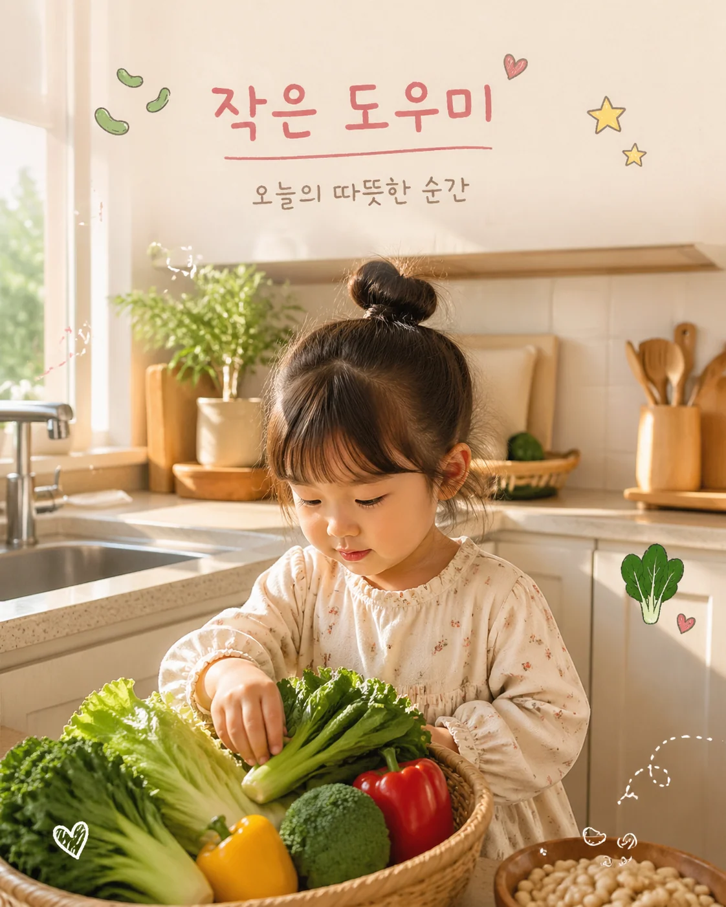


```text
使用 [参考图片] 作为源图，创建「亲子时刻卡片」。先识别主体、背景、情绪和照片潜台词，保留真实主体、比例、表情、材质和记忆感，不要把主体换成另一个人、宠物、菜品、地点或产品。根据场景清理杂乱背景、弱化干扰物、改善光线和构图，并加入适合社交分享的短标题、花字、手绘标注或涂鸦。所有可见文字使用简体中文，文字要短、清楚、自然。可按用户补充要求加入日系明亮、韩系柔和、文艺 Instagram、可爱毛茸茸、暗色艺术等风格，但不要过度修图、不要伪造品牌标志或水印。
```


### 7. 宠物可爱涂鸦 (`pet-cute-doodle-remix`)


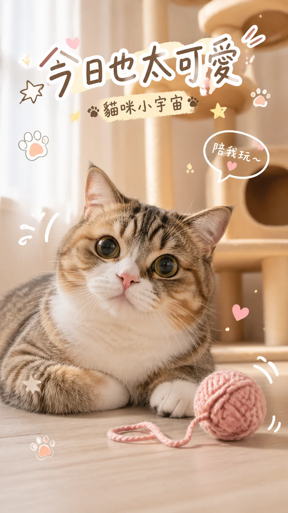


```text
使用 [参考图片] 作为源图，创建「宠物可爱涂鸦」。先识别主体、背景、情绪和照片潜台词，保留真实主体、比例、表情、材质和记忆感，不要把主体换成另一个人、宠物、菜品、地点或产品。根据场景清理杂乱背景、弱化干扰物、改善光线和构图，并加入适合社交分享的短标题、花字、手绘标注或涂鸦。所有可见文字使用简体中文，文字要短、清楚、自然。可按用户补充要求加入日系明亮、韩系柔和、文艺 Instagram、可爱毛茸茸、暗色艺术等风格，但不要过度修图、不要伪造品牌标志或水印。
```


### 8. 美食记忆改图 (`food-memory-polish`)


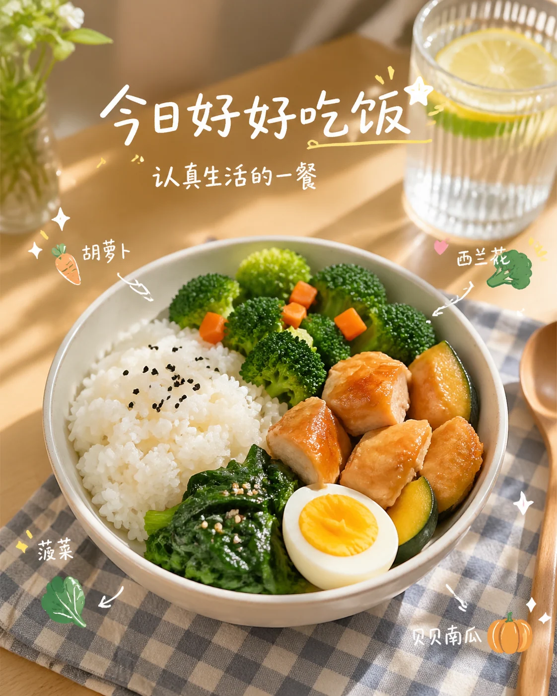


```text
使用 [参考图片] 作为源图，创建「美食记忆改图」。先识别主体、背景、情绪和照片潜台词，保留真实主体、比例、表情、材质和记忆感，不要把主体换成另一个人、宠物、菜品、地点或产品。根据场景清理杂乱背景、弱化干扰物、改善光线和构图，并加入适合社交分享的短标题、花字、手绘标注或涂鸦。所有可见文字使用简体中文，文字要短、清楚、自然。可按用户补充要求加入日系明亮、韩系柔和、文艺 Instagram、可爱毛茸茸、暗色艺术等风格，但不要过度修图、不要伪造品牌标志或水印。
```


### 9. 通用照片精修 (`universal-clean-photo-remix`)


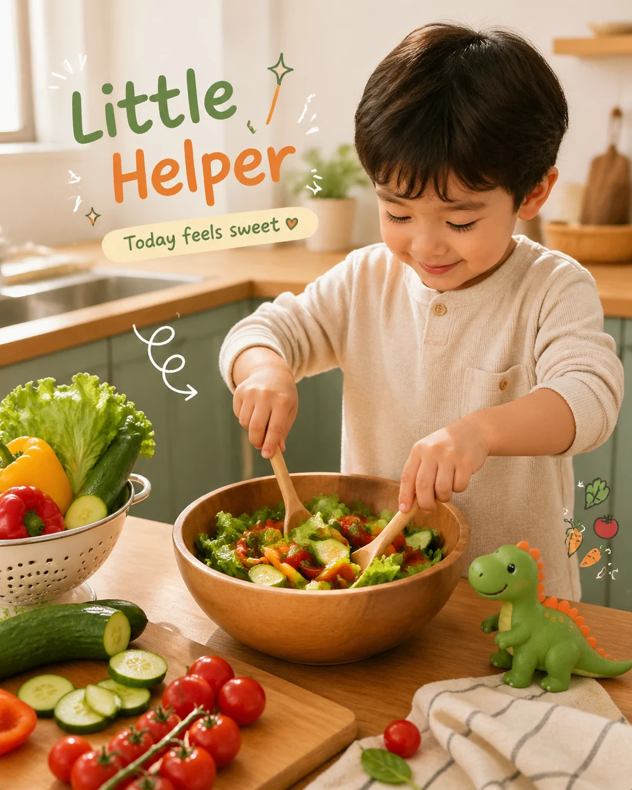


```text
使用 [参考图片] 作为源图，创建「通用照片精修」。先识别主体、背景、情绪和照片潜台词，保留真实主体、比例、表情、材质和记忆感，不要把主体换成另一个人、宠物、菜品、地点或产品。根据场景清理杂乱背景、弱化干扰物、改善光线和构图，并加入适合社交分享的短标题、花字、手绘标注或涂鸦。所有可见文字使用简体中文，文字要短、清楚、自然。可按用户补充要求加入日系明亮、韩系柔和、文艺 Instagram、可爱毛茸茸、暗色艺术等风格，但不要过度修图、不要伪造品牌标志或水印。
```


## 运动广告模板 (`sports-fashion-ad-posters`)

用 GPT Image 2 生成高端运动海报。


### 1. 篮球飞跃广告 (`basketball-elevation-ad`)


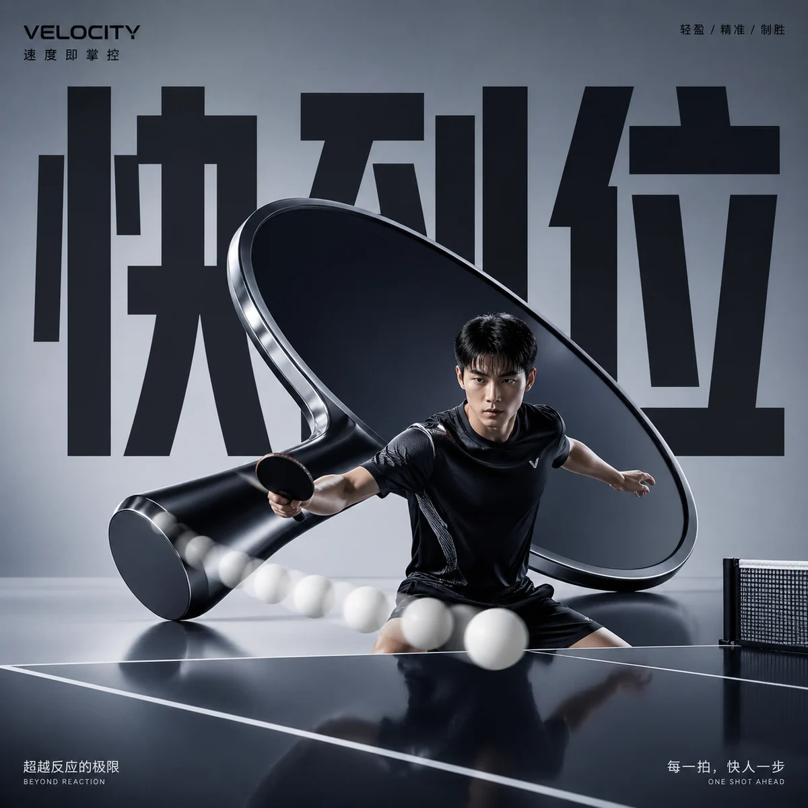


```text
为篮球创作一张前卫高端运动时尚广告。展示{运动员描述}，穿着{服装}。把该运动的标志性器材放大成纪念碑尺度，并重塑为{雕塑空间隐喻}。运动员以{姿态与关系}和巨型器材互动，画面要有掌控感、力量感和冷静的高级感。背景放置巨大的中文或指定关键词“{主关键词}”，使用粗体窄字并让人物与器材部分遮挡。使用{色彩方案}摄影棚、反光{表面类型}和细微{场地标线}，电影级商业灯光，锐利产品摄影，高端运动服广告美学，干净留白，动态几何构图。加入小型虚构品牌“{品牌名}”和短微文案“{标语}”。所有可见文字使用简体中文，避免真实 logo、球队标志、杂乱背景、肢体错误和难读文字。
```


### 2. 乒乓速度广告 (`table-tennis-speed-ad`)


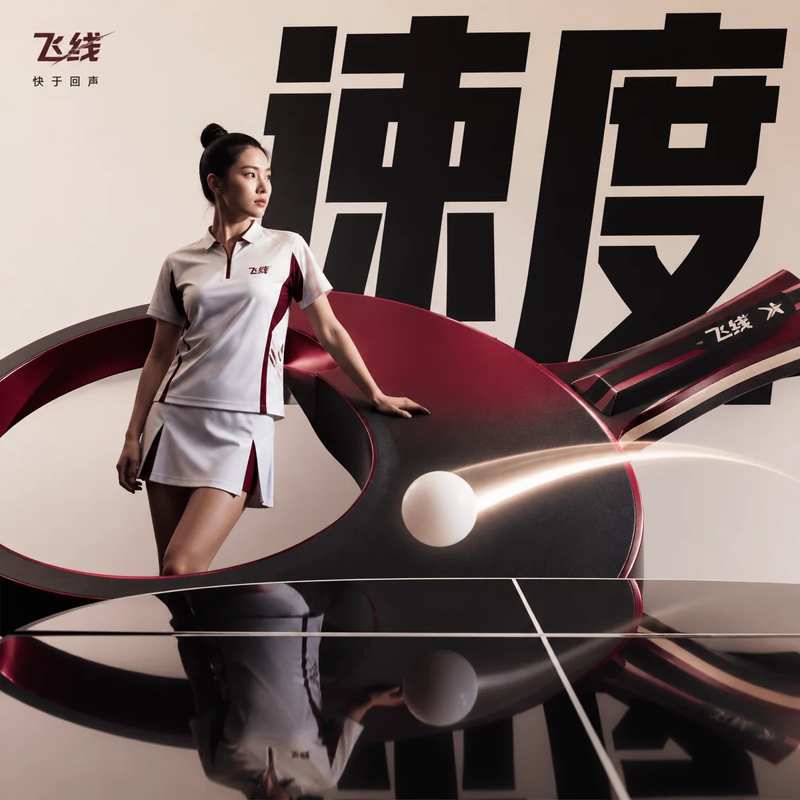


```text
为乒乓球创作一张前卫高端运动时尚广告。展示{运动员描述}，穿着{服装}。把该运动的标志性器材放大成纪念碑尺度，并重塑为{雕塑空间隐喻}。运动员以{姿态与关系}和巨型器材互动，画面要有掌控感、力量感和冷静的高级感。背景放置巨大的中文或指定关键词“{主关键词}”，使用粗体窄字并让人物与器材部分遮挡。使用{色彩方案}摄影棚、反光{表面类型}和细微{场地标线}，电影级商业灯光，锐利产品摄影，高端运动服广告美学，干净留白，动态几何构图。加入小型虚构品牌“{品牌名}”和短微文案“{标语}”。所有可见文字使用简体中文，避免真实 logo、球队标志、杂乱背景、肢体错误和难读文字。
```


### 3. 棒球力量广告 (`baseball-power-ad`)


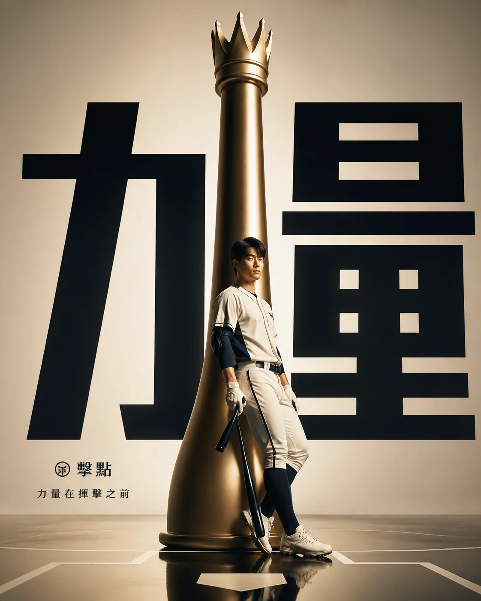


```text
为棒球创作一张前卫高端运动时尚广告。展示{运动员描述}，穿着{服装}。把该运动的标志性器材放大成纪念碑尺度，并重塑为{雕塑空间隐喻}。运动员以{姿态与关系}和巨型器材互动，画面要有掌控感、力量感和冷静的高级感。背景放置巨大的中文或指定关键词“{主关键词}”，使用粗体窄字并让人物与器材部分遮挡。使用{色彩方案}摄影棚、反光{表面类型}和细微{场地标线}，电影级商业灯光，锐利产品摄影，高端运动服广告美学，干净留白，动态几何构图。加入小型虚构品牌“{品牌名}”和短微文案“{标语}”。所有可见文字使用简体中文，避免真实 logo、球队标志、杂乱背景、肢体错误和难读文字。
```


### 4. 跆拳道专注广告 (`taekwondo-focus-ad`)


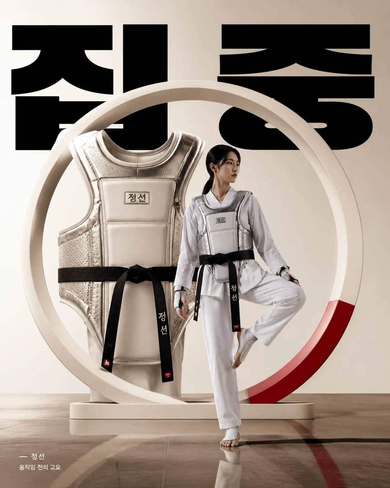


```text
为跆拳道创作一张前卫高端运动时尚广告。展示{运动员描述}，穿着{服装}。把该运动的标志性器材放大成纪念碑尺度，并重塑为{雕塑空间隐喻}。运动员以{姿态与关系}和巨型器材互动，画面要有掌控感、力量感和冷静的高级感。背景放置巨大的中文或指定关键词“{主关键词}”，使用粗体窄字并让人物与器材部分遮挡。使用{色彩方案}摄影棚、反光{表面类型}和细微{场地标线}，电影级商业灯光，锐利产品摄影，高端运动服广告美学，干净留白，动态几何构图。加入小型虚构品牌“{品牌名}”和短微文案“{标语}”。所有可见文字使用简体中文，避免真实 logo、球队标志、杂乱背景、肢体错误和难读文字。
```


### 5. 剑道秩序广告 (`kendo-discipline-ad`)


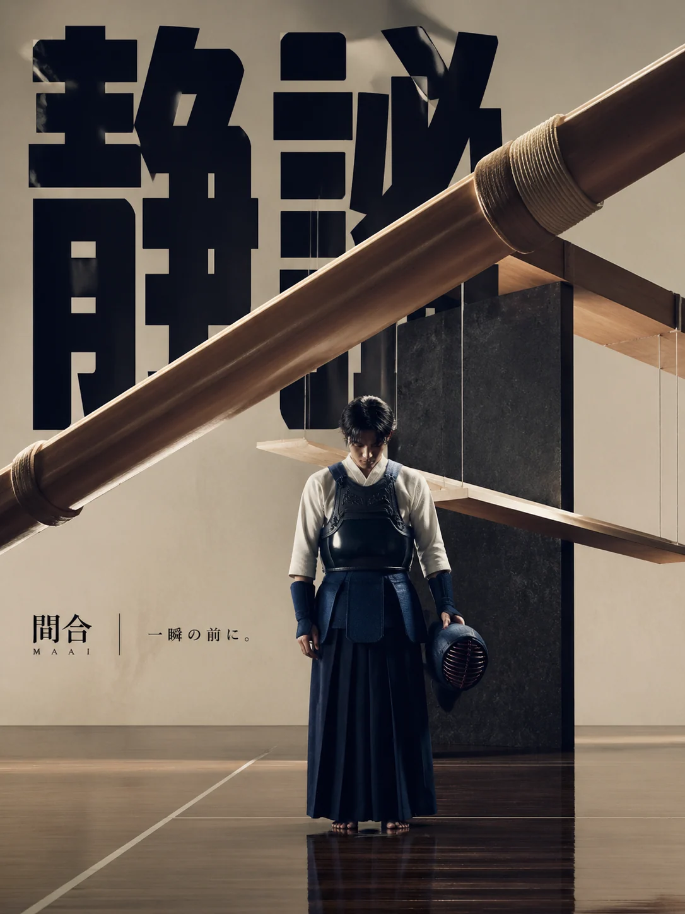


```text
为剑道创作一张前卫高端运动时尚广告。展示{运动员描述}，穿着{服装}。把该运动的标志性器材放大成纪念碑尺度，并重塑为{雕塑空间隐喻}。运动员以{姿态与关系}和巨型器材互动，画面要有掌控感、力量感和冷静的高级感。背景放置巨大的中文或指定关键词“{主关键词}”，使用粗体窄字并让人物与器材部分遮挡。使用{色彩方案}摄影棚、反光{表面类型}和细微{场地标线}，电影级商业灯光，锐利产品摄影，高端运动服广告美学，干净留白，动态几何构图。加入小型虚构品牌“{品牌名}”和短微文案“{标语}”。所有可见文字使用简体中文，避免真实 logo、球队标志、杂乱背景、肢体错误和难读文字。
```


### 6. 足球节奏广告 (`football-rhythm-ad`)


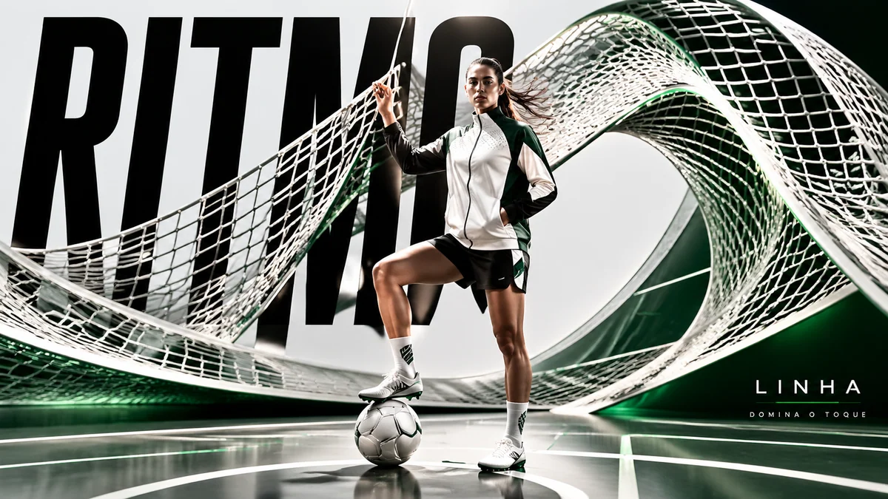


```text
为足球创作一张前卫高端运动时尚广告。展示{运动员描述}，穿着{服装}。把该运动的标志性器材放大成纪念碑尺度，并重塑为{雕塑空间隐喻}。运动员以{姿态与关系}和巨型器材互动，画面要有掌控感、力量感和冷静的高级感。背景放置巨大的中文或指定关键词“{主关键词}”，使用粗体窄字并让人物与器材部分遮挡。使用{色彩方案}摄影棚、反光{表面类型}和细微{场地标线}，电影级商业灯光，锐利产品摄影，高端运动服广告美学，干净留白，动态几何构图。加入小型虚构品牌“{品牌名}”和短微文案“{标语}”。所有可见文字使用简体中文，避免真实 logo、球队标志、杂乱背景、肢体错误和难读文字。
```


### 7. 自行车速度广告 (`cycling-velocity-ad`)


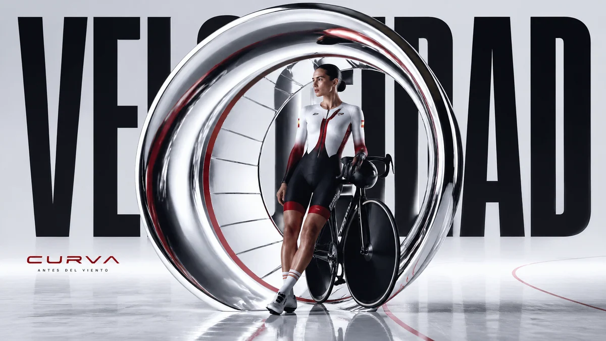


```text
为场地自行车创作一张前卫高端运动时尚广告。展示{运动员描述}，穿着{服装}。把该运动的标志性器材放大成纪念碑尺度，并重塑为{雕塑空间隐喻}。运动员以{姿态与关系}和巨型器材互动，画面要有掌控感、力量感和冷静的高级感。背景放置巨大的中文或指定关键词“{主关键词}”，使用粗体窄字并让人物与器材部分遮挡。使用{色彩方案}摄影棚、反光{表面类型}和细微{场地标线}，电影级商业灯光，锐利产品摄影，高端运动服广告美学，干净留白，动态几何构图。加入小型虚构品牌“{品牌名}”和短微文案“{标语}”。所有可见文字使用简体中文，避免真实 logo、球队标志、杂乱背景、肢体错误和难读文字。
```


### 8. 高山滑雪广告 (`alpine-ski-precision-ad`)


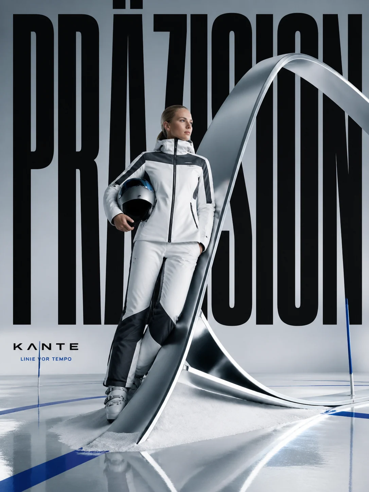


```text
为高山滑雪创作一张前卫高端运动时尚广告。展示{运动员描述}，穿着{服装}。把该运动的标志性器材放大成纪念碑尺度，并重塑为{雕塑空间隐喻}。运动员以{姿态与关系}和巨型器材互动，画面要有掌控感、力量感和冷静的高级感。背景放置巨大的中文或指定关键词“{主关键词}”，使用粗体窄字并让人物与器材部分遮挡。使用{色彩方案}摄影棚、反光{表面类型}和细微{场地标线}，电影级商业灯光，锐利产品摄影，高端运动服广告美学，干净留白，动态几何构图。加入小型虚构品牌“{品牌名}”和短微文案“{标语}”。所有可见文字使用简体中文，避免真实 logo、球队标志、杂乱背景、肢体错误和难读文字。
```


### 9. 击剑精准广告 (`fencing-accuracy-ad`)


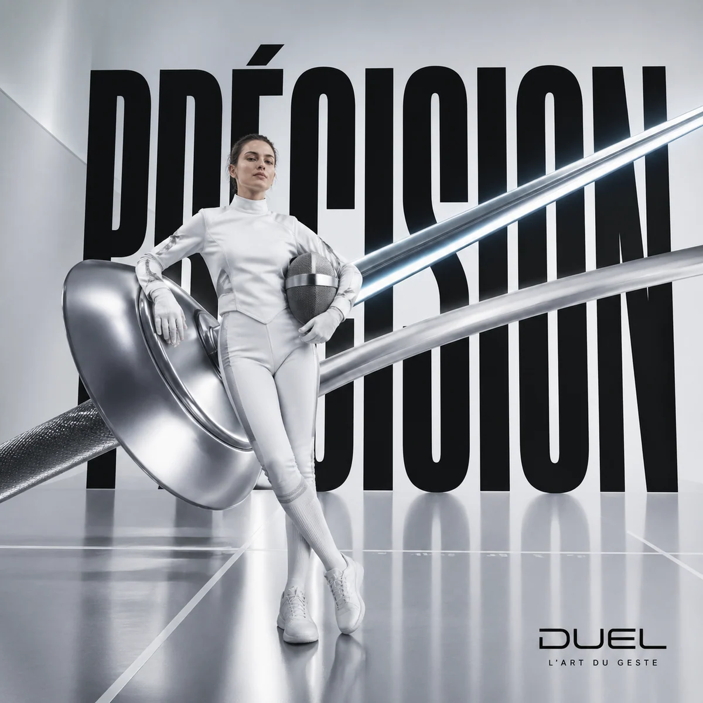


```text
为击剑创作一张前卫高端运动时尚广告。展示{运动员描述}，穿着{服装}。把该运动的标志性器材放大成纪念碑尺度，并重塑为{雕塑空间隐喻}。运动员以{姿态与关系}和巨型器材互动，画面要有掌控感、力量感和冷静的高级感。背景放置巨大的中文或指定关键词“{主关键词}”，使用粗体窄字并让人物与器材部分遮挡。使用{色彩方案}摄影棚、反光{表面类型}和细微{场地标线}，电影级商业灯光，锐利产品摄影，高端运动服广告美学，干净留白，动态几何构图。加入小型虚构品牌“{品牌名}”和短微文案“{标语}”。所有可见文字使用简体中文，避免真实 logo、球队标志、杂乱背景、肢体错误和难读文字。
```


## 气质三选海报 (`style-persona-choice-posters`)

一张自拍生成三种穿搭气质。


### 1. 三风格气质海报 (`three-style-persona-poster`)


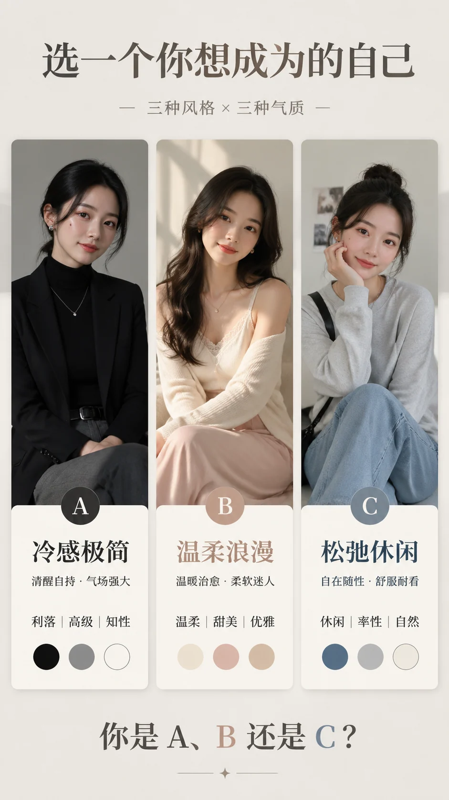


```text
使用用户上传的自拍作为身份参考，生成一张 9:16 竖版「三风格气质海报」。画面必须展示同一个人的 A / B / C 三种穿搭气质版本。保留同一张脸、年龄感、身形、肤质和整体气质；不要换脸、过度美颜、改变五官或改变身体比例。只允许改变服装、发型、妆容强弱、光线、姿态和色彩。\n\n版式使用高级时尚杂志与干净社媒海报风格：三列或三张轻微错位卡片，低饱和配色，留白充足，轻阴影，字体清晰。每一列包含风格名、一句短情绪标签、3 到 4 个穿搭关键词和 3 个色块。所有可见文字使用简体中文，文字要短、清楚、可读。底部加入 A/B/C 互动选择引导。不要品牌 logo，不要长段分析，不要电商详情页风格。
```


### 2. 清冷温柔松弛三选一 (`cold-soft-relaxed-choice`)


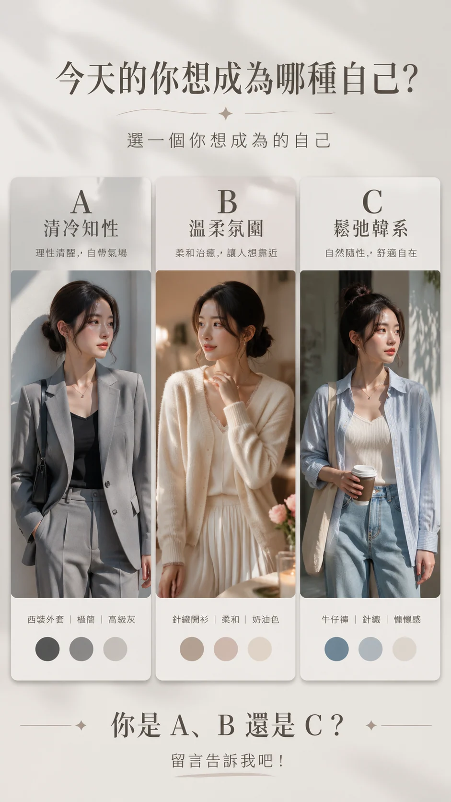


```text
使用用户上传的自拍作为身份参考，生成一张 9:16 竖版「清冷温柔松弛三选一」。画面必须展示同一个人的 A / B / C 三种穿搭气质版本。保留同一张脸、年龄感、身形、肤质和整体气质；不要换脸、过度美颜、改变五官或改变身体比例。只允许改变服装、发型、妆容强弱、光线、姿态和色彩。\n\n版式使用高级时尚杂志与干净社媒海报风格：三列或三张轻微错位卡片，低饱和配色，留白充足，轻阴影，字体清晰。每一列包含风格名、一句短情绪标签、3 到 4 个穿搭关键词和 3 个色块。所有可见文字使用简体中文，文字要短、清楚、可读。底部加入 A/B/C 互动选择引导。不要品牌 logo，不要长段分析，不要电商详情页风格。
```


### 3. 生活场景风格三选一 (`life-scenario-style-trio`)


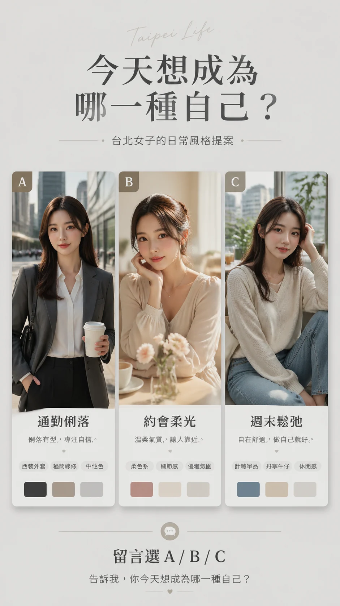


```text
使用用户上传的自拍作为身份参考，生成一张 9:16 竖版「生活场景风格三选一」。画面必须展示同一个人的 A / B / C 三种穿搭气质版本。保留同一张脸、年龄感、身形、肤质和整体气质；不要换脸、过度美颜、改变五官或改变身体比例。只允许改变服装、发型、妆容强弱、光线、姿态和色彩。\n\n版式使用高级时尚杂志与干净社媒海报风格：三列或三张轻微错位卡片，低饱和配色，留白充足，轻阴影，字体清晰。每一列包含风格名、一句短情绪标签、3 到 4 个穿搭关键词和 3 个色块。所有可见文字使用简体中文，文字要短、清楚、可读。底部加入 A/B/C 互动选择引导。不要品牌 logo，不要长段分析，不要电商详情页风格。
```


### 4. 韩系极简风格三选一 (`korean-minimal-style-trio`)


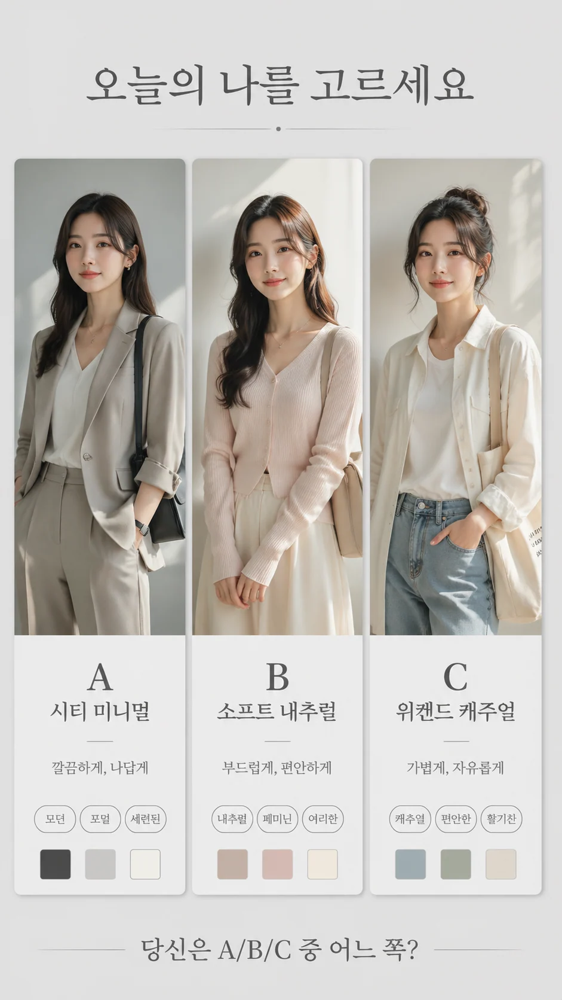


```text
使用用户上传的自拍作为身份参考，生成一张 9:16 竖版「韩系极简风格三选一」。画面必须展示同一个人的 A / B / C 三种穿搭气质版本。保留同一张脸、年龄感、身形、肤质和整体气质；不要换脸、过度美颜、改变五官或改变身体比例。只允许改变服装、发型、妆容强弱、光线、姿态和色彩。\n\n版式使用高级时尚杂志与干净社媒海报风格：三列或三张轻微错位卡片，低饱和配色，留白充足，轻阴影，字体清晰。每一列包含风格名、一句短情绪标签、3 到 4 个穿搭关键词和 3 个色块。所有可见文字使用简体中文，文字要短、清楚、可读。底部加入 A/B/C 互动选择引导。不要品牌 logo，不要长段分析，不要电商详情页风格。
```


### 5. 日杂风格三选一 (`japanese-magazine-style-choice`)


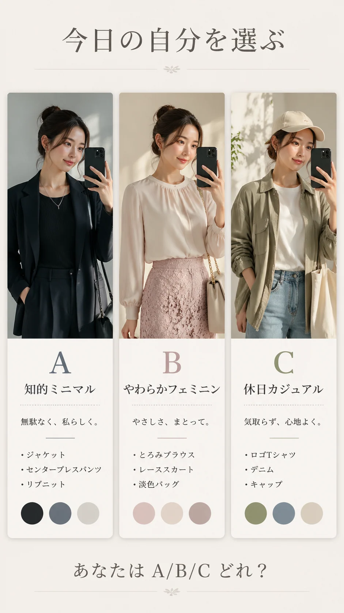


```text
使用用户上传的自拍作为身份参考，生成一张 9:16 竖版「日杂风格三选一」。画面必须展示同一个人的 A / B / C 三种穿搭气质版本。保留同一张脸、年龄感、身形、肤质和整体气质；不要换脸、过度美颜、改变五官或改变身体比例。只允许改变服装、发型、妆容强弱、光线、姿态和色彩。\n\n版式使用高级时尚杂志与干净社媒海报风格：三列或三张轻微错位卡片，低饱和配色，留白充足，轻阴影，字体清晰。每一列包含风格名、一句短情绪标签、3 到 4 个穿搭关键词和 3 个色块。所有可见文字使用简体中文，文字要短、清楚、可读。底部加入 A/B/C 互动选择引导。不要品牌 logo，不要长段分析，不要电商详情页风格。
```


### 6. 葡语 Lookbook 三选一 (`portuguese-lookbook-choice`)


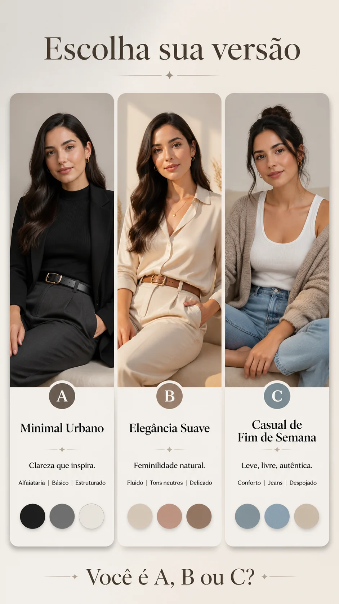


```text
使用用户上传的自拍作为身份参考，生成一张 9:16 竖版「葡语 Lookbook 三选一」。画面必须展示同一个人的 A / B / C 三种穿搭气质版本。保留同一张脸、年龄感、身形、肤质和整体气质；不要换脸、过度美颜、改变五官或改变身体比例。只允许改变服装、发型、妆容强弱、光线、姿态和色彩。\n\n版式使用高级时尚杂志与干净社媒海报风格：三列或三张轻微错位卡片，低饱和配色，留白充足，轻阴影，字体清晰。每一列包含风格名、一句短情绪标签、3 到 4 个穿搭关键词和 3 个色块。所有可见文字使用简体中文，文字要短、清楚、可读。底部加入 A/B/C 互动选择引导。不要品牌 logo，不要长段分析，不要电商详情页风格。
```


### 7. 西语社媒风格海报 (`spanish-social-choice-poster`)


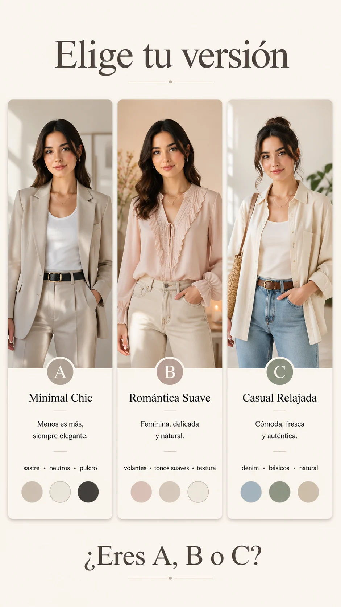


```text
使用用户上传的自拍作为身份参考，生成一张 9:16 竖版「西语社媒风格海报」。画面必须展示同一个人的 A / B / C 三种穿搭气质版本。保留同一张脸、年龄感、身形、肤质和整体气质；不要换脸、过度美颜、改变五官或改变身体比例。只允许改变服装、发型、妆容强弱、光线、姿态和色彩。\n\n版式使用高级时尚杂志与干净社媒海报风格：三列或三张轻微错位卡片，低饱和配色，留白充足，轻阴影，字体清晰。每一列包含风格名、一句短情绪标签、3 到 4 个穿搭关键词和 3 个色块。所有可见文字使用简体中文，文字要短、清楚、可读。底部加入 A/B/C 互动选择引导。不要品牌 logo，不要长段分析，不要电商详情页风格。
```


### 8. 德语胶囊衣橱对比 (`german-capsule-style-comparison`)


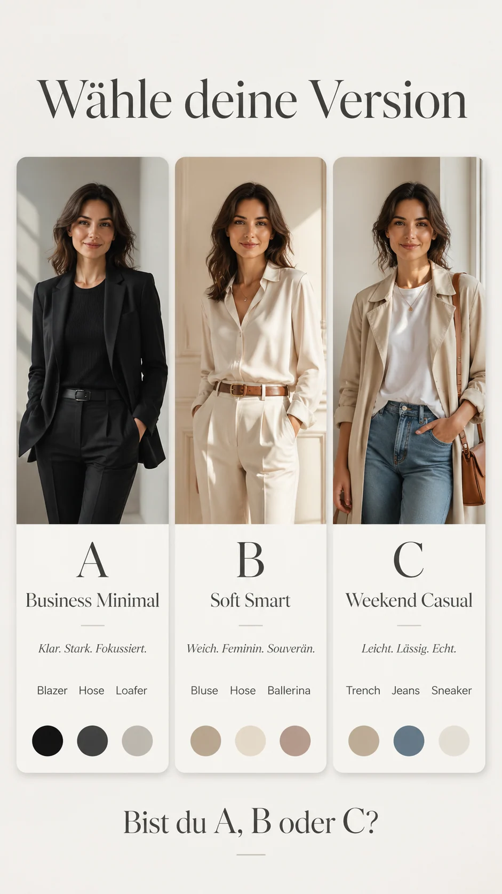


```text
使用用户上传的自拍作为身份参考，生成一张 9:16 竖版「德语胶囊衣橱对比」。画面必须展示同一个人的 A / B / C 三种穿搭气质版本。保留同一张脸、年龄感、身形、肤质和整体气质；不要换脸、过度美颜、改变五官或改变身体比例。只允许改变服装、发型、妆容强弱、光线、姿态和色彩。\n\n版式使用高级时尚杂志与干净社媒海报风格：三列或三张轻微错位卡片，低饱和配色，留白充足，轻阴影，字体清晰。每一列包含风格名、一句短情绪标签、3 到 4 个穿搭关键词和 3 个色块。所有可见文字使用简体中文，文字要短、清楚、可读。底部加入 A/B/C 互动选择引导。不要品牌 logo，不要长段分析，不要电商详情页风格。
```


### 9. 法式编辑风格三选一 (`french-editorial-style-trio`)


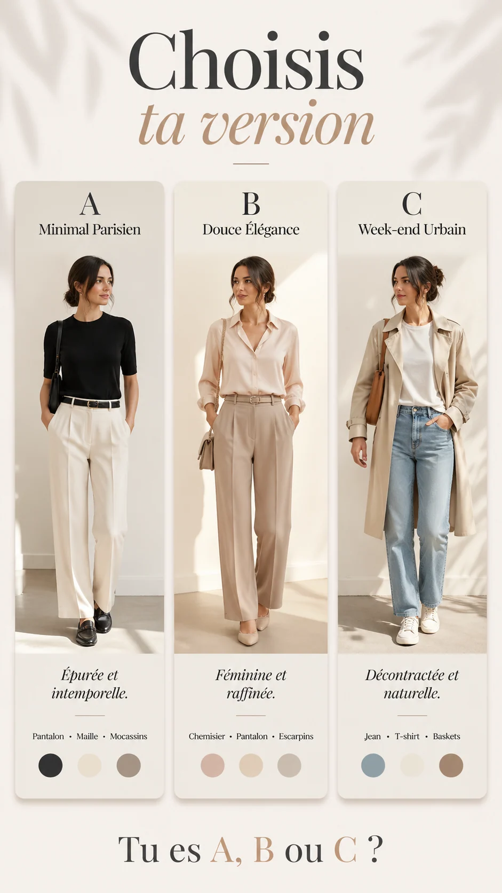


```text
使用用户上传的自拍作为身份参考，生成一张 9:16 竖版「法式编辑风格三选一」。画面必须展示同一个人的 A / B / C 三种穿搭气质版本。保留同一张脸、年龄感、身形、肤质和整体气质；不要换脸、过度美颜、改变五官或改变身体比例。只允许改变服装、发型、妆容强弱、光线、姿态和色彩。\n\n版式使用高级时尚杂志与干净社媒海报风格：三列或三张轻微错位卡片，低饱和配色，留白充足，轻阴影，字体清晰。每一列包含风格名、一句短情绪标签、3 到 4 个穿搭关键词和 3 个色块。所有可见文字使用简体中文，文字要短、清楚、可读。底部加入 A/B/C 互动选择引导。不要品牌 logo，不要长段分析，不要电商详情页风格。
```


## 城市纸雕模板 (`time-slice-city-dioramas`)

用 GPT Image 2 生成城市纸雕。


### 1. 城市纪念画 (`editorial-city-keepsake`)


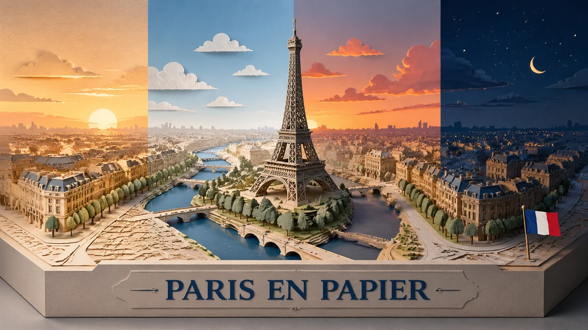


```text
生成一张高级 3D 分层纸雕城市微缩景观，用于高级城市纪念画和印刷视觉。城市从结构化地图中生长出来，以 [HERO_LANDMARK] 作为唯一主地标，只出现一次且建筑准确。使用哑光卡纸、轻黏土浮雕、分层纸建筑、真实地域自然元素和精致几何构图。画面包含四道竖向时间切片：清晨、白天、夕阳、星夜。加入 [FLAG_DESCRIPTION] 旗杆，并在底座用 [CAPTION_COLOR] 压印文字 [CAPTION_TEXT]。所有可见文字使用简体中文或用户指定语言。不要人物、重复地标、克隆建筑、随机标志或品牌 logo。
```


### 2. 节庆城市地图 (`festival-city-map`)


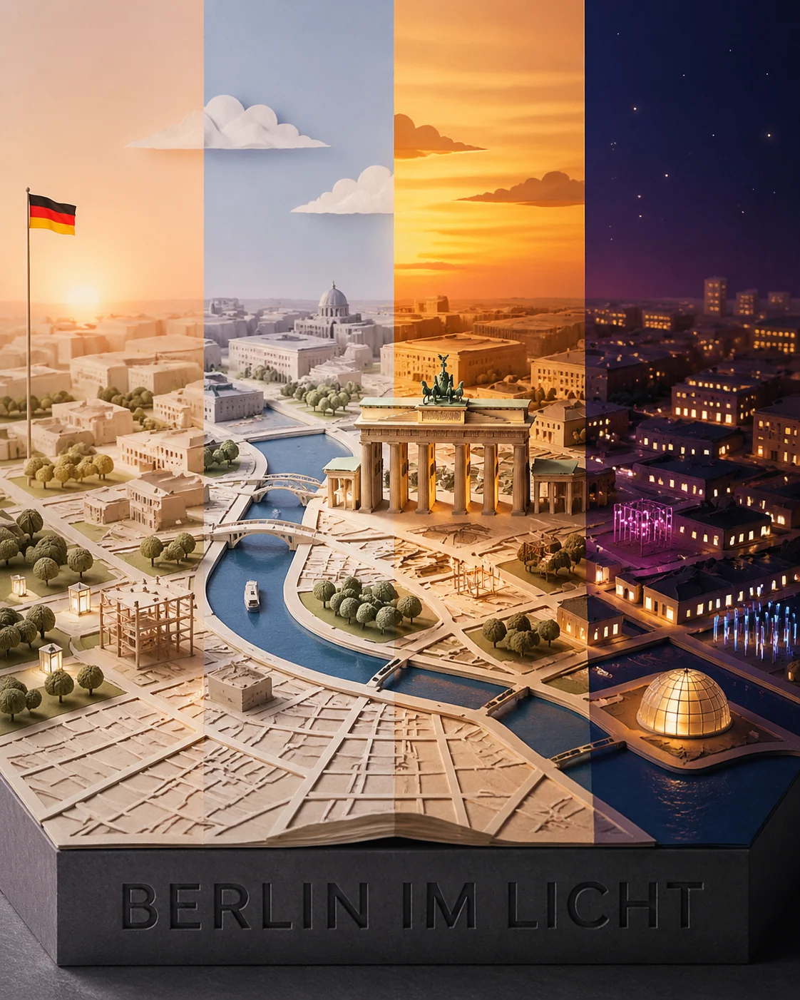


```text
生成一张高级 3D 分层纸雕城市微缩景观，用于城市节庆或活动地图纸雕。城市从结构化地图中生长出来，以 [HERO_LANDMARK] 作为唯一主地标，只出现一次且建筑准确。使用哑光卡纸、轻黏土浮雕、分层纸建筑、真实地域自然元素和精致几何构图。画面包含四道竖向时间切片：清晨、白天、夕阳、星夜。加入 [FLAG_DESCRIPTION] 旗杆，并在底座用 [CAPTION_COLOR] 压印文字 [CAPTION_TEXT]。所有可见文字使用简体中文或用户指定语言。不要人物、重复地标、克隆建筑、随机标志或品牌 logo。
```


### 3. 文化街区微缩景 (`cultural-quarter-miniature`)


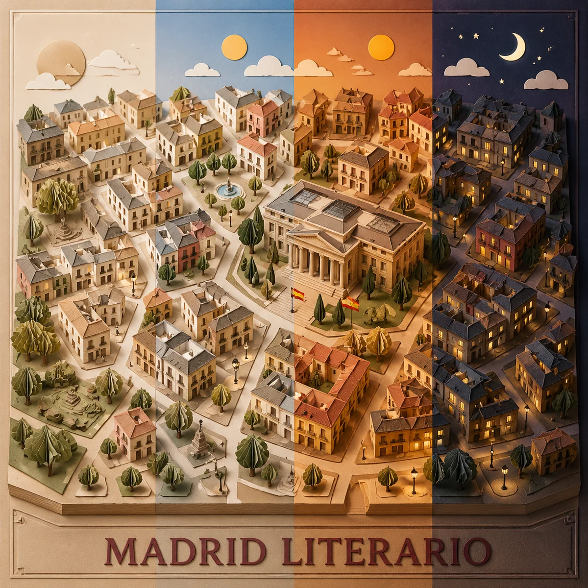


```text
生成一张高级 3D 分层纸雕城市微缩景观，用于文化建筑和街区微缩景。城市从结构化地图中生长出来，以 [HERO_LANDMARK] 作为唯一主地标，只出现一次且建筑准确。使用哑光卡纸、轻黏土浮雕、分层纸建筑、真实地域自然元素和精致几何构图。画面包含四道竖向时间切片：清晨、白天、夕阳、星夜。加入 [FLAG_DESCRIPTION] 旗杆，并在底座用 [CAPTION_COLOR] 压印文字 [CAPTION_TEXT]。所有可见文字使用简体中文或用户指定语言。不要人物、重复地标、克隆建筑、随机标志或品牌 logo。
```


### 4. 山城入口纸雕 (`mountain-gateway-city`)


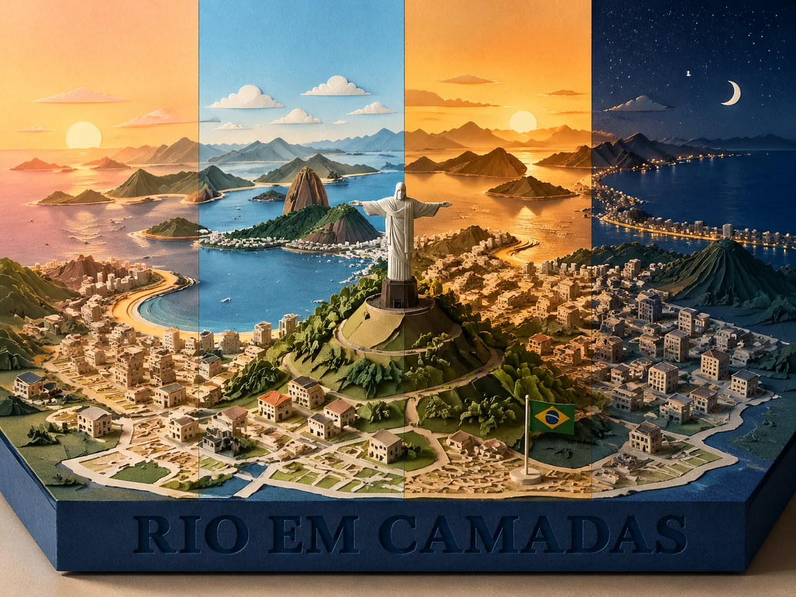


```text
生成一张高级 3D 分层纸雕城市微缩景观，用于山地城市目的地视觉。城市从结构化地图中生长出来，以 [HERO_LANDMARK] 作为唯一主地标，只出现一次且建筑准确。使用哑光卡纸、轻黏土浮雕、分层纸建筑、真实地域自然元素和精致几何构图。画面包含四道竖向时间切片：清晨、白天、夕阳、星夜。加入 [FLAG_DESCRIPTION] 旗杆，并在底座用 [CAPTION_COLOR] 压印文字 [CAPTION_TEXT]。所有可见文字使用简体中文或用户指定语言。不要人物、重复地标、克隆建筑、随机标志或品牌 logo。
```


### 5. 港口海岸纸雕 (`harbor-coast-paper-city`)


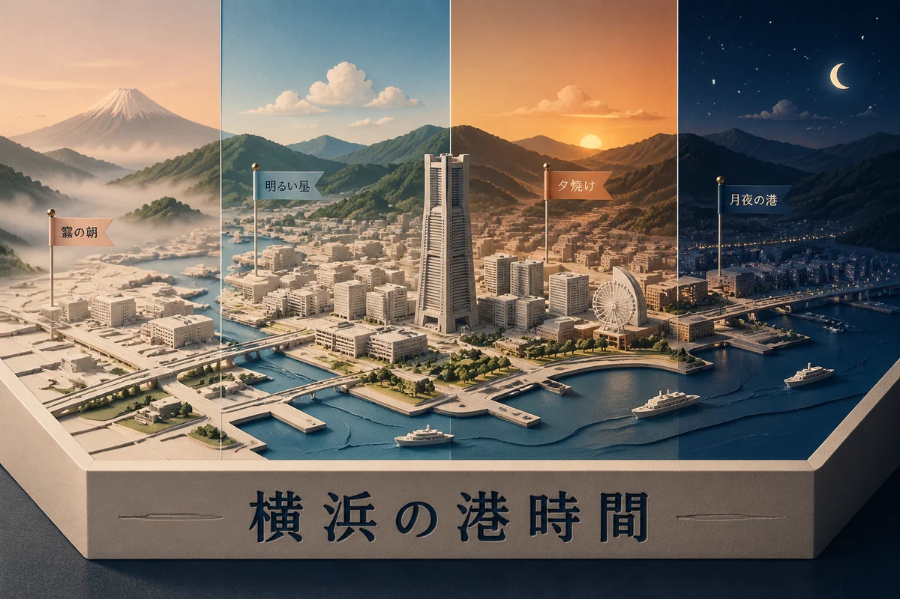


```text
生成一张高级 3D 分层纸雕城市微缩景观，用于海岸或港口城市宣传图。城市从结构化地图中生长出来，以 [HERO_LANDMARK] 作为唯一主地标，只出现一次且建筑准确。使用哑光卡纸、轻黏土浮雕、分层纸建筑、真实地域自然元素和精致几何构图。画面包含四道竖向时间切片：清晨、白天、夕阳、星夜。加入 [FLAG_DESCRIPTION] 旗杆，并在底座用 [CAPTION_COLOR] 压印文字 [CAPTION_TEXT]。所有可见文字使用简体中文或用户指定语言。不要人物、重复地标、克隆建筑、随机标志或品牌 logo。
```


### 6. 天际线四季切片 (`skyline-season-slices`)


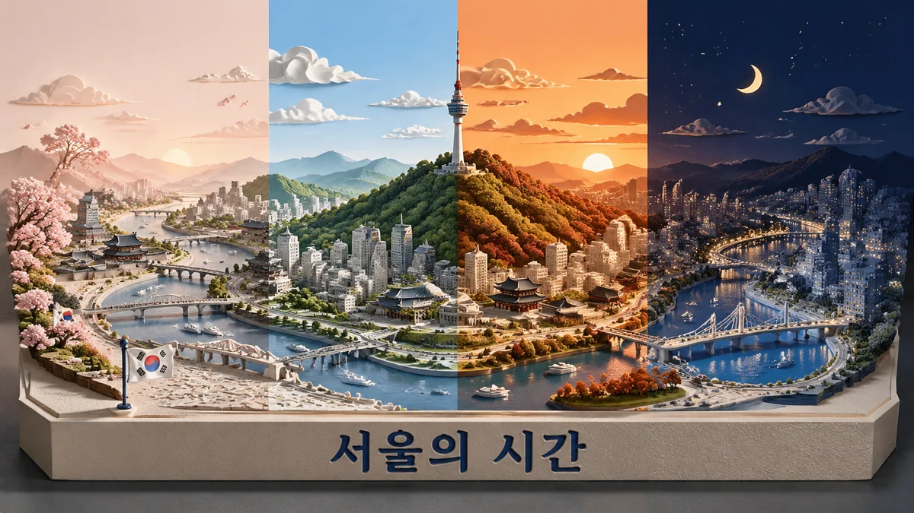


```text
生成一张高级 3D 分层纸雕城市微缩景观，用于城市宣传用四季天际线海报。城市从结构化地图中生长出来，以 [HERO_LANDMARK] 作为唯一主地标，只出现一次且建筑准确。使用哑光卡纸、轻黏土浮雕、分层纸建筑、真实地域自然元素和精致几何构图。画面包含四道竖向时间切片：清晨、白天、夕阳、星夜。加入 [FLAG_DESCRIPTION] 旗杆，并在底座用 [CAPTION_COLOR] 压印文字 [CAPTION_TEXT]。所有可见文字使用简体中文或用户指定语言。不要人物、重复地标、克隆建筑、随机标志或品牌 logo。
```


### 7. 老城夜景纸雕 (`old-town-night-diorama`)


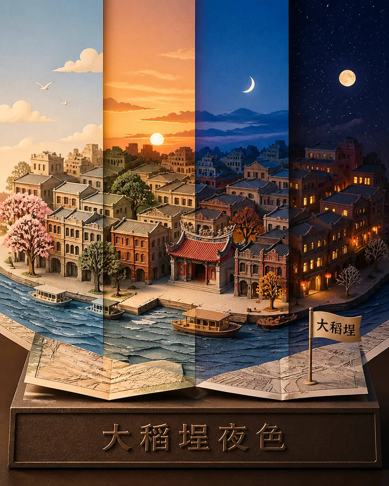


```text
生成一张高级 3D 分层纸雕城市微缩景观，用于带夜景叙事的历史街区视觉。城市从结构化地图中生长出来，以 [HERO_LANDMARK] 作为唯一主地标，只出现一次且建筑准确。使用哑光卡纸、轻黏土浮雕、分层纸建筑、真实地域自然元素和精致几何构图。画面包含四道竖向时间切片：清晨、白天、夕阳、星夜。加入 [FLAG_DESCRIPTION] 旗杆，并在底座用 [CAPTION_COLOR] 压印文字 [CAPTION_TEXT]。所有可见文字使用简体中文或用户指定语言。不要人物、重复地标、克隆建筑、随机标志或品牌 logo。
```


### 8. 河岸晨光城市 (`river-map-morning-city`)


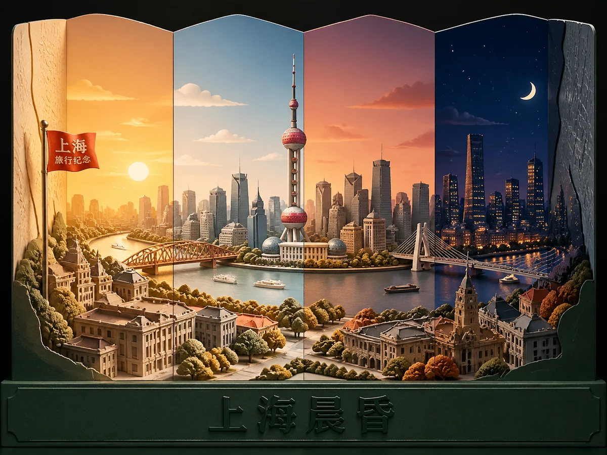


```text
生成一张高级 3D 分层纸雕城市微缩景观，用于从河流地图生长出的城市图。城市从结构化地图中生长出来，以 [HERO_LANDMARK] 作为唯一主地标，只出现一次且建筑准确。使用哑光卡纸、轻黏土浮雕、分层纸建筑、真实地域自然元素和精致几何构图。画面包含四道竖向时间切片：清晨、白天、夕阳、星夜。加入 [FLAG_DESCRIPTION] 旗杆，并在底座用 [CAPTION_COLOR] 压印文字 [CAPTION_TEXT]。所有可见文字使用简体中文或用户指定语言。不要人物、重复地标、克隆建筑、随机标志或品牌 logo。
```


### 9. 主地标四时切片 (`hero-landmark-time-slice`)


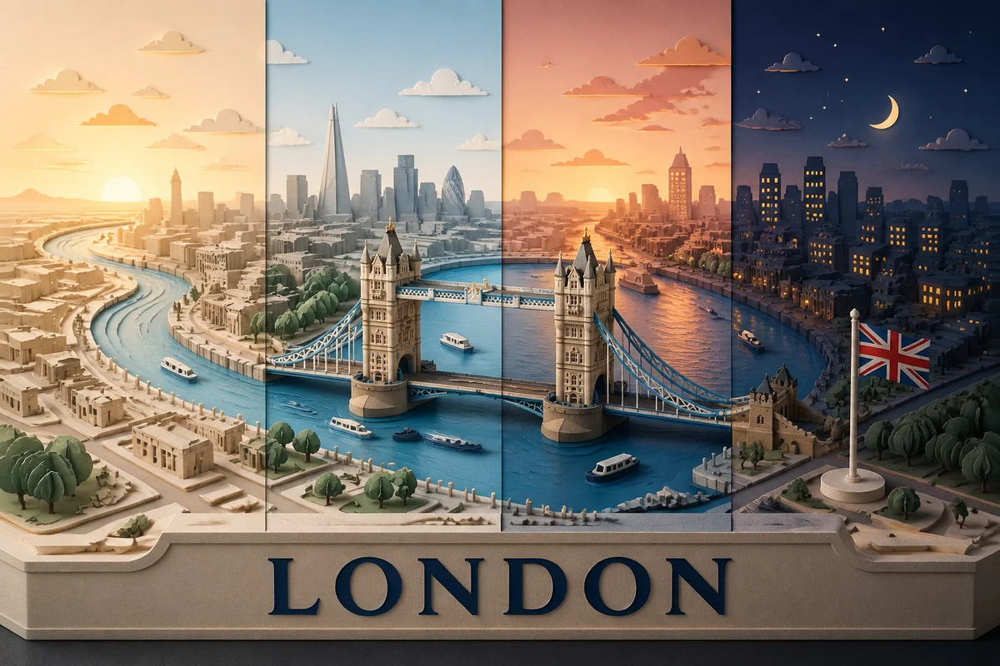


```text
生成一张高级 3D 分层纸雕城市微缩景观，用于旗舰城市文旅纸雕。城市从结构化地图中生长出来，以 [HERO_LANDMARK] 作为唯一主地标，只出现一次且建筑准确。使用哑光卡纸、轻黏土浮雕、分层纸建筑、真实地域自然元素和精致几何构图。画面包含四道竖向时间切片：清晨、白天、夕阳、星夜。加入 [FLAG_DESCRIPTION] 旗杆，并在底座用 [CAPTION_COLOR] 压印文字 [CAPTION_TEXT]。所有可见文字使用简体中文或用户指定语言。不要人物、重复地标、克隆建筑、随机标志或品牌 logo。
```


## 旅行回忆海报 (`travel-memory-poster`)

生成路线地图、宝丽来和行程数据海报。


### 1. Paris 路线回忆海报 (`paris-art-walk-poster`)


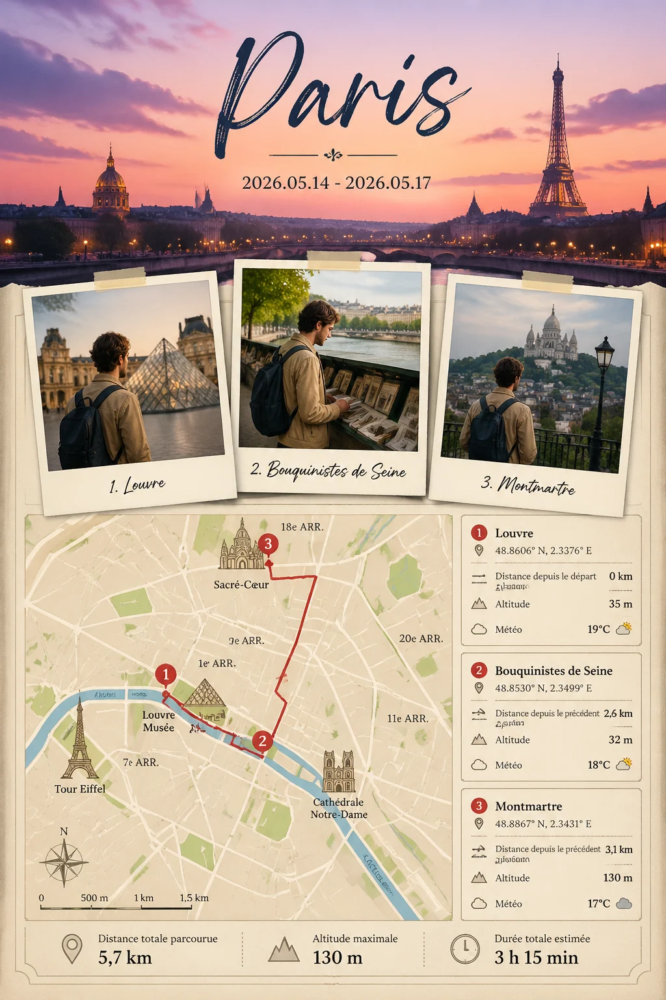


```text
生成一张 2:3 竖版旅行回忆海报，所有可见文字使用简体中文。地点为 Paris，路线包含三个编号站点：Louvre, Seine Bookstalls, Montmartre。地图是下方主体，用红色路线连接站点，并加入地点信息卡、坐标、分段距离、天气、海拔和总距离。上方放三张宝丽来旅行照片，可使用上传的旅行者、情侣、头像或原创角色参考图。排版干净高级，文字短且可读，适合印刷，不要商标或受版权保护的角色。
```


### 2. Berlin 路线回忆海报 (`berlin-museum-route-poster`)


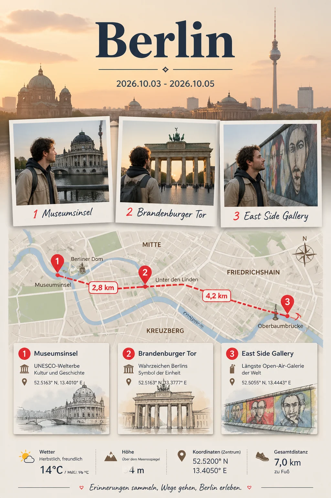


```text
生成一张 2:3 竖版旅行回忆海报，所有可见文字使用简体中文。地点为 Berlin，路线包含三个编号站点：Museum Island, Brandenburg Gate, East Side Gallery。地图是下方主体，用红色路线连接站点，并加入地点信息卡、坐标、分段距离、天气、海拔和总距离。上方放三张宝丽来旅行照片，可使用上传的旅行者、情侣、头像或原创角色参考图。排版干净高级，文字短且可读，适合印刷，不要商标或受版权保护的角色。
```


### 3. Barcelona 路线回忆海报 (`barcelona-gaudi-route-poster`)


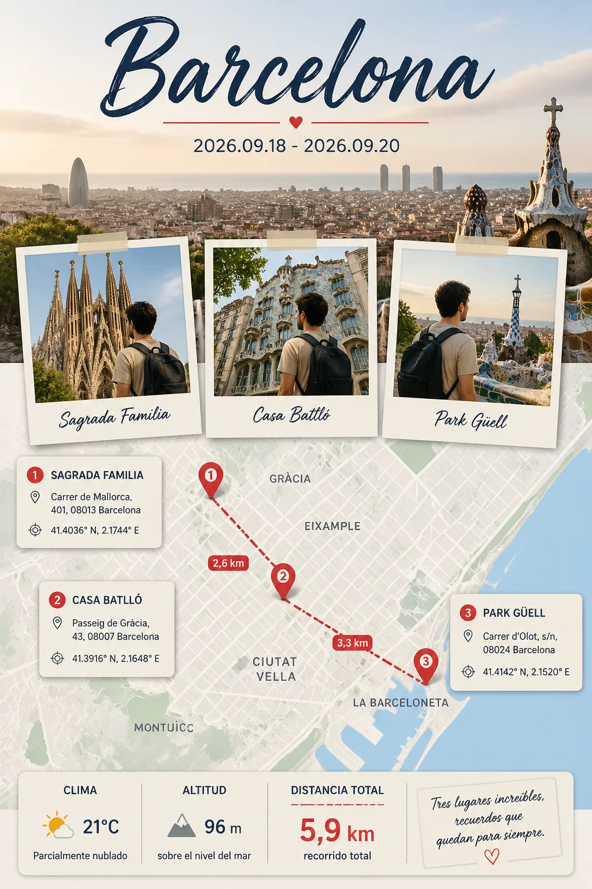


```text
生成一张 2:3 竖版旅行回忆海报，所有可见文字使用简体中文。地点为 Barcelona，路线包含三个编号站点：Sagrada Familia, Casa Batllo, Park Guell。地图是下方主体，用红色路线连接站点，并加入地点信息卡、坐标、分段距离、天气、海拔和总距离。上方放三张宝丽来旅行照片，可使用上传的旅行者、情侣、头像或原创角色参考图。排版干净高级，文字短且可读，适合印刷，不要商标或受版权保护的角色。
```


### 4. Lisbon 路线回忆海报 (`lisbon-tram-route-poster`)


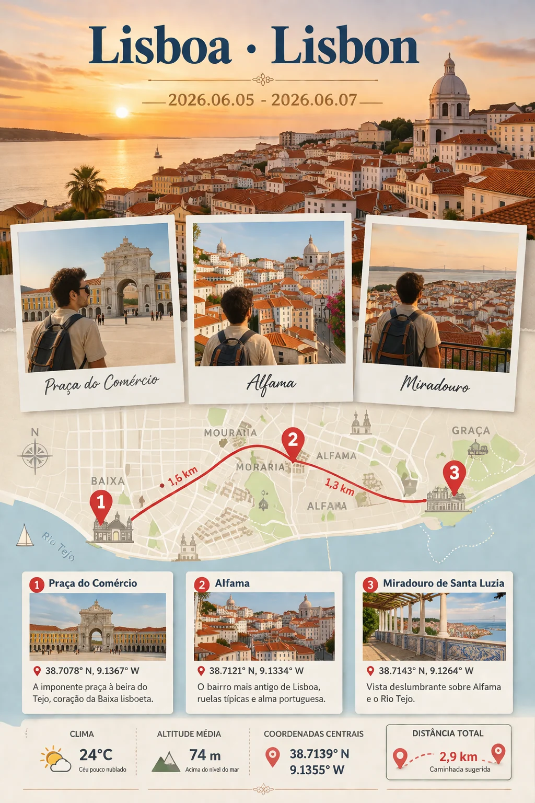


```text
生成一张 2:3 竖版旅行回忆海报，所有可见文字使用简体中文。地点为 Lisbon，路线包含三个编号站点：Praca do Comercio, Alfama, Miradouro。地图是下方主体，用红色路线连接站点，并加入地点信息卡、坐标、分段距离、天气、海拔和总距离。上方放三张宝丽来旅行照片，可使用上传的旅行者、情侣、头像或原创角色参考图。排版干净高级，文字短且可读，适合印刷，不要商标或受版权保护的角色。
```


### 5. Kyoto 路线回忆海报 (`kyoto-autumn-route-poster`)


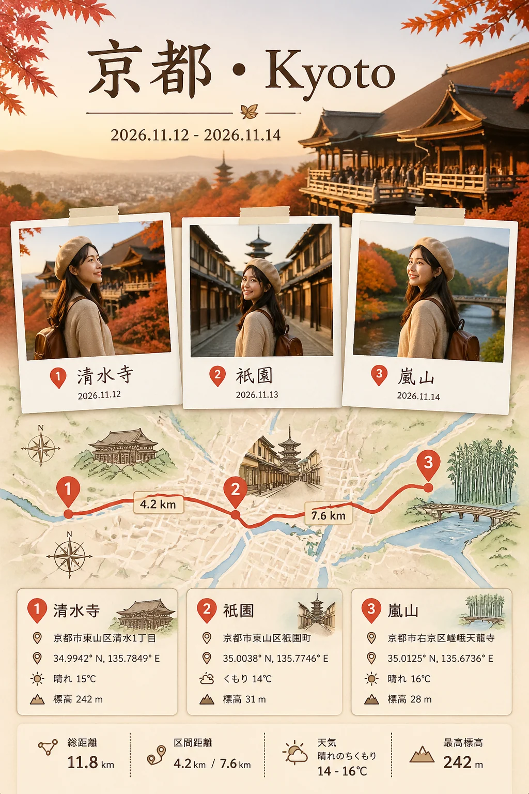


```text
生成一张 2:3 竖版旅行回忆海报，所有可见文字使用简体中文。地点为 Kyoto，路线包含三个编号站点：Kiyomizu-dera, Gion, Arashiyama。地图是下方主体，用红色路线连接站点，并加入地点信息卡、坐标、分段距离、天气、海拔和总距离。上方放三张宝丽来旅行照片，可使用上传的旅行者、情侣、头像或原创角色参考图。排版干净高级，文字短且可读，适合印刷，不要商标或受版权保护的角色。
```


### 6. Seoul 路线回忆海报 (`seoul-cafe-walk-poster`)


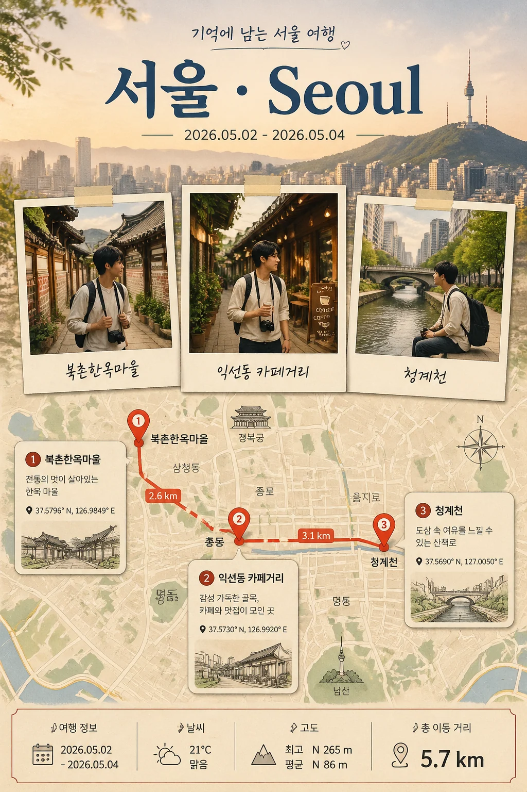


```text
生成一张 2:3 竖版旅行回忆海报，所有可见文字使用简体中文。地点为 Seoul，路线包含三个编号站点：Bukchon Hanok Village, Ikseon-dong Cafe Street, Cheonggyecheon。地图是下方主体，用红色路线连接站点，并加入地点信息卡、坐标、分段距离、天气、海拔和总距离。上方放三张宝丽来旅行照片，可使用上传的旅行者、情侣、头像或原创角色参考图。排版干净高级，文字短且可读，适合印刷，不要商标或受版权保护的角色。
```


### 7. Taipei 路线回忆海报 (`taipei-weekend-memory-map`)


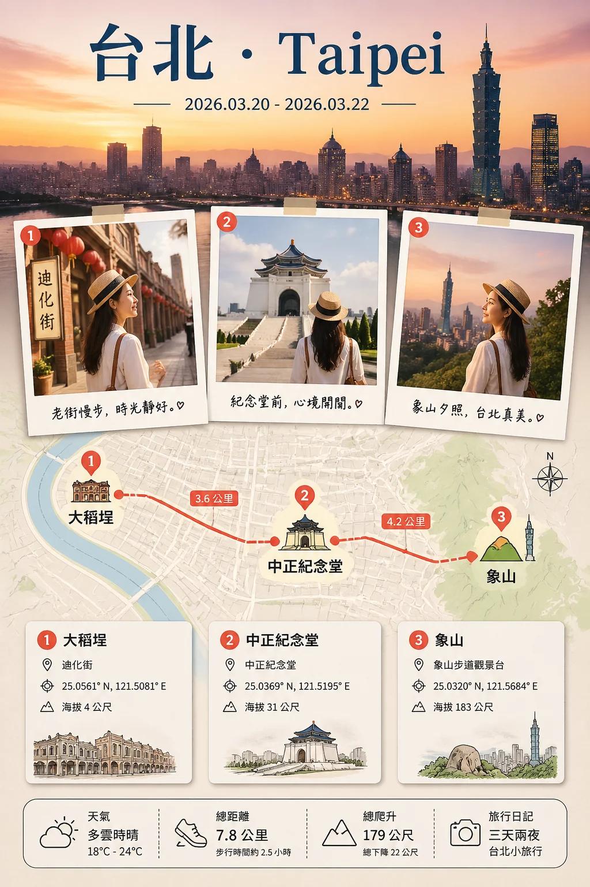


```text
生成一张 2:3 竖版旅行回忆海报，所有可见文字使用简体中文。地点为 Taipei，路线包含三个编号站点：Dadaocheng, Chiang Kai-shek Memorial Hall, Elephant Mountain。地图是下方主体，用红色路线连接站点，并加入地点信息卡、坐标、分段距离、天气、海拔和总距离。上方放三张宝丽来旅行照片，可使用上传的旅行者、情侣、头像或原创角色参考图。排版干净高级，文字短且可读，适合印刷，不要商标或受版权保护的角色。
```


### 8. Hangzhou 路线回忆海报 (`hangzhou-tea-route-poster`)


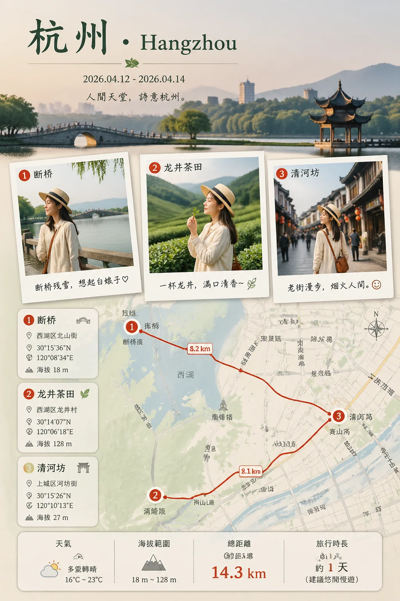


```text
生成一张 2:3 竖版旅行回忆海报，所有可见文字使用简体中文。地点为 Hangzhou，路线包含三个编号站点：West Lake Broken Bridge, Longjing Tea Fields, Qinghefang Old Street。地图是下方主体，用红色路线连接站点，并加入地点信息卡、坐标、分段距离、天气、海拔和总距离。上方放三张宝丽来旅行照片，可使用上传的旅行者、情侣、头像或原创角色参考图。排版干净高级，文字短且可读，适合印刷，不要商标或受版权保护的角色。
```


### 9. San 路线回忆海报 (`san-francisco-route-keepsake`)


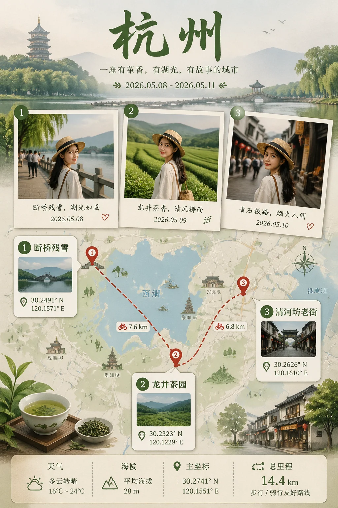


```text
生成一张 2:3 竖版旅行回忆海报，所有可见文字使用简体中文。地点为 San Francisco，路线包含三个编号站点：Golden Gate Bridge, Fisherman's Wharf, Ferry Building。地图是下方主体，用红色路线连接站点，并加入地点信息卡、坐标、分段距离、天气、海拔和总距离。上方放三张宝丽来旅行照片，可使用上传的旅行者、情侣、头像或原创角色参考图。排版干净高级，文字短且可读，适合印刷，不要商标或受版权保护的角色。
```


## 文字视觉模板 (`word-visuals`)

用 GPT Image 2 生成语义字体视觉。


### 1. 字体气质版式 (`editorial-font-temperament`)


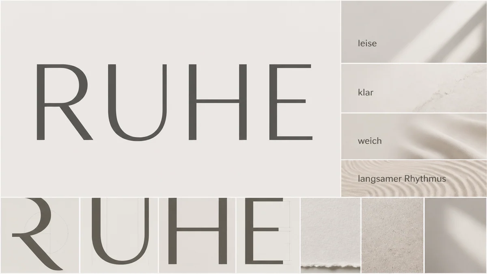


```text
请用简体中文编辑这个 GPT Image 2 提示词。所有需要出现在图片里的可见文字默认使用简体中文；保留方括号变量，用户可替换。\n\nCreate an editorial typography board for the word "[TARGET WORD]" in [LANGUAGE]. The board should explain the word's font temperament visually, not as a long essay. Show one large hero word treatment plus small supporting studies such as stroke detail, material swatch, rhythm line, weight contrast, curvature sample, and two or three short trait labels.\n\nUse [FONT TEMPERAMENT], such as severe and precise, soft and humane, luxurious and slow, playful and elastic, scholarly and calm, futuristic and cold, or ceremonial and heavy. Use [MATERIAL SWATCHES] and [TRAIT LABELS] to support the design logic. Keep all visible text short and readable.\n\nThe output should look like a mature design studio board for [USE CASE], with strong hierarchy, clean grid, refined spacing, and no fake brand logos.
```


### 2. 概念对照字卡 (`concept-duality-type-card`)


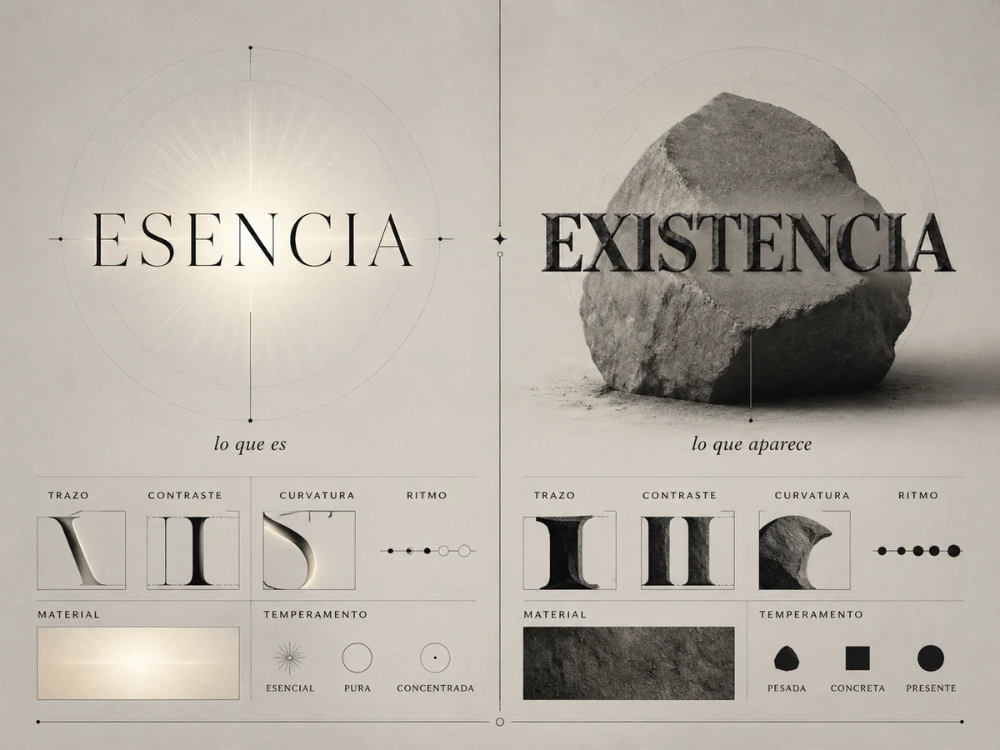


```text
请用简体中文编辑这个 GPT Image 2 提示词。所有需要出现在图片里的可见文字默认使用简体中文；保留方括号变量，用户可替换。\n\nCreate a typographic concept card comparing "[FIRST CONCEPT]" and "[SECOND CONCEPT]" in [LANGUAGE]. The two words should be readable and visually opposed or mirrored according to [CONTRAST LOGIC], such as essence versus existence, chaos versus order, silence versus noise, memory versus future, or gravity versus flight.\n\nUse typography, material, spacing, scale, lighting, and negative space to explain the contrast. One side may be dense, heavy, carved, sharp, or grounded; the other may be airy, transparent, glowing, soft, or dissolving. Do not rely on paragraphs. Use only short labels and minimal visual annotation.\n\nFormat as [LAYOUT FORMAT], such as horizontal editorial card, square concept board, or presentation-ready visual. Keep the design intellectually clear, aesthetically mature, and readable.
```


### 3. 专辑标题海报 (`album-title-type-poster`)


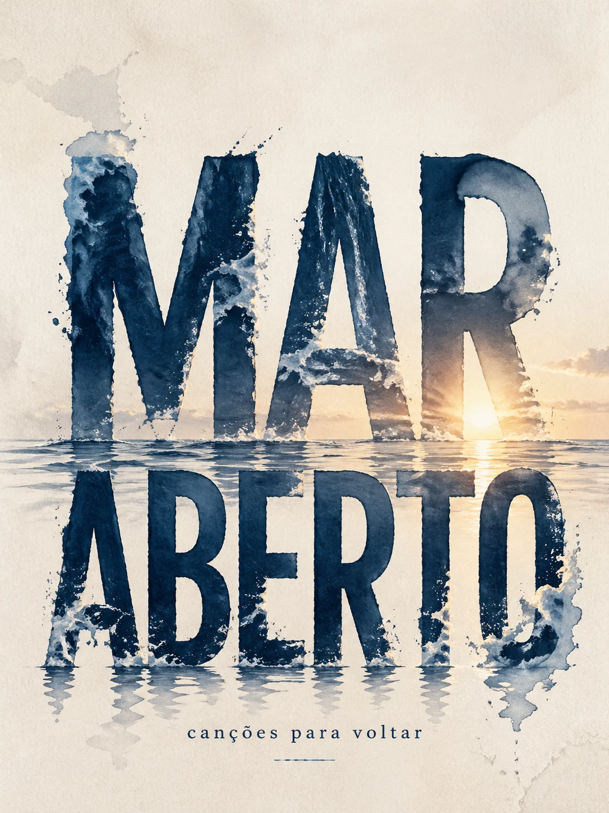


```text
请用简体中文编辑这个 GPT Image 2 提示词。所有需要出现在图片里的可见文字默认使用简体中文；保留方括号变量，用户可替换。\n\nCreate a typographic cover poster for the short title "[TITLE]" in [LANGUAGE]. The title is the hero, and the letterforms should express [MUSIC OR WRITING MOOD] through [VISUAL METAPHOR], typography style, texture, and composition. Keep the title readable and avoid adding long lyrics, fake artist names, or real label logos.\n\nUse [TYPOGRAPHY STYLE], such as poetic serif, experimental display type, soft handwritten lettering, minimal editorial type, brutalist type, or dreamy magazine cover typography. The letters may interact with subtle objects, light, smoke, water, dust, fabric, paper, stars, or architectural shadows if they support the title mood.\n\nFormat for [COVER FORMAT], with refined hierarchy, enough negative space, and one optional small subtitle. The output should feel like a finished music cover, poetry cover, or cultural poster concept.
```


### 4. 实体单词装置 (`grounded-word-installation`)


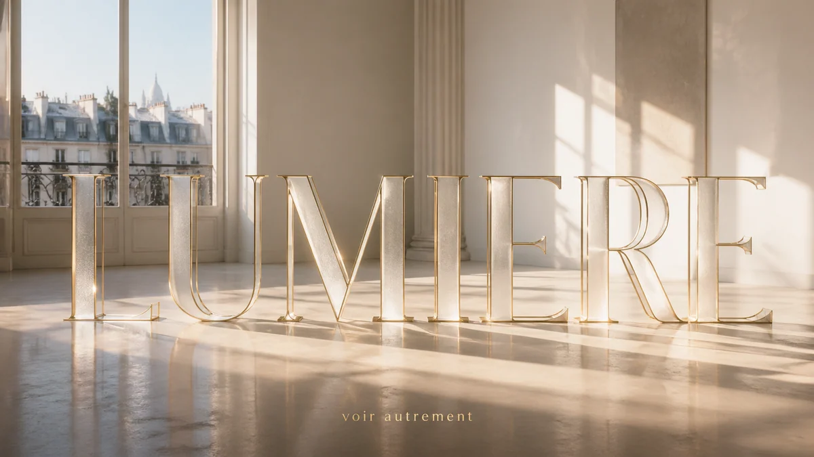


```text
请用简体中文编辑这个 GPT Image 2 提示词。所有需要出现在图片里的可见文字默认使用简体中文；保留方括号变量，用户可替换。\n\nCreate a grounded typographic installation image for the word "[TARGET WORD]" in [LANGUAGE]. Unlike a floating no-ground poster, this version places the word as a physical object in [SETTING]. The word must remain readable while existing naturally in the environment with contact shadows, scale, perspective, material behavior, and believable lighting.\n\nChoose [MATERIAL] and [SCALE] to express [MEANING NOTES]. The letters may be carved into sand, built from glass, grown from moss, formed by folded fabric, cast in metal, assembled from paper, reflected in water, or glowing softly as an installation. Keep the scene clean enough that the word is still the hero.\n\nUse [LIGHTING] and cinematic composition. Avoid real brand signage, logos, or trademarked environments. Output a mature concept image suitable for a campaign moodboard, exhibition mockup, or social hero visual.
```


### 5. 日语季节词 (`japanese-season-word`)


```text
请用简体中文编辑这个 GPT Image 2 提示词。所有需要出现在图片里的可见文字默认使用简体中文；保留方括号变量，用户可替换。\n\nCreate a vertical Japanese typographic poster for the word "[JAPANESE WORD]". Keep the Japanese text readable and elegant. Express [SEASON OR MOOD] through [NATURAL MOTIF], stroke rhythm, paper texture, and quiet atmosphere. The word should feel designed, not merely typed on top of a background.\n\nUse [TYPEFACE TEMPERAMENT], such as brushlike, editorial serif, soft modern gothic, handwritten literary, or refined display lettering. Selected strokes may interact with petals, rain, wind, moonlight, snow, leaves, or mist, but the word remains the main subject. Use [BACKGROUND] and a restrained color system.\n\nAdd one short Japanese caption [SHORT CAPTION]. Keep all visible text in Japanese. The final image should work as a social poster, poetry card, or seasonal cover.
```


### 6. 韩语情绪单词 (`korean-emotion-word`)


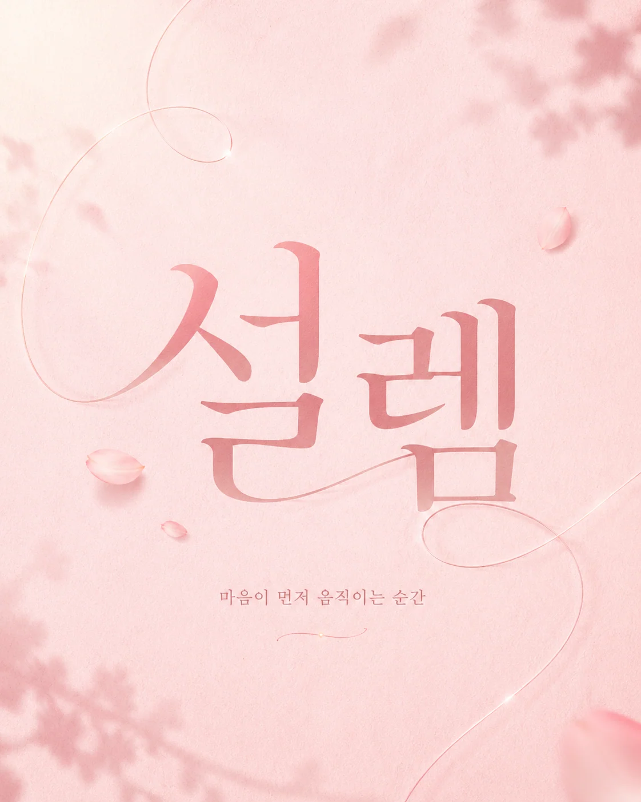


```text
请用简体中文编辑这个 GPT Image 2 提示词。所有需要出现在图片里的可见文字默认使用简体中文；保留方括号变量，用户可替换。\n\nCreate a Korean typographic poster for the word "[KOREAN WORD]". Keep the Hangul readable. The visual goal is to make the syllable blocks carry the emotion [EMOTION] through stroke shape, spacing, texture, and movement. Use [VISUAL METAPHOR], [MATERIAL], and [COLOR PALETTE] to express the word without adding heavy explanatory text.\n\nLet the Hangul blocks breathe with subtle rhythm: curves may soften, strokes may overlap like fabric, edges may blur like mist, or parts may glow, crack, fold, or scatter only if that supports the emotion. Add one short Korean caption [CAPTION]. Use a clean poster composition with controlled negative space and refined lighting. Avoid random decorative clutter and keep the word itself as the hero.
```


### 7. 繁体字工艺物 (`traditional-character-artifact`)


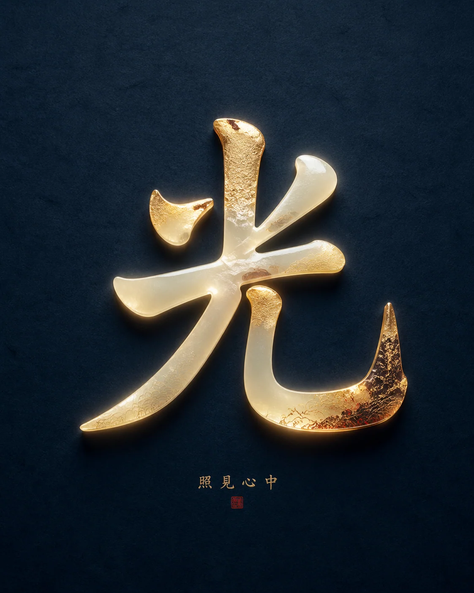


```text
请用简体中文编辑这个 GPT Image 2 提示词。所有需要出现在图片里的可见文字默认使用简体中文；保留方括号变量，用户可替换。\n\nCreate a vertical typographic poster for the traditional Chinese character "[TRADITIONAL CHARACTER]". Keep the character readable and central. Make the character feel like a crafted cultural artifact that expresses [CULTURAL MEANING], using [ARTIFACT OR CRAFT REFERENCE] as inspiration without copying a specific historical object.\n\nTransform the strokes with [MATERIAL], such as carved jade, lacquer, ink-wash fiber, bronze, porcelain glaze, woven silk, carved wood, or folded paper. Use [LIGHTING] and a restrained background. The character may cast a subtle shadow or float slightly, but it should remain a typographic object first.\n\nInclude a small traditional Chinese caption [SUPPORTING LABEL] if helpful. Keep visible text sparse and legible. The result should feel native to traditional Chinese typography and cultural visual design, not like an English poster with translated text.
```


### 8. 汉字灵兽字形 (`chinese-character-beast`)


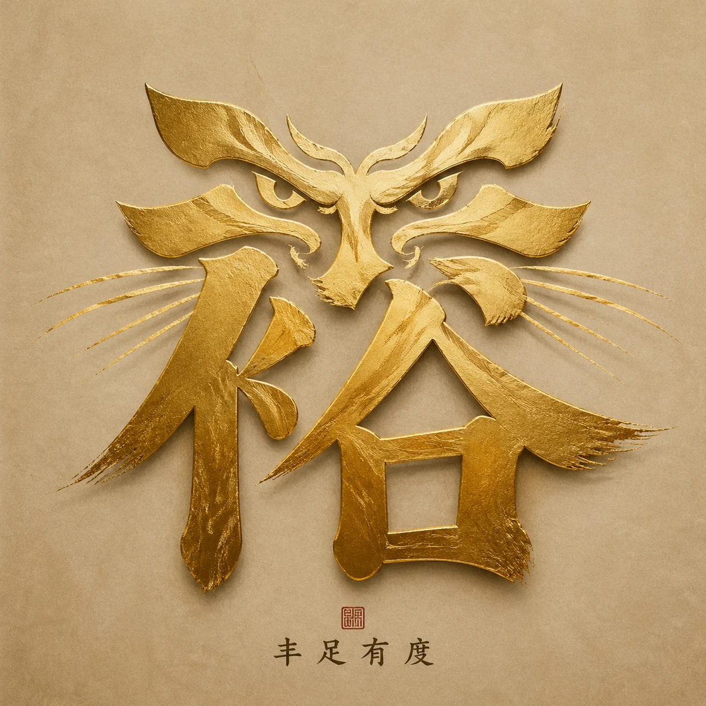


```text
$20
```


### 9. 悬浮单词灵感 (`floating-word-spirit`)


```text
$21
```
